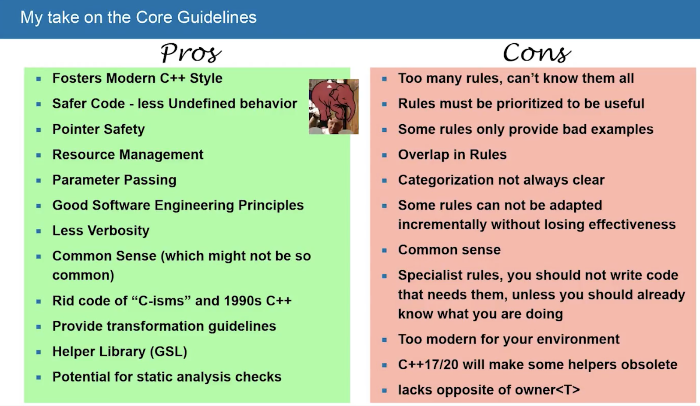

# C++ Club meeting -- 25 May 2017

## C++ feature polls by Bryce Lelbach

## Concepts of the Upcoming Ranges TS

[Video of the talk by Eric Niebler](https://www.youtube.com/watch?v=4OgAjT6HTG8&feature=youtu.be)

* What is in Ranges
* What is in Ranges TS (Ranges minus the good stuff, like views or actions)
* “Based on Concepts TS which was finalised, what, 2–3 years ago?” Hah!
* Latest draft: [http://wg21.link/N4651](http://wg21.link/N4651)
* C++11 implementation: [https://github.com/ericniebler/range-v3](https://github.com/ericniebler/range-v3)
* Concepts-based implementation: [https://github.com/CaseyCarter/cmcstl2](https://github.com/CaseyCarter/cmcstl2)
* This is the beginning of STLv2 (`namespace std2`)
* Eric shows snippers of code that use the standard library and then converts them to use ranges --- so nice!
* “Projection” is basically a map using a unary function
* SentinelsHow to convert your own algorithms to using Ranges TS
* Ranges and coroutines: [https://github.com/toby-allsopp/ranges-coroutines](https://github.com/toby-allsopp/ranges-coroutines) — lets you write lazy ranges which work very well with views
* Async ranges based on coroutines ⇒ reactive programming! Does Eric know about RxCpp?
* 5 star

## An Introduction to Reflection in C++

[Blog post by Jackie Kay](http://jackieokay.com/2017/04/13/reflection1.html)

* Terminology:
    * "_Introspection_ is the ability to inspect a type and retrieve its various qualities. You might want to introspect an object’s data members, member functions, inheritance hierarchy, etc. And you might want to introspect different things at compile time and runtime."
    * "_Metaobjects_ are the result of introspection on a type: a handle containing the metadata you requested from introspection. If the reflection implementation is good, this metaobject handle should be lightweight or zero-cost at runtime."
    * "_Reification_ is a fancy word for “making something a first-class citizen”, or “making something concrete”. We will use it to mean mapping from the reflected representation of objects (metaobjects) to concrete types or identifiers."
* "Run-time type information/identification is a controversial C++ feature, commonly reviled by performance maniacs and zero-overhead zealots. If you’ve ever used `dynamic_cast`, `typeid`, or `type_info`, you were using RTTI."
* Macros: "Hana and MPL can adapt a user-defined POD-type into an introspectible structure which tuple-like access. The code is quite formidable and verbose. That’s because there’s a separate macro case for adapting a struct of specific sizes. For example, all structs with 1 member map to a particular macro, all structs with 2 members map to the next macro, etc." Max 62 members per struct.
* "The current pinnacle of POD introspection in C++14 is a library called **magic_get** (Precise and Flat Reflection, pre-Boost `boost::pfr`) by Antony Polukhin — [https://github.com/apolukhin/magic_get](https://github.com/apolukhin/magic_get) — C++17 implementation doesn’t use macros, just templates and structured bindings." Still, max 101 members per struct.
* Other languages: Python, Java, C#, Go
* C++20: `reflexpr`: "The `reflexpr` proposal, by Matúš Chochlík, Axel Naumann, and David Sankel, introduces several “metaobjects” which are accessed by passing a type to the new `reflexpr` operator."
* C++20: `operator$`: "Andrew Sutton and Herb Sutter wrote _A design for static reflection_, which introduces the reflection operator, `$`, as a way of getting object metadata out of a class, namespace, etc. (Using $ has been argued out of favor because it is common in legacy code, particularly in code generation and template systems which are not necessarily valid C++ but produce C++ sources.)"
* "The fundamental design difference between these two papers is whether the result of the reflection operator is a value or a type."
* "Concepts are design prerequisite for both of the reflection papers."

## Static Duck Typing in C++

[Blog post by Philippe Groarke
](https://philippegroarke.com/blog/2017/05/09/static-duck-typing-in-c/)

* "_Duck Typing_ is a pattern by which you accept any kind of object for a certain task, but only call certain methods, or do certain operations, if the object has the required member functions/member variables."
* Stuffs unrelated objects in a tuple, then calls apply on it to call a given member function.
* Uses SFINAE + `enable_if` to detect member function availability.
* Uses macros (ugh) to generalize the code.
* One comment mentions `overload_linearly` as an alternative for a simpler implementation: "A function that takes an arbitrarily list of function objects and returns a function object that combines them all through overloading. The difference between overload and `overload_linearly` is that the latter builds an overload set that only tries the next function object if the previous one did not match." — See [p0051r2 (PDF)](http://www.open-std.org/jtc1/sc22/wg21/docs/papers/2016/p0051r2.pdf): _C++ generic overload function_, by Vicente J. Botet Escribá.
* This should be solved by Concepts.
    * Aside: There are many tricks and problems in various articles lately that fall under “this will be solved by Concepts” category.

## History of Time: Asynchronous C++ - Steven Simpson [ACCU 2017]

[Video](https://www.youtube.com/watch?v=Z8tbjyZFAVQ)

* informational density is low, presentation is slow-going (after lunch?)
* first half of the talk: how not to implement network server
* don’t use one thread per connection
* epoll (IO completion ports): OS tells us when a connection is ready, so we don’t need threads, don’t have race conditions, and can scale well
* overview of callback libraries, including Boost ASIO
* live reimplementation of ASIO event loop
* "futures" in event loops: no threads, but syntactic sugar around callbacks: like JavaScript `promise` or Python `deferred`
* coroutines ("user-space threads")
* fibers are the same as stackful coroutines
* his "coroutine" code is using Boost coroutines, not Coroutines TS
* slide 116 has a summary table at 1:26:30 — that’s all you need to know: 
* 2 star

## C++11 Multithreading done right? - Rainer Grimm @ Meeting C++ 2014

[Video](https://www.youtube.com/watch?v=paK38WAq8WY)

* discusses snippets of code, best practices, what not to do
* engages the audience (a bit too much IMHO) ⇒ lots of interruptions, sometimes they see his bugs and it all gets very confusing
* poor volunteer with the microphine running around like mad trying his best to catch random replies across the huge room
* 3 star

## Why does C++ seem to be mentioned a lot in jobs related to video encoding or streaming?

[Reddit](https://www.reddit.com/r/cpp/comments/6cei7n/not_a_c_guy_but_curious_why_does_c_seem_to_be/)

* C++ is efficient, close to metal, you can do anything, and tooling is readily available
* Soft real-time constraints, speed is king
* Memory constraints for embedded encoders/decoders
* C++ toolchain permits optimisations that are simply not possible in other languages
* SIMD

## Using C++ Resumable Functions with Libuv

[GitHub](https://github.com/jimspr/awaituv) | [Blog post](https://blogs.msdn.microsoft.com/vcblog/2017/02/02/using-ibuv-with-c-resumable-functions/)

* "Libuv is a C library that provides the asynchronous I/O in Node.js. While it was explicitly designed for use by Node.js, it can be used on its own and provides a common cross-platform API, abstracting away the various platform-specific asynchronous APIs."
* "With resumable functions, you can write code that looks very sequential but executes asynchronously."
* Header-only wrappers for the main lib functions

## Using C++ Coroutines with Boost C++ Libraries

[Blog post](https://blogs.msdn.microsoft.com/vcblog/2017/05/19/using-c-coroutines-with-boost-c-libraries/)

* Using coroutines with `boost::future` and `boost::asio`
* Interesting techniques for adapting future/promise and callback-based APIs to using coroutines
* I expect more adaptations like this coming in the near future
    * [awaitable_tasks](https://github.com/wangjieest/awaitable_tasks) — for `boost::asio`
    * [a Gist by John Bandela](https://gist.github.com/jbandela/95d54560abe37775d957f65881170641) — a much simpler version that relies on `boost::asio` capability to return a future instead of using a callback.

## await/yield: C++ coroutines — presentation slides by Zbigniew Skowron

[PDF](http://cpp.mimuw.edu.pl/files/await-yield-c++-coroutines.pdf)

* Current status (as of 30 Nov 2016)
* Overview and motivation
* Stackful vs. stackless
* Coroutines as generators
* Coroutines instead of callbacks
* Awaitable types vs. coroutine return types
* Gotchas

## cdecl: C gibberish ↔ English

[Website](https://cdecl.org)

* `int (*(*foo)(void ))[3]` ⇒
declare foo as pointer to function `(void)` returning pointer to array 3 of `int` — [permalink](https://cdecl.org/?q=int+%28*%28*foo%29%28void+%29%29%5B3%5D)
* declare bar as volatile pointer to array 64 of `const int` ⇒
`const int (* volatile bar)[64]` — [permalink](https://cdecl.org/?q=declare+bar+as+volatile+pointer+to+array+64+of+const+int)
* cast `foo into block(int, long long)` returning `double` ⇒
`(double (^)(int , long long ))foo` — [permalink](https://cdecl.org/?q=cast+foo+into+block%28int%2C+long+long%29+returning+double)

## Learning (and teaching) modern C++ - Challenges and Resources - Arne Mertz [ACCU 2017]

[Video](https://www.youtube.com/watch?v=dlh-UnmCARk)

* “Template-intensive, generic code” — Alexandrescu
* “Post-modern C++” — Odin Holmes
* “Functional C++” — Phil Nash
* Hypothetical book: “C++: The Good Parts”
* An overview of different environments where C++ is used, including resource-constrained hardware
* Instead of retelling own story just skip the obsolete parts (pointer arithmetic)
* new/delete is advanced topic
* “Stop teaching C” — Kate Gregory
* “Dark matter developers” — don’t see them, just the code they produce (they don’t blog, don’t go to conferences)
* Professors don’t update their materials ⇒ teach legacy C++
* Books last long and get out of date
* Some books are bad: “C/C++” books by Herb Schildt: “Not recommended” by ACCU [→](https://accu.org/index.php?func=search&module=bookreviews&q=schildt&stype=author)
* Some blogs are also bad
* Conferences and videos:
    * Meeting C++
    * CppCon
    * ACCU
    * emBO++
    * BeC++
    * C++Now
    * code::dive
    * ++it
    * NDC
* Websites: [http://isocpp.org](http://isocpp.org), [http://cppreference.com](http://cppreference.com), C++ Core Guidelines, Stack Overflow C++ Documentation
* 5 star

C++ Core Guidelines - Modernize your C++ Code Base - Peter Sommerlad [ACCU 2017]

[Video](https://www.youtube.com/watch?v=fQ926v4ZzAM)

* [Cevelop](https://www.cevelop.com) -- an Eclipse-based C++ IDE
* [CUTE++ unit test framework with Eclipse plugin](http://cute-test.com) (LGPL3)
* Pros/cons: 
* Express ideas directly in code (not comments)
* Write in ISO standard C++
* Express intent
* Ideally, a program should be statically type safe
* Prefer compile-time checking to run-time checking
* What cannot be checked at compile time should be checkable at run time
* Catch run-time errors early
* Don't leak any resources
* Don't waste time or space
* Prefer immutable data to mutable data
* Encapsulate messy constructs rather than spreading them through the code
* 5 star

## Quote

"If you think it’s simple, then you have misunderstood the problem." — Bjarne Stroustrup

