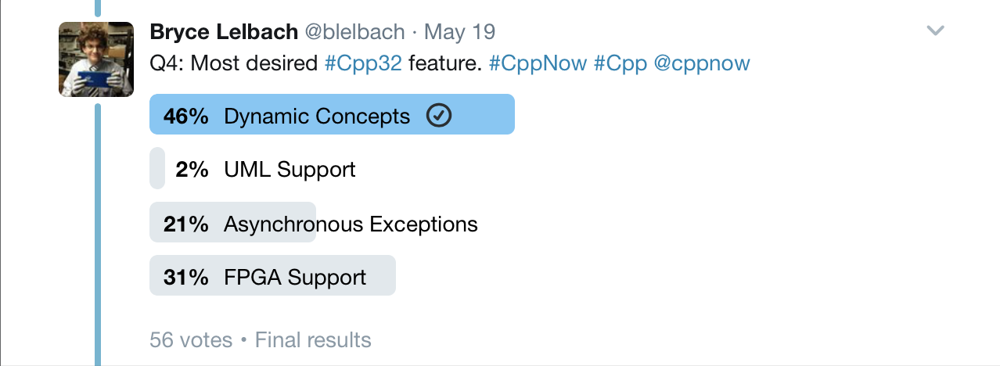

# C++ Club meeting -- 25 May 2017

## C++ feature polls by Bryce Lelbach

## Concepts of the Upcoming Ranges TS - Eric Niebler [NWCPP]

[Video](https://www.youtube.com/watch?v=4OgAjT6HTG8&feature=youtu.be)

* What is in Ranges
* What is in Ranges TS (Ranges minus the good stuff, like views or actions)
* “Based on Concepts TS which was finalised, what, 2–3 years ago?” Hah!
* Latest draft: [http://wg21.link/N4651](http://wg21.link/N4651)
* C++11 implementation: [https://github.com/ericniebler/range-v3](https://github.com/ericniebler/range-v3)
* Concepts-based implementation: [https://github.com/CaseyCarter/cmcstl2](https://github.com/CaseyCarter/cmcstl2)
* This is the beginning of STLv2 (`namespace std2`)
* Eric shows snippers of code that use the standard library and then converts them to use ranges --- so nice!
* “Projection” is basically a map using a unary function
* SentinelsHow to convert your own algorithms to using Ranges TS
* Ranges and coroutines: [https://github.com/toby-allsopp/ranges-coroutines](https://github.com/toby-allsopp/ranges-coroutines) — lets you write lazy ranges which work very well with views
* Async ranges based on coroutines ⇒ reactive programming! Does Eric know about RxCpp?
* 5 star

## History of Time: Asynchronous C++ - Steven Simpson [ACCU 2017]

[Video](https://www.youtube.com/watch?v=Z8tbjyZFAVQ)

* first half of the talk: how not to implement network server
* don’t use one thread per connection
* `epoll` (IO completion ports): OS tells us when a connection is ready, so we don’t need threads, don’t have race conditions, and can scale well
* overview of callback libraries, including Boost ASIO
* live reimplementation of ASIO event loop
* "futures" in event loops: no threads, but syntactic sugar around callbacks: like JavaScript `promise` or Python `deferred`
* coroutines ("user-space threads")
* fibers are the same as stackful coroutines
* his "coroutine" code is using Boost coroutines, not Coroutines TS
* demonstrates performance degradation and scaling capabilities of all the way of implementing async code
* slide 116 has a summary table at 1:26:30 
* 3 star

## C++11 Multithreading done right? - Rainer Grimm @ Meeting C++ 2014

[Video](https://www.youtube.com/watch?v=paK38WAq8WY)

* discusses snippets of code, best practices, what not to do
* engages the audience (a bit too much IMHO) ⇒ lots of interruptions, sometimes they see his bugs and it all gets very confusing
* poor volunteer with the microphone running around like mad trying his best to catch random replies across the huge room
* 3 star

## Why does C++ seem to be mentioned a lot in jobs related to video encoding or streaming?

[Reddit](https://www.reddit.com/r/cpp/comments/6cei7n/not_a_c_guy_but_curious_why_does_c_seem_to_be/)

* C++ is efficient, close to metal, you can do anything, and tooling is readily available
* Soft real-time constraints, speed is king
* Memory constraints for embedded encoders/decoders
* C++ toolchain permits optimisations that are simply not possible in other languages
* SIMD

## Using C++ Resumable Functions with Libuv

[GitHub](https://github.com/jimspr/awaituv) :: [Blog post](https://blogs.msdn.microsoft.com/vcblog/2017/02/02/using-ibuv-with-c-resumable-functions/)

* "Libuv is a C library that provides the asynchronous I/O in Node.js. While it was explicitly designed for use by Node.js, it can be used on its own and provides a common cross-platform API, abstracting away the various platform-specific asynchronous APIs."
* "With resumable functions, you can write code that looks very sequential but executes asynchronously."
* Header-only wrappers for the main lib functions

## Using C++ Coroutines with Boost C++ Libraries

[Blog post](https://blogs.msdn.microsoft.com/vcblog/2017/05/19/using-c-coroutines-with-boost-c-libraries/)

* Using coroutines with `boost::future` and `boost::asio`
* Interesting techniques for adapting future/promise and callback-based APIs to using coroutines
* I expect more adaptations like this coming in the near future
    * [awaitable_tasks](https://github.com/wangjieest/awaitable_tasks) — for `boost::asio`
    * [a Gist by John Bandela](https://gist.github.com/jbandela/95d54560abe37775d957f65881170641) — a much simpler version that relies on `boost::asio` capability to return a future instead of using a callback.

## await/yield: C++ coroutines - Zbigniew Skowron

[PDF](http://cpp.mimuw.edu.pl/files/await-yield-c++-coroutines.pdf)

* Current status (as of 30 Nov 2016)
* Overview and motivation
* Stackful vs. stackless
* Coroutines as generators
* Coroutines instead of callbacks
* Awaitable types vs. coroutine return types
* Gotchas
