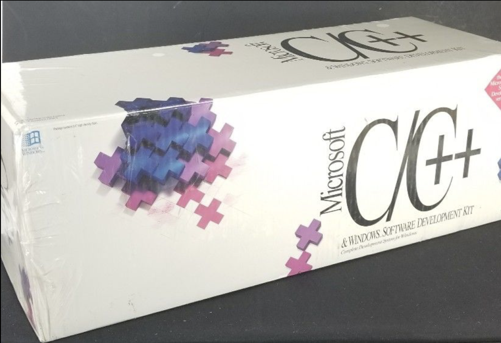

autoscale: true

# C++ Club

## 6 July 2017

---

# CLion 2017.1 + MSVC

- Experimental support for MSVC toolchain
- Debugging not supported yet

---

# CATCH survey

[https://www.surveymonkey.co.uk/r/TLLYQJW](https://www.surveymonkey.co.uk/r/TLLYQJW)

---

# C++17 STL Cookbook

- [Blog post](https://blog.galowicz.de/2017/06/30/cpp17_stl_cookbook/)
- [Packt](https://www.packtpub.com/application-development/c17-stl-cookbook)
- [Amazon](https://www.amazon.com/17-STL-Cookbook-Jacek-Galowicz-ebook/dp/B01MTSADN8)

---

# MinGW by STL

by Stephan T. Lavavej of Microsoft's STL fame

> "Steh-fin Lah-wah-wade"

[Nuwen.org](https://nuwen.net/mingw.html)


---

# SSO in GCC

- RHEL7 and earlier: GCC uses old C++98 copy-on-write strings (no SSO)
- even in C++11 and C++14 mode (non-compliant behaviour)
- RHEL8 will have C++11 SSO strings

---

# GCC 6.4 released

[Release Notes](https://gcc.gnu.org/gcc-6/changes.html)

- bugfix release -- fixes regressions in GCC 6.3

---

# Generics in Go?

[Twitter](https://twitter.com/mosheroperandi/status/856946180810354688?lang=en)


---

# C++London: The Badlands of C++ (game development)


## Valentin Galea

- MSVC is prevalent
- Huge amounts of legacy code using C++98
- Mostly proprietary code, sometimes really ugly
- Process- and deadline-driven, no clean-up exercises ("ship it!")
- Warnings are just fine (ignored)
- Low-latency specifics
    + no exceptions
    + minimize allocations
    + special container versions (EASTL)
- garbage collection for dynamic objects (Lua)
- [Splash Damage Tech Blog](http://www.splashdamage.com/blog/1254/introducing-our-c-tech-blog)

---

# C++London: practical uses of reflection in C++


## Jackie Kay

- a shorter version of the talk at C++Now 2017
- serialization
- program options
- addition: metaclasses

---


# Declaration style

Style 1

```cpp
const char *foo = "Foo"; // * and & bind to the right
```

Style 2

```cpp
const char* foo = "Foo"; // the type is 'pointer to const char'
```

Style 3

```cpp
char const *foo = "Foo"; // declaration reads from right to left
```

---


# MS C++ 7 on eBay

[$300](http://www.ebay.com/itm/172764355338)

- original box, still sealed!
- MFC, no templates
- Windows 3.1 SDK
- overlays for extended memory/swapping
- OLE, DDE
- CodeView debugger
- over 5000 pages of manuals!



---

# A New C++ YouTube Channel

[Abhisekh Gupta teaches C++](https://www.youtube.com/channel/UCGmfC_avrfQv9KPtwVZIKmw)

* uses Turbo C++ within DosBox within Windows 10
* why?
* what (if anything) should we tell him?
