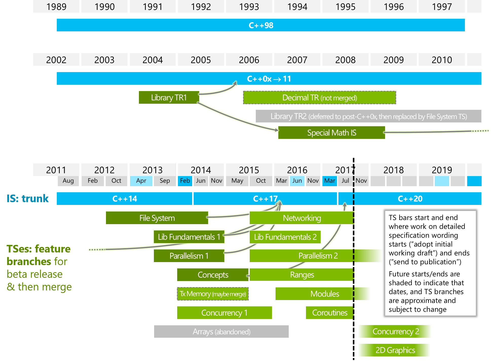

<!-- page_number: true -->
<!-- $size: 16:9 -->

# C++ Club

## 13 July 2017

---

# VS2017 Delayed

Compatibility issues with Symantec AV

---

# Toronto report — Herb Sutter

[Post](https://herbsutter.com/2017/07/15/trip-report-summer-iso-c-standards-meeting-toronto/)

* 120 people, 9 national bodies
* 1st meeting for C++20
* Concepts TS merged into draft C++20!
    - no “introducer syntax”
    - no “terse/natural syntax” for now (no consensus)
    - removed the need to write “bool”
    - removed function concepts "until we see a need to overload concepts"

---

# Toronto report — Herb Sutter

* Allow lambda capture `[=, this]`
* Add designated initializers. Draft C++20 now allows code like:

```cpp
struct A { int x; int y; int z; }; A b{.x = 1, .z = 2};
```

* Allow template parameter lists on lambdas:

```cpp
auto f = []<typename T>(std::vector<T> vector){/*…*/};
```

---

# Toronto report — Herb Sutter

* Coroutines TS
* Ranges TS
* Networking TS
* Modules PDTS (no macros)

Not yet:

* Concurrency TS (published, parts to be merged in the next meeting)

---

C++ Feature Timeline



---

# Toronto Meeting Discussion

[Reddit thread](https://www.reddit.com/r/cpp/comments/6ngkgc/2017_toronto_iso_c_committee_discussion_thread/)

Clang added option `-std=c++2a` for C++20.

---

# Deduction guides

* [Paper](http://www.open-std.org/jtc1/sc22/wg21/docs/papers/2017/p0702r0.html)
* [Reddit comment](https://www.reddit.com/r/cpp/comments/6ngkgc/2017_toronto_iso_c_committee_discussion_thread/dk9remg/)

Current:

```cpp
tuple t{tuple{1, 2}};   // Deduces tuple<int, int>
vector v{vector{1, 2}}; // Deduces vector<vector<int>>
```

C++20: prefer copy initialization

```cpp
vector a {vector {1, 2},
          vector {3, 4}}; // vector<vector<int>>
vector b {vector {1, 2}}; // vector<int>
```

---

# Networking TS

[Implementation by Chris Kohlhoff](https://github.com/chriskohlhoff/networking-ts-impl)

> This implementation is automatically generated from the Asio library. Consequently, it may still be missing small pieces of functionality, or contain artifacts from Asio that are not part of the TS.

---

# In-Flight TS (1)

* Transactional Memory v1, published
* Concepts v1, merged into C++20
* Concurrency v1, published, parts will be merged into C++20 next meeting
* Library Fundamentals v2, published
* Ranges v1, published
* Networking v1, published
* Coroutines v1, published
* Modules v1, draft released (PDTS)

---

# In-Flight TS (2)

* Executors v1, in development
* Parallelism v2, in development
* Reflection v1, in development
* Concurrency v2, in early development
* Parallelism v2, in early development
* Library Fundamentals v3, in early development
* Contracts v1
* 2D Graphics v1, in early development

---

# Developer Ecosystem Survey (JetBrains)

[Link](https://www.jetbrains.com/research/devecosystem-2017/cpp/)

* 46% don't plan to move to a newer C++ standard.
* 62% of those using older standards (C++ 98 and C++ 03) are moving to modern C++ standards.
* 25% of C++ developers are planning to move to C++17.

---

# `pystring` by Sony ImageWorks

[GitHub](https://github.com/imageworks/pystring)

Pystring is a collection of C++ functions which match the interface and behavior of python's string class methods using `std::string`. Implemented in C++, it does not require or make use of a python interpreter. It provides convenience and familiarity for common string operations not included in the standard C++ library. It's also useful in environments where both C++ and python are used.

Overlapping functionality (such as `index` and `slice`/`substr`) of `std::string` is included to match python interfaces.