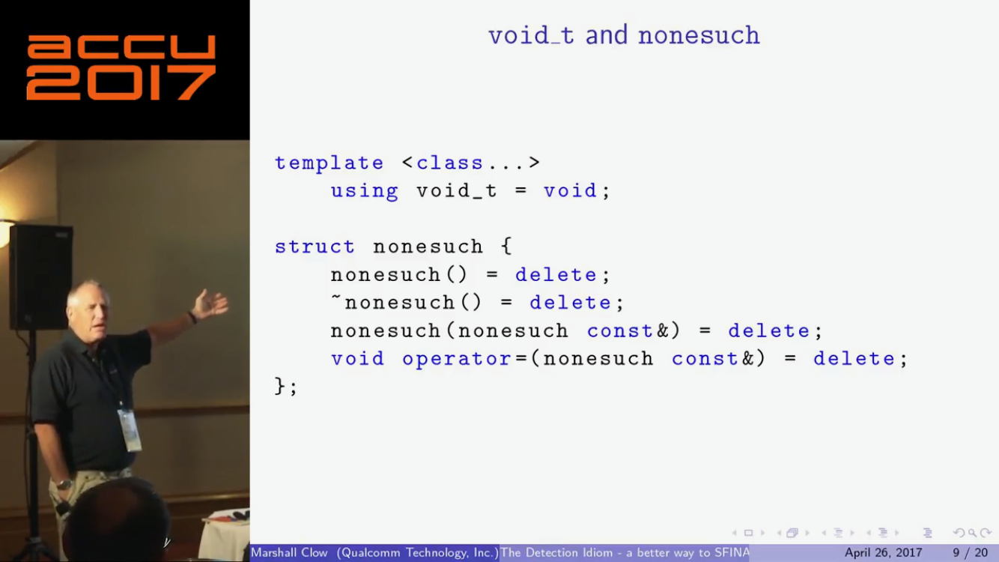
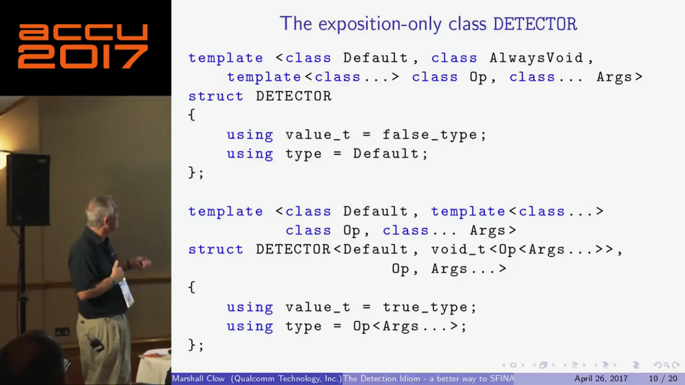
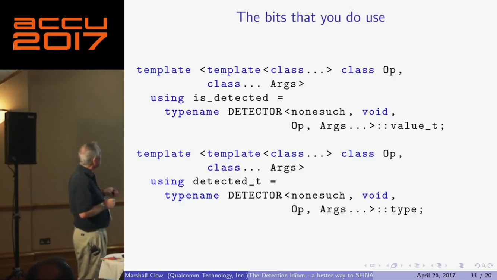
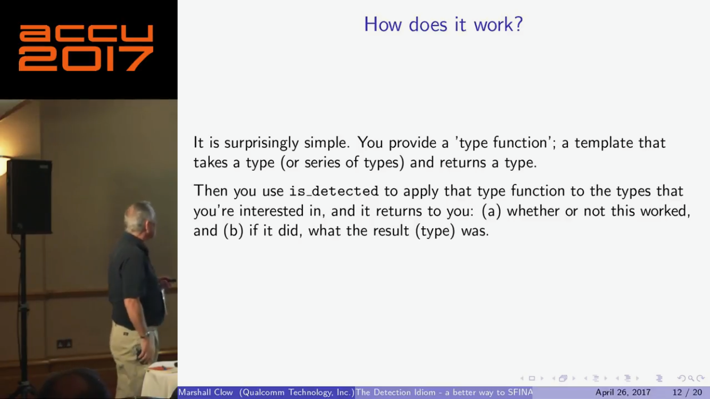
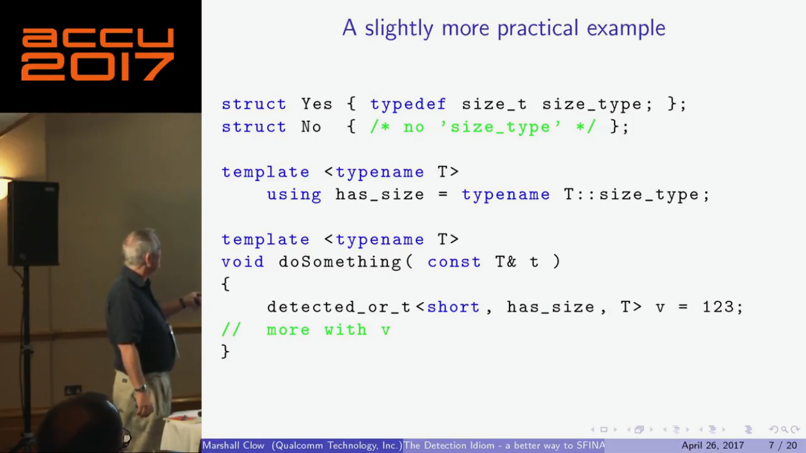
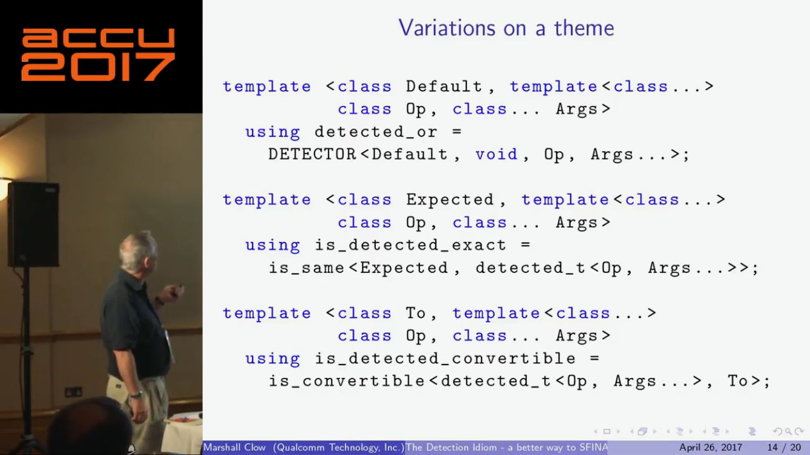
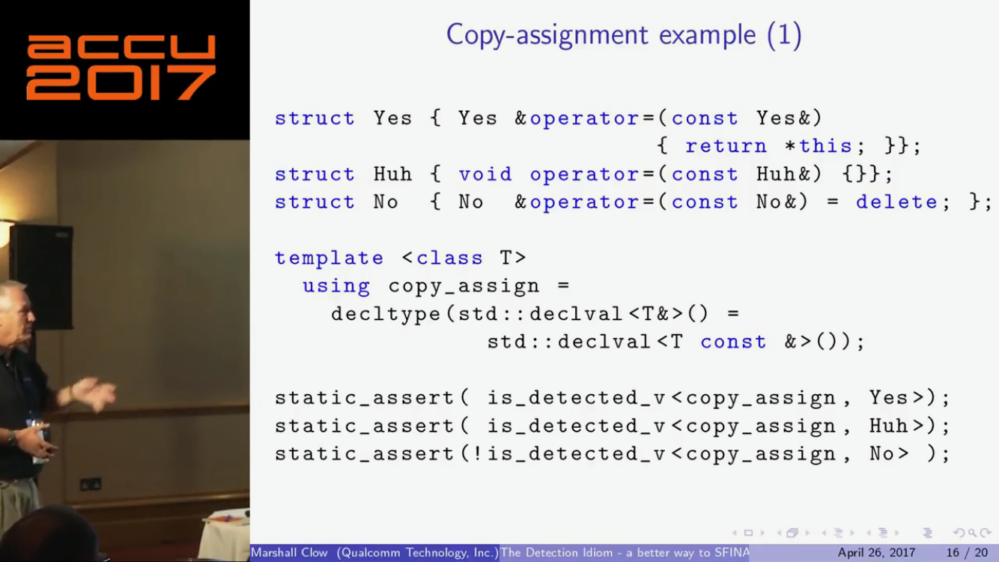
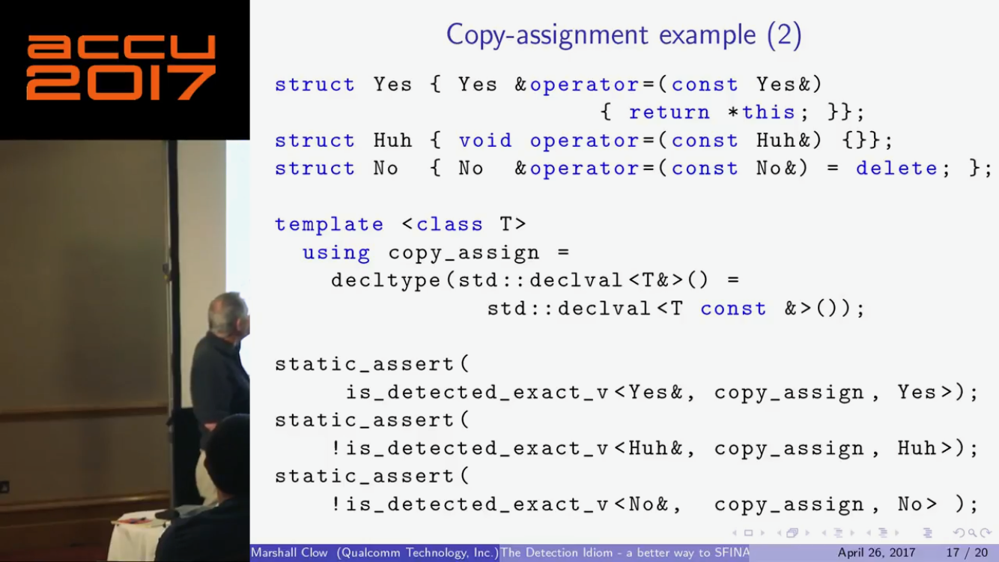

<!-- page_number: true -->
<!-- $size: 16:9 -->

# C++ Club

## 27 July 2017

---

# The Detection Idiom - a simpler way to SFINAE - Marshall Clow [ACCU 2017]

https://www.youtube.com/watch?v=o1ekBpEFcPc

---

# The Detection Idiom - a simpler way to SFINAE - Marshall Clow [ACCU 2017]

---

# The Detection Idiom - a simpler way to SFINAE - Marshall Clow [ACCU 2017]

---

# The Detection Idiom - a simpler way to SFINAE - Marshall Clow [ACCU 2017]

---

# The Detection Idiom - a simpler way to SFINAE - Marshall Clow [ACCU 2017]

---

# The Detection Idiom - a simpler way to SFINAE - Marshall Clow [ACCU 2017]

---

# The Detection Idiom - a simpler way to SFINAE - Marshall Clow [ACCU 2017]

---

# The Detection Idiom - a simpler way to SFINAE - Marshall Clow [ACCU 2017]

---

# `pystring` by Sony ImageWorks

[GitHub](https://github.com/imageworks/pystring)

Pystring is a collection of C++ functions which match the interface and behavior of python's string class methods using `std::string`. Implemented in C++, it does not require or make use of a python interpreter. It provides convenience and familiarity for common string operations not included in the standard C++ library. It's also useful in environments where both C++ and python are used.

Overlapping functionality (such as `index` and `slice`/`substr`) of `std::string` is included to match python interfaces.
