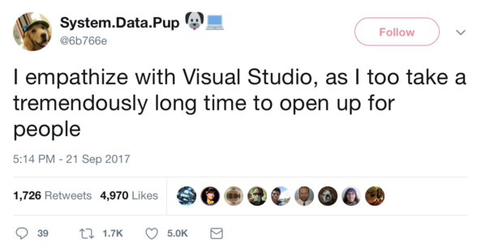

# Bjarne Stroustrup awarded 2017 Faraday Medal

Congratulations!

[Columbia University](https://www.cs.columbia.edu/2017/bjarne-stroustrup-awarded-2017-faraday-medal/):

> For significant contributions to the history of computing, in particular pioneering the C++ programming language, Bjarne Stroustrup has been named the recipient of the 2017 Faraday Medal, the most prestigious award to an individual made by the Institution of Engineering and Technology.

# Bjarne Stroustrup “Learning and Teaching Modern C++”

[Video (1h38m)](https://www.youtube.com/watch?v=fX2W3nNjJIo)

[CppCon 2017 Playlist](https://www.youtube.com/playlist?list=PLHTh1InhhwT6bwIpRk0ZbCA0N2p1taxd6)

# C++17 in Visual Studio

[Stephan T. Lavavej on Twitter](https://twitter.com/StephanTLavavej/status/912828909246234624):

> C++17 fold expressions have been implemented by @joncaves for VS 2017 15.5!

And [later](https://twitter.com/StephanTLavavej/status/912937233463754752):

> Our plan was C++17 complete in calendar year 2017. It looks like we’ll miss that, but we’re getting really close. FS will be last in libs.

# Google's Abseil

[Abseil](https://abseil.io) is an open-source collection of C++ library code designed to augment the C++ standard library. The Abseil library code is collected from Google’s own C++ code base, has been extensively tested and used in production, and is the same code we depend on in our daily coding lives.

In some cases, Abseil provides pieces missing from the C++ standard; in others, Abseil provides alternatives to the standard for special needs we’ve found through usage in the Google code base. We denote those cases clearly within the library code we provide you.

[Intro](https://abseil.io/about/intro), [Why](https://abseil.io/about/philosophy), [C++ Quickstart](https://abseil.io/docs/cpp/quickstart), [GitHub](https://github.com/abseil/) (Apache), [Reddit](https://www.reddit.com/r/cpp/comments/72m3e3/introducing_abseil_a_new_common_libraries_project/)

# Stb libraries by Sean Barrett

Single-file libraries for C/C++ (Public Domain/MIT)

[GitHub](https://github.com/nothings/stb), [libraries](https://github.com/nothings/stb#stb_libs), [Author](http://nothings.org), [Twitter](https://twitter.com/nothings)

C, MSVC 6 (!)

# Wt 4.0.0

Wt is a web GUI library in modern C++. Quickly develop highly interactive web UIs with widgets, without having to write a single line of JavaScript. Wt handles all request handling and page rendering for you, so you can focus on functionality.

[Home](https://www.webtoolkit.eu/wt/), [Download](https://www.webtoolkit.eu/wt/download), [GitHub](https://github.com/emweb/wt) (GPL/Commercial)

# GCC 7.2 patch implementing abbreviated lambdas

* [GitHub](https://github.com/DaemonSnake/gcc-abriviated-cpp-lambda), [Reddit](https://www.reddit.com/r/cpp/comments/708tpd/c_abbreviated_lambdas_for_fun_and_profit_gcc72/)
* Implements "Abbreviated Lambdas for Fun and Profit": [P0573r1](http://www.open-std.org/jtc1/sc22/wg21/docs/papers/2017/p0573r1.html)
* Implements "Forward without forward": [P0644r0](http://www.open-std.org/jtc1/sc22/wg21/docs/papers/2017/p0644r0.html)

```cpp
[](auto&&x) => func(>>x);
//equivalent to
[](auto&& x) ->
decltype((func(std::forward<decltype(x)&&>(x))))
noexcept(noexcept(func(std::forward<decltype(x)&&>(x))))
{
    return func(std::forward<decltype(x)&&>(x));
};
```

# Useful GCC warning options not enabled by -Wall -Wextra

[Post](https://kristerw.blogspot.co.uk/2017/09/useful-gcc-warning-options-not-enabled.html)

# Parsing Expression Grammar Template Library

[GitHub](https://github.com/taocpp/PEGTL) (MIT)

The Parsing Expression Grammar Template Library (PEGTL) is a zero-dependency C++11 header-only parser combinator library for creating parsers according to a [Parsing Expression Grammar](http://en.wikipedia.org/wiki/Parsing_expression_grammar) (PEG).

# What's new in Clang-format 5

[Post](https://blog.benoitblanchon.fr/clang-format-5/)

# Programming language energy efficiency

[Article](https://sites.google.com/view/energy-efficiency-languages/results)

# Units 2.3.0 released

[GitHub](https://github.com/nholthaus/units/tree/v2.3.0)

A compile-time, header-only, dimensional analysis and unit conversion library built on C++14 with no dependencies.

```cpp
// simple implicit conversion
foot_t              len   = 5_m;
// more complex implicit conversion
meters_per_second_t speed = 60_mi / 1_hr;
// previous example with mixed units
square_meter_t      area  = 15_m * 5_m + 1000_cm * 1000_cm;
```

# Detection Idiom - A Stopgap for Concepts

[Post](https://blog.tartanllama.xyz/detection-idiom/)

* SFINAE and expression SFINAE
* `void_t`
* `is_detected` implementation
* links to videos on the topic

# How to implement the pimpl idiom by using `unique_ptr`

[Article by Jonathan Boccara](https://www.fluentcpp.com/2017/09/22/make-pimpl-using-unique_ptr/)

# The Price of Shared Pointers

### Nicolai Josuttis "The Price of Shared Pointers or Why Passing them by-reference can be Useful" (May 2015)

[YouTube](https://www.youtube.com/watch?v=drhIIbmrjzg)

* `make_shared` and `weak_ptr`: potential memory overhead
* `enable_shared_from_this`
* `atomic_shared_ptr` removed from C++11
* _MESI_ cache management protocol: Modified, Exclusive, Shared, Invalid
* [GotW 91](https://herbsutter.com/2013/06/05/gotw-91-solution-smart-pointer-parameters/)

# Small Buffer Optimization for C++ Lambdas

[Blog post](https://hackernoon.com/experimenting-with-small-buffer-optimization-for-c-lambdas-d5b703fb47e4), [GitHub](https://github.com/LoopPerfect/smallfunction)

A faster replacement for `std::function` using PImpl, type erasure and placement-`new` (MIT).

# Stringify

A single-header-file library to pretty-print STL containers (implicitly GPL)

[GitHub](https://github.com/asit-dhal/stringify)

Based on [printers](https://github.com/mnciitbhu/printers) (GPL)

# llvm::Expected

* [GitHub](https://github.com/weliveindetail/llvm-expected) (LLVM licence)
* [Video (5m)](https://www.youtube.com/watch?v=Wq8fNK98WGw)
* [Article 1: Basics](https://weliveindetail.github.io/blog/post/2017/09/06/llvm-expected-basics.html)
* [Article 2: Differentiation](https://weliveindetail.github.io/blog/post/2017/09/07/llvm-expected-differentiation.html)
* Uses `llvm::ErrorInfo` instead of a template parameter error type
* Article 3: coming soon

# liberasure

[GitHub](https://github.com/atomgalaxy/liberasure)

A no-dependencies C++ extensible type erasure library + lecture material.

# static_any: a low-latency stack-based Boost.Any

[Article](http://david-grs.github.io/low_latency_stack_based_boost_any/), [GitHub](https://github.com/david-grs/static_any) (MIT)

A container for generic (as general) data type like `boost.any`. However:

* It is ~10x faster than `boost.any`, mainly because there is no memory allocation
* As it lies on the stack, it is cache-friendly, close to your other class attributes
* There is a very small space overhead: a fixed overhead of 8 bytes

# "Virtual concepts"

* [Concept-Model Idiom Part One: A new look at polymorphism](https://gracicot.github.io/conceptmodel/2017/09/13/concept-model-part1.html), [Reddit discussion](https://www.reddit.com/r/cpp/comments/709ttn/conceptmodel_idiom_part_one_a_new_look_at/)
* Virtual Concepts ([GitHub](https://github.com/andyprowl/virtual-concepts)): A research project aimed at introducing language support for type erasure in C++, [std-proposals discussion](https://groups.google.com/a/isocpp.org/forum/#!msg/std-proposals/4gEt2OBbSQM/dFr3Go95iZgJ) (Andy Prowl, with feedback from Brittany Friedman, whom he invariably calls "Brent")

# Ericsson's CodeCompass

Open-source C, C++ and Java code navigator based on Clang/LLVM: [GitHub](https://github.com/Ericsson/CodeCompass), [YouTube](https://www.youtube.com/watch?v=gjQG3RNfFxM), [PDF](http://llvm.org/devmtg/2017-03//assets/slides/code_compass_an_open_software_comprehension_framework.pdf)

# Expression Template Library (ETL) 1.2

ETL is a header only library for C++ that provides vector and matrix classes with support for Expression Templates to perform very efficient operations on them.

At this time, the library support compile-time sized matrix and vector and runtime-sized matrix and vector with all element-wise operations implemented. It also supports 1D and 2D convolution, matrix multiplication (naive algorithm and Strassen) and FFT.

[Home](https://baptiste-wicht.com/posts/2016/09/expression-templates-library-etl-10.html), [GitHub](https://github.com/wichtounet/etl) (MIT)

# Orbit Profiler

Orbit is a standalone profiler and debugging tool for Windows. Its main purpose is to help developers understand and visualize the execution flow of a complex application. By giving a bird’s eye view of what is happening under the hood, Orbit gives the developer a deeper understanding of complex systems and allows to quickly find performance bottlenecks.

[Home](https://orbitprofiler.com), [Demo](http://www.telescopp.com), [Download v1.0.1](http://www.telescopp.com/update), [GitHub](https://github.com/pierricgimmig/orbitprofiler) (BSD 2-Clause)

# Visual Studio

[Tweet](https://twitter.com/6b766e/status/910899932248268801)



