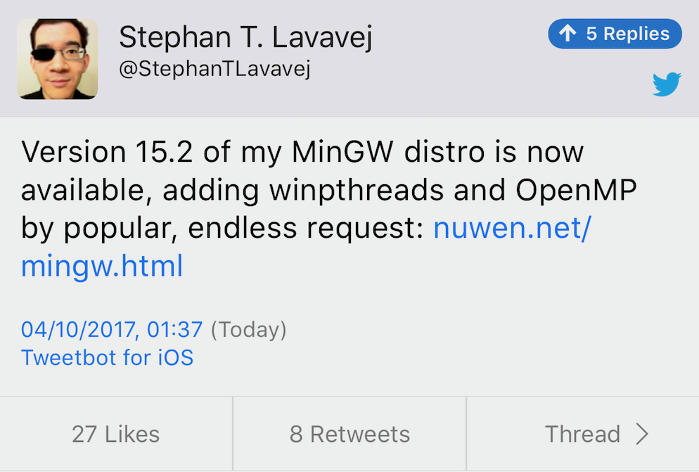

# CppCon 2017 Trip Reports

* [Matt Godbolt](https://xania.org/201710/cppcon-2017-trip-report)
* [Ben Deane](http://www.elbeno.com/blog/?p=1542)
* [Charles L. Wilcox](http://web.cynd.net/~willo/cppcon-2017-trip-report/)
* [Eva Conti: A Beginner's Guide to CPPCon 2017](http://bunnyladame.blogspot.co.uk/2017/09/a-beginners-guide-to-cppcon-2017.html)
* [Oliver Smith aka kfsone](https://kfsone.wordpress.com/2017/10/01/cppcon-2017/)
* [Quentin Duval](https://deque.blog/2017/10/04/my-cppcon-2017-trip-report-10-great-talks-to-watch-and-learn-from/)
* [Tim van Deurzen: CppCon 2017 For Fun and Profit](http://blog.razzeal.org/posts/trip-report-cppcon-2017/)
* [Viktor Kirilov](http://onqtam.com/misc/2017-10-04-cppcon-2017-trip-report/)

# Bjarne Stroustrup “Learning and Teaching Modern C++” (follow-up)

[Video (1h38m)](https://www.youtube.com/watch?v=fX2W3nNjJIo), [Reddit thread](https://www.reddit.com/r/cpp/comments/72o44u/cppcon_2017_bjarne_stroustrup_learning_and/)

# CppCon 2017: Herb Sutter "Meta: Thoughts on generative C++"

[YouTube](https://www.youtube.com/watch?v=4AfRAVcThyA)

* [P0515](http://open-std.org/JTC1/SC22/WG21/docs/papers/2017/p0515r0.pdf) Consistent Comparison (spaceship operator)
* Still calls them "metaclasses"
* Tries hard to justify metaclasses: "this is something people already do, it’s just hard"
* Reflection: [P0385](https://wg21.link/P0385), [P0194](https://wg21.link/P0194), [P0578](https://wg21.link/P0578), [P0670](https://wg21.link/P0670), [P0590](https://wg21.link/P0590), [P0598](https://wg21.link/P0598)
* Compile-time code: [P0633](https://wg21.link/P0633), [P0425](https://wg21.link/P0425), [P0595](https://wg21.link/P0595)-8, [P0031](https://wg21.link/P0031), [P0202](https://wg21.link/P0202), [P0639](https://wg21.link/P0639), [P0712](https://wg21.link/P0712)
* Constexpr: [P0202](https://wg21.link/P0202), [P0597](https://wg21.link/P0597), [P0639](https://wg21.link/P0639)
* Metaclasses: [P0707](https://wg21.link/P0707), [P0712](https://wg21.link/P0712), [P0589](https://wg21.link/P0589)-[P0590](https://wg21.link/P0590)

# CppCon 2017: Titus Winters "C++ as a 'Live at Head' Language"

[YouTube](https://www.youtube.com/watch?v=tISy7EJQPzI)

* Software engineering is about resilience to change over time.
* Semantic versioning (SemVer): x.y.z
* As C++ code is distributed in source form, we should live at head.

Hyrum's Law:

> With a sufficient number of users of an API, it doesn't matter what you promise in the contract, all observable behaviours of your system will be depended on by somebody.

[Abseil.io](https://abseil.io/)

# DConf

[Things that Matter - Scott Meyers | DConf2017](https://www.youtube.com/watch?v=RT46MpK39rQ)

# C++ community Slack server

[https://cpplang.now.sh](https://cpplang.now.sh)

C++, yay! Slack, boo.

# Bartek Filipek's mailing list

[Subscribe](http://bfilipek.us8.list-manage2.com/subscribe?u=e93417593cbf4da3dba03d672&id=2f3084dda3) and get:

* **C++17 Ref Card** - one-page PDF with a concise description of all C++17 features
* **C++17 in Detail** - 50-page PDF compiled from his recent blog series

[Blog](http://www.bfilipek.com)

# Using MinGW and Cygwin with Visual C++

* [Post](https://blogs.msdn.microsoft.com/vcblog/2017/07/19/using-mingw-and-cygwin-with-visual-cpp-and-open-folder/)
* [Video](https://channel9.msdn.com/Shows/C9-GoingNative/GoingNative-59-MinGW-in-Visual-Studio)
* Requires [Visual Studio 15.3 Preview 4](https://www.visualstudio.com/vs/preview/).

# STL's MinGW 15.2



[Website](http://nuwen.net/mingw.html)

# Why is the `std::function` `operator()` `const`?

[Reddit](https://www.reddit.com/r/cpp/comments/742ol8/why_is_the_stdfunction_operator_const/)

STL:

> It's indeed a Boost/TR1-era mistake that the LWG has recognized, although we can't do anything about it.

# Apple open-sourced the Darwin kernel (XNU)

[GitHub](https://github.com/apple/darwin-xnu)

XNU kernel is part of the Darwin operating system for use in OS X and iOS operating systems. XNU is an acronym for XNU is Not Unix. XNU is a hybrid kernel combining the Mach kernel developed at Carnegie Mellon University with components from FreeBSD and C++ API for writing drivers called IOKit. XNU runs on I386, X86_64 for both single processor and multi-processor configurations.

# ComputeCpp for Windows

[CodePlay announcement](https://codeplay.com/portal/09-27-17-computecpp-windows-support)

ComputeCpp Community Edition is now available on Windows. This means it is now possible to develop [SYCL](https://www.khronos.org/sycl) applications using Windows and Visual Studio.

SYCL (pronounced ‘sickle’) is a royalty-free, cross-platform abstraction layer that builds on the underlying concepts, portability and efficiency of OpenCL that enables code for heterogeneous processors to be written in a “single-source” style using completely standard C++.

# The Price of Shared Pointers

[Nicolai Josuttis "The Price of Shared Pointers or Why Passing them by-reference can be Useful" (May 2015)](https://www.youtube.com/watch?v=drhIIbmrjzg)

* `make_shared` and `weak_ptr`: potential memory overhead
* `enable_shared_from_this`
* `atomic_shared_ptr` removed from C++11
* _MESI_ cache management protocol: Modified, Exclusive, Shared, Invalid
* [GotW 91](https://herbsutter.com/2013/06/05/gotw-91-solution-smart-pointer-parameters/)
* Audience didn't agree with the presenter (quite rightly)

# Stringify

A single-header-file library to pretty-print STL containers (implicitly GPL)

[GitHub](https://github.com/asit-dhal/stringify)

Based on [printers](https://github.com/mnciitbhu/printers) (GPL)

# llvm::Expected

* [GitHub](https://github.com/weliveindetail/llvm-expected) (LLVM licence)
* [Video (5m)](https://www.youtube.com/watch?v=Wq8fNK98WGw)
* [Article 1: Basics](https://weliveindetail.github.io/blog/post/2017/09/06/llvm-expected-basics.html)
* [Article 2: Differentiation](https://weliveindetail.github.io/blog/post/2017/09/07/llvm-expected-differentiation.html)
* Uses `llvm::ErrorInfo` instead of a template parameter error type
* Unchecked `llvm::Error` objects abort program on destruction

# liberasure

[GitHub](https://github.com/atomgalaxy/liberasure)

A no-dependencies C++ extensible type erasure library + lecture material.

# static_any: a low-latency stack-based Boost.Any

* [Article](http://david-grs.github.io/low_latency_stack_based_boost_any/)
* [GitHub](https://github.com/david-grs/static_any) (MIT)

A container for generic (as general) data type like `boost.any`. However:

* It is ~10x faster than `boost.any`, mainly because there is no memory allocation
* As it lies on the stack, it is cache-friendly, close to your other class attributes
* There is a very small space overhead: a fixed overhead of 8 bytes

# "Virtual concepts"

* [Concept-Model Idiom Part One: A new look at polymorphism](https://gracicot.github.io/conceptmodel/2017/09/13/concept-model-part1.html)
* [Reddit discussion](https://www.reddit.com/r/cpp/comments/709ttn/conceptmodel_idiom_part_one_a_new_look_at/)
* Virtual Concepts ([GitHub](https://github.com/andyprowl/virtual-concepts)): A research project aimed at introducing language support for type erasure in C++
* [std-proposals discussion](https://groups.google.com/a/isocpp.org/forum/#!msg/std-proposals/4gEt2OBbSQM/dFr3Go95iZgJ) (Andy Prowl, with feedback from Brittany Friedman, whom he keeps calling "Brent")

# Ericsson's CodeCompass

Open-source C, C++ and Java code navigator based on Clang/LLVM

* [GitHub](https://github.com/Ericsson/CodeCompass)
* [YouTube](https://www.youtube.com/watch?v=gjQG3RNfFxM)
* [PDF](http://llvm.org/devmtg/2017-03//assets/slides/code_compass_an_open_software_comprehension_framework.pdf)

# Expression Template Library (ETL) 1.2

ETL is a header only library for C++ that provides vector and matrix classes with support for Expression Templates to perform very efficient operations on them.

At this time, the library support compile-time sized matrix and vector and runtime-sized matrix and vector with all element-wise operations implemented. It also supports 1D and 2D convolution, matrix multiplication (naive algorithm and Strassen) and FFT.

* [Home](https://baptiste-wicht.com/posts/2016/09/expression-templates-library-etl-10.html)
* [GitHub](https://github.com/wichtounet/etl) (MIT)

# Orbit Profiler

Orbit is a standalone profiler and debugging tool for Windows. Its main purpose is to help developers understand and visualize the execution flow of a complex application. By giving a bird’s eye view of what is happening under the hood, Orbit gives the developer a deeper understanding of complex systems and allows to quickly find performance bottlenecks.

* [Home](https://orbitprofiler.com)
* [Demo](http://www.telescopp.com)
* [Download v1.0.1](http://www.telescopp.com/update)
* [GitHub](https://github.com/pierricgimmig/orbitprofiler) (BSD 2-Clause)

# C++17 class template argument deduction

[Article by Arne Mertz](https://arne-mertz.de/2017/06/class-template-argument-deduction/)

Before C++17:

```cpp
std::pair<int, double> myPair1(22, 43.9);
auto myPair2 = std::make_pair(22, 43.9);
```

Since C++17:

```cpp
std::pair myPair{22, 43.9};
```

Deduction guide:

```cpp
namespace std {
    template<class T1, class T2>
    pair(T1 const&, T2 const&) -> pair<T1, T2>;
}
```

# Quote

David Leinweber:

> Give someone a program, you frustrate them for a day; teach them how to program, you frustrate them for a lifetime.

# Quote

Fred Brooks (unconfirmed):

> What one programmer can do in one month, two programmers can do in two months.
