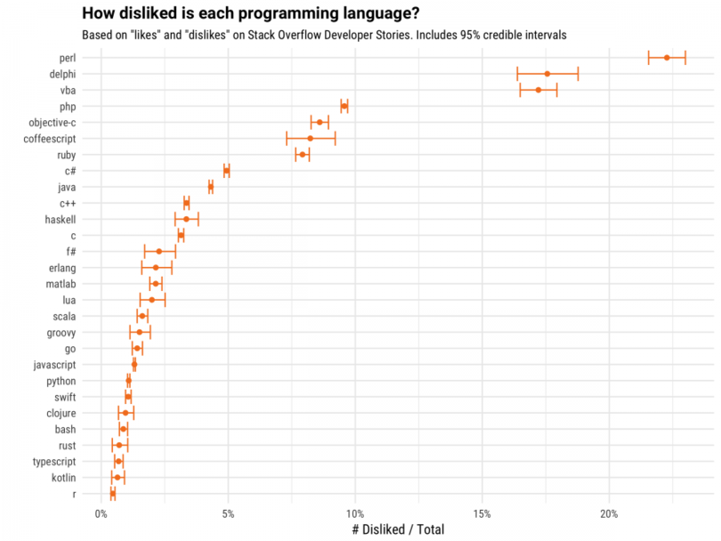

# The C++ Bestiary

[Website](http://videocortex.io/2017/Bestiary/)

# CppCon 2017: Matt Godbolt "What Has My Compiler Done for Me Lately? Unbolting the Compiler's Lid"

[YouTube](https://www.youtube.com/watch?v=bSkpMdDe4g4)

* [x86 Assembly (Wikibooks)](https://en.wikibooks.org/wiki/X86_Assembly)
* Reading assembly alone can be misleading, need to measure too
    * [Google Benchmark](https://github.com/google/benchmark)
    * [quick-bench.com](http://quick-bench.com)
* Target specific CPU architecture (`-march=i486` vs. `-march=haswell`)
* Coming soon: code execution
* Written in Node.js
* Costs: $200/month

# CppCon 2017: Scott Wardle "EA's Secret Weapon: Packages and Modules"

[YouTube](https://www.youtube.com/watch?v=NlyDUQS8OcQ)

* Versions in library paths: not ideal
* Masterconfig: Premake solves this much more elegantly, IMHO
* EA package server: directory of packages
* Disting is tricky (manual versioning)
* Module example (MSVC-style); discusses how to find modules during build
* EA packages can have circular link dependencies
* Modules should have package as part of the name to avoid conflicts (naming convention). Better yet, there should be a package manager.
* Q: "I'm coming from Rust and I don't get the point of these modules"

# CppCon 2017 Internet of Things Panel

[YouTube](https://www.youtube.com/watch?v=gmW6b0I_t5k)

* Updating and fixing bugs is a problem, especially when the device is not supported anymore or the manufacturer goes out of business
* Why would anyone want their fridge to connect to the Internet?
* Early IoT adopters have quite a few paperweights
* IoT security is a big issue and it is hard
* Using exceptions may not be possible
* IoT projects are excellent for getting children interested in programming and technology

# Intel® System Studio 2018 Beta User Guide for IoT C/C++ Development

* [CodeProject article](https://www.codeproject.com/Articles/1212067/Intel-System-Studio-Beta-User-Guide-for-Internet-o)
* [Download Intel System Studio IoT Edition](https://software.intel.com/en-us/iot/tools-ide/ide/iss-iot-edition)

Supported boards:

* [Intel® IoT Gateway](https://software.intel.com/en-us/iot/hardware/gateways)
* [MinnowBoard MAX](https://software.intel.com/en-us/iot/hardware/minnow-board-turbot)

# CppCon 2017: John D. Woolverton "C Pointers"

[YouTube](https://www.youtube.com/watch?v=iJ1rwgCI1Xc)

A lightning talk about learning from mistakes.

```cpp
/* add polygon to current grid position and advance */
*((*(gridfill++))++) = poly;
```

*DRES*: Destruct Resources on Exit Scope (aka *RAII*)

# Clara: A simple-to-use composable command line parser by Phil Nash

* [GitHub](https://github.com/philsquared/Clara)
* [YouTube](https://www.youtube.com/watch?v=Od4bjLfwI-A)
* C++11
* Monadic binding for composability, no exceptions
* Used by [Catch](https://github.com/philsquared/Catch), combines with user's parsers

```cpp
int width = 0;
using namespace clara;
auto cli = Opt(width, "width")["-w"]["--width"]("How wide?");
auto result = cli.parse(Args(argc, argv));
if (!result) {
    std::cerr << "Error: " << result.errorMessage() << std::endl;
    exit(1);
}
```

# DLL: Deep Learning Library (!)

[GitHub](https://github.com/wichtounet/dll) (MIT)

DLL is a library that aims to provide a C++ implementation of Restricted Boltzmann Machine (RBM) and Deep Belief Network (DBN) and their convolution versions as well. It also has support for some more standard neural networks.

* Header-only
* C++14
* CUDA
* Windows not supported
* Dependencies:
    * [Catch](https://github.com/philsquared/Catch)
    * [cifar](https://github.com/wichtounet/cifar-10) -- Simple C++ reader for CIFAR-10 dataset
    * [etl](https://github.com/wichtounet/etl) -- Expression Templates Library (ETL) with GPU support
    * [mnist](https://github.com/wichtounet/mnist) -- Simple C++ reader for MNIST dataset
    * [libsvm](https://www.csie.ntu.edu.tw/~cjlin/libsvm/) -- A Library for Support Vector Machines

# C++/WinRT in Windows SDK

[Post](https://moderncpp.com/2017/11/01/cppwinrt-in-the-windows-sdk/)

Goal: to retire C++/CX

[Download Windows Insider Preview SDK build 17025](https://blogs.windows.com/buildingapps/2017/11/01/windows-10-sdk-preview-build-17025/#ryPH3zAy6yk2cIRX.97)

# Best unknown MSVC flag: `/d2cgsummary`

[Post](http://aras-p.info/blog/2017/10/23/Best-unknown-MSVC-flag-d2cgsummary/)

[Case study](https://www.enkisoftware.com/devlogpost-20171031-1-Speeding-up-Runtime-Compiled-C++-compile-times-in-MSVC-with-d2cgsummary)

* Anomalistic compile times
* Caching stats
* Code generation summary
* Name demangling: `undname.exe` or [online demangler](https://demangler.com/)

# ARM GCC Cross Compilation in Visual Studio

[Post](https://blogs.msdn.microsoft.com/vcblog/2017/10/23/arm-gcc-cross-compilation-in-visual-studio/)

Download the [Visual Studio 2017 Preview](https://www.visualstudio.com/vs/preview/), install the **Linux C++ Workload**, select the option for **Embedded and IoT Development** and give it a try with your projects.

# CLion 2017.3 EAP

[Post](https://blog.jetbrains.com/clion/2017/10/clion-2017-3-eap-valgrind-memcheck-integration/)

* Valgrind memcheck integration (except on Windows)
* [YouTrack ticket: Sanitizer support](https://youtrack.jetbrains.com/issue/CPP-11099)
* Improved support for multiple toolchains

# Guide into OpenMP: Easy multithreading programming for C++

[Link](http://bisqwit.iki.fi/story/howto/openmp/)

```cpp
#include <cmath>
int main()
{
    const int size = 256;
    double sinTable[size];

    #pragma omp parallel for
    for(int n=0; n<size; ++n)
        sinTable[n] = std::sin(2 * M_PI * n / size);

    // the table is now initialized
}
```

# A polymorphic value-type for C++

[P0201R2 by Jonathan Coe and Sean Parent](http://www.open-std.org/jtc1/sc22/wg21/docs/papers/2017/p0201r2.pdf)

```cpp
// Copyable composite with mutable polymorphic components
class CompositeObject {
  std::polymorphic_value<IComponent1> c1_;
  std::polymorphic_value<IComponent2> c2_;
public:
  CompositeObject(std::polymorphic_value<IComponent1> c1,
                    std::polymorphic_value<IComponent2> c2) :
                    c1_(std::move(c1)), c2_(std::move(c2)) {}
  void foo() { c1_->foo(); }
  void bar() { c2_->bar(); }
};
```

# Printing boolean values

[Pierre Habouzit on Twitter](https://twitter.com/pedantcoder/status/923115888999522304):

```c
printf("%c", boolean_expr["NY"])
```

# ULID: Universally Unique Lexicographically Sortable Identifier

* [GitHub](https://github.com/alizain/ulid)
* [C++](https://github.com/suyash/ulid) --- header-only, MIT
* 128-bit compatibility with UUID
* 1.21e+24 unique ULIDs per millisecond
* Lexicographically sortable!
* Canonically encoded as a 26 character string, as opposed to the 36 character UUID
* Uses Crockford's *base32* for better efficiency and readability (5 bits per character)
* Case insensitive
* No special characters (URL safe)
* Monotonic sort order (correctly detects and handles the same millisecond)

# Does C++ need a universal package manager?

* [Article by Paul Fultz II](http://pfultz2.com/blog/2017/10/27/universal-package-manager/)
* [Reddit thread](https://www.reddit.com/r/programming/comments/79a0x3/does_c_need_a_universal_package_manager/)
* [Hacker News thread](https://news.ycombinator.com/item?id=15578065)
* Many package managers but no standard build system for C++
* A platform independent package manager for C++ must effectively degrade into a build system that rebuilds all dependencies from source (Rust & Cargo)

> What C++ needs is a common format to communicate a package’s requirements among different package manager tools.

# Conan 0.28.1

[Changelog](http://docs.conan.io/en/latest/changelog.html)

# Transwarp

*Transwarp* is a header-only C++ library for task concurrency. It enables you to free your functors from explicit threads and transparently manage dependencies. Under the hood, a directed acyclic graph is built that allows for efficient traversal and type-safe dependencies. Use *transwarp* if you want to model your dependent operations in a graph of tasks and intend to invoke the graph more than once (MIT).

* [GitHub](https://github.com/bloomen/transwarp)

# Ctla: Compile-time linear algebra in C++

[GitHub](https://github.com/moroneyt/ctla) (MIT)

* Header-only library
* All functions `constexpr`, all computation done at compile time
* Intuitive syntax for initialisation, indexing, augmenting
* Matrix arithmetic including inverses and linear systems supported
* Block matrices supported
* Runtime printing in MATLAB-compatible syntax if required

# Pacific++ Conference in New Zealand

* [Trip report](https://kirit.com/Blog:/2017-10-31/Pacific++%20trip%20report)
* [Pacific++ Conference Website](https://pacificplusplus.com/) (Christchurch, New Zealand)
* [Videos](https://www.youtube.com/channel/UCrRR5mU5aqvtZAuEGYfdTjw/videos)

# CppCon 2017: Barbara Geller & Ansel Sermersheim "Unicode Strings: Why the Implementation Matters"

[YouTube](https://www.youtube.com/watch?v=ysh2B6ZgNXk)

* Unicode introduction
* You cannot interpret a sequence of characters without knowing the encoding
* `std::string` or `std::wstring` have no way to specify encoding
* MFC, Java, C#, QT: UCS-2, UTF-16
* .NET `TextField` length is specified in storage units => can crash .NET runtime

# CsString

A library providing Unicode-aware string support for C++. Part of [CopperSpice](https://github.com/copperspice)

* [GitHub](https://github.com/copperspice/cs_string) (BSD 2-clause)
* [Docs](http://www.copperspice.com/docs/cs_string/namespace_cs_string.html)
* Header-only, C++11

# Most-disliked programming languages on [StackOverflow](https://stackoverflow.blog/2017/10/31/disliked-programming-languages/)



# Quote

Stan Kelly-Bootle:

> Should array indices start at 0 or 1? My compromise of 0.5 was rejected without, I thought, proper consideration.

# Quote

@jamesshore:

> Do; or do not. There is no //TODO
