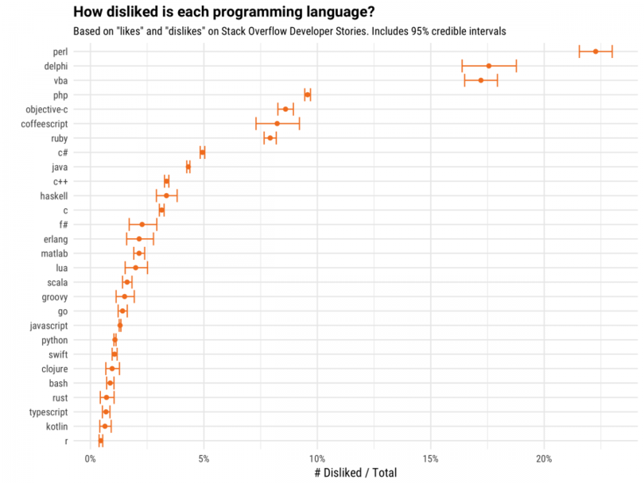

# CppCon 2017 Trip Report by KDAB

[Blog post](http://www.kdab.com/cppcon-2017-trip-report/)

# Catch2

[Announcement](http://www.levelofindirection.com/journal/2017/11/3/catch2-released.html) | [GitHub](https://github.com/catchorg/Catch2)

New:

* Requires C++11
* Clara: a composable command line processor | [GitHub](https://github.com/philsquared/Clara) | [Video](https://www.youtube.com/watch?v=Od4bjLfwI-A)
* Commas in assertions

```cpp
REQUIRE( getPair() == std::pair<true, "banana">() );
```

* Microbenchmarking (experimental)

Future plans

* Threading
* Generators/[property-based testing](http://hypothesis.works/articles/what-is-property-based-testing/)

# ULID: Universally Unique Lexicographically Sortable Identifier

* [GitHub](https://github.com/alizain/ulid)
* [C++](https://github.com/suyash/ulid) --- header-only, MIT
* 128-bit compatibility with UUID
* 1.21e+24 unique ULIDs per millisecond
* Lexicographically sortable!
* Canonically encoded as a 26 character string, as opposed to the 36 character UUID
* Uses Crockford's *base32* for better efficiency and readability (5 bits per character)
* Case insensitive
* No special characters (URL safe)
* Monotonic sort order (correctly detects and handles the same millisecond)

# Does C++ need a universal package manager?

* [Article by Paul Fultz II](http://pfultz2.com/blog/2017/10/27/universal-package-manager/)
* [Reddit thread](https://www.reddit.com/r/programming/comments/79a0x3/does_c_need_a_universal_package_manager/)
* [Hacker News thread](https://news.ycombinator.com/item?id=15578065)
* Many package managers but no standard build system for C++
* A platform-independent package manager for C++ must effectively degrade into a build system that rebuilds all dependencies from source (Rust & Cargo)

> What C++ needs is a common format to communicate a package’s requirements among different package manager tools.

# Conan 0.28.1

[Changelog](http://docs.conan.io/en/latest/changelog.html)

# CppCon 2017: Boris Kolpackov "C++ Modules and Packages: Making Dreams Come True"

[YouTube](https://www.youtube.com/watch?v=PxFrhYAYF3M) (5m)

A live demo of using *build2* package manager and build system with C++ Modules.

# CppCon 2017: Boris Kolpackov "Building C++ Modules"

[YouTube](https://www.youtube.com/watch?v=E8EbDcLQAoc)

* Isolation from macros and symbols
* A physical design mechanism
* A step towards not needing the preprocessor
* Reliable distributed compilation
* Faster builds
* Module declaration starts *module purview*

# CppCon 2017: Nathan Sidwell “Adding C++ modules-ts to the GNU Compiler”

[YouTube](https://www.youtube.com/watch?v=5EI3XBde_w4)

# CppCon 2017: Adrien Devresse “Nix: A functional package manager for your C++ software stack”

[YouTube](https://www.youtube.com/watch?v=6wJ4-wP-nnA)

# CppCon 2017: Isabella Muerte “There Will Be Build Systems: I Configure Your Milkshake”

[YouTube](https://www.youtube.com/watch?v=7THzO-D0ta4&t=3s)

# C++ Modules, what are they for?

[Reddit post](https://www.reddit.com/r/cpp/comments/7b2och/c_modules/) with a "Modules Lite" proposal

**Goals of Modules TS**

 1. componentization;
 2. isolation from macros;
 3. scalable build;
 4. support for modern semantics-aware developer tools.

Furthermore, the proposal reduces opportunities for violations of the One Definition Rule (ODR), and increases practical type-safe linking.

# Transwarp

*Transwarp* is a header-only C++ library for task concurrency. It enables you to free your functors from explicit threads and transparently manage dependencies. Under the hood, a directed acyclic graph is built that allows for efficient traversal and type-safe dependencies. Use *transwarp* if you want to model your dependent operations in a graph of tasks and intend to invoke the graph more than once (MIT).

* [GitHub](https://github.com/bloomen/transwarp)

# Ctla: Compile-time linear algebra in C++

[GitHub](https://github.com/moroneyt/ctla) (MIT)

* Header-only library
* All functions `constexpr`, all computation done at compile time
* Intuitive syntax for initialisation, indexing, augmenting
* Matrix arithmetic including inverses and linear systems supported
* Block matrices supported
* Runtime printing in MATLAB-compatible syntax if required

# Pacific++ Conference in New Zealand

* [Trip report](https://kirit.com/Blog:/2017-10-31/Pacific++%20trip%20report)
* [Pacific++ Conference Website](https://pacificplusplus.com/) (Christchurch, New Zealand)
* [Videos](https://www.youtube.com/channel/UCrRR5mU5aqvtZAuEGYfdTjw/videos)

# CppCon 2017: Barbara Geller & Ansel Sermersheim "Unicode Strings: Why the Implementation Matters"

[YouTube](https://www.youtube.com/watch?v=ysh2B6ZgNXk)

* Unicode introduction
* You cannot interpret a sequence of characters without knowing the encoding
* `std::string` or `std::wstring` have no way to specify encoding
* MFC, Java, C#, QT: UCS-2, UTF-16
* .NET `TextField` length is specified in storage units $\Rightarrow$ can crash .NET runtime
* [CsString](https://github.com/copperspice/cs_string)

# CsString

A library providing Unicode-aware string support for C++.

* [GitHub](https://github.com/copperspice/cs_string) (BSD 2-clause)
* [Docs](http://www.copperspice.com/docs/cs_string/namespace_cs_string.html)
* Header-only, C++11
* Separates encoding from storage
* Extensively tested
* Part of [CopperSpice](https://github.com/copperspice)

# Most-disliked programming languages on [StackOverflow](https://stackoverflow.blog/2017/10/31/disliked-programming-languages/)



# Quote

Stan Kelly-Bootle:

> Should array indices start at 0 or 1? My compromise of 0.5 was rejected without, I thought, proper consideration.

# Quote

@jamesshore:

> Do; or do not. There is no //TODO

# Variadic CRTP by Steve Dewhurst

[PDF](http://stevedewhurst.com/once_weakly/once-weakly20170328/once-weakly20170328.pdf)

# "Making new friends" idiom by Dan Saks

[Wikibooks](https://en.wikibooks.org/wiki/More_C%2B%2B_Idioms/Making_New_Friends)

> The goal is to simplify creation of friend functions for a class template.

```cpp
template<typename T>
class Foo {
   T value;
public:
   Foo(const T& t) { value = t; }
   friend ostream& operator <<(ostream& os, const Foo<T>& b)
   {
      return os << b.value;
   }
};
```

# Boost.UI library

[GitHub](https://github.com/kosenko/ui)
