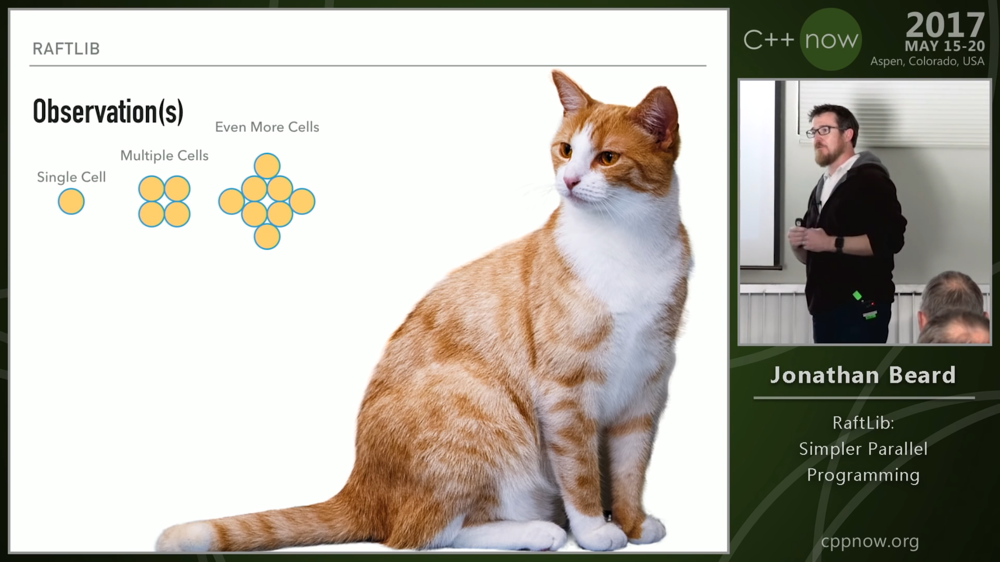
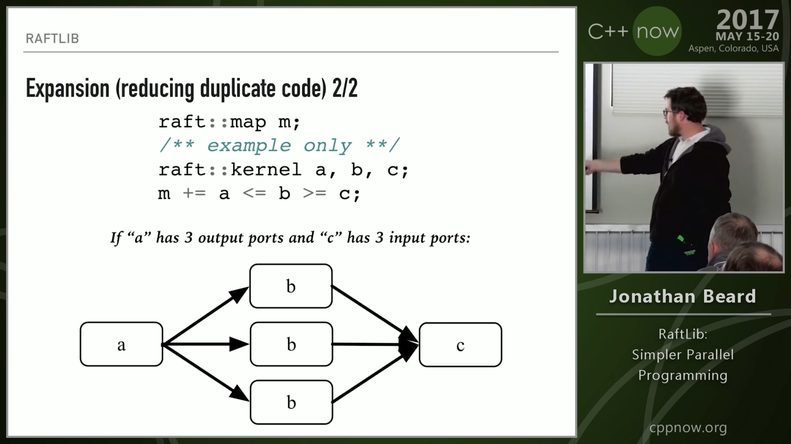
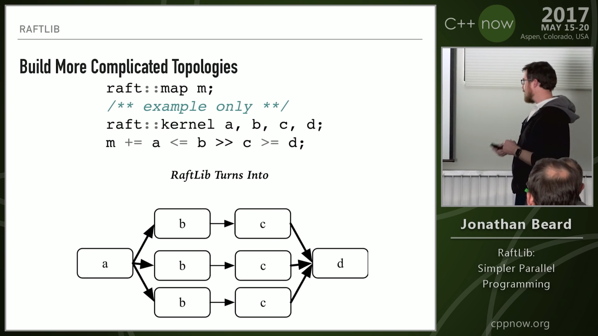

# C++17 ISO Standard

[Link](https://www.iso.org/standard/68564.html)

Buy your own copy for only CHF 198 / USD 202 / GBP 150 / BTC 0.017363

# CLion 2017.3 Released

* [Announcement](https://blog.jetbrains.com/clion/2017/11/clion-2017-3-cpp-support-valgrind-memcheck-boost-test/)
* [What's New video with Phil Nash](https://www.youtube.com/watch?v=HMJpf99na0I)
* [Download](https://www.jetbrains.com/clion/download/?utm_source=twitter&utm_medium=blog_post&utm_campaign=clion_release_2017_3)
* Improvements in support for list initialization, name lookup, MSVC support, JUCE library
* Support for Valgrind Memcheck
* Support for Boost.Test
* Ability to configure multiple toolchains

# Meeting C++ Trip Report

* [Jean Guegant](http://jguegant.github.io/blogs/tech/trip-report-meetingcpp-2017.html)

# C++ Standards Meeting in Albuquerque, November 2017

[Trip report by Botond Ballo](https://botondballo.wordpress.com/2017/11/20/trip-report-c-standards-meeting-in-albuquerque-november-2017/)

* C++17: GCC and Clang: done, MSVC: by March 2018
* C++20 news
* TS: Coroutines, Ranges (a leading candidate for introducing Concepts into the Standard Library), Networking
* Modules TS, Parallelism TS v2, Concurrency TS v2
* Future: reflection, metaclasses (updated), graphics, numerics
* Concepts: adjective syntax for Abbreviated Function Templates (AFT): `void sort(Sortable& auto s);`
* Rejected proposals, discussion papers
* Modules v2: context-sensitive `module` keyword, module partitions; continue to explore macro support

# C++17 upgrades you should be using in your code

[Article by Julian Templeman](https://www.oreilly.com/ideas/c++17-upgrades-you-should-be-using-in-your-code)

* Structured bindings for tuples, arrays, and structs
* New library types and containers: `std::variant`, `std::byte`, `std::optional`, `std::any`

# CppCon 2017: Adrien Devresse "Nix: A functional package manager for your C++ software stack"

* [YouTube](https://www.youtube.com/watch?v=6wJ4-wP-nnA)
* [Home](https://nixos.org/nix/)

# Conan 0.29

* [Changelog](http://docs.conan.io/en/latest/changelog.html)
* [Introduction](http://docs.conan.io/en/latest/introduction.html)

# Creating Conan packages, by Giorgio Azzinnaro

[Article](http://giorgio.azzinna.ro/2017/12/creating-conan-packages-package-manager-for-c--/)

[Conan](https://www.conan.io/)

# C++ Modules Are a Tooling Opportunity, by GDR

[PDF](http://www.axiomatics.org/~gdr/modules/tooling-opportunity.pdf)

* That opening Machiavelli quote :-)
* Modules TS introduces a concept of an artifact that depends on the sources and requires a build step, but doesn't specify how to do it
* Turning C++ compiler into a build system: not recommended, but possible
* *build2* understands module dependencies (a separate tool pass required)
* Different binary formats in different compilers (MSVC: open IFC format, Clang: own format, GCC: own format) $\Rightarrow$ translation?
* No packaging support: an opportunity

# P0804R0: Impact of the Modules TS on the C++ Tools Ecosystem

[P0804R0](http://open-std.org/JTC1/SC22/WG21/docs/papers/2017/p0804r0.html)

* The tool must now be able to resolve module import declarations to either the source code for the corresponding module interface unit, or to some module artifact that provides the exported entities for the module.
* Though module artifact are not intended to be a distribution format or an alternative to access to source code, motivation exists to use them in this way.

# Modules in Build2

[Docs](https://build2.org/build2/doc/build2-build-system-manual.xhtml#cxx-modules-intro)

* From a consumer's perspective, a module is a collection of external names, called module interface, that become visible once the module is imported.
* A module does not provide any symbols, only C++ entity names.
* From the producer's perspective, a module is a collection of module translation units: one interface unit and zero or more implementation units.
* When building a shared library, some platforms (notably Windows) require that we explicitly export symbols that must be accessible to the library users.

# Modules in Build2 (cont.)

* Module interface units are by default installed in the same location as headers (for example, `/usr/include`). However, instead of relying on a header-like search mechanism (-I paths, etc.), an explicit list of exported modules is provided for each library in its .pc (pkg-config) file.
* Mega-modules vs. mini-modules: The sensible approach is to create modules of conceptually-related and commonly-used entities possibly complemented with aggregate modules for ease of importation.
* The sensible guideline is to have a separate module implementation unit except perhaps for modules with a simple implementation that is mostly inline/template.

# Modules in Build2: module interface unit template

```cpp
// Module interface unit.
// <header includes>
export module <name>;        // Start of module purview.
// <module imports>
// <special header includes> <- Configuration, export, etc.
// <module interface>
// <inline/template includes>
```

# Modules in Build2: module implementation unit template

```cpp
// Module implementation unit.
// <header includes>
module <name>;             // Start of module purview.
// <extra module imports>  <- Only additional to interface.
// <module implementation>
```

# Modules in Build2 (cont.)

The possible backwards compatibility levels are:

* modules-only (consumption via headers is no longer supported);
* modules-or-headers (consumption either via headers or modules);
* modules-and-headers (as the previous case but with support for consuming a library built with modules via headers and vice versa).

# C++Now 2013 Keynote: Chandler Carruth "Optimizing the Emergent Structures of C++"

[YouTube](https://www.youtube.com/watch?v=eR34r7HOU14)

*(Terrible clipped sound. Terrible jerky camera tracking and zooming. Good content made unwatchable by unprofessional video. Your eyes and ears will bleed.)*

* Antipattern: passing output parameter by reference instead of returning by value
* Value semantics allow compilers apply more optimisations
* Member function calls are evil (need to take address of `this`)

> Trust the compiler. You have no idea how smart the compiler is. It’s terrifying!

# C++Now 2013 Keynote: Chandler Carruth "Optimizing the Emergent Structures of C++" (cont.)

```cpp
struct S {
    float x, y, z;
    double delta;
    double compute();
};
...
double f() {
    S s;
    s.x = /* expensive compute */;
    s.y = /* expensive compute */;
    s.z = /* expensive compute */;
    s.delta = s.x - s.y - s.z;
    return s.compute(); // <- this is a killer
}
```

# C++Now 2013 Keynote: Chandler Carruth "Optimizing the Emergent Structures of C++" (cont.)

## Tips for optimizable APIs

* Use value semantics.
* Don't create unneeded abstractions. Sometimes, a function parameter is plenty.
* Partition **all** logic away from template-expanded deeply nested constructs.

Use abstractions, but also consider how they will look to the optimizer.

# C++Now 2017: Jonathan Beard "RaftLib: Simpler Parallel Programming"

[YouTube](https://www.youtube.com/watch?v=IiQ787fJgmU) * [GitHub](https://github.com/RaftLib/RaftLib) (Apache 2.0)



# C++Now 2017: Jonathan Beard "RaftLib: Simpler Parallel Programming" (cont.)



# C++Now 2017: Jonathan Beard "RaftLib: Simpler Parallel Programming" (cont.)



# CppCon 2017: Billy Baker "Almost Unlimited Modern C++ in Kernel-Mode Applications"

* [YouTube](https://www.youtube.com/watch?v=4AMhgkLjVHM)

Linus Torvalds, 2004:

> Trust me -- writing kernel code in C++ is a BLOODY STUPID IDEA.

# CppCon 2017: Billy Baker "Almost Unlimited Modern C++ in Kernel-Mode Applications" (cont.)

Windows (2012): Visual C++ `/kernel` option

* No exceptions (compiler error on `try`/`catch`)
* No RTTI (compiler error on `dynamic_cast` and `typeid`)
* Users must replace `new` and `delete`

# CppCon 2017: Billy Baker "Almost Unlimited Modern C++ in Kernel-Mode Applications" (cont.)

Options:

* VxWorks (WindRiver) -- GCC
* Linux -- GCC, Clang
* On Time -- Visual C++, Borland C++
* Windows/TenaSys InTime -- Visual C++, Intel ICC, Clang
* Windows/IntervalZero RTX -- Visual C++, Intel ICC, Clang
* bare metal -- Borland C++

Windows is not reliable enough for mission-critical systems (frequent reboots, intermittent misbehavious, instability, background tasks, OOM errors).

# CppCon 2017: Billy Baker "Almost Unlimited Modern C++ in Kernel-Mode Applications" (cont.)

Not just C++:

* Fortran
* D (but: GC?)
* Lua

# ComputeCpp 0.5.0 and SYCL 1.2.1

* [Blog post by Codeplay](https://codeplay.com/portal/12-06-17-computecpp-ce-0-5-0-released-and-sycl-1-2-1-ratified)
* [Download](https://developer.codeplay.com/)
* SYCL is used in machine learning. ComputeCpp, Codeplay's implementation of the SYCL standard can already be used to execute TensorFlow applications on SPIR OpenCL supported hardware.
* An ARM release of ComputeCpp is also now available and allows developers to target a range of embedded processors using SYCL.

# CUTLASS by NVIDIA

Today, we are introducing a preview of CUTLASS (CUDA Templates for Linear Algebra Subroutines), a collection of CUDA C++ templates and abstractions for implementing high-performance GEMM computations at all levels and scales within CUDA kernels.

* [Announcement](https://devblogs.nvidia.com/parallelforall/cutlass-linear-algebra-cuda/)
* [GitHub](https://github.com/NVIDIA/cutlass) (BSD-3-Clause)

# Clipp: command-line argument handler

Easy to use, powerful and expressive command line argument handling for C++11/14/17 contained in a single header file.

* [GitHub](https://github.com/muellan/clipp) (MIT)

# Compile-time String Obfuscator

[GitHub](https://github.com/urShadow/StringObfuscator) (C++14) (MIT)

```cpp
#include <iostream>
#include "str_obfuscator.hpp"

int main(void)
{
  std::cout << cryptor::create("Hello, World!").decrypt()
            << "\n";
  return 0;
}
```

# C++ poetry

[Reddit](https://www.reddit.com/r/cpp/comments/7crald/a_c_poem/)

# Variadic CRTP by Steve Dewhurst

[PDF](http://stevedewhurst.com/once_weakly/once-weakly20170328/once-weakly20170328.pdf)

# "Making new friends" idiom by Dan Saks

[Wikibooks](https://en.wikibooks.org/wiki/More_C%2B%2B_Idioms/Making_New_Friends)

> The goal is to simplify creation of friend functions for a class template.

```cpp
template<typename T>
class Foo {
   T value;
public:
   Foo(const T& t) { value = t; }
   friend ostream& operator <<(ostream& os, const Foo<T>& b)
   {
      return os << b.value;
   }
};
```
