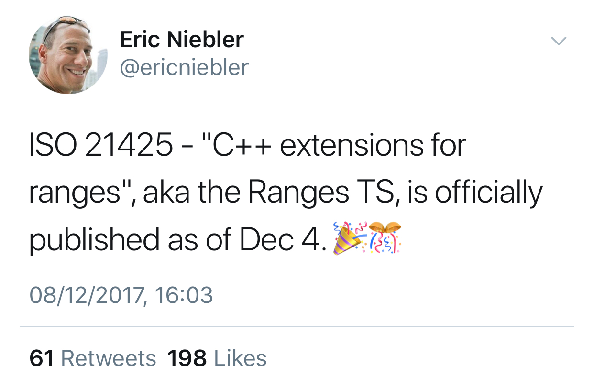
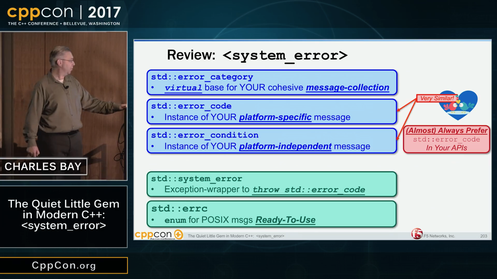
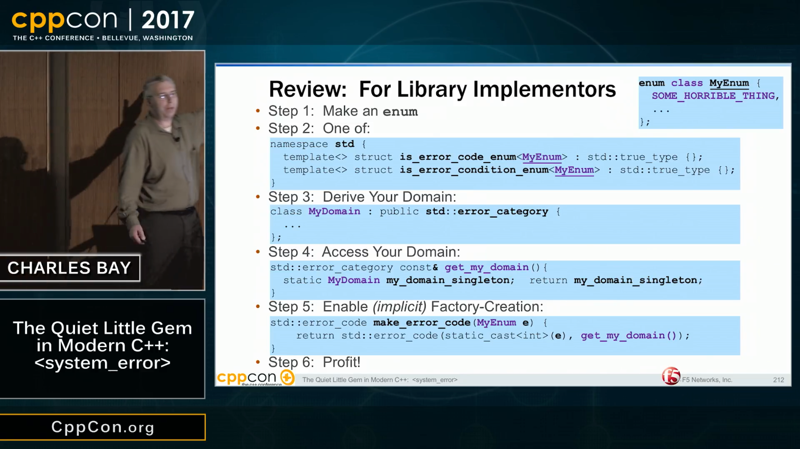

# Intel offers Parallel STL implementation to GNU libstdc++ and libc++

"The implementation is not specific to Intel’s hardware. For thread-level parallelism it uses [TBB](https://www.threadingbuildingblocks.org/) but abstracts it with an internal API which can be implemented on top of other threading/parallel solutions -- so it is for the community to decide which ones to use. For SIMD parallelism (`unseq`, `par_unseq`) we use `#pragma omp simd` directives; it is vendor-neutral and does not require any OpenMP runtime support."

* [Reddit](https://www.reddit.com/r/cpp/comments/7gjmgd/intel_offers_parallel_stl_implementation_to_gnu/)
* [libstdc++ RFC email](https://gcc.gnu.org/ml/libstdc++/2017-11/msg00112.html)
* [ICC for open source](https://software.intel.com/en-us/qualify-for-free-software/opensourcecontributor)

# Ranges TS Published



# CppCon 2017: Hartmut Kaiser “The Asynchronous C++ Parallel Programming Model”

[YouTube](https://www.youtube.com/watch?v=js-e8xAMd1s)

- Existing frameworks are building blocks, can’t mix them (off-node:OpenMP, on-node: MPI, accelerator: CUDA)
- Amdahl’s Law
- The 4 Horsemen: **S**tarvation, **L**atency, **O**verhead, **W**aiting
- Expose asynchrony to the programmer without exposing additional concurrency
- Use futures to represent data dependencies
- HPX supports GPGPU: runs kernel on GPU, exposing its result as a future on the CPU side

# CppCon 2017: Charles Bay “The Quiet Little Gem in Modern C++: `<system_error>`”

[YouTube](https://www.youtube.com/watch?v=hNaLf8lYLDo)

- How a function finishes impacts algorithm composition: success, error, exception, termination, and now suspension.
- Not every error is an error.

# CppCon 2017: Charles Bay “The Quiet Little Gem in Modern C++: `<system_error>`” (cont.)



# CppCon 2017: Charles Bay “The Quiet Little Gem in Modern C++: `<system_error>`” (cont.)



# Functional exceptionless error handling with `optional` and `expected`

[Article by Simon Brand](https://blog.tartanllama.xyz/optional-expected/) -- [Reddit thread](https://www.reddit.com/r/cpp/comments/7gua48/functional_exceptionless_errorhandling_with/) -- [HackerNews thread](https://news.ycombinator.com/item?id=15838411)

* Makes a case against exceptions by (incorrectly) using them as a negative result of a function.
* Discusses `std::optional` and the proposed `std::expected` ([p0323r3](http://www.open-std.org/jtc1/sc22/wg21/docs/papers/2017/p0323r3.pdf)) but argues that error checking with these is still very 'noisy'.
* Proposes `.map()` and `.and_then()` functions (Haskell equivalents are `fmap` and `bind`, or `>>=`).
* See also: [Functors, Applicatives, and Monads in Pictures](http://adit.io/posts/2013-04-17-functors,_applicatives,_and_monads_in_pictures.html) by Aditya Bhargava.
* Related proposal: [p0834r0 Lifting overload sets into objects](http://www.open-std.org/jtc1/sc22/wg21/docs/papers/2017/p0834r0.html) by Michał Dominiak.

# Functional exceptionless error handling with `optional` and `expected` (cont.)

[Reddit](https://www.reddit.com/r/cpp/comments/7gua48/functional_exceptionless_errorhandling_with/):

> Exceptions make sense when you actually need to unwind the call stack, because the only reasonable course of action is to ditch what you're working on and have something far up the call stack handle the failure.

> They do not make sense when there is a reasonable way to recover, and the failure is likely to happen in normal usage.

> 'Exceptionless' isn't strictly true if memory is allocated in the chain of calls.

Related to the sum types discussion: [Mach7 pattern matching library](https://github.com/solodon4/Mach7)

# Functional exceptionless error handling with `optional` and `expected` (cont.)

[HackerNews](https://news.ycombinator.com/item?id=15838411):

```haskell
    getCuteCat img = findCat img >>=
                     addBowTie >>=
                     makeEyesSparkle >>=
                     addRainbow . makeSmaller
```

> I wish people could just stop copying this idea from Haskell and use what’s reasonable in their language. Shoehorning monads and monad-heavy code into a typical language isn’t reasonable.

# C++ Monadic Interface, by Vicente J. Botet Escribá

[p0650r1](http://www.open-std.org/jtc1/sc22/wg21/docs/papers/2017/p0650r1.pdf)

```
functor::transform : [T] x (T->U) -> [U]
functor::map : (T->U) x [T] -> [U]
applicative::ap : [T] x [(T->U)] -> [U]
applicative::pure<A> : T -> [T]
monad::unit<A> : T -> [T]
monad::bind : [T] x (T->[U]) -> [U] //mbind
monad::unwrap : [[T]] -> [T] // unwrap
monad::compose : (B->[C]) x (A->[B])-> (A->[C])
monad_error::make_error<M>: E -> error_type_t<M,E>
monad_error::catch_error: [T] x (E->T) -> [T]
                          where E = error_type_t<[T]>
monad_error::catch_error: [T] x (E->[T]) -> [T]
```

# Operator `try`, by Niall Douglas

[p0779r0](http://www.open-std.org/jtc1/sc22/wg21/docs/papers/2017/p0779r0.pdf)

Proposes `operator try` as it is used in [Swift](https://developer.apple.com/library/content/documentation/Swift/Conceptual/Swift_Programming_Language/ErrorHandling.html) and [Rust](https://doc.rust-lang.org/std/macro.try.html).

With C++ exception handling, the points at which control flow can change are invisible. This is not the case with `Expected`|`Outcome` code where the programmer must explicitly annotate each potential control flow change point with either explicit `if` logic, or a `try`.

Facebook's *Folly* 'abused' `co_await` by using it with `folly::optional` to check for presence of a value. Also: [Link](https://github.com/toby-allsopp/coroutine_monad)

The author ends up proposing language injection feature, i.e. compile-time programming, and maybe even metaclass-like functionality.

# Why choose sum types over exceptions, by Vittorio Romeo

[Post](https://vittorioromeo.info/index/blog/adts_over_exceptions.html)

* Algebraic Data Types (ADT) -- [Wikipedia](https://en.wikipedia.org/wiki/Algebraic_data_type)
* [Example](https://github.com/SuperV1234/scelta/blob/master/example/error_handling.cpp)
* [Reddit thread](https://www.reddit.com/r/cpp/comments/7ha64y/why_choose_sum_types_over_exceptions/)
* [Outcome V2 Tutorial](https://ned14.github.io/outcome/tutorial/)
* [Exception-Safe Coding, by Jon Kalb](http://exceptionsafecode.com/) -- C++11

# Why choose sum types over exceptions, by Vittorio Romeo -- Reddit thread

* "Stroustrup is clear in his book: a method should throw and exception if it cannot do the job it was supposed to do. Of course, it requires that you think about class and method invariants and detect when they can't be fulfilled."
* "The problem is when an exception is thrown in a library or in the platform which have no way to know if the client program can meaningfully continue or not. Particularly in Java it leads to the ugly pattern of defensive try-catch blocks when interfacing with third-party code just to make sure that a NullPointerException thrown from deep within their implementation does not bring down your entire application."
* "The fact the user is not aware of the failure modes is not a bug, it's a feature <...> that allows you to write code that completely ignores the possibility of failure when it's not that code's responsibility to handle the error."

# Why choose sum types over exceptions, by Vittorio Romeo -- Reddit thread (cont.)

* [Comment by Tony van Eerd](https://www.reddit.com/r/cpp/comments/7ha64y/why_choose_sum_types_over_exceptions/dqqbnwe/)
* Tony van Eerd: I find it interesting that people want errors more "in your face", but then want "monad style" to hide the error handling. Are we just trying to find the sweet spot - not too intrusive, but not too hidden? Does the sweet spot actually exist? Or is the ideal error handling a set of contradictory desires?
    - Reply: Having a choice between multiple non-ideal strategies depending on situation is really important. I'm not going to use C++ exceptions in a real-time critical piece of bare metal code, ever, so alternate options are very much needed.
* Tony van Eerd: Here's the real problem - programmers don't want to deal with errors. So ADTs put errors "in your face". Exceptions let you ignore errors - for a while.

# Why choose sum types over exceptions, by Vittorio Romeo (cont.)

* [Vittorio Romeo](https://www.reddit.com/r/cpp/comments/7ha64y/why_choose_sum_types_over_exceptions/dqpm07q/): Your constructor should not throw, and that the logic which might fail should be moved to a separate helper function. *(Ugh -- GD)*
    - Reply: Make the constructor private and make the function returning `std::optional<foo>` a static method. *(Seen that a lot -- GD)*

# Quote

Alan Cooper:

> Programming is a few brief moments of sublime elegance embedded in months of niggling, exacting, precise trivialities.
