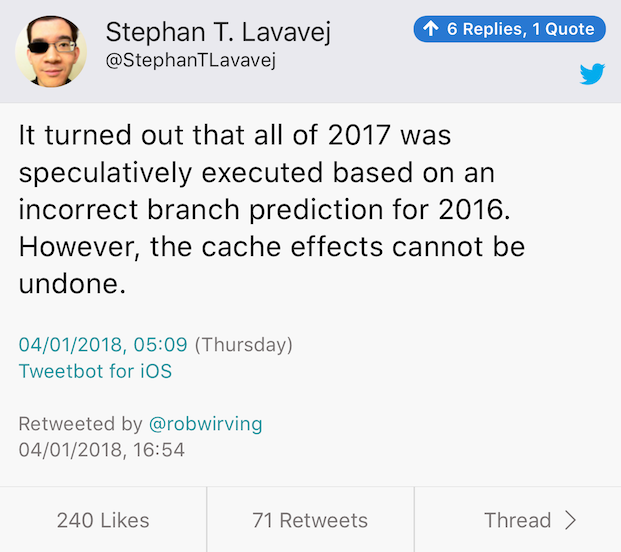
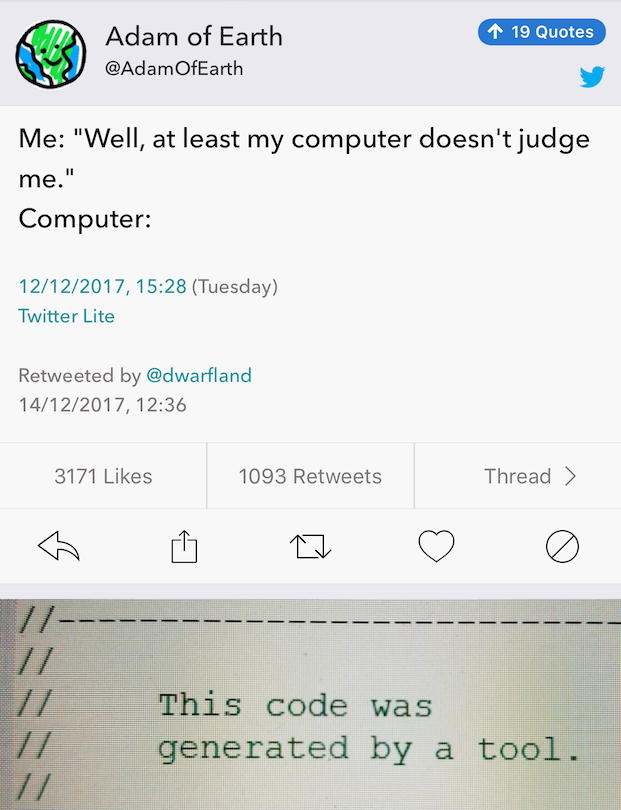

# Spectre mitigations in MSVC

* [Article](https://blogs.msdn.microsoft.com/vcblog/2018/01/15/spectre-mitigations-in-msvc/)
* [Reddit thread](https://www.reddit.com/r/cpp/comments/7qo7vd/spectre_mitigations_in_msvc/)

# CppCast: Meltdown and Spectre with Matt Godbolt

[Podcast](http://cppcast.com/2018/01/matt-godbolt/)

# Tweet by STL



# Free books from O'Reilly

* [Website](http://www.oreilly.com/free/reports.html)
* [Practical C++ Metaprogramming, by Edouard Alligand and Joel Falcou](http://www.oreilly.com/programming/free/practical-c-plus-plus-metaprogramming.csp)
* [C++ Today, by Jon Kalb and Gašper Ažman](http://www.oreilly.com/programming/free/c++-today.csp?intcmp=il-prog-free-product-lgen_cpp_today)

# Awesome C++

[Website](http://fffaraz.github.io/awesome-cpp/)

A curated list of awesome C/C++ frameworks, libraries, resources, and shiny things.

# C++17 Review from PVS-Studio

[Article](https://www.viva64.com/en/b/0533/)

# Exceptions vs expected: Let's find a compromise

[Post](http://foonathan.net/blog/2017/12/04/exceptions-vs-expected.html) -- [Reddit thread](https://www.reddit.com/r/cpp/comments/7hk1gs/exceptions_vs_expected_lets_find_a_compromise/?st=jatcyvuo&sh=5b3957ef)

* Exceptions: Writing exception safe code is hard
* Exceptions are not easily composable: There is only one current exception, you can’t have multiple ones. This was a problem, for example, for the C++17 [parallel algorithms](http://www.bfilipek.com/2017/08/cpp17-details-parallel.html). What if an exception is thrown in multiple of the worker threads? How to report all of them back to the caller? The implementation gave up on solving that problem and just decided to terminate the program if any exception is thrown.
* As with most things, the disadvantages are opposites: “exceptions are too implicit!” — “ADTs are too explicit!”

# Exceptions vs expected: Let's find a compromise (cont.)

You’re writing a library and have a function that may fail — how do you report the error? If you want to write a truly flexible API, you have to do both: exceptions and error return codes. Because sometimes the error is “exceptional” and sometimes it isn’t.

Swift chose to use exceptions. *(Swift doesn’t use exceptions — GD)*

`defer` allows guaranteed cleanup without the boilerplate of RAII" *(`defer` is equivalent to `finally`, and what boilerplate is that? — GD)*

# Exceptions vs expected: Let's find a compromise (cont.)

Rust: ADT for error handling. `Result<T,E>`.

```rust
result = foo();
if (!result)
  return result.error();
// do something with result.value()

// old way
result = try!(foo());

// new built-in language feature
result = foo()?;
```

# Introduction to proposed std::expected - Niall Douglas - Meeting C++ 2017

[YouTube](https://www.youtube.com/watch?v=JfMBLx7qE0I)

# How to handle errors in constructors without exceptions

[Post](http://foonathan.net/blog/2017/01/09/exceptions-constructor.html)

> If you do not have exceptions, reporting errors from a constructor is impossible without sacrificing guarantees. Where possible, simply use an alternative and non-recoverable way of error reporting.

> If that’s not applicable, provide a static function as the only way to create the object. It does not return an object directly, but an `optional` type. Carefully craft the implementation, so that the actual private constructor will only be called, when no operation can fail. Then every object will be valid, just like it were the case when using exceptions.

# A call for data on exceptions, by Simon Brand

[Post](https://blog.tartanllama.xyz/exception-data/)

* [C++ Core Guidelines: Error Handling](https://isocpp.github.io/CppCoreGuidelines/CppCoreGuidelines#e-error-handling)
* [Error handling links and resources](https://github.com/MattPD/cpplinks/blob/master/error_handling.md)

# std::optional and the m word - Simon Brand - Meeting C++ 2017

[YouTube](https://www.youtube.com/watch?v=NhcHwkUPX7w)

# Reddit: What are the weakest points of C++ in your opinion?

[Thread](https://www.reddit.com/r/cpp/comments/7lvteh/what_are_the_weakest_points_of_c_in_your_opinion/)

* Setting up a build environment, adding third party libraries, like pulling teeth. [#](https://www.reddit.com/r/cpp/comments/7lvteh/what_are_the_weakest_points_of_c_in_your_opinion/drpdoxp/)
    - [Conan V1.0.0 beta](https://github.com/conan-io/conan/releases), [build2](https://build2.org/), [cppget](https://cppget.org/), [cget](https://github.com/pfultz2/cget) for CMake; Modules won't help here.
* Unicode support [#](https://www.reddit.com/r/cpp/comments/7lvteh/what_are_the_weakest_points_of_c_in_your_opinion/drpckgi/)
* Rust and D got mentioned
* Template metaprogramming is ridiculously verbose and complicated (but Concepts will help) [#](https://www.reddit.com/r/cpp/comments/7lvteh/what_are_the_weakest_points_of_c_in_your_opinion/drpf2i9/)
* "The biggest strength and weakness of C++ is its legacy" [#](https://www.reddit.com/r/cpp/comments/7lvteh/what_are_the_weakest_points_of_c_in_your_opinion/drpfnuj/)
* Header files [#](https://www.reddit.com/r/cpp/comments/7lvteh/what_are_the_weakest_points_of_c_in_your_opinion/drpc7rv/)

# Reddit: What are the weakest points of C++ in your opinion? (cont.)

* "Every time there is a proposal accepted in a given standard, it is getting fixes and amendments for the next ten years" [#](https://www.reddit.com/r/cpp/comments/7lvteh/what_are_the_weakest_points_of_c_in_your_opinion/drpf5qh/)
* "Complexity. It could be reasoned that C++ is the most complex programming language ever created."
* String manipulation [#](https://www.reddit.com/r/cpp/comments/7lvteh/what_are_the_weakest_points_of_c_in_your_opinion/drpldk4/)
* The preprocessor [#](https://www.reddit.com/r/cpp/comments/7lvteh/what_are_the_weakest_points_of_c_in_your_opinion/drpi9yd/)
* Lack of a consistent stable ABI [#](https://www.reddit.com/r/cpp/comments/7lvteh/what_are_the_weakest_points_of_c_in_your_opinion/drpu8o3/)
* Lack of reflection [#](https://www.reddit.com/r/cpp/comments/7lvteh/what_are_the_weakest_points_of_c_in_your_opinion/drqq6n8/)
* Compile times
* Irregular `void`

# Kate Gregory - It's Complicated - Meeting C++ 2017 Keynote

[YouTube](https://www.youtube.com/watch?v=tTexD26jIN4)

* Know the language (all of it)
* Know C++ idioms
* Follow C++ Core Guidelines
* Write simple code

# C++ poetry

[Reddit](https://www.reddit.com/r/cpp/comments/7crald/a_c_poem/)

```cpp
void spanish_inquisition() noexcept
{
    throw std::unexpected;
}
```

# Tweet



# Quote

Kevlin Henney:

> A common fallacy is to assume authors of incomprehensible code will be able to express themselves clearly in comments.

# Quote

Steve C. McConnell:

> The problem with quick and dirty is that the dirty remains long after the quick has been forgotten.
