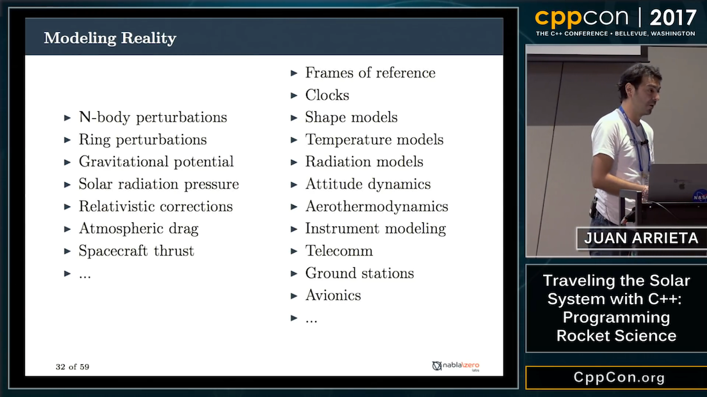

# Best C++ build system?

[Reddit](https://www.reddit.com/r/cpp/comments/7p5ouv/bedst_build_system_to_c/)

* CMake is suggested most often
* build2, QBS
* Meson

# Unicode in C++ - James McNellis - Meeting C++ 2016

[YouTube](https://www.youtube.com/watch?v=tOHnXt3Ycfo)

* [International Components for Unicode (ICU)](http://site.icu-project.org/)
* [Boost.Locale](http://www.boost.org/doc/libs/1_66_0/libs/locale/doc/html/index.html)

# A CMS written in C++

[Blog](http://blog.cppcms.com/)

See also: [Building a website with C++](https://blog.sourcerer.io/building-a-website-with-c-db942c801aee)

# CppCon 2017: Vinnie Falco “Make Classes Great Again! (Using Concepts for Customization Points)”

* [CppCon 2017: Vinnie Falco “Make Classes Great Again! (Using Concepts for Customization Points)”](https://www.youtube.com/watch?v=WsUnnYEKPnI)
    - [Code](https://github.com/vinniefalco/CppCon2017)
* [CppCon 2016: Vinnie Falco “Introducing Beast..."](https://www.youtube.com/watch?v=uJZgRcvPFwI)
* See also: [Boost::Beast: HTTP and WebSocket built on Boost.Asio in C++11](https://github.com/boostorg/beast)

# CppCon 2017: Vinnie Falco “Make Classes Great Again!...” (cont.)


# Your own type predicate in C++11

[Post](https://akrzemi1.wordpress.com/2017/12/02/your-own-type-predicate/)

A gentle intro to metaprogramming, metafunctions and type traits.

```cpp
static_assert(is_acceptable<X>::value,
              "X does not have a desired interface");

template <typename... T>
using void_t = void;
```

# std::launder - Réka Kovács - Lightning Talks Meeting C++ 2017

[YouTube](https://www.youtube.com/watch?v=5HXCbLilIzs)

```cpp
#include <new>
struct X { const int n; double m; }
int main() {
    X p{3, 8.8};
    new (&p) X{5, 7.7};
    int b = std::launder(&p)->n; // 5
    double c = p.m; // UB!
}
```

# Callbacks in C++

[Article](https://sudomakeinstall.io/posts/2017/11/30/callbacks-in-cpp11/)

* Function pointer
* Pointer to member function
* Functor
* Lambda

# Stiffstream C++ libraries

* [SObjectizer](https://stiffstream.com/en/products/sobjectizer.html) -- a framework for building solid multithreaded applications. It is based on async message exchange and uses a mixture high-level abstractions: Actor-Model, Publish-Subscribe and Communicating Sequential Processes.
* [RESTinio](https://stiffstream.com/en/products/restinio.html) --  header-only C++14 library that gives you an embedded HTTP server with nice express-like routing (although it is not mandatory to use router) and websockets on board.
* [timertt](https://sourceforge.net/p/sobjectizer/wiki/Timer%20Thread%20Template/) -- The timertt (Timer Thread Template) library was created as a lightweight alternative of ACE Framework's timers for SObjectizer.

# Boost 1.66 released

[Release page](http://www.boost.org/users/history/version_1_66_0.html)

# Futures_cpp for C++11

[GitHub](https://github.com/chyh1990/futures_cpp) -- A future and stream library for modern C++ (MIT)

# Cereal -- a C++11 serialization library

[Website](https://uscilab.github.io/cereal/)

* Header-only
* Similar to Boost serialization, with easy transition
* Formats: binary, XML, JSON, custom
* No external dependencies
* Supports `std::shared_ptr` and `std::unique_ptr`
* BSD

# CLI11 1.3

A powerful library for writing beautiful command line interfaces in C++11. No dependencies, header-only, BSD 3-Clause.

* [Announcement](https://iscinumpy.gitlab.io/post/announcing-cli11-13/)
* [GitHub](https://github.com/CLIUtils/CLI11)
* [Docs](https://cliutils.gitlab.io/CLI11Tutorial/)

# Pugixml

Light-weight, simple and fast XML parser for C++ with XPath support

* [Website](https://pugixml.org/)
* [GitHub](https://github.com/zeux/pugixml) (MIT)

# RapidJSON

A fast JSON parser/generator for C++ with both SAX/DOM style API. Header-only, Unicode-friendly, BSD

* [Website](http://rapidjson.org/)
* [GitHub](https://github.com/Tencent/rapidjson)

# NLohmann/JSON: JSON for modern C++

* [GitHub](https://github.com/nlohmann/json) (MIT)
* [Docs](https://nlohmann.github.io/json/)

# ComputeCpp 0.5.0 and SYCL 1.2.1

* [Blog post by Codeplay](https://codeplay.com/portal/12-06-17-computecpp-ce-0-5-0-released-and-sycl-1-2-1-ratified)
* [Download](https://developer.codeplay.com/)
* SYCL is used in machine learning. ComputeCpp, Codeplay's implementation of the SYCL standard can already be used to execute TensorFlow applications on SPIR OpenCL supported hardware.
* An ARM release of ComputeCpp is also now available and allows developers to target a range of embedded processors using SYCL.

# CUTLASS by NVIDIA

A preview of CUTLASS (CUDA Templates for Linear Algebra Subroutines), a collection of CUDA C++ templates and abstractions for implementing high-performance GEMM computations at all levels and scales within CUDA kernels.

* [Announcement](https://devblogs.nvidia.com/parallelforall/cutlass-linear-algebra-cuda/)
* [GitHub](https://github.com/NVIDIA/cutlass) (BSD-3-Clause)

# HPX on a RasPI cluster

* [Slides](http://reu.cct.lsu.edu/documents/2017-presentations/Goncalves-Presentation.pdf)

# CppCon 2017: Juan Arrieta “Traveling the Solar System with C++: Programming Rocket Science”

[YouTube](https://www.youtube.com/watch?v=YXs3DFrZZL4)



# CppCon 2017: Juan Arrieta “Traveling the Solar System with C++: Programming Rocket Science” (cont.)


# CppCon 2017: Juan Arrieta “Traveling the Solar System with C++: Programming Rocket Science” (cont.)


# Clipp: command-line argument handler

Easy to use, powerful and expressive command line argument handling for C++11/14/17 contained in a single header file.

* [GitHub](https://github.com/muellan/clipp) (MIT)

# Compile-time String Obfuscator

[GitHub](https://github.com/urShadow/StringObfuscator) (C++14) (MIT)

```cpp
#include <iostream>
#include "str_obfuscator.hpp"

int main(void)
{
  std::cout << cryptor::create("Hello, World!").decrypt()
            << "\n";
  return 0;
}
```

# Vc: SIMD Vector Classes for C++ by Matthias Kretz

* [GitHub](https://github.com/VcDevel/Vc) (C++14) (BSD-3-Clause)
* [P0214R7: Data-Parallel Vector Types & Operations](http://www.open-std.org/jtc1/sc22/wg21/docs/papers/2017/p0214r7.pdf)

# libbson: A BSON utility library by MongoDB

* [GitHub](https://github.com/mongodb/libbson) (Apache-2.0)

# GDC Programming Talks

[YouTube](https://www.youtube.com/playlist?list=PL2e4mYbwSTbaw1l65rE0Gv6_B9ctOzYyW)

# Quote

Unknown from Twitter:

> Debuggers don't remove bugs. They only show them in slow motion.

# Twitter

Jon Purdy @whyevernotso:

> People who deeply understand C++ are great to have on a team---not for their knowledge of C++, but for their ability to accept, cope with, and pragmatically manage things that other people would balk at and call insane, bug-prone, abject horrors.

Slava Pestov @slava_pestov, Apple Swift programmer:

> This is very true, but there are like five people who deeply understand C++
