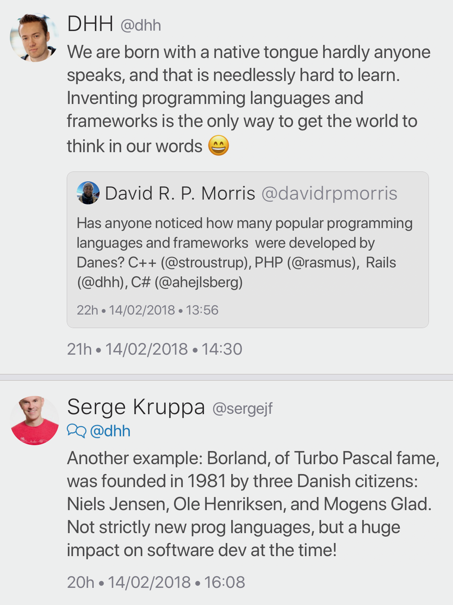

# Videos by Qt Studios

[YouTube](https://www.youtube.com/user/QtStudios/videos)

# Video: Secure Programming Practices in C++ - NDC Security 2018

[YouTube](https://www.youtube.com/watch?v=Jh0G_A7iRac)

# Video: C++ Performance and Optimisation - NDC Techtown 2017

[YouTube](https://www.youtube.com/watch?v=eICYHA-eyXM)

# Video: Concurrent Programming in C++ - NDC Techtown 2017

[YouTube](https://www.youtube.com/watch?v=O7gUNNYjmsM)

# Video: True parallelism, with no concept of threads - Alfred Bratterud - Meeting C++ 2017

[YouTube](https://www.youtube.com/watch?v=9IXivbSA_5A)

# Video: Deep Learning with C++ - Peter Goldsborough - Meeting C++ 2017

[YouTube](https://www.youtube.com/watch?v=8GoYXWOq55A)

# Video: CppCon 2016: "C++14 Reflections Without Macros, Markup nor External Tooling"

[YouTube](https://www.youtube.com/watch?v=abdeAew3gmQ)

# Variadic CRTP, by Steve Dewhurst

[PDF](http://stevedewhurst.com/once_weakly/once-weakly20170328/once-weakly20170328.pdf)

# DHH on Danes

