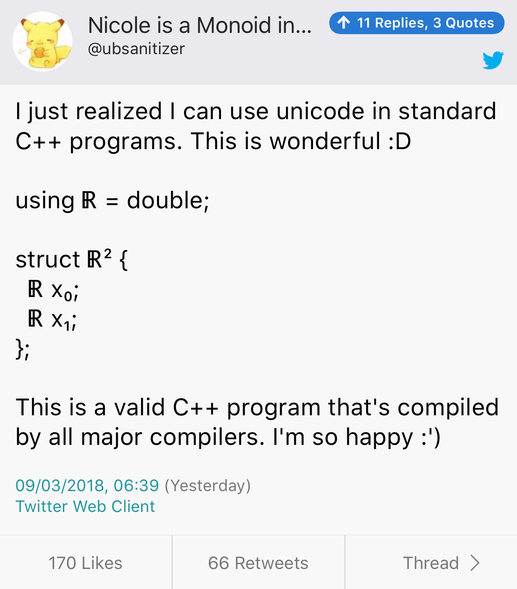

# Arno Schödl - A Practical Approach to Error Handling

* [YouTube](https://www.youtube.com/watch?v=tTz_JRJJrsc)
* [think-cell](https://www.think-cell.com/en/)
* The main product plugs into PowerPoint to provide chart auto-layout
* Patches PowerPoint code at run time (client-server architecture)
* They disassemble PowerPoint and related libraries using [IDA](https://www.hex-rays.com/products/ida/) to find entry points (working against undocumented APIs)!

# Arno Schödl - A Practical Approach to Error Handling (cont.)

* Strong exception guarantee is very hard to achieve in application code: too many state changes
* What to do on error:
    * Collect information, send report home
    * Stop further reporting, as program state is undefined
    * Despite the above, carry on and never terminate!
    * Server stops processing certain type of requests if too many threads hang
    * Reproduce error in the lab, handle reproducible errors only
* Asserts can be wrong! Don't terminate on assert, call home instead, otherwise developers will be afraid to add asserts!
* Reporting server gets 1 crash report per second on average

# Smf RPC

*smf* is a new RPC system and code generation like gRPC, Cap'n'Proto, Apache Thrift, etc, but designed for microsecond tail latency.

* [Home page](https://senior7515.github.io/smf/)
* [Code](https://github.com/senior7515/smf)
* [Reddit](https://www.reddit.com/r/cpp/comments/807rgh/show_reditcpp_smf_cpp_community_feedback/)

Based on [Seastar](http://www.seastar-project.org/) ([code](https://github.com/scylladb/seastar)) by [ScyllaDB](https://www.scylladb.com/).

# Frozen: a header-only, `constexpr` alternative to gperf for C++14 users

Header-only library that provides zero-cost initialization for immutable containers and various algorithms.

* [Code](https://github.com/serge-sans-paille/frozen) (Apache 2.0)
* [Intro](https://blog.quarkslab.com/frozen-an-header-only-constexpr-alternative-to-gperf-for-c14-users.html)

```cpp
#include <frozen/unordered_set.h>

constexpr frozen::unordered_set<int, 3> keys = {1,2,4};

int some_user(int key) {
    return keys.count(key);
}
```

# Video: The hidden rules of world-class C++ code - Boris Schäling - Meeting C++ 2017

[Video](https://www.youtube.com/watch?v=fu6N6JbPOrI)

How we know if a code base is good or bad?

Getting rid of inheritance and virtual functions in favour of TMP and value semantics.

# Video: Free your functions! - Klaus Iglberger - Meeting C++ 2017

[Video](https://www.youtube.com/watch?v=nWJHhtmWYcY)

Data should be as encapsulated as possible => free functions lead to better encapsulation than member functions.

How to test a private function?

* `friend` test function (bad)
* `#define private public` (worse)
* free function operating on data in the class (better)

# Fun with (user-defined) attributes - Jonathan Müller - Meeting C++ 2017

* [Video](https://www.youtube.com/watch?v=Pt6oeIpzue4)

Syntax:

* Simple identifiers: `[[foo]]`
* Pack expansion: `[[foo...]]`
* Multiple attributes: `[[foo, bar, baz]]`
* Arguments: `[[foo(a, "b", 3.14, +)]]`
* Namespaces: `[[foo::bar]]`
* Using declaration: `[[using foo: bar, baz]]`

# Fun with (user-defined) attributes - Jonathan Müller - Meeting C++ 2017 (cont.)

```cpp
[[noreturn]] void handle_error(std::string msg)
{
    throw std::runtime_error(std::move(msg));
}
```

# Fun with (user-defined) attributes - Jonathan Müller - Meeting C++ 2017 (cont.)

```cpp
alignas(128) char cacheline[128];
```

# Fun with (user-defined) attributes - Jonathan Müller - Meeting C++ 2017 (cont.)

```cpp
void func(int param);

[[deprecated("pass a parameter instead")]]
void func()
{
    func(0);
}
```

# Fun with (user-defined) attributes - Jonathan Müller - Meeting C++ 2017 (cont.)

```cpp
switch (selected_option)
{
    <...>
    case option::b:
        if (foo)
            log_error("option::b may not be used when foo is set");
        // otherwise b is exactly like c so continue on
        [[fallthrough]];
    case option::c:
        <...>
}
```

# Fun with (user-defined) attributes - Jonathan Müller - Meeting C++ 2017 (cont.)

```cpp
[[nodiscard]]
int error();
```

# Fun with (user-defined) attributes - Jonathan Müller - Meeting C++ 2017 (cont.)

```cpp
[[maybe_unused]]
static bool is_valid(int param);

void do_something(int a, [[maybe_unused]] int b)
{
    <...>
}
```

# Fun with (user-defined) attributes - Jonathan Müller - Meeting C++ 2017 (cont.)

Compiler-specific attributes change generated code, C++ standard ones don't.

# CppCon 2017: Andrew Sutton “Meta”

* [YouTube](https://www.youtube.com/watch?v=29IqPeKL_QY)
* [P0633: Exploring the design space of metaprogramming and reflection](http://www.open-std.org/jtc1/sc22/wg21/docs/papers/2017/p0633r0.pdf)

```cpp
constexpr { // metaprogram
    for... (auto x : $x.member_variables()) {
        // do stuff with x
    }
}
```

# CppCon 2017: Andrew Sutton “Meta” (cont.)

Injection of new declarations or statements

```cpp
template<enum E>
const char* to_string(E value)
{
    switch (value) constexpr {
        for... (auto e : $E.enumerators())
            -> { case e.value(): return e.name(); } // Injection
    }
}
```

# CppCon 2017: Andrew Sutton “Meta” (cont.)

Source code literals

```cpp
auto frag = __fragment class C { // name C is optional
    int x;
    int foo() {
        return x + this->y;
    }
};
auto frag = __fragment class Node {
    Node* next;
    Node* prev;
};
auto ns = __fragment {
    case 0: return 42;
};
```

# UB will delete your null checks

* [Post](https://qinsb.blogspot.co.uk/2018/03/ub-will-delete-your-null-checks.html)

# True parallelism, with no concept of threads - Alfred Bratterud - Meeting C++ 2017

* [Video](https://www.youtube.com/watch?v=9IXivbSA_5A)
* [IncludeOS](http://www.includeos.org/)
* [GitHub](https://github.com/hioa-cs/IncludeOS)

Fibers, green threads, channels, lightweight processes, coroutines, pthreads - there are lots of options for parallelism abstractions. But what do you do if you just want your application to run a specific task on a specific core on your machine? In IncludeOS we have proper multicore support allowing you to do just that in C++: assign a task - for instance a lambda - directly to an available CPU. <...> In this talk we’ll <...> explore how direct per-core processing can be combined with threading concepts like C++14 fibers or coroutines, without taking away from the simplicity of getting work done uninterrupted.

# True parallelism, with no concept of threads - Alfred Bratterud - Meeting C++ 2017 (cont.)

Conclusions:

* You don't need classical threads to utilize CPU cores
    * Fibers and coroutines can run directly on them
* A pthreads backend requires true blocking
    * Might require fibers, yielding directly to scheduler
* Coroutines TS beats the simplest stack switch
* Stackful coroutines would replace our fibers
* Expect more multicore magic from IncludeOS

# VIM Clutch

* [GitHub](https://github.com/alevchuk/vim-clutch)

VIM Clutch is a hardware pedal for improved text editing speed for users of the magnificent VIM text editor. When the pedal is pressed down, the pedal types "i" causing VIM to go into Insert Mode. When released, it types <Esc> and you are back in Normal Mode.

# Twitter



