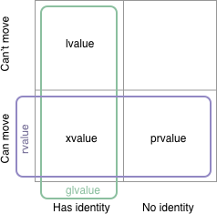

# Jacksonville trip reports

* [Vittorio Romeo](https://vittorioromeo.info/index/blog/mar18_iso_meeting_report.html)
* [Guy Davidson](https://hatcat.com/?p=33)

The Plan (according to Herb Sutter):

* Executors: TS in the C++20 timeframe, standard in C++23
* Networking: C++23 (delayed by Executors)
* Coroutines: C++20
* Modules: Partially in C++20 with more in C++23 (blame Google)
* Contracts: C++20
* Reflection: TS in C++20 timeframe, standard in C++23
* Ranges: Core in C++20, cool stuff in C++23

# C++ committee, please look at the big picture

[Reddit](https://www.reddit.com/r/cpp/comments/8577qc/c_committee_please_look_at_the_big_picture/)

> More disappointment as the C++ standardisation process fails to deliver what programmers need....

> There have been a lot of improvements but the whole "It must be perfect" ethos rather than 80/20 is really damaging this language and libraries.

> Maybe the precious backwards compatibility is more damaging to progress?

# 28.03.2018, Distributed C++ meet-up 0x02 - Berlin && London && Stockholm

* [Blog post](http://jguegant.github.io//jguegant.github.io/blogs/tech/distributed-c++-meetup.html)
* [Reddit announcement](https://www.reddit.com/r/cpp/comments/861n3o/28032018_distributed_c_meetup_0x02_berlin_london/)
* [C++ London](https://www.meetup.com/CppLondon/events/248091281/)
* [SwedenCpp](https://www.meetup.com/swedencpp/events/248092613/)
* [Berlin C++](https://www.meetup.com/berlincplusplus/events/248093069/)

# The RedMonk Programming Language Rankings: January 2018

[Rankings](https://redmonk.com/sogrady/2018/03/07/language-rankings-1-18/)

1. JavaScript
2. Java
3. Python
4. PHP
5. C#
6. C++

# GCC8 usability improvements by Red Hat

* [Article](https://developers.redhat.com/blog/2018/03/15/gcc-8-usability-improvements/)

# C++ Study Notes for interview preparation

[Web](https://encelo.github.io/notes.html)

# The Definitive C++ Book Guide and List

[StackOverflow](https://stackoverflow.com/questions/388242/the-definitive-c-book-guide-and-list)

# Reddit Q: Monadic error handling

[Reddit](https://www.reddit.com/r/cpp/comments/81woqn/i_want_to_do_monadic_error_handling_what_is_the/)

# Detecting incorrect C++ STL usage, by Krister Walfridsson

[Post](https://kristerw.blogspot.co.uk/2018/03/detecting-incorrect-c-stl-usage.html)

```bash
g++ -O2 -D_GLIBCXX_DEBUG example.cpp
```

# Memory Tagging (aka memory coloring, memory tainting, lock and key) and how it improves C/C++ memory safety

[PDF](https://arxiv.org/ftp/arxiv/papers/1802/1802.09517.pdf)

* Every TG (tagging granularity) bytes of memory aligned by TG are associated with a tag of TS (tag size) bits. These TG bytes are called the granule.
* TS bits in the upper part of every pointer contain a tag.
* Memory allocation (e.g. malloc) chooses a tag, associates the memory chunk being
allocated with this tag, and sets this tag in the returned pointer.
* Every load and store instruction raises an exception on mismatch between the pointer and memory tags.
* The memory access and tag check do not necessarily occur atomically with respect to
each other.

# Memory Tagging (cont.)

Implementations:

* SPARC ADI: The SPARC ADI hardware extension is supported on SPARC M7/M8 CPUs running Solaris OS. There is also some indication that Linux support is in progress.
* AArch64 HWASAN (hardware-assisted ASAN): an AArch64-specific compiler-based tool.

# My favourite C++17 features, by Kacper Kołodziej

[Post](https://kacperkolodziej.com/programming/my-favourite-cpp17-language-features.html)

* Structured bindings
* Fold expressions
* `constexpr if`
* [Selection statements with initializer](http://www.open-std.org/jtc1/sc22/wg21/docs/papers/2016/p0305r1.html)
* Nested namespaces

# lvalues, rvalues, glvalues, prvalues, xvalues, help!

[Post](https://blog.knatten.org/2018/03/09/lvalues-rvalues-glvalues-prvalues-xvalues-help/)



# True parallelism, with no concept of threads - Alfred Bratterud - Meeting C++ 2017

* [Video](https://www.youtube.com/watch?v=9IXivbSA_5A)
* [IncludeOS](http://www.includeos.org/)
* [GitHub](https://github.com/hioa-cs/IncludeOS)

Fibers, green threads, channels, lightweight processes, coroutines, pthreads - there are lots of options for parallelism abstractions. But what do you do if you just want your application to run a specific task on a specific core on your machine? In IncludeOS we have proper multicore support allowing you to do just that in C++: assign a task - for instance a lambda - directly to an available CPU. <...> In this talk we’ll <...> explore how direct per-core processing can be combined with threading concepts like C++14 fibers or coroutines, without taking away from the simplicity of getting work done uninterrupted.

# True parallelism, with no concept of threads - Alfred Bratterud - Meeting C++ 2017 (cont.)

Conclusions:

* You don't need classical threads to utilize CPU cores
    * Fibers and coroutines can run directly on them
* A pthreads backend requires true blocking
    * Might require fibers, yielding directly to scheduler
* Coroutines TS beats the simplest stack switch
* Stackful coroutines would replace our fibers
* Expect more multicore magic from IncludeOS

# Ground Up Functional API Design in C++, by Sumant Tambe

* [Article](https://cpptruths.blogspot.co.uk/2017/12/ground-up-functional-api-design-in-c.html)
* [Video: Systematic Generation of Data and Types in C++](https://vimeo.com/247642986) -- this talk presents two classic techniques from the functional domain -- composable data generators and property-based testing -- implemented in C++14 for testing a generic serialization and deserialization library ([RefleX](http://rticommunity.github.io/rticonnextdds-reflex/)). The talk describes the laws of monoids, functors, applicative, and monads and how they are implemented in a simple to understand abstraction of data generators.
* [Slides](https://www.slideshare.net/SumantTambe/systematic-generation-data-and-types-in-c)
* [GitHub: cpp-generators](https://github.com/sutambe/cpp-generators)
* See also: [DDS](https://en.wikipedia.org/wiki/Data_Distribution_Service)

# Video: Deep Learning with C++ - Peter Goldsborough - Meeting C++ 2017

* [YouTube](https://www.youtube.com/watch?v=8GoYXWOq55A)
* [Google's TensorFlow C++ API](https://www.tensorflow.org/api_guides/cc/guide)
* [How to train a Deep Neural Network using only TensorFlow C++](https://matrices.io/training-a-deep-neural-network-using-only-tensorflow-c/) -- [GitHub](https://github.com/theflofly/dnn_tensorflow_cpp)

# Twitter: C++ 9-year cycle


# Twitter: Fast integers


