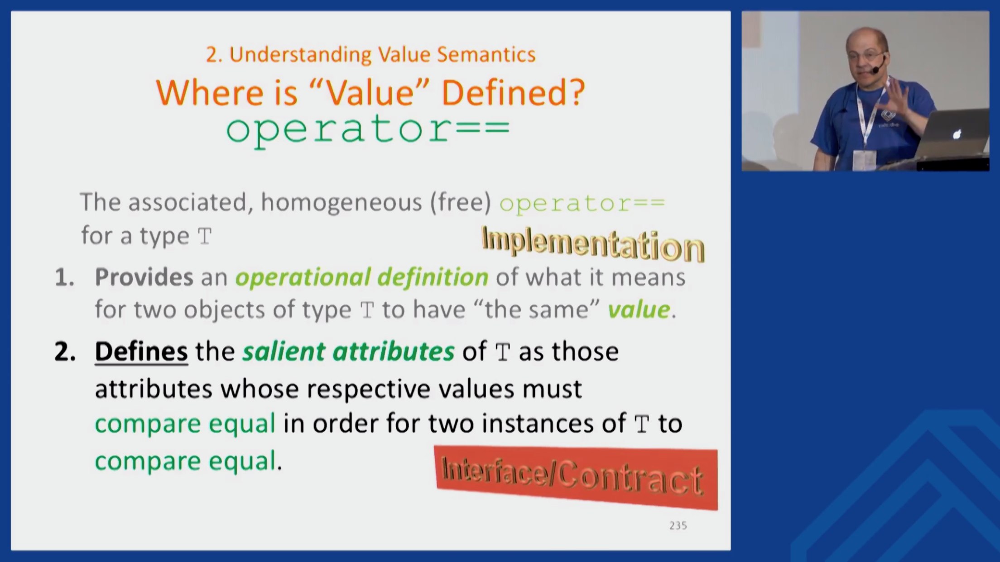
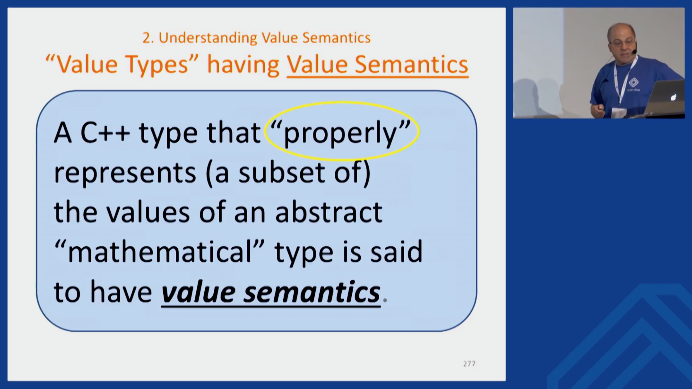
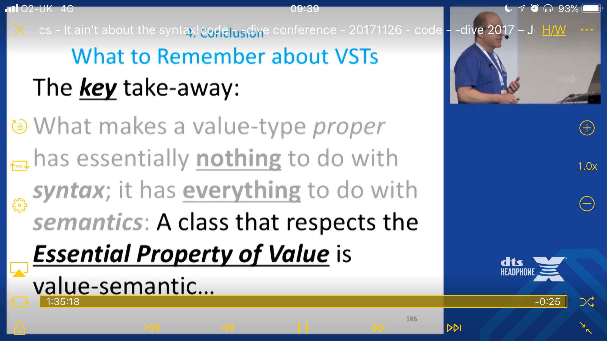

# Concepts in-place syntax, by Herb Sutter

* [P0745](http://www.open-std.org/jtc1/sc22/wg21/docs/papers/2018/p0745r0.pdf)

Concepts TS and [P0694](https://wg21.link/p0694):

```cpp
void sort(Sortable& s);
```

P0745:

```cpp
void sort(Sortable{}& s);
```

# Feedback on the distributed C++ meetup

* [Post by Jean Guegant](http://jguegant.github.io/blogs/tech/distributed-c++-meetup-0x02.html)
* [Video](https://www.youtube.com/watch?v=31mQmUryw50)
* Lessons:
    * Two-city format is best, 3-city is too much
    * Need breaks
    * 15-min talks are ideal
    * Slides need a bigger font
    * Mandatory NDA is bad
    * Turn the lights on in the audience

# Boost 1.67

* [Changes](https://www.boost.org/users/history/version_1_67_0.html)
* New libraries:
    * [Boost.Contract](https://www.boost.org/doc/libs/1_67_0/libs/contract/doc/html/index.html) -- Support for contract-based programming
    * [Boost.HOF](https://www.boost.org/libs/hof/) -- Higher-order functions

# Blast from the Past: Borland C++ on Windows 98

* [Post](http://nullprogram.com/blog/2018/04/13/)
* [QEMU](https://www.qemu.org/)
* [Windows 98SE - The Internet Archive](https://archive.org/details/win98se_201607)
* [Borland C++ 5.02 - The Internet Archive](https://archive.org/details/BorlandC5.02)

# Apple switches from libclang to Clangd

* [Announcement](http://lists.llvm.org/pipermail/cfe-dev/2018-April/057668.html)

> We at Apple have decided to switch focus from supporting the libclang-based
tooling infrastructure in order to join forces on the Clangd development
efforts. We believe that Clangd is the preferred solution for interactive
Clang-based tooling. There has been great work on Clangd already, and we're
going to start investing effort as well to make Clangd faster, more
capable, and more efficient.

# The C++ committee has taken off its ball and chain

* [Post by Derek Jones](http://shape-of-code.coding-guidelines.com/2018/04/14/the-c-committee-has-taken-off-its-ball-and-chain/)
    * Is C++ a language of exciting new features?
    * Is C++ a language known for great stability over a long period?
* [Reddit](https://www.reddit.com/r/cpp/comments/8d0fkt/the_c_committee_has_taken_off_its_ball_and_chain/)

# Modern C++ isn’t memory safe, either

* [Post by Mahmoud Al-Qudsi](https://neosmart.net/blog/2018/modern-c-isnt-memory-safe/)
    * C++ vs. Rust alert!

# Original STL Library Documentation Recovered by Robert Ramey

* [STL Docs](http://www.rrsd.com/software_development/stl/index.htm)

# Boris Schäling - Containers in Boost (C++Now 2013)

* [YouTube](https://www.youtube.com/watch?v=FM-fUjhoCp0)
* Boost.Multiindex -- multiple interfaces (indexes) for item lookup
* Boost.Bitmap -- a `std::map`-like container which supports lookups from both sides
* Boost.Container -- same containers as in the C++ standard library but with extra comfort:
    * Support for recursive containers
    * Stable versions of vector, set, map; single-linked list
    * SSO
* Boost.Intrusive -- containers that store the original objects instead of their copies

# Boris Schäling - Containers in Boost (C++Now 2013) (cont.)

* Boost.PointerContainer -- manages dynamically allocated objects (similar to `std::vector<std::unique_ptr>`)
* Boost.CircularBuffer -- a fixed-size container that overwrites elements if you add more
* Boost.Lockfree -- a lock-free queue and stack that can be concurrently modified from different threads
* Boost.PropertyTree -- a serializable key/value pair container for storing configuration data; supports XML, JSON and INI formats

# Boris Schäling - Containers in Boost (C++Now 2013) (cont.)

* Boost.Multiarray -- a multidimensional array; index-based access returns a subarray; reshaping and resising supported
* Boost.DynamicBitset -- like `std::bitset` but the size can be set/changed at run time
* Boost.Heap -- like `std::priority_queue` but with additional functionality
* Boost.Array -- use `std::array` instead
* Boost.Unordered -- use unordered containers from the C++ standard library instead

# code::dive 2017 – John Lakos – Value semantics: It ain't about the syntax!

* [Video](https://www.youtube.com/watch?v=AL9DBWdj-Pg)



# code::dive 2017 – John Lakos – Value semantics: It ain't about the syntax! (cont.)



# code::dive 2017 – John Lakos – Value semantics: It ain't about the syntax! (cont.)



# Reddit: Why is C++ so hated?

* [Reddit](https://www.reddit.com/r/cpp/comments/8bouu7/why_is_c_so_hated/)

# C++ in Zircon (Fuchsia OS kernel)

* [Readme](https://github.com/fuchsia-mirror/zircon/blob/master/docs/cxx.md)

# Brigand -- Instant compile time C++11 metaprogramming library

* [GitHub](https://github.com/edouarda/brigand) (header-only, Boost Software License 1.0)
* [Docs](https://github.com/edouarda/brigand/wiki)
* [Meeting C++ 2015 video](https://www.youtube.com/watch?v=B8XSDhWx7hY)
* [CppCon 2016 video](https://www.youtube.com/watch?v=ky0JdPh_LgE)
* [Ebook](http://www.oreilly.com/programming/free/practical-c-plus-plus-metaprogramming.csp)

> Everything you were doing with Boost.MPL can be done with Brigand.

# Brigand -- Instant compile time C++ 11 metaprogramming library (cont.)

* Example tasks:
    * Create a tuple from a list of types and then transform it into a variant
    * Look for the presence of a type in a tuple and get its index
    * Sort a list of types
    * Advanced static assertion with arithmetics and complex functions
    * Go through a list of types and perform a runtime action for each type

# C++ Patterns

[Website](https://cpppatterns.com/)

# CRTP refresher by Jonathan Boccara

* [Part 1](https://www.fluentcpp.com/2017/05/12/curiously-recurring-template-pattern/)
* [Part 2](https://www.fluentcpp.com/2017/05/16/what-the-crtp-brings-to-code/)
* [Part 3](https://www.fluentcpp.com/2017/04/28/extract-interface-cpp/)
* [Part 4](https://www.fluentcpp.com/2017/12/12/mixin-classes-yang-crtp/)

# Favourite C++ coding standards

* [Reddit](https://www.reddit.com/r/cpp/comments/80m4vx/favorite_c_coding_standards/)
* [C++ Core Guidelines](http://isocpp.github.io/CppCoreGuidelines/CppCoreGuidelines)
* [High Integrity C++ Coding Standard](http://www.codingstandard.com/section/index/)
* [Geosoft C++ Programming Practice Guidelines](http://geosoft.no/development/cpppractice.html)
* [Webkit Code Style Guidelines](https://webkit.org/code-style-guidelines/)

# Twitter


# Quote

Edsger Dijkstra:

> Program testing can be a very effective way to show the presence of bugs, but is hopelessly inadequate for showing their absence.

