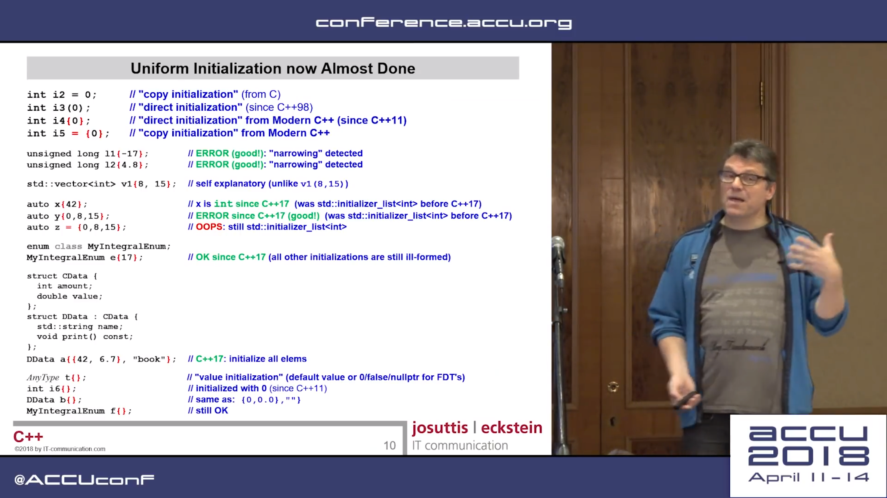

# ACCU Conf 2018 (2018-04-10--2018-04-14) Trip Reports

* [JetBrains](https://blog.jetbrains.com/clion/2018/04/accu-conf-2018-trip-report/), by Anastasia Kazakova (PMM for C++ Tools), Timur Doumler (Software Developer in the CLion team) and Phil Nash (JetBrains C++ tools Developer Advocate)
* [Felix Petriconi](https://petriconi.net/?p=242)
* [Mathieu Ropert](https://mropert.github.io/2018/04/20/accu_2018/)

# C++17 - The Best Features - Nicolai Josuttis (ACCU 2018)

* [YouTube](https://www.youtube.com/watch?v=e2ZQyYr0Oi0)
* [Reddit](https://www.reddit.com/r/cpp/comments/8ddv9w/c17_the_best_features_nicolai_josuttis_accu_2018/)

# C++17 - The Best Features - Nicolai Josuttis (ACCU 2018) (cont.)

# C++17 - The Best Features - Nicolai Josuttis (ACCU 2018) (cont.)

# C++17 - The Best Features - Nicolai Josuttis (ACCU 2018) (cont.)

# C++17 - The Best Features - Nicolai Josuttis (ACCU 2018) (cont.)

# C++17 - The Best Features - Nicolai Josuttis (ACCU 2018) (cont.)

# C++17 - The Best Features - Nicolai Josuttis (ACCU 2018) (cont.)

# VCPkg, now for Linux and macOS

* [Post](https://blogs.msdn.microsoft.com/vcblog/2018/04/24/announcing-a-single-c-library-manager-for-linux-macos-and-windows-vcpkg/)
* [Reddit](https://www.reddit.com/r/programming/comments/8eoux3/microsoft_announces_a_c_library_manager_for_linux/), [Reddit](https://www.reddit.com/r/cpp/comments/8eumvj/my_love_for_c_has_been_revived_with_vcpkg_and/)

# {fmt}

* [Website](http://fmtlib.net/latest/index.html)
* [GitHub](https://github.com/fmtlib/fmt)

# code::dive 2017 – John Lakos – Value semantics: It ain't about the syntax!

* [Video](https://www.youtube.com/watch?v=AL9DBWdj-Pg)

# code::dive 2017 – John Lakos – Value semantics: It ain't about the syntax! (cont.)

# code::dive 2017 – John Lakos – Value semantics: It ain't about the syntax! (cont.)

# Reddit: Why is modern C++ seemingly not being taught?

* [Reddit](https://www.reddit.com/r/cpp/comments/8evtgy/why_is_modern_c_seemingly_not_being_taught/)

# Reddit: Why is C++ so hated?

* [Reddit](https://www.reddit.com/r/cpp/comments/8bouu7/why_is_c_so_hated/)

# C++ in Zircon (Fuchsia OS kernel)

* [Readme](https://github.com/fuchsia-mirror/zircon/blob/master/docs/cxx.md)

# Brigand -- Instant compile time C++11 metaprogramming library

* [GitHub](https://github.com/edouarda/brigand) (header-only, Boost Software License 1.0)
* [Docs](https://github.com/edouarda/brigand/wiki)
* [Meeting C++ 2015 video](https://www.youtube.com/watch?v=B8XSDhWx7hY)
* [CppCon 2016 video](https://www.youtube.com/watch?v=ky0JdPh_LgE)
* [Ebook](http://www.oreilly.com/programming/free/practical-c-plus-plus-metaprogramming.csp)

> Everything you were doing with Boost.MPL can be done with Brigand.

# Brigand -- Instant compile time C++ 11 metaprogramming library (cont.)

* Example tasks:
    * Create a tuple from a list of types and then transform it into a variant
    * Look for the presence of a type in a tuple and get its index
    * Sort a list of types
    * Advanced static assertion with arithmetics and complex functions
    * Go through a list of types and perform a runtime action for each type

# Raspberry Pi - Install Clang 6 and compile C++17 programs

* [Post](https://solarianprogrammer.com/2018/04/22/raspberry-pi-raspbian-install-clang-compile-cpp-17-programs/)

# FoundationDB and Flow by Apple

* [Post](https://apple.github.io/foundationdb/flow.html)

Flow, a new programming language that brings actor-based concurrency to C++11. Flow is implemented as a compiler which analyzes an asynchronous function (actor) and rewrites it as an object with many different sub-functions that use callbacks to avoid blocking. The Flow compiler’s output is normal C++11 code, which is then compiled to a binary using traditional tools. Flow also provides input to our simulation tool, which conducts deterministic simulations of the entire system, including its physical interfaces and failure modes. In short, Flow allows efficient concurrency within C++ in a maintainable and extensible manner.

# C++ Patterns

[Website](https://cpppatterns.com/)

# CRTP refresher by Jonathan Boccara

* [Part 1](https://www.fluentcpp.com/2017/05/12/curiously-recurring-template-pattern/)
* [Part 2](https://www.fluentcpp.com/2017/05/16/what-the-crtp-brings-to-code/)
* [Part 3](https://www.fluentcpp.com/2017/04/28/extract-interface-cpp/)
* [Part 4](https://www.fluentcpp.com/2017/12/12/mixin-classes-yang-crtp/)

# Favourite C++ coding standards

* [Reddit](https://www.reddit.com/r/cpp/comments/80m4vx/favorite_c_coding_standards/)
* [C++ Core Guidelines](http://isocpp.github.io/CppCoreGuidelines/CppCoreGuidelines)
* [High Integrity C++ Coding Standard](http://www.codingstandard.com/section/index/)
* [Geosoft C++ Programming Practice Guidelines](http://geosoft.no/development/cpppractice.html)
* [Webkit Code Style Guidelines](https://webkit.org/code-style-guidelines/)

# Twitter

