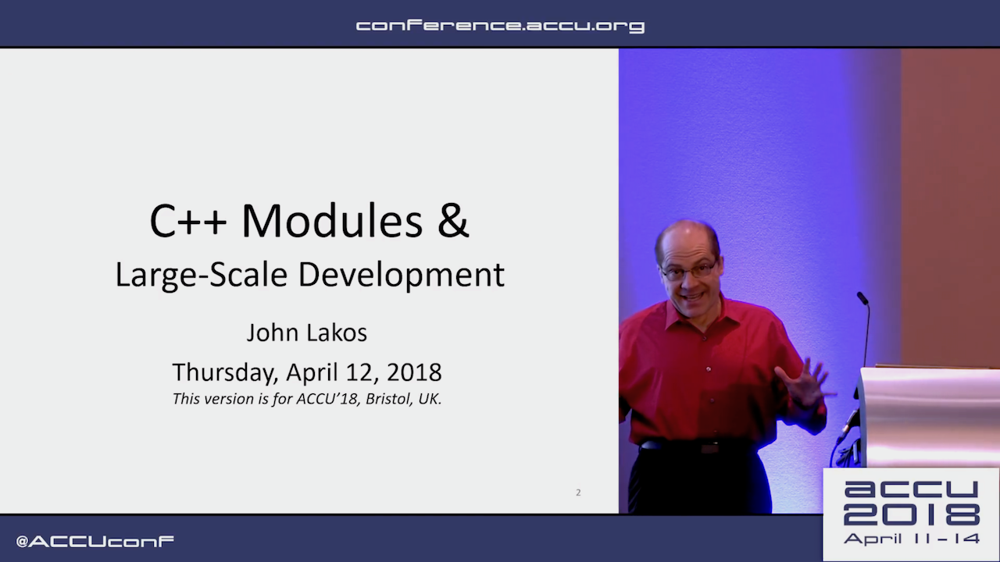
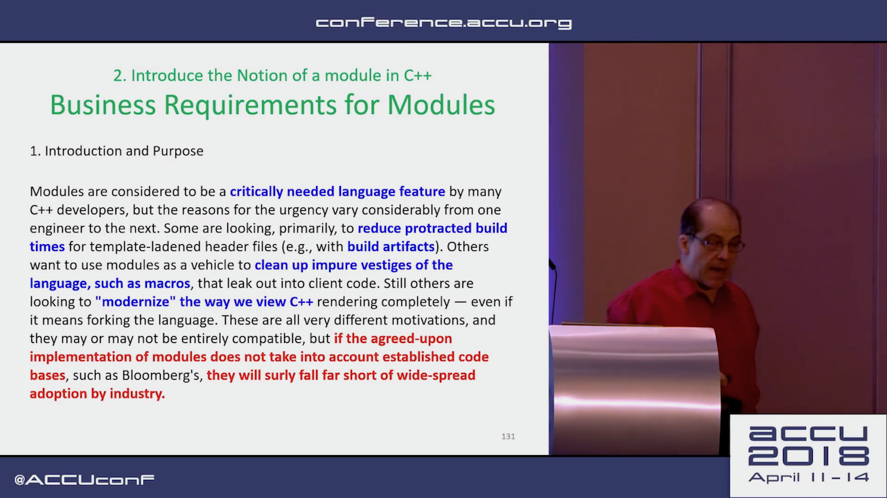
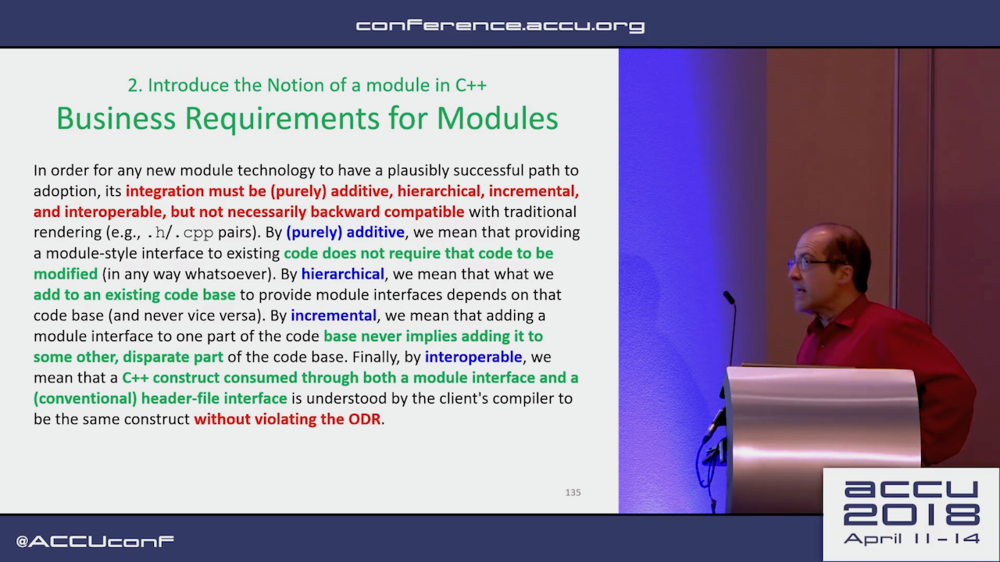
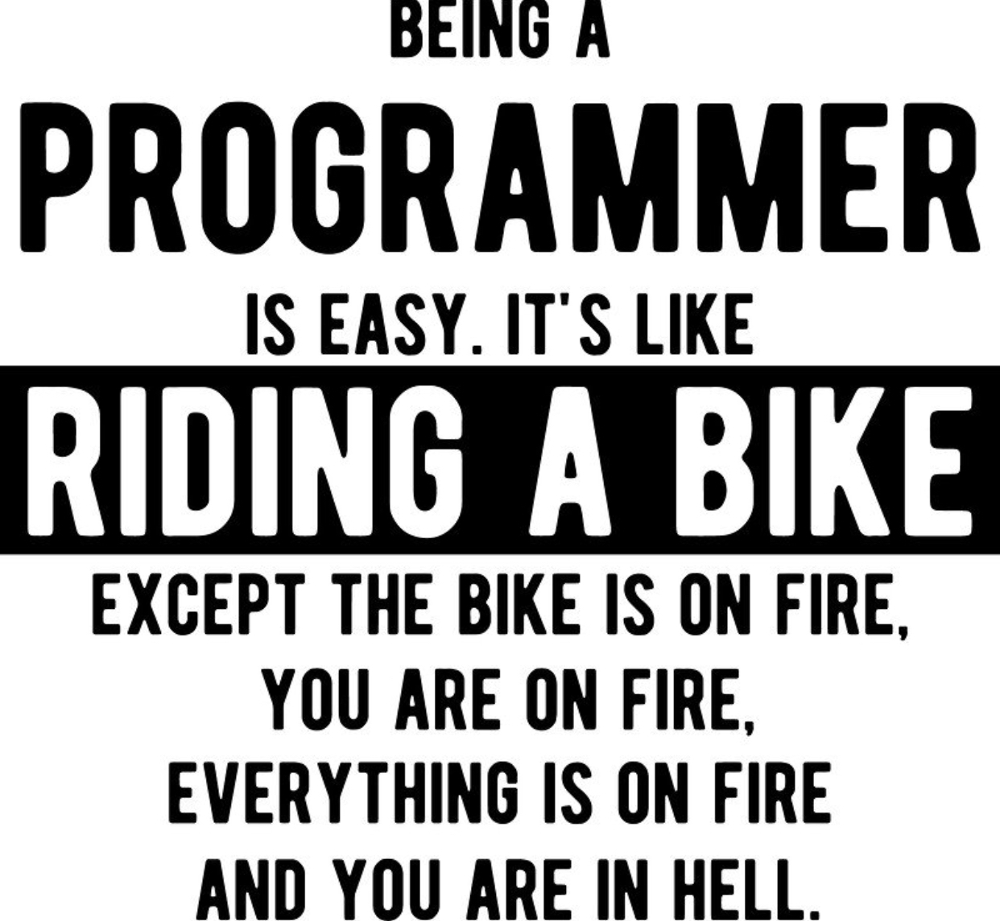

# Visual Studio 2017 version 15.7

* [Microsoft blog post](https://docs.microsoft.com/en-us/visualstudio/releasenotes/vs2017-relnotes#15.7.0)
* [MSVC Conforms to the C++ Standard](https://blogs.msdn.microsoft.com/vcblog/2018/04/26/announcing-msvc-conforms-to-the-c-standard/)
* [Reddit](https://www.reddit.com/r/cpp/comments/8hpx0q/visual_studio_157_is_out_with_c17_conformance/)

# Diet Graphics

* [p1062R0](https://api.csswg.org/bikeshed/?url=https://raw.githubusercontent.com/brycelelbach/diet_graphics/master/diet_graphics.bs&force=1)
* [Reddit](https://www.reddit.com/r/cpp/comments/8hmyzk/p1062r0_diet_graphics/)

> The proposed programmatic 2D drawing library is not a good fit for C++.

# Macros and modules

[Reddit: Really think that the macro story in Modules is doing more harm than good](https://www.reddit.com/r/cpp/comments/8j1edf/really_think_that_the_macro_story_in_modules_is/)

# Modules and macros: a reasonable compromise (?)

* [Post](https://gracicot.github.io/modules/2018/05/14/modules-macro.html)
* [Reddit: "Nope"](https://www.reddit.com/r/cpp/comments/8j61wa/modules_and_macros_a_reasonable_compromise/)

# What modules actually provide

* [Reddit](https://www.reddit.com/r/cpp/comments/8jb0nt/what_modules_can_actually_provide_and_what_not/)

# C++ Modules and Large-Scale Development - John Lakos, ACCU 2018

[Video](https://www.youtube.com/watch?v=HmI1XFEu_uY)



# C++ Modules and Large-Scale Development - John Lakos, ACCU 2018

* Bloomberg doesn't allow free functions (?!)



# C++ Modules and Large-Scale Development - John Lakos, ACCU 2018



# Must-watch C++ talks

[Reddit thread](https://www.reddit.com/r/cpp/comments/8hww8k/talks_are_there_any_must_watch_c_talks/)

# Runtime Compiled C & C++ Solutions

[List](https://github.com/RuntimeCompiledCPlusPlus/RuntimeCompiledCPlusPlus/wiki/Alternatives)

# Boost.Text: What a C++ standard Unicode library might look like

* [GitHub](https://github.com/tzlaine/text)
* [Docs](https://tzlaine.github.io/text/doc/html/index.html)
* [Intro](https://tzlaine.github.io/text/doc/html/boost_text__proposed_/intro.html)

> C++ is one of a select few major languages with no built-in support for Unicode. If nothing else, this is an embarassment that should be remedied.

# Transwarp 1.3.0

* [Release notes](https://github.com/bloomen/transwarp/releases/tag/1.3.0)
* [GitHub](https://github.com/bloomen/transwarp) -- C++11, MIT
* [Comparison to other libraries](https://github.com/bloomen/transwarp#comparison-to-other-libraries)

*Transwarp* is a header-only C++ library for task concurrency. It enables you to free your functors from explicit threads and transparently manage dependencies. Under the hood, a directed acyclic graph is built that allows for efficient traversal and type-safe dependencies. Use *transwarp* if you want to model your dependent operations in a graph of tasks and intend to invoke the graph more than once.

# C++ Committee Pre-Rappersvil mailing

* [Mailing](http://www.open-std.org/jtc1/sc22/wg21/docs/papers/2018/#mailing2018-05)
* [Reddit thread](https://www.reddit.com/r/cpp/comments/8iqysq/c_standards_committee_papers_201805_prerapperswil/)

# P0709: Zero-overhead deterministic exceptions

* [P0709R0](http://www.open-std.org/jtc1/sc22/wg21/docs/papers/2018/p0709r0.pdf)
* [Reddit thread](https://www.reddit.com/r/cpp/comments/8iw72i/p0709_r0_zerooverhead_deterministic_exceptions/)

# East const/Const west: Constant bikeshedding

* [Post](http://nosubstance.me/post/constant-bikeshedding/)
* [Reddit thread](https://www.reddit.com/r/cpp/comments/8j7jwz/constant_bikeshedding_answer_to_the_east_const/)

# Igor's C++ Grimoire

* [Link](http://knockknock.org.uk/igor.html)
* [Reddit thread](https://www.reddit.com/r/cpp/comments/8j8ywa/igors_c_grimoire/)

# CppInsights

* [Link](https://cppinsights.io/)
* [Source](https://github.com/andreasfertig/cppinsights)

# Namespace tricks

* [The Old New Thing](https://blogs.msdn.microsoft.com/oldnewthing/20180516-00/?p=98765)

# The Incredible Shrinking Standard - Alisdair Meredith [ACCU 2018]

* [Video](https://www.youtube.com/watch?v=YTV2frD1W4Y)

## Static Functions

* Can't be used with templates in C++98 (internal linkage)
    * C compatibility feature, deprecated in initial C++98 standard in favour of unnamed namespaces
    * Un-deprecated in C++11 (all such functions must work with templates)
* Modules: TBD

# The Incredible Shrinking Standard - Alisdair Meredith (cont.)

## Incrementing `bool`

* `bool++` deprecated in original C++98
* `++bool` deprecated in C++03
* Added to C in C99
* Both removed in C++17

# The Incredible Shrinking Standard - Alisdair Meredith (cont.)

## Incrementing `bool`

### Was

```cpp
void test(bool before, bool after) {
    ++after;
    if (after and before++) {...}
}
```

### Now

```cpp
void test(bool before, bool after) {
    after = true;
    if (after and std::exchange(before, true)) {...}
}
```

# The Incredible Shrinking Standard - Alisdair Meredith (cont.)

## Decrementing `bool`?

* Added to C99
* Not in C++
* Toggles the value

# The Incredible Shrinking Standard - Alisdair Meredith (cont.)

## `export`

* In original C++ Standard
* The only implementation shipped with C++03
* Many surprises due to 2-phase name lookup
* Removed from C++11 without deprecation
* Keyword reserved for future use

# The Incredible Shrinking Standard - Alisdair Meredith (cont.)

## `auto`

* C++98: a local variable in a function
* Removed from C++11

# The Incredible Shrinking Standard - Alisdair Meredith (cont.)

## `register`

* A hint to compiler
* No use other than C compatibility
* Modern compilers ignore it
* Deprecated in C++11
* Removed from C++17
* Keyword reserved for future use

# The Incredible Shrinking Standard - Alisdair Meredith (cont.)

## Trigraphs

* ??! --> #
* Translated by preprocessor ==> expanded in literals and other surprising places
* Attempted to deprecate in C++11, but national bodies objected
* Removed in C++17

# The Incredible Shrinking Standard - Alisdair Meredith (cont.)

## Digraphs

* Alternative keywords, like `and` and `or`
* Fully supported

# The Incredible Shrinking Standard - Alisdair Meredith (cont.)

## Exception specification

* Feature of C++98
* Deprecated in favour of `noexcept` in C++11
* Removed in C++17 apart from `throw()`
* Removing `throw()` from C++20

# The Incredible Shrinking Standard - Alisdair Meredith (cont.)

## Implicit copy operations

* C++98 always declared copy ctor and copy assignment operator for a class (unless it had awkward bases/members)
* Members are not declared in C++11 if a move ctor/assignment operator is declared
* C++11 deprecates implicit declaration of the 2nd copy operation if just one is declared, or a dtor is declared
* C++20: no changes

# The Incredible Shrinking Standard - Alisdair Meredith (cont.)

## `char*` for string literals

* C++98 allows this
* Plain `char*` binding was permitted for C compatibility, but deprecated in C++98
* Removed in C++11

# The Incredible Shrinking Standard - Alisdair Meredith (cont.)

## Narrowing conversions

* C++11: Use uniform initialization
    * Narrowing conversions are ill-formed
* Can break aggregate initialization in legacy code

# The Incredible Shrinking Standard - Alisdair Meredith (cont.)

## PODs

* What is it? Opinions differ
* Removed in C++20
* Removed the term from core language and deprecated `is_pod` trait

# The Incredible Shrinking Standard - Alisdair Meredith (cont.)

## `gets()`

* No safe usage
* Deprecated in C99, removed in C11
* Removed from C++14

# The Incredible Shrinking Standard - Alisdair Meredith (cont.)

## Ref counted strings

* C++98: `basic_string` supported CoW idiom
    ** Can be surprising, like calling `begin()` invalidates iterators
* CoW is a performance hazard in concurrent code ==> removed in C++11
* Enabled SSO instead

# The Incredible Shrinking Standard - Alisdair Meredith (cont.)

## `auto_ptr`

* Added in C++98
* Deprecaated in C++11 in favour of `unique_ptr`
* Removed in C++17

# The Incredible Shrinking Standard - Alisdair Meredith (cont.)

## `random_shuffle`

* Uses poor-quality C library random function
* Deprecated in C++14 (specify a random generator, or use `shuffle`)
* Removed in C++17

# The Incredible Shrinking Standard - Alisdair Meredith (cont.)

## Adaptable functions

* `bind1st`, `bind2nd`, `mem_fun_ref` etc.
* Rely on protocol of nested typedefs
* Superseded by `std::bind`, so deprecated in C++11
* Removed in C++17

# The Incredible Shrinking Standard - Alisdair Meredith (cont.)

## Vacuous C++ headers

* `<ccomplex>`, `<ciso646>`, `<cstdalign>`, `<cstdbool>`, `<ctgmath>`
* Nothing but compatibility macros in C headers
* To be removed in C++20
* Last contention: `<version>`
* Detect with `__has_include(<header>)`

# The Incredible Shrinking Standard - Alisdair Meredith (cont.)

## `strstreams`

* Older form of string streams (more performant, but harder to use)
* No templates, only supports `char`
* Deprecated in C++98
* No replacement yet

# The Incredible Shrinking Standard - Alisdair Meredith (cont.)

## `std::iterator`

* A base class to provide typedefs for iterators
* Problems with 2-phase lookup not finding typedefs in dependent base class (typical usage)
* Library removed explicit dependency on this in C++11
* Deprecated in C++17

# The Incredible Shrinking Standard - Alisdair Meredith (cont.)

## Temporary buffers

* `get_temporary_buffer`: nobody used it
* No RAII support
* Deprecated in C++17
* To be removed in C++20

# The Incredible Shrinking Standard - Alisdair Meredith (cont.)

## `raw_storage_iterator`

* Constructs elements when assigned (useful with `copy` and `transform`)
* No safe usage if ctor throws
* Deprecated in C++17
* To be removed in C++20

# The Incredible Shrinking Standard - Alisdair Meredith (cont.)

## Deducible members of `std::allocator`

* Allocators should always be accessed via traits since C++11
* Deprecated in C++17
* To be removed in C++20
* Un-deprecate `size_type` and `difference_type` in C++20

# The Incredible Shrinking Standard - Alisdair Meredith (cont.)

## `allocator<void>`

* Mostly empty specialization, no `allocate` member
* Less needed when usage is via `allocator_traits`
* Explicit instantiation will fail due to `allocate`/`deallocate`
* Deprecated in C++17
* To be removed in C++20

# The Incredible Shrinking Standard - Alisdair Meredith (cont.)

## `is_literal`

* Useless unless you know which ctors are `constexpr`
* Deprecated in C++17
* To be removed in C++20

# The Incredible Shrinking Standard - Alisdair Meredith (cont.)

## `result_of`

* Introduced in Library TR1
* Standardised in C++11 as a simple `decltype`
* Could not support some use cases due to 'cute' syntax
* Deprecated in C++17, use `invoke_result` instead
* To be removed in C++20

# The Incredible Shrinking Standard - Alisdair Meredith (cont.)

## `uncaught_exception`

* To detect an exception in-flight
* Underspecified (such as when exception is in another thread, or a `try`/`catch` that doesn't escape dtor)
* Deprecated in C++17, use `uncaught_exceptions`
* To be removed in C++20

# The Incredible Shrinking Standard - Alisdair Meredith (cont.)

## Atomic API for `shared_ptr`

* Free function API to use `shared_ptr` atomically without synchronisation
* Easily misused (can't dereference, all operations must happen via this API)
* Deprecated in C++20 in favour of `atomic<shared_ptr>`

## `shared_ptr::unique`

* Unreliable with multiple threads
* Ignored `weak_ptr` in other threads (can become locked)
* Deprecated in C++17
* To be removed in C++20

# The Incredible Shrinking Standard - Alisdair Meredith (cont.)

## `basic_string::reserve()`

* Prior to C++20 allows string to shrink
* C++10 removes shrinking permission (for consistency with other containers)
* Calling `reserve()` becomes a no-op unique to `basic_string` -- use `clear()` instead
* Signature without parameters deprecated in C++20

# The Incredible Shrinking Standard - Alisdair Meredith (cont.)

## Namespace `relops`

* Provides default implementations for comparison operators, assuming `operator==` and `operator<` are defined for a type
* No tag class to derive from ==> can't be hooked with ADL
* Requires `using namespace relops;` to activate which is not good in a header
* Deprecated in C++20 in favour of the spaceship operator

# The Incredible Shrinking Standard - Alisdair Meredith (cont.)

## `<codecvt>`

* Added for Unicode support in C++11
* Underspecified and hard to use
* Deprecated in C++17

# The Incredible Shrinking Standard - Alisdair Meredith (cont.)

## `wstring_convert`

* Widens/narrows strings using streams interface
* Underspecified and awkward to use
* Deprecated in C++17 without replacement

# The Incredible Shrinking Standard - Alisdair Meredith (cont.)

## Standard subsets

* C++98 -> C++14
* C++11 -> Latest

# Quote


