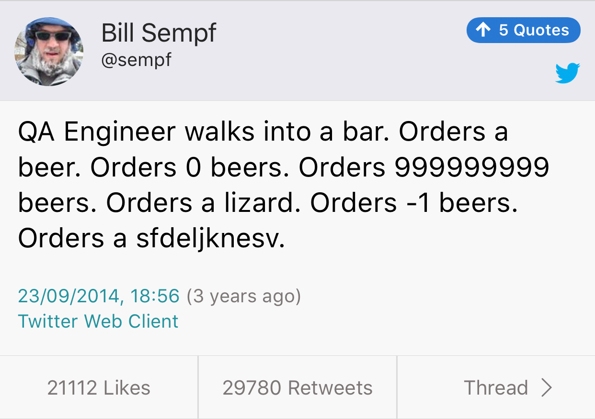

# Cpp.chat Episode #29: "We've Dropped The 'M' Word"

> In this episode we discuss Herb Sutter's new proposal, p0709, "Zero-overhead deterministic exceptions", a.k.a. "Static Exceptions" - and a couple of supporting proposals from Niall Douglas (p1028 and p1029).

* [YouTube](https://www.youtube.com/watch?v=aODRQ99j2uw&t=54s)
* [iTunes](https://itunes.apple.com/gb/podcast/cpp-chat/id1378325120?mt=2)
* [Overcast](https://overcast.fm/+M9D4KS6Qc)

# East const/Const west: Constant bikeshedding

* [Post](http://nosubstance.me/post/constant-bikeshedding/)
* [Reddit thread](https://www.reddit.com/r/cpp/comments/8j7jwz/constant_bikeshedding_answer_to_the_east_const/)

# Igor's C++ Grimoire

* [Link](http://knockknock.org.uk/igor.html)
* [Reddit thread](https://www.reddit.com/r/cpp/comments/8j8ywa/igors_c_grimoire/)

# CppInsights

* [Link](https://cppinsights.io/)
* [Source](https://github.com/andreasfertig/cppinsights)

# Facebook Infer

A static analyzer for Java, C, C++, and Objective-C

* [Website](http://fbinfer.com/)
* [Code](https://github.com/facebook/infer)

# CLion starts 2018.2 EAP

* [Post](https://blog.jetbrains.com/clion/2018/05/clion-starts-2018-2-eap-sanitizers-gradle-db-performance/)

# Namespace tricks

* [The Old New Thing](https://blogs.msdn.microsoft.com/oldnewthing/20180516-00/?p=98765)
* [Follow-up: My namespace importing trick imported the same three namespaces into each top-level namespace, yet it worked?](https://blogs.msdn.microsoft.com/oldnewthing/20180525-00/?p=98835)

# Getting started with Meson in C++

* [Part 1](https://medium.com/@germandiagogomez/getting-started-with-meson-build-system-and-c-83270f444bee)
* [Part 2](https://medium.com/@germandiagogomez/getting-started-with-meson-in-c-part-2-58150354ff17)
* [Part 3](https://medium.com/@germandiagogomez/getting-started-with-meson-in-c-part-3-70b9bc419957)

# Using Conan with Premake

* [Article](https://enhex.virhex.com/using-conan-with-premake)

# {fmt} 5.0.0

* [Release notes](https://github.com/fmtlib/fmt/releases/tag/5.0.0)

# Digital Mars C++ compiler source code

* [Code](https://github.com/DigitalMars/Compiler)

# function2

Improved and configurable drop-in replacement to std::function that supports move only types, multiple overloads and more.

* [Website](http://naios.github.io/function2)
* [Code](https://github.com/Naios/function2)

# Builder Pattern with Fluent API

[Post](http://www.riptutorial.com/cplusplus/example/30166/builder-pattern-with-fluent-api)

```cpp
class Email {
public:
    ...
    static EmailBuilder make();
};

class EmailBuilder {
    ...
    operator Email&&() { return std::move(m_email); }
private:
    Email m_email;
}

EmailBuilder Email::make() { return EmailBuilder(); }
```

# Builder Pattern with Fluent API (cont.)

```cpp
int main() {
    Email mail = Email::make().from("me@mail.com")
                              .to("you@mail.com")
                              .subject("C++ builders")
                              .body("I like this API");
}
```

# The Incredible Shrinking Standard - Alisdair Meredith [ACCU 2018]

* [Video](https://www.youtube.com/watch?v=YTV2frD1W4Y)

## Static Functions

* Can't be used with templates in C++98 (internal linkage)
    * C compatibility feature, deprecated in initial C++98 standard in favour of unnamed namespaces
    * Un-deprecated in C++11 (all such functions must work with templates)
* Modules: TBD

# The Incredible Shrinking Standard - Alisdair Meredith (cont.)

## Incrementing `bool`

* `bool++` deprecated in original C++98
* `++bool` deprecated in C++03
* Added to C in C99
* Both removed in C++17

# The Incredible Shrinking Standard - Alisdair Meredith (cont.)

## Incrementing `bool`

### Was

```cpp
void test(bool before, bool after) {
    ++after;
    if (after and before++) {...}
}
```

### Now

```cpp
void test(bool before, bool after) {
    after = true;
    if (after and std::exchange(before, true)) {...}
}
```

# The Incredible Shrinking Standard - Alisdair Meredith (cont.)

## Decrementing `bool`?

* Added to C99
* Not in C++
* Toggles the value

# The Incredible Shrinking Standard - Alisdair Meredith (cont.)

## `export`

* In original C++ Standard
* The only implementation shipped with C++03
* Many surprises due to 2-phase name lookup
* Removed from C++11 without deprecation
* Keyword reserved for future use

# The Incredible Shrinking Standard - Alisdair Meredith (cont.)

## `auto`

* C++98: a local variable in a function
* Removed from C++11

# The Incredible Shrinking Standard - Alisdair Meredith (cont.)

## `register`

* A hint to compiler
* No use other than C compatibility
* Modern compilers ignore it
* Deprecated in C++11
* Removed from C++17
* Keyword reserved for future use

# The Incredible Shrinking Standard - Alisdair Meredith (cont.)

## Trigraphs

* ??! --> #
* Translated by preprocessor ==> expanded in literals and other surprising places
* Attempted to deprecate in C++11, but national bodies objected
* Removed in C++17

# The Incredible Shrinking Standard - Alisdair Meredith (cont.)

## Digraphs

* Alternative keywords, like `and` and `or`
* Fully supported

# The Incredible Shrinking Standard - Alisdair Meredith (cont.)

## Exception specification

* Feature of C++98
* Deprecated in favour of `noexcept` in C++11
* Removed in C++17 apart from `throw()`
* Removing `throw()` from C++20

# The Incredible Shrinking Standard - Alisdair Meredith (cont.)

## Implicit copy operations

* C++98 always declared copy ctor and copy assignment operator for a class (unless it had awkward bases/members)
* Members are not declared in C++11 if a move ctor/assignment operator is declared
* C++11 deprecates implicit declaration of the 2nd copy operation if just one is declared, or a dtor is declared
* C++20: no changes

# The Incredible Shrinking Standard - Alisdair Meredith (cont.)

## `char*` for string literals

* C++98 allows this
* Plain `char*` binding was permitted for C compatibility, but deprecated in C++98
* Removed in C++11

# The Incredible Shrinking Standard - Alisdair Meredith (cont.)

## Narrowing conversions

* C++11: Use uniform initialization
    * Narrowing conversions are ill-formed
* Can break aggregate initialization in legacy code

# The Incredible Shrinking Standard - Alisdair Meredith (cont.)

## PODs

* What is it? Opinions differ
* Removed in C++20
* Removed the term from core language and deprecated `is_pod` trait

# The Incredible Shrinking Standard - Alisdair Meredith (cont.)

## `gets()`

* No safe usage
* Deprecated in C99, removed in C11
* Removed from C++14

# The Incredible Shrinking Standard - Alisdair Meredith (cont.)

## Ref counted strings

* C++98: `basic_string` supported CoW idiom
    ** Can be surprising, like calling `begin()` invalidates iterators
* CoW is a performance hazard in concurrent code ==> removed in C++11
* Enabled SSO instead

# The Incredible Shrinking Standard - Alisdair Meredith (cont.)

## `auto_ptr`

* Added in C++98
* Deprecaated in C++11 in favour of `unique_ptr`
* Removed in C++17

# The Incredible Shrinking Standard - Alisdair Meredith (cont.)

## `random_shuffle`

* Uses poor-quality C library random function
* Deprecated in C++14 (specify a random generator, or use `shuffle`)
* Removed in C++17

# The Incredible Shrinking Standard - Alisdair Meredith (cont.)

## Adaptable functions

* `bind1st`, `bind2nd`, `mem_fun_ref` etc.
* Rely on protocol of nested typedefs
* Superseded by `std::bind`, so deprecated in C++11
* Removed in C++17

# The Incredible Shrinking Standard - Alisdair Meredith (cont.)

## Vacuous C++ headers

* `<ccomplex>`, `<ciso646>`, `<cstdalign>`, `<cstdbool>`, `<ctgmath>`
* Nothing but compatibility macros in C headers
* To be removed in C++20
* Last contention: `<version>`
* Detect with `__has_include(<header>)`

# The Incredible Shrinking Standard - Alisdair Meredith (cont.)

## `strstreams`

* Older form of string streams (more performant, but harder to use)
* No templates, only supports `char`
* Deprecated in C++98
* No replacement yet

# The Incredible Shrinking Standard - Alisdair Meredith (cont.)

## `std::iterator`

* A base class to provide typedefs for iterators
* Problems with 2-phase lookup not finding typedefs in dependent base class (typical usage)
* Library removed explicit dependency on this in C++11
* Deprecated in C++17

# The Incredible Shrinking Standard - Alisdair Meredith (cont.)

## Temporary buffers

* `get_temporary_buffer`: nobody used it
* No RAII support
* Deprecated in C++17
* To be removed in C++20

# The Incredible Shrinking Standard - Alisdair Meredith (cont.)

## `raw_storage_iterator`

* Constructs elements when assigned (useful with `copy` and `transform`)
* No safe usage if ctor throws
* Deprecated in C++17
* To be removed in C++20

# The Incredible Shrinking Standard - Alisdair Meredith (cont.)

## Deducible members of `std::allocator`

* Allocators should always be accessed via traits since C++11
* Deprecated in C++17
* To be removed in C++20
* Un-deprecate `size_type` and `difference_type` in C++20

# The Incredible Shrinking Standard - Alisdair Meredith (cont.)

## `allocator<void>`

* Mostly empty specialization, no `allocate` member
* Less needed when usage is via `allocator_traits`
* Explicit instantiation will fail due to `allocate`/`deallocate`
* Deprecated in C++17
* To be removed in C++20

# The Incredible Shrinking Standard - Alisdair Meredith (cont.)

## `is_literal`

* Useless unless you know which ctors are `constexpr`
* Deprecated in C++17
* To be removed in C++20

# The Incredible Shrinking Standard - Alisdair Meredith (cont.)

## `result_of`

* Introduced in Library TR1
* Standardised in C++11 as a simple `decltype`
* Could not support some use cases due to 'cute' syntax
* Deprecated in C++17, use `invoke_result` instead
* To be removed in C++20

# The Incredible Shrinking Standard - Alisdair Meredith (cont.)

## `uncaught_exception`

* To detect an exception in-flight
* Underspecified (such as when exception is in another thread, or a `try`/`catch` that doesn't escape dtor)
* Deprecated in C++17, use `uncaught_exceptions`
* To be removed in C++20

# The Incredible Shrinking Standard - Alisdair Meredith (cont.)

## Atomic API for `shared_ptr`

* Free function API to use `shared_ptr` atomically without synchronisation
* Easily misused (can't dereference, all operations must happen via this API)
* Deprecated in C++20 in favour of `atomic<shared_ptr>`

## `shared_ptr::unique`

* Unreliable with multiple threads
* Ignored `weak_ptr` in other threads (can become locked)
* Deprecated in C++17
* To be removed in C++20

# The Incredible Shrinking Standard - Alisdair Meredith (cont.)

## `basic_string::reserve()`

* Prior to C++20 allows string to shrink
* C++10 removes shrinking permission (for consistency with other containers)
* Calling `reserve()` becomes a no-op unique to `basic_string` -- use `clear()` instead
* Signature without parameters deprecated in C++20

# The Incredible Shrinking Standard - Alisdair Meredith (cont.)

## Namespace `relops`

* Provides default implementations for comparison operators, assuming `operator==` and `operator<` are defined for a type
* No tag class to derive from ==> can't be hooked with ADL
* Requires `using namespace relops;` to activate which is not good in a header
* Deprecated in C++20 in favour of the spaceship operator

# The Incredible Shrinking Standard - Alisdair Meredith (cont.)

## `<codecvt>`

* Added for Unicode support in C++11
* Underspecified and hard to use
* Deprecated in C++17

# The Incredible Shrinking Standard - Alisdair Meredith (cont.)

## `wstring_convert`

* Widens/narrows strings using streams interface
* Underspecified and awkward to use
* Deprecated in C++17 without replacement

# The Incredible Shrinking Standard - Alisdair Meredith (cont.)

## Standard subsets

* C++98 -> C++14
* C++11 -> Latest

# Twitter


