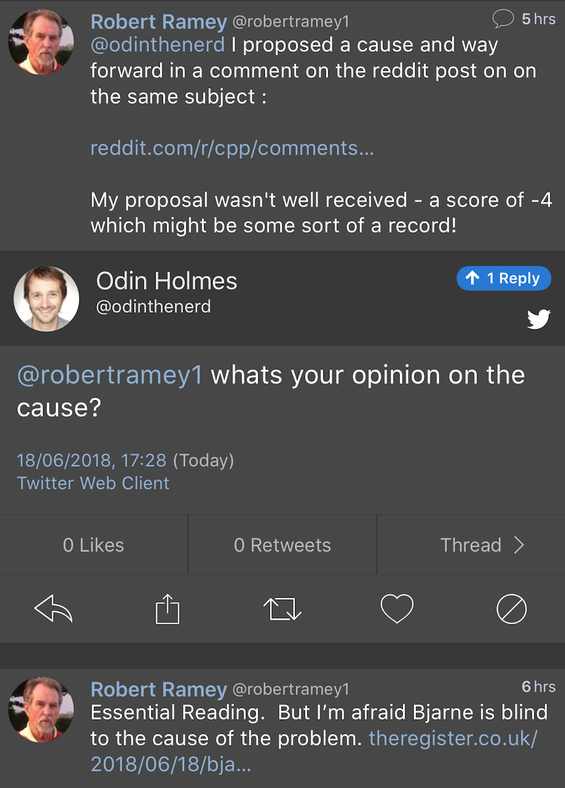
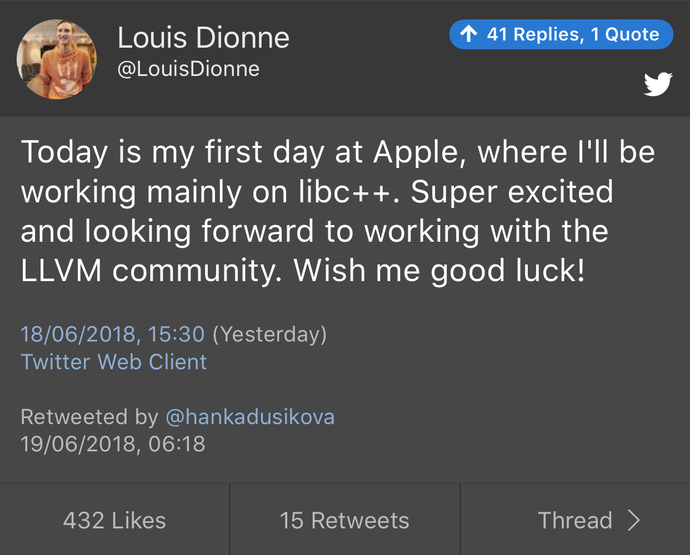
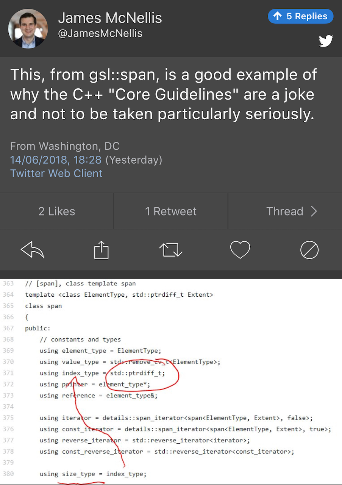
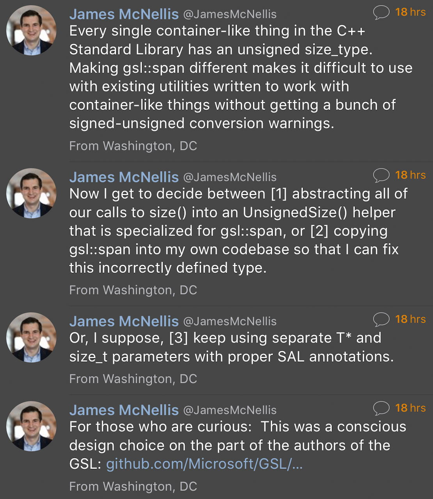
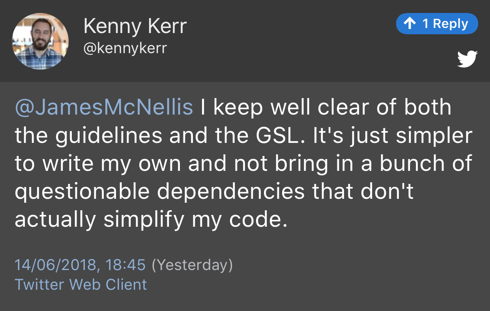
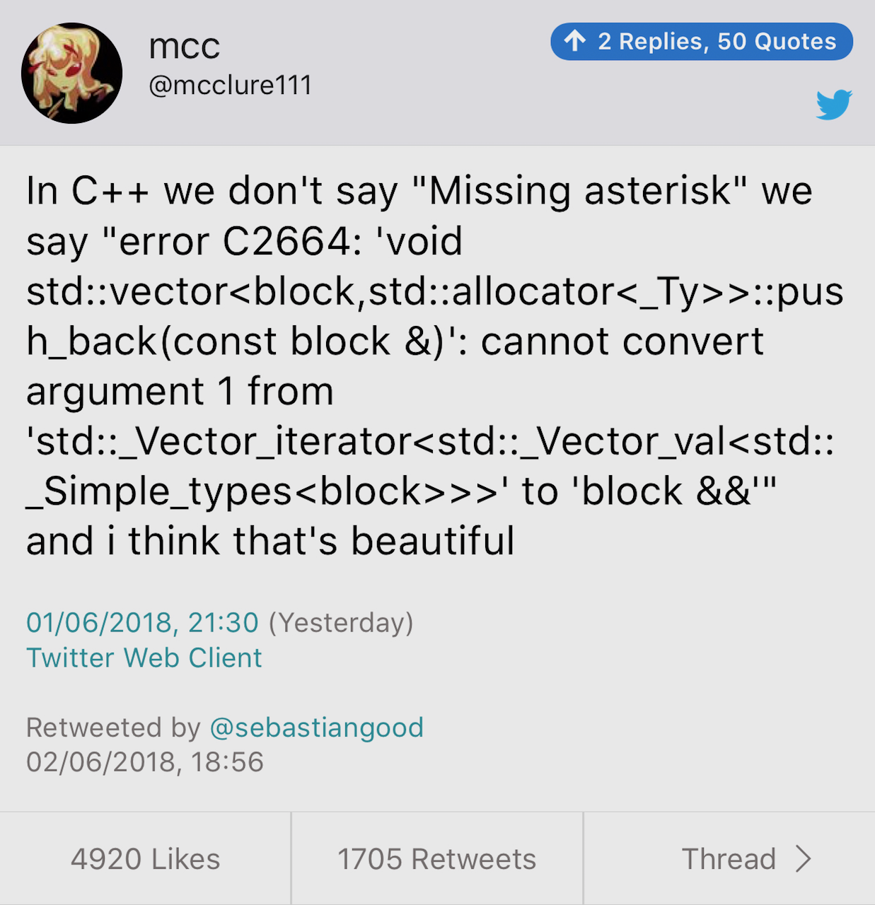
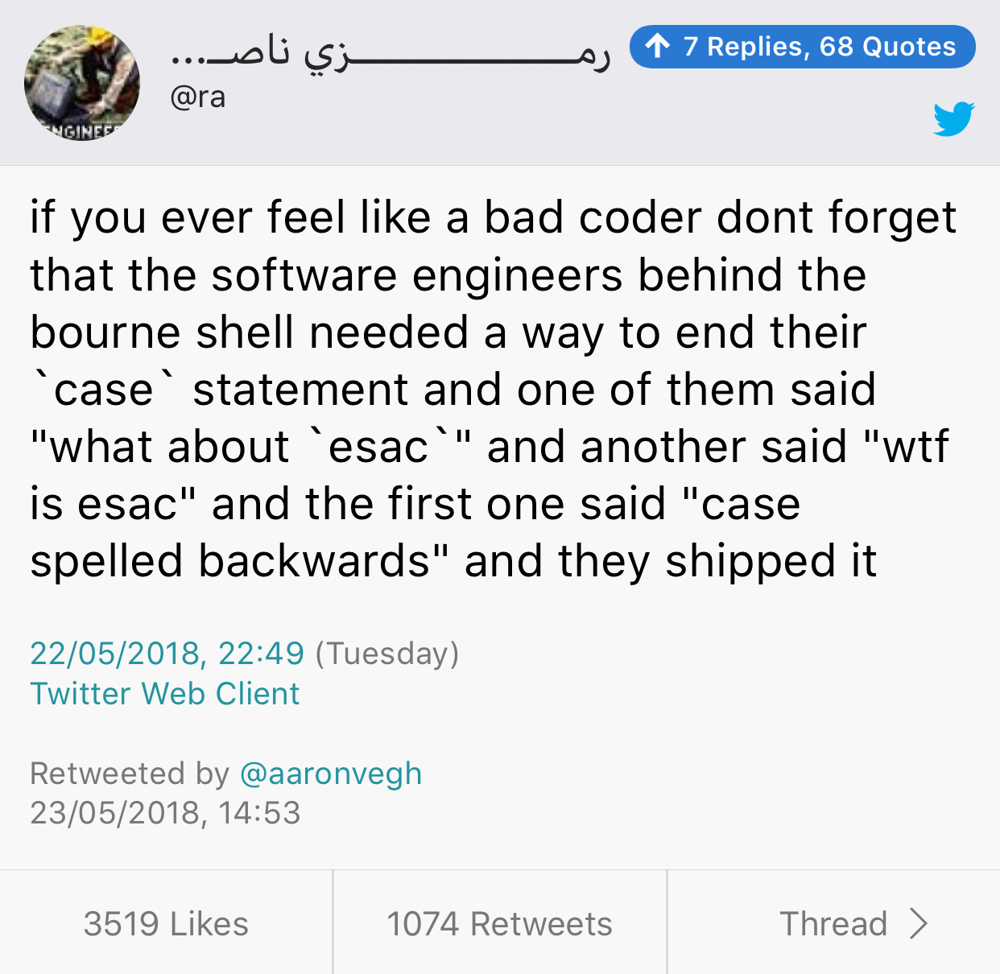

# Rapperswil trip reports

* [Botond Ballo](https://botondballo.wordpress.com/2018/06/20/trip-report-c-standards-meeting-in-rapperswil-june-2018/)
* [CppCast](http://cppcast.com/2018/06/trip-report/)

# The Register interview

* [The Reg](https://www.theregister.co.uk/2018/06/18/bjarne_stroustrup_c_plus_plus/)
* [Reddit thread](https://www.reddit.com/r/cpp/comments/8ry4zd/interview_whats_all_the_c_plus_fuss_bjarne/)

# Bjarne Stroustrup: Remember the Vasa

* [P0977r0](http://open-std.org/JTC1/SC22/WG21/docs/papers/2018/p0977r0.pdf)
    * [Reddit thread](https://www.reddit.com/r/cpp/comments/8mp7in/bjarne_stroustrup_remember_the_vasa/)
        * [Robert Ramey's reply](https://www.reddit.com/r/cpp/comments/8mp7in/bjarne_stroustrup_remember_the_vasa/dzpp2r9/)



# Louis Dionne goes to Apple



# Twitter: C++ Core Guidelines and Microsoft's James McNellis (1)



# Twitter: C++ Core Guidelines and Microsoft's James McNellis (2)



# Twitter: C++ Core Guidelines and Microsoft's Kenny Kerr



# Unions and type punning in C++

```cpp
union CurrencyCode {
    char code[4];
    unsigned int hash;
}
```

* [C++ Core Guidelines: Don't use unions for type punning](http://isocpp.github.io/CppCoreGuidelines/CppCoreGuidelines#Ru-pun)
* [SO: Accessing inactive union member](https://stackoverflow.com/questions/11373203/accessing-inactive-union-member-and-undefined-behavior)
* [John Regehr: Type Punning, Strict Aliasing, and Optimization](https://blog.regehr.org/archives/959)
* [C++ standard committee mailing list: Unions and UB](http://www.open-std.org/pipermail/ub/2013-July/thread.html#71)

# Builder Pattern with Fluent API

[Post](http://www.riptutorial.com/cplusplus/example/30166/builder-pattern-with-fluent-api)

```cpp
class Email {
public:
    ...
    static EmailBuilder make();
};

class EmailBuilder {
    ...
    operator Email&&() { return std::move(m_email); }
private:
    Email m_email;
}

EmailBuilder Email::make() { return EmailBuilder(); }
```

# Builder Pattern with Fluent API (cont.)

```cpp
int main() {
    Email mail = Email::make().from("me@mail.com")
                              .to("you@mail.com")
                              .subject("C++ builders")
                              .body("I like this API");
}
```

# {fmt} 5.0.0

* [Release notes](https://github.com/fmtlib/fmt/releases/tag/5.0.0)
* [P0645](http://www.open-std.org/jtc1/sc22/wg21/docs/papers/2018/p0645r2.html)
* [Support for ranges, containers and types with tuple interface](https://github.com/Remotion/fmt_extension)

# Before/after tables ("Tony Tables") for C++17 and C++20 by Tony van Eerd

* [C++20](https://github.com/tvaneerd/cpp20_in_TTs)
* [C++17](https://github.com/tvaneerd/cpp17_in_TTs)

# Namespace tricks

* [The Old New Thing](https://blogs.msdn.microsoft.com/oldnewthing/20180516-00/?p=98765)
* [Follow-up: My namespace importing trick imported the same three namespaces into each top-level namespace, yet it worked?](https://blogs.msdn.microsoft.com/oldnewthing/20180525-00/?p=98835)

# Book: The Modern C++ Challenge

* [Review by Scott Meyers](https://scottmeyers.blogspot.com/2018/06/interesting-book-modern-c-challenge.html)
* [Book page (Packt)](https://www.packtpub.com/application-development/modern-c-challenge)

# zapcc open-sourced

zapcc is a caching C++ compiler based on clang, designed to perform faster compilations.

* [Code](https://github.com/yrnkrn/zapcc) (LLVM)

# C++17: std::string_view

* [Post](http://www.nuonsoft.com/blog/2018/06/06/c17-stdstring_view/)

# Getting started with Meson in C++

* [Part 1](https://medium.com/@germandiagogomez/getting-started-with-meson-build-system-and-c-83270f444bee)
* [Part 2](https://medium.com/@germandiagogomez/getting-started-with-meson-in-c-part-2-58150354ff17)
* [Part 3](https://medium.com/@germandiagogomez/getting-started-with-meson-in-c-part-3-70b9bc419957)

# Using Conan with Premake

* [Article](https://enhex.virhex.com/using-conan-with-premake)

# Digital Mars C++ compiler source code

* [Code](https://github.com/DigitalMars/Compiler)

# function2

Improved and configurable drop-in replacement to `std::function` that supports move only types, multiple overloads and more.

* [Website](http://naios.github.io/function2)
* [Code](https://github.com/Naios/function2)

# NanoRange: a MSVC-compatible Ranges TS implementation for C++14

* [Code](https://github.com/tcbrindle/nanorange) (BSL)
* [Reddit thread](https://www.reddit.com/r/cpp/comments/8ob7dd/nanorange_msvccompatible_implementation_of_the/)

# C++17: std::apply

* [CppReference](http://en.cppreference.com/w/cpp/utility/apply)

# C++ Now 2018 Videos

* [Playlist](https://www.youtube.com/playlist?list=PL_AKIMJc4roVSbTTfHReQTl1dc9ms0lWH)

# Twitter



# Twitter


