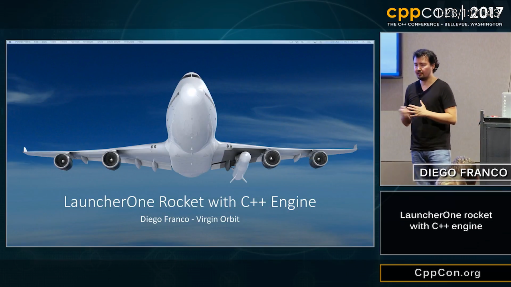
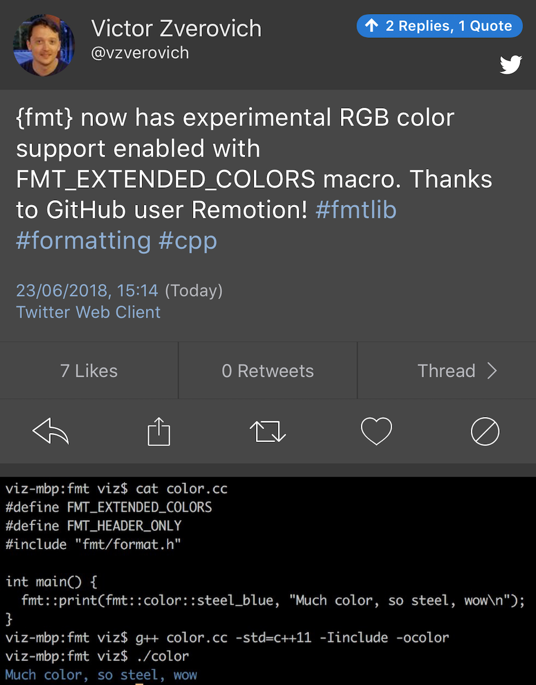
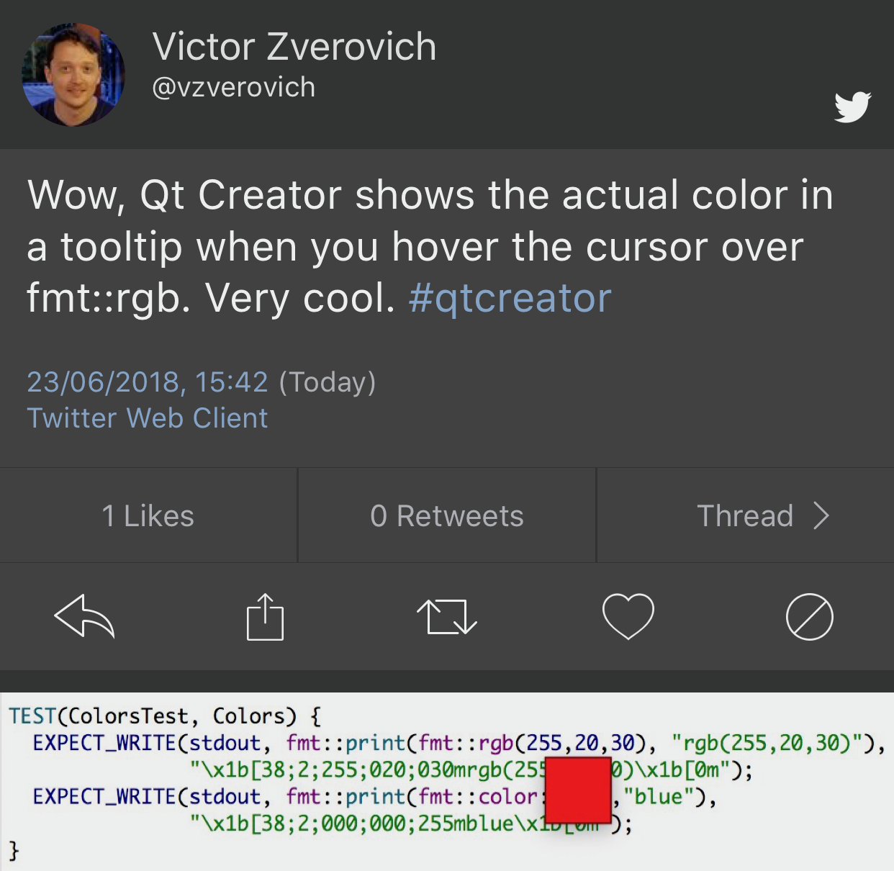
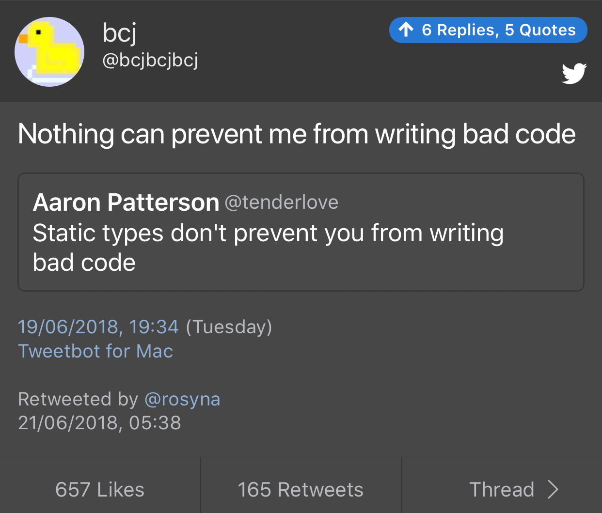

# CLion 2018.2 EAP

[Announcement](https://blog.jetbrains.com/clion/2018/06/clion-2018-2-eap-clangd/#more-5268)

* **clangd** as an additional (not you Windows!) C++ language engine

# Visual Studio 2017 version 15.8 Preview 3

[Announcement](https://blogs.msdn.microsoft.com/visualstudio/2018/06/26/visual-studio-2017-version-15-8-preview-3/)

* convert basic macros to constexpr
* [experimental code analysis features](https://blogs.msdn.microsoft.com/vcblog/2018/06/26/new-experimental-code-analysis-features-in-visual-studio-2017-15-8-preview-3/)
* [Template IntelliSense](https://blogs.msdn.microsoft.com/vcblog/2018/06/26/template-intellisense/)
* [clang-format](https://aka.ms/clangformat)
* improved CMake support
* C++ Quick Info Tooltips (show expanded macros)

# What is a good Package Manager for C++?

[Reddit thread](https://www.reddit.com/r/cpp/comments/8t0ufu/what_is_a_good_package_manager_for_c/)

> No matter which one you use, you'll probably be pretty disappointed.

# std::variant Doesn't Let Me Sleep, by Pablo Arias (ht to Gergely Petrik)

* [Post](https://pabloariasal.github.io/2018/06/26/std-variant/)
* [The most valuable values - Juanpe Bolívar - Meeting C++ 2017](https://www.youtube.com/watch?v=NMol_5-2owo)
* [Overload: Build a Variant Visitor on the Fly](https://arne-mertz.de/2018/05/overload-build-a-variant-visitor-on-the-fly/)
* [folly/Overload.h](https://github.com/facebook/folly/blob/master/folly/Overload.h)

# Raffle (C++17, ranges, asio, json)

Fetches the names of all RSVP members of a meetup event and randomly chooses The Raffle Winner.

* [Code](https://github.com/CoreCppIL/raffle)
* [Reddit thread](https://www.reddit.com/r/cpp/comments/8sllrn/c_meetup_raffle_name_picker/)

# Diego Franco - LauncherOne rocket with C++ engine - CppCon 2017

# Diego Franco - LauncherOne rocket with C++ engine - CppCon 2017 (cont.)

* Radiation
    * Single Event Upset (SEU)
    * Single Event Latch (SEL)
    * Error Correcting Code (ECC)
    * Memory scrubbing
    * Radiation-hardened components
* Log or hard error
    * Log for each requirement
    * Not all errors are hard errors
    * Depends on system under test -- some systems are more expensive to test than others

# {fmt} 5.0.0

* [Release notes](https://github.com/fmtlib/fmt/releases/tag/5.0.0)
* [P0645](http://www.open-std.org/jtc1/sc22/wg21/docs/papers/2018/p0645r2.html)
* [Support for ranges, containers and types with tuple interface](https://github.com/Remotion/fmt_extension)

# {fmt} supports colours

|

# Namespace tricks

* [The Old New Thing](https://blogs.msdn.microsoft.com/oldnewthing/20180516-00/?p=98765)
* [Follow-up: My namespace importing trick imported the same three namespaces into each top-level namespace, yet it worked?](https://blogs.msdn.microsoft.com/oldnewthing/20180525-00/?p=98835)

# Book: The Modern C++ Challenge

* [Review by Scott Meyers](https://scottmeyers.blogspot.com/2018/06/interesting-book-modern-c-challenge.html)
* [Book page (Packt)](https://www.packtpub.com/application-development/modern-c-challenge)

# zapcc open-sourced

zapcc is a caching C++ compiler based on clang, designed to perform faster compilations.

* [Code](https://github.com/yrnkrn/zapcc) (LLVM)

# C++17: std::string_view

* [Post](http://www.nuonsoft.com/blog/2018/06/06/c17-stdstring_view/)

# Getting started with Meson in C++

* [Part 1](https://medium.com/@germandiagogomez/getting-started-with-meson-build-system-and-c-83270f444bee)
* [Part 2](https://medium.com/@germandiagogomez/getting-started-with-meson-in-c-part-2-58150354ff17)
* [Part 3](https://medium.com/@germandiagogomez/getting-started-with-meson-in-c-part-3-70b9bc419957)

# Using Conan with Premake

* [Article](https://enhex.virhex.com/using-conan-with-premake)

# Digital Mars C++ compiler source code

* [Code](https://github.com/DigitalMars/Compiler)

# function2

Improved and configurable drop-in replacement to `std::function` that supports move only types, multiple overloads and more.

* [Website](http://naios.github.io/function2)
* [Code](https://github.com/Naios/function2)

# NanoRange: a MSVC-compatible Ranges TS implementation for C++14

* [Code](https://github.com/tcbrindle/nanorange) (BSL)
* [Reddit thread](https://www.reddit.com/r/cpp/comments/8ob7dd/nanorange_msvccompatible_implementation_of_the/)

# C++17: std::apply

* [CppReference](http://en.cppreference.com/w/cpp/utility/apply)

# Twitter

