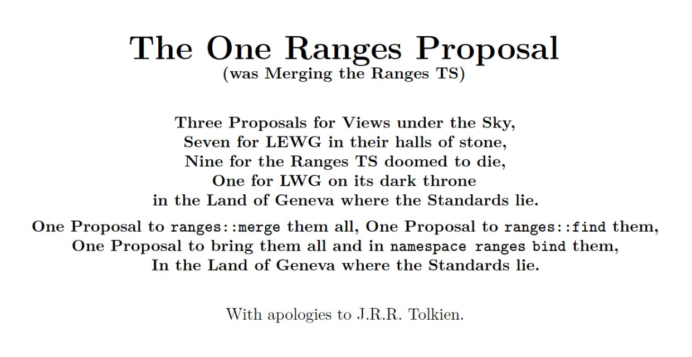
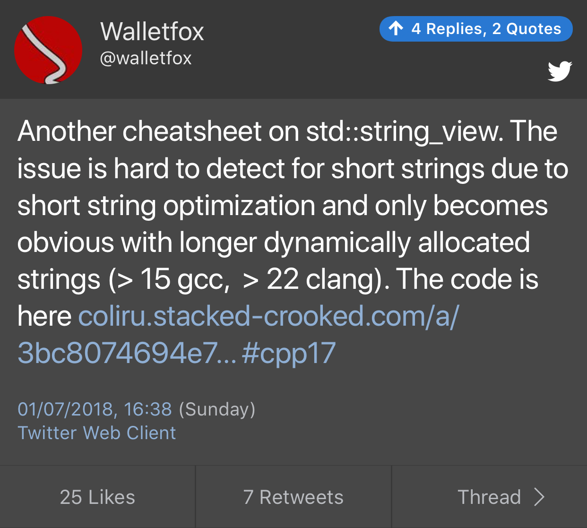
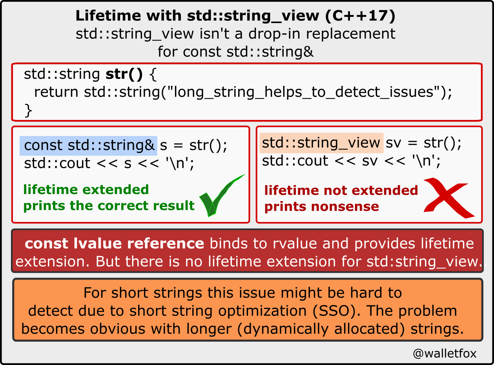

# Rapperswil reports

* [Corentin](https://cor3ntin.github.io/posts/rapperswil/)
* [Herb Sutter](https://herbsutter.com/2018/07/02/trip-report-summer-iso-c-standards-meeting-rapperswil/)
    * *"I sometimes delay my trip report until the post-meeting mailing is available so that everyone can see the latest papers"*
    * On contracts: *"Having first-class contracts support it is the first major “step 1” of reforming error handling in C++ and applying 30 years’ worth of learnings."*
    * On `std::bad_alloc`: *"Consider handling heap exhaustion (out-of-memory, OOM) differently from other errors."*
    * On feature test macros: *"Some experts still disagree, and we respect their views, but in my view these feature test macros are an important and pragmatic help to improve the speed of adoption of new standard C++ features."*
    * [Reddit thread](https://www.reddit.com/r/cpp/comments/8vl19w/trip_report_summer_iso_c_standards_meeting/)
* [J.Daniel Garcia's Contracts presentation](https://www.youtube.com/watch?v=IBas3S2HtdU) and [slides](https://github.com/ACCUConf/ACCUConf_PDFs/blob/master/2017/j-danie-garcia-contracts.pdf)

# Post-Rapperswil mailing

* [Mailing 2018-06](http://www.open-std.org/jtc1/sc22/wg21/docs/papers/2018/#mailing2018-06)

# The One Ranges Proposal, by Casey Carter

# The tightly-constrained design space of convenient syntaxes for generic programming

* [Corentin](https://cor3ntin.github.io/posts/concepts_syntax/) -- there is a questionnaire at the end

> The compiler (and by extension, tools) needs no syntax whatsoever to distinguish concepts, types, values, type-concepts, value-concepts.

> Some people like syntax so much, Bjarne calls them the “syntax people”.

* [Combined proposal: "Yet another approach for constrained declarations"](http://www.open-std.org/jtc1/sc22/wg21/docs/papers/2018/p1141r0.html)

# James McNellis on C++ Core Guidelines

* [Issue: The entirety of "NL: Naming and layout rules" should be removed](https://github.com/isocpp/CppCoreGuidelines/issues/1238)
* [Reddit discussion](https://www.reddit.com/r/cpp/comments/8uv2yr/cppcoreguidelines_the_entirety_of_nl_naming_and/)

# Forward declarations

* [Google C++ Guidelines](https://google.github.io/styleguide/cppguide.html)

# East Const Central

* [Jon Kalb](http://slashslash.info/eastconst/)

# Twitter: `string_view` lifetime

|

# Namespace tricks

* [The Old New Thing](https://blogs.msdn.microsoft.com/oldnewthing/20180516-00/?p=98765)
* [Follow-up: My namespace importing trick imported the same three namespaces into each top-level namespace, yet it worked?](https://blogs.msdn.microsoft.com/oldnewthing/20180525-00/?p=98835)

# Be Mindful with Compiler-Generated Move Constructors

* [Post](https://ibob.github.io/blog/2018/07/03/compiler-generated-move/)
    * [Reddit](https://www.reddit.com/r/cpp/comments/8vzvkb/be_mindful_with_compilergenerated_move/)

## function2

Improved and configurable drop-in replacement to `std::function` that supports move only types, multiple overloads and more.

* [Website](http://naios.github.io/function2)
* [Code](https://github.com/Naios/function2)

# Quote

Tom Cargill:

> The first 90% of the code accounts for the first 90% of the development time. The remaining 10% of the code accounts for the other 90% of the development time.
