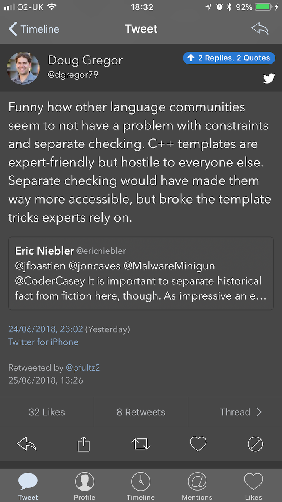
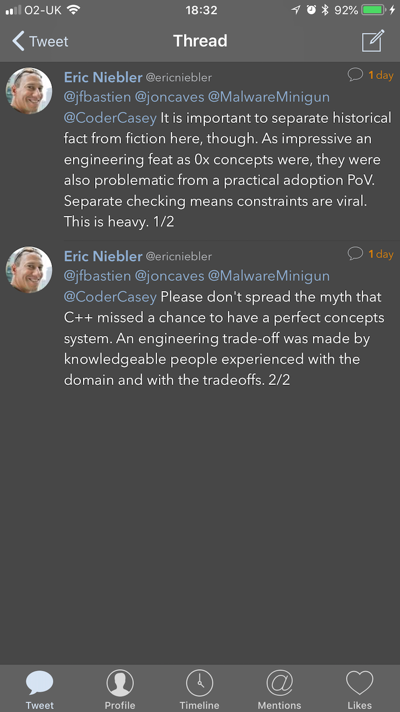
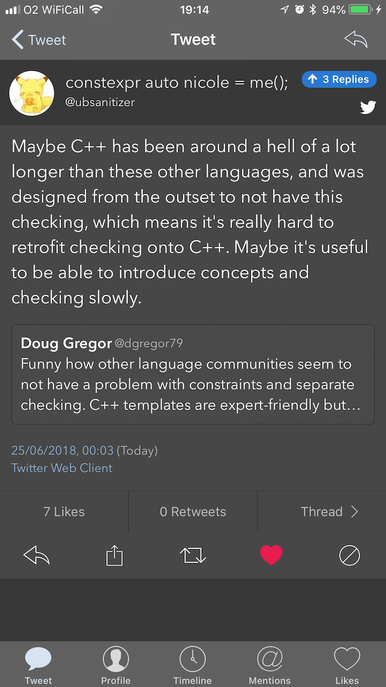
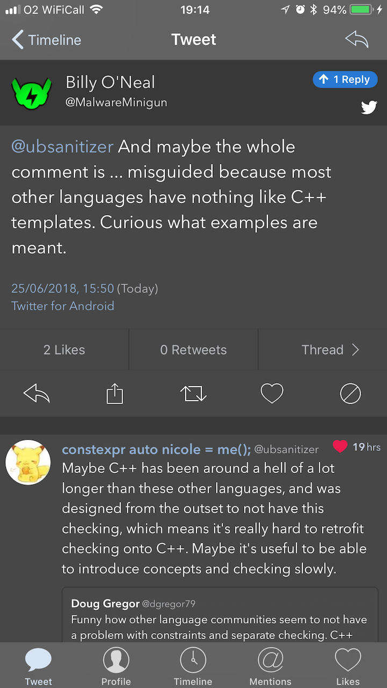
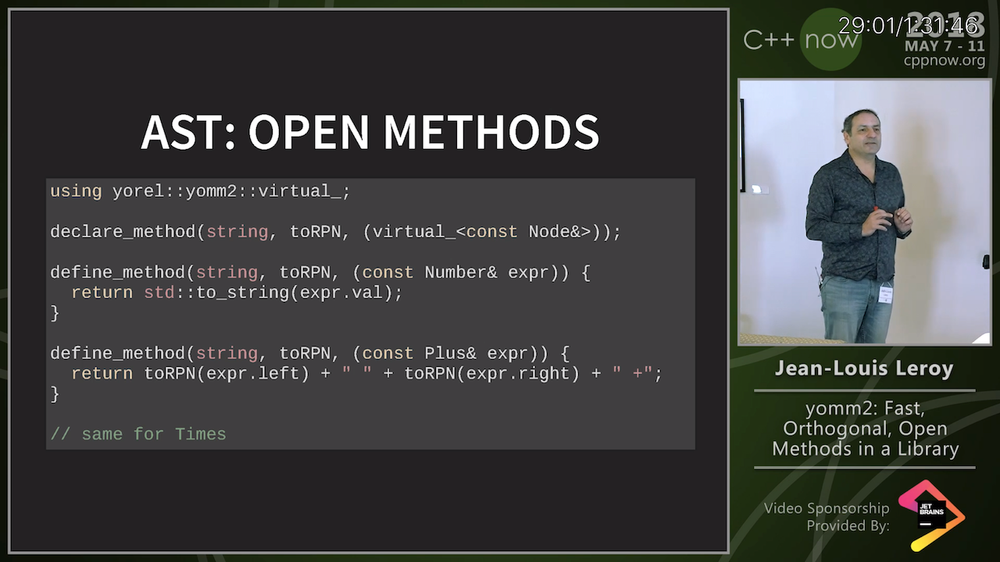
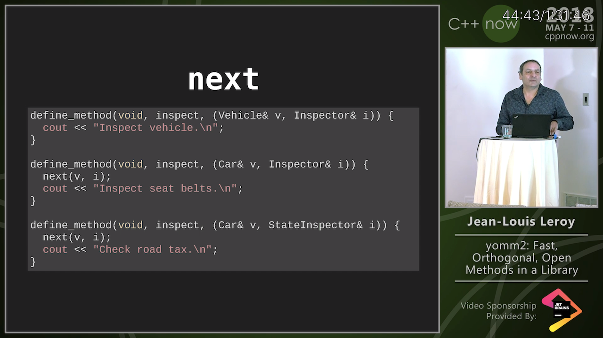

# Combined proposal for short concepts syntax

* [Combined proposal: "Yet another approach for constrained declarations"](http://www.open-std.org/jtc1/sc22/wg21/docs/papers/2018/p1141r0.html)

# Twitter: concepts and constraint checking

|

# Twitter: concepts and constraint checking (cont.)

|

# Twitter: Bryce Lelbach

[This is horrific](https://twitter.com/blelbach/status/1016845030986694656):

```cpp
int a; std::cout << &a << std::endl;
int volatile a; std::cout << &a << std::endl;
```

What's the difference?

* Line 1: Implicitly converts to `void*`, calls `operator<<(ostream&, void*)`.
* Line 2: Implicitly converts to `bool`, calls `operator<<(ostream&, bool)`.

# Revisiting Builder Pattern with Fluent API

[Post](http://www.riptutorial.com/cplusplus/example/30166/builder-pattern-with-fluent-api)

```cpp
class FooBuilder;

class Foo {
public:
    friend class FooBuilder;
    static FooBuilder builder();
private:
    Foo() = default;
    std::string name_;
};
```

# Revisiting Builder Pattern with Fluent API (cont.)

```cpp
class FooBuilder {
    FooBuilder& name(const char* name) {
        foo_.name_ = name;
        return *this;
    }
    operator Foo&&() {return std::move(foo_);}
    Foo build() {return foo_;}
private:
    Foo foo_;
}

FooBuilder Foo::build() {return FooBuilder();}
```

# Revisiting Builder Pattern with Fluent API (cont.)

```cpp
int main() {
    Foo foo1 = Foo::builder().name("foo1");
    Foo foo2 = Foo::builder().name("foo2").build();
}
```

The generated optimised code is the same.

# C++Now 2018: Jean-Louis Leroy “yomm2: Fast, Orthogonal, Open Methods in a Library”

* [Video](https://www.youtube.com/watch?v=rm82LBpyXjM)
* [Code](https://github.com/jll63/yomm2) (BSL 1.0)
* [Reddit](https://www.reddit.com/r/cpp/comments/7qm2qw/announce_yomm2_open_methods_in_a_library/)
* [Wikipedia: Multiple dispatch](https://en.wikipedia.org/wiki/Multiple_dispatch)
* [n2216: Report on language support for Multi-Methods and Open-Methods for C++](http://www.open-std.org/jtc1/sc22/wg21/docs/papers/2007/n2216.pdf)

# C++Now 2018: Jean-Louis Leroy “yomm2: Fast, Orthogonal, Open Methods in a Library” (cont.)



# C++Now 2018: Jean-Louis Leroy “yomm2: Fast, Orthogonal, Open Methods in a Library” (cont.)



# Twitter


