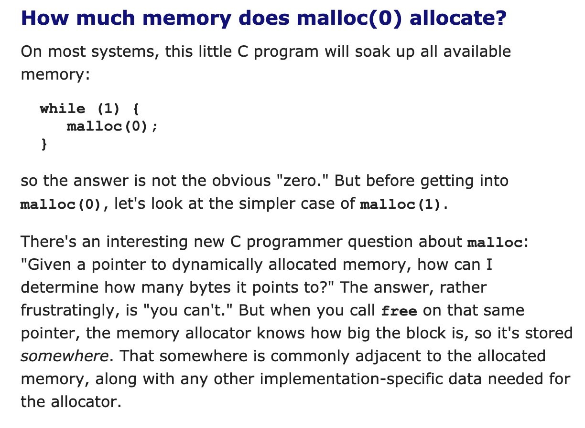
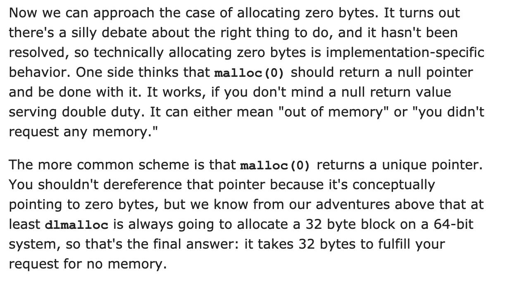
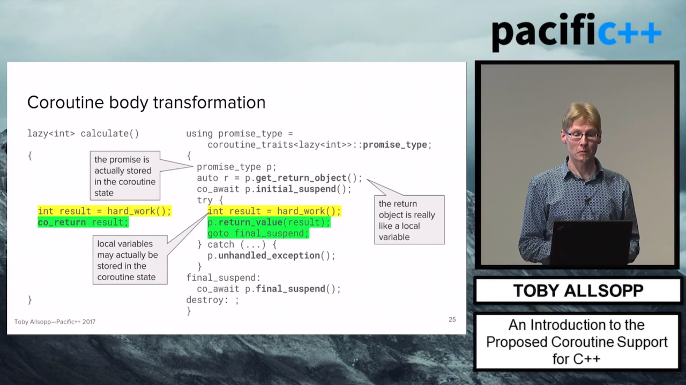
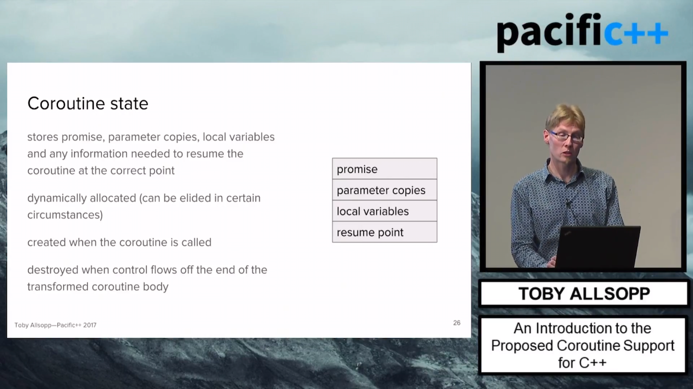
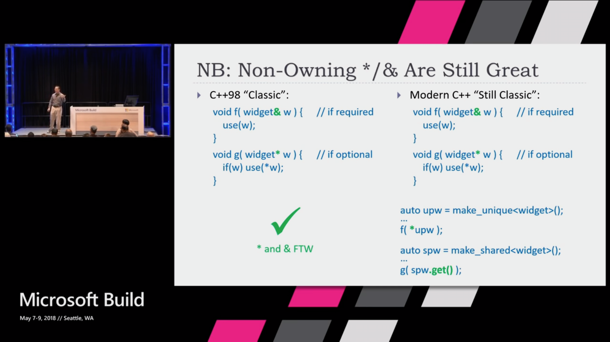
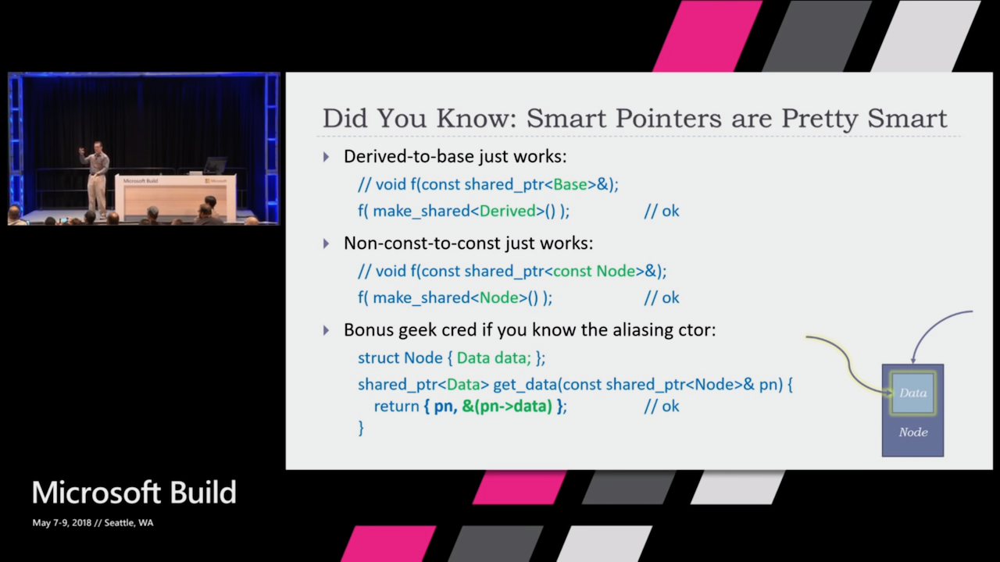
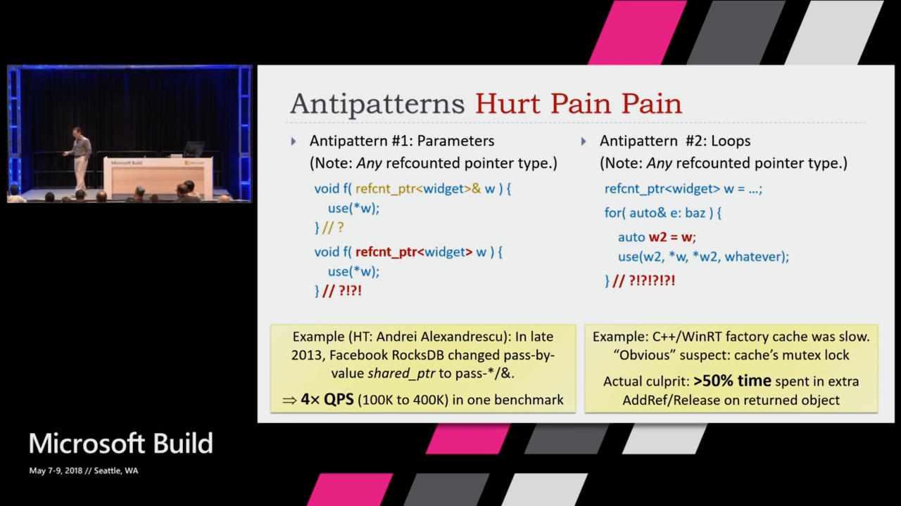
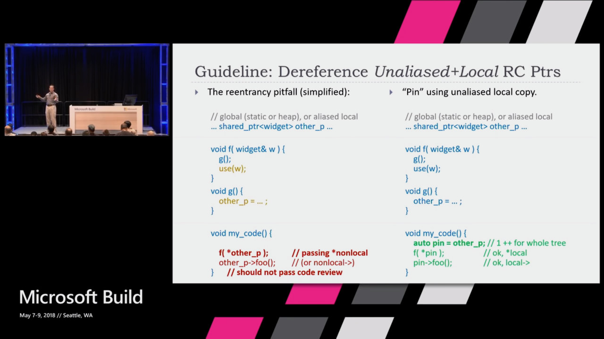
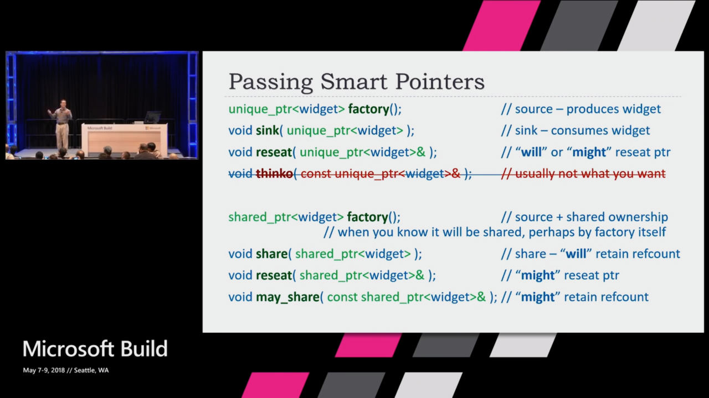
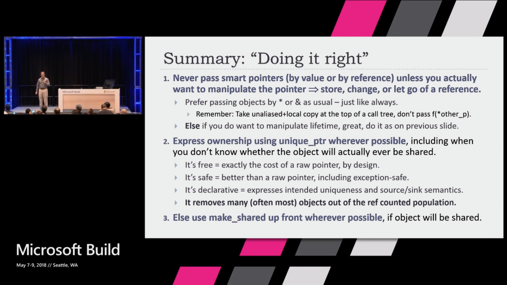

# Follow-up: Four Habit-Forming Tips to Faster C++ (1/4)

[Post by KDAB](https://www.kdab.com/four-habit-forming-tips-faster-c/)

"Cache member-variables and reference-parameters"

The original version in the article doesn't even work without aliasing:

```cpp
template<typename T>
class complex {
    complex& operator*=(const complex<T>& a) {
        real = real * a.real - imag * a.imag;
        // BUG: real is changed, then used in subsequent calculation
        imag = real * a.imag + imag * a.real;
        return *this;
    }
};
```

# Follow-up: Four Habit-Forming Tips to Faster C++ (2/4)

[Post by KDAB](https://www.kdab.com/four-habit-forming-tips-faster-c/)

"Cache member-variables and reference-parameters"

The recommended version from the article:

```cpp
template<typename T>
class complex {
    complex& operator*=(const complex<T>& a) {
        T a_real = a.real, a_imag = a.imag;
        T t_real = real, t_imag = imag;
        real = t_real * a_real - t_imag * a_imag;
        imag = t_real * a_imag + t_imag * a_real;
        return *this;
    }
};
```

# Follow-up: Four Habit-Forming Tips to Faster C++ (3/4)

[Post by KDAB](https://www.kdab.com/four-habit-forming-tips-faster-c/)

"Cache member-variables and reference-parameters"

Proposed "economy" version:

```cpp
template<typename T>
class complex {
    complex& operator*=(const complex<T>& a) {
        const auto real_this{real}; // modified by our code
        const auto real_a{a.real}; // may be modified if aliased
        real = real * a.real - imag * a.imag;
        imag = real_this * a.imag + imag * real_a;
        return *this;
    }
};
```

# Follow-up: Four Habit-Forming Tips to Faster C++ (4/4)

[Post by KDAB](https://www.kdab.com/four-habit-forming-tips-faster-c/)

"Cache member-variables and reference-parameters"

Proposed "easy" version:

```cpp
template<typename T>
class complex {
    complex& operator*=(complex<T> a) {
        const auto self{*this};
        real = self.real * a.real - self.imag * a.imag;
        imag = self.real * a.imag + self.imag * a.real;
        return *this;
    }
};
```

# C++ Quiz by Shafik Yaghmour via Twitter (1/2)

[Tweet](https://twitter.com/shafikyaghmour/status/1024212664833044480)

C:

```c
malloc(0)
```

C++:

```cpp
new int[0]
```

What's the behavior of these expressions?

1. Both return NULL/nullptr
2. Both return an address that's invalid to dereference
3. Behavior can vary
4. Undefined behavior

# C++ Quiz by Shafik Yaghmour via Twitter (2/2)

[Tweet](https://twitter.com/shafikyaghmour/status/1024212664833044480)

In C99 and C11 malloc(0) is allowed to return either NULL or pointer that is not valid to dereference:

* [C99 N1256 7.20.3](https://port70.net/~nsz/c/c99/n1256.html#7.20.3)
* [C11 N1570 7.22.3](https://port70.net/~nsz/c/c11/n1570.html#7.22.3)

In C++ we get back an array with zero elements:

* [expr.new](http://eel.is/c++draft/expr.new#7.sentence-4)
* [dynamic.allocation](http://eel.is/c++draft/basic.stc.dynamic.allocation#2.sentence-8)
* [dynamic.allocation](http://eel.is/c++draft/basic.stc.dynamic.allocation#footnote-36)

# Allocaling 0 bytes

|

# Metashell GUI

* [Code](https://github.com/RangelReale/msgui) (MIT)
    * [Reddit](https://www.reddit.com/r/cpp/comments/93578w/i_made_a_gui_ide_for_the_metashell_c_template/)
* [Metashell](http://metashell.org/) "The goal of this project is to provide an interactive template metaprogramming shell." (GPL-3.0)

# Ericsson CodeCompass

CodeCompass is a software comprehension tool for large scale software written in C/C++ and Java

* [Code](https://github.com/Ericsson/CodeCompass) (GPL-3.0)

# Expect the Expected, by Andrei Alexandrescu

* [Video](https://youtu.be/nVzgkepAg5Y)
* [Reddit](https://www.reddit.com/r/cpp/comments/8zwzv0/expect_the_expected_andrei_alexandrescu/)
* [Howard Hinnant on how to initialize a class using delegating constructors](https://stackoverflow.com/questions/38780596/how-to-handle-constructors-that-must-acquire-multiple-resources-in-an-exception#38780597)

# CppCast: Parallel Ranges with Chris DiBella

* [Podcast](http://cppcast.com/2018/07/chris-dibella/)
* [P0836R1 Introduce Parallelism to the Ranges TS](http://www.open-std.org/jtc1/sc22/wg21/docs/papers/2018/p0836r1.pdf)

# Pacific++ 2017: Toby Allsopp "An Introduction to the Proposed Coroutine Support for C++" (1/2)

* [Video](https://www.youtube.com/watch?v=nWuXubffryo)



# Pacific++ 2017: Toby Allsopp "An Introduction to the Proposed Coroutine Support for C++" (2/2)



# Qt and the Coroutines TS

* [Post by Jeff Trull](http://jefftrull.github.io/qt/c++/coroutines/2018/07/21/coroutines-and-qt.html)
* [Post by Jesús Fernández](http://blog.qt.io/blog/2018/05/29/playing-coroutines-qt/)
* [Boost.Asio coroutine support](https://www.boost.org/doc/libs/1_67_0/doc/html/boost_asio/overview/core/coroutines_ts.html)
* [Coroutine Theory Series, by Lewis Baker](https://lewissbaker.github.io/2017/09/25/coroutine-theory)
* [cppcoro: Coroutine Utilities, by Lewis Baker](https://github.com/lewissbaker/cppcoro)
* [How Coroutines Work, by Kirit Sælensminde](https://kirit.com/How%20C%2B%2B%20coroutines%20work)

# Exploiting Coroutines to Attack the “Killer Nanoseconds”

* [PDF](http://www.vldb.org/pvldb/vol11/p1702-jonathan.pdf)

In this work, we compare and contrast the state-of-the-art approaches to reduce CPU stalls due to cache misses for pointer-intensive data structures. We present an in-depth experimental evaluation and a detailed analysis using four popular data structures: hash table, binary search, Masstree, and Bw-tree. Our focus is on understanding the practicality of using coroutines to improve throughput of such data structures.

# Herb Sutter: How to Adopt Modern C++17 into Your C++ Code (1/7)

* [Video](https://channel9.msdn.com/Events/Build/2018/BRK2146)
    * [Reddit](https://www.reddit.com/r/cpp/comments/8iexv8/herb_sutter_how_to_adopt_modern_c17_into_your_c/)

# Herb Sutter: How to Adopt Modern C++17 into Your C++ Code (2/7)



# Herb Sutter: How to Adopt Modern C++17 into Your C++ Code (3/7)



# Herb Sutter: How to Adopt Modern C++17 into Your C++ Code (4/7)



# Herb Sutter: How to Adopt Modern C++17 into Your C++ Code (5/7)



# Herb Sutter: How to Adopt Modern C++17 into Your C++ Code (6/7)



# Herb Sutter: How to Adopt Modern C++17 into Your C++ Code (7/7)



# Unity ("jumbo") builds

AKA: amalgamated, or Single Compilation Unit (SCU) builds.

* [A Guide to Unity Builds by Viktor Kirilov](http://onqtam.com/programming/2018-07-07-unity-builds/)
* [Support for Unity (Jumbo) Files in Visual Studio 2017 15.8 (Experimental)](https://blogs.msdn.microsoft.com/vcblog/2018/07/02/support-for-unity-jumbo-files-in-visual-studio-2017-15-8-experimental/)
* [Chromium instructions](https://chromium.googlesource.com/chromium/src/+/lkcr/docs/jumbo.md) and [GoogleDoc](https://docs.google.com/document/d/19jGsZxh7DX8jkAKbL1nYBa5rcByUL2EeidnYsoXfsYQ/edit)
* [Reddit](https://www.reddit.com/r/cpp/comments/8wusdi/everything_about_unity_builds_a_highly_underrated/)
* Other tools:
    * CMake [cotire](https://github.com/sakra/cotire) and [Unity Build macro](http://kecsapblog.blogspot.com/2016/03/unity-build-macro-for-cmake.html)
    * [FASTBuild](http://www.fastbuild.org/docs/functions/unity.html)
    * [Meson](http://mesonbuild.com/Unity-builds.html#unity-builds)
    * [waf](https://gitlab.com/ita1024/waf/blob/master/waflib/extras/unity.py)
    * [RudeBuild plugin for Visual Studio](https://marketplace.visualstudio.com/items?itemName=Trass3r.RudeBuild)

# `const auto*` versus `const auto` for Pointer Types

[Article](http://www.nuonsoft.com/blog/2018/07/06/const-auto-versus-const-auto-for-pointer-types/)

# Twitter


