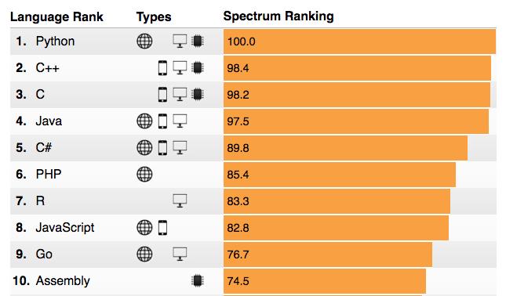

# IEEE Most popular programming languages of 2018

# Modules TS example

[Post](https://schneide.blog/2017/07/09/c-modules-example/)

# C++17: `std::apply`

* [CppReference](http://en.cppreference.com/w/cpp/utility/apply)

# C++17 in libsigc++ : `invoke`, `apply`, and `constexpr if`

* [Post](https://www.murrayc.com/permalink/2018/04/15/c17-in-libsigc-invoke-apply-and-constexpr-if/)
* [Code](https://github.com/libsigcplusplus/libsigcplusplus) (LGPL)
* [Docs](https://libsigcplusplus.github.io/libsigcplusplus/)

libsigc++ implements a typesafe callback system for standard C++. It allows you to define signals and to connect those signals to any callback function, either global or a member function, regardless of whether it is static or virtual.

# Variadic CRTP

* [Steve Dewhurst](http://stevedewhurst.com/once_weakly/once-weakly20170328/once-weakly20170328.pdf)
* [Jonathan Boccara](https://www.fluentcpp.com/2018/06/22/variadic-crtp-opt-in-for-class-features-at-compile-time/)
    * [Reddit thread](https://www.reddit.com/r/cpp/comments/8szpia/variadic_crtp_an_optin_for_class_features_at/)

# Quote

Tony Hoare:

> Concurrent programs wait faster.

# Twitter

