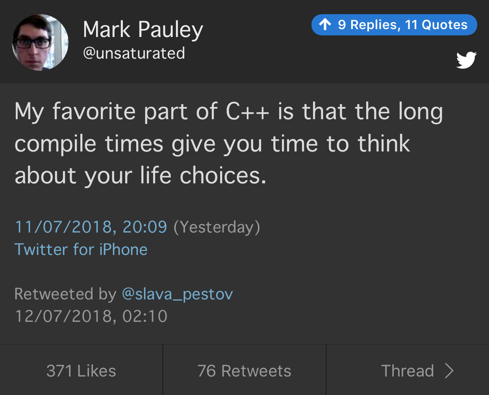

# Louis Brandy -- Curiously Recurring C++ Bugs at Facebook -- CppCon 2017

[Video](https://www.youtube.com/watch?v=3MB2iiCkGxg)

* `volatile` does not make your code thread-safe
* is `shared_ptr` thread-safe?
* `std::map::operator[]`

```cpp
auto& ref = *returns_a_shared_ptr();
ref.boom();
```

* use Address Sanitizer (`--fsanitize-address-use-after-scope`)

# Louis Brandy -- Curiously Recurring C++ Bugs at Facebook -- CppCon 2017

## Broken

```cpp
const string& get_default(
    const map<string, string>& map,
    const string& key,
    const string& dflt)
{
    auto pos = map.find(key);
    return pos != map.end() ? pos->second : dflt;
}
```

# Louis Brandy -- Curiously Recurring C++ Bugs at Facebook -- CppCon 2017

## Does this compile?

```cpp
#include <string>

void f() {
    std::string(foo);
}
```

# Louis Brandy -- Curiously Recurring C++ Bugs at Facebook -- CppCon 2017

## Does this compile?

```cpp
#include <string>

void f() {
    std::string(foo);
    std::string{foo};
}
```

# Louis Brandy -- Curiously Recurring C++ Bugs at Facebook -- CppCon 2017

## Problem

```cpp
void Object::update() noexcept {
    unique_lock<mutex>(m_mutex);
    do_update();
}
```

# Louis Brandy -- Curiously Recurring C++ Bugs at Facebook -- CppCon 2017

## Fix

```cpp
void Object::update() noexcept {
    unique_lock<mutex> lock(m_mutex);
    do_update();
}
```

# Quote

Tony Hoare:

> Concurrent programs wait faster.

# Twitter


