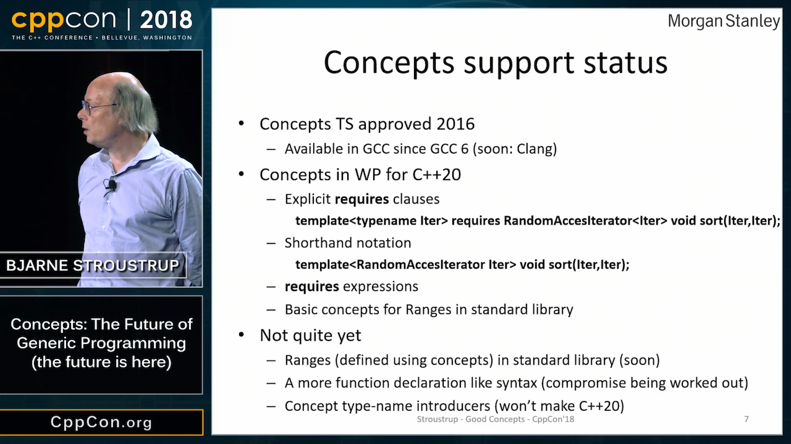
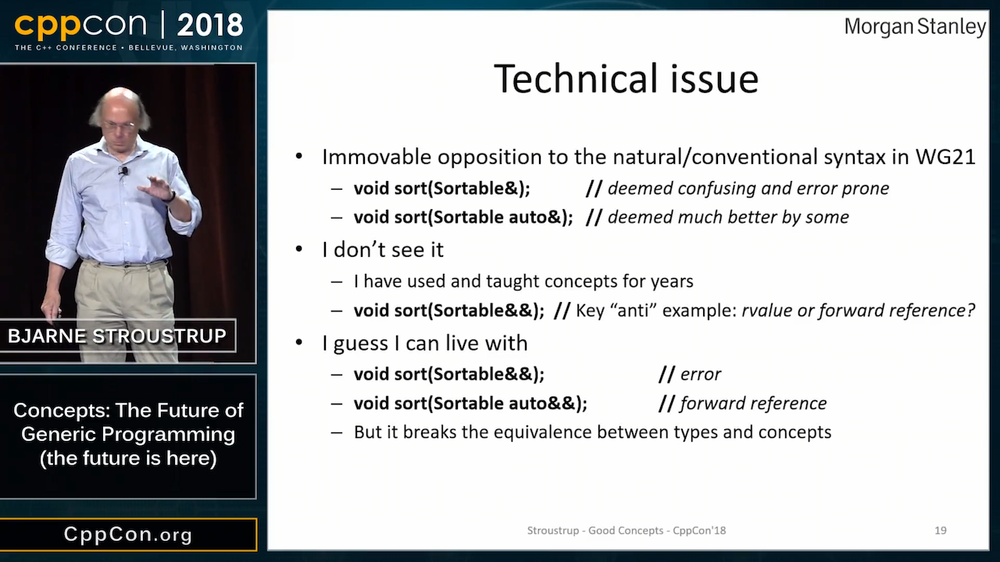
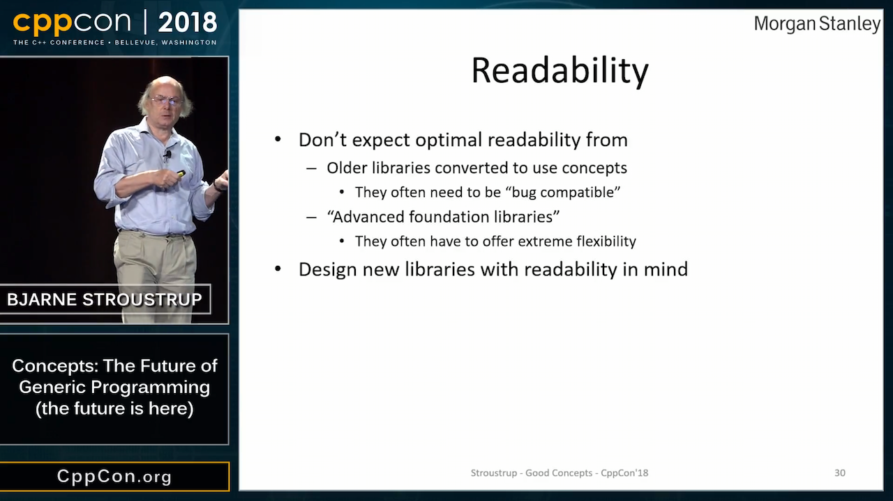
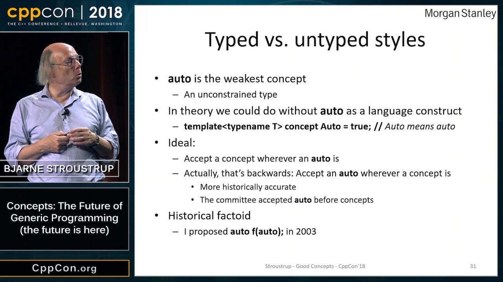
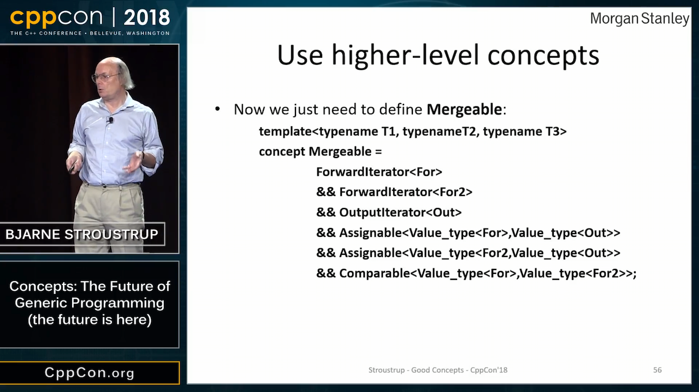

# C++ developers for hire

* Malar Linkeshwaran, London
* Jeremy Levine, New York

# CppCon 2018: Bjarne Stroustrup “Concepts: The Future of Generic Programming (the future is here)”

* [Video](https://www.youtube.com/watch?v=HddFGPTAmtU)
    * [Reddit](https://www.reddit.com/r/cpp/comments/9itcz6/cppcon_2018_bjarne_stroustrup_concepts_the_future/)
    * [Arthur O'Dwyer: Concepts as door-opening robots](https://quuxplusone.github.io/blog/2018/09/24/concepts-as-door-opening-robots/)

# CppCon 2018: Bjarne Stroustrup “Concepts: The Future of Generic Programming (the future is here)”



# CppCon 2018: Bjarne Stroustrup “Concepts: The Future of Generic Programming (the future is here)”


# CppCon 2018: Bjarne Stroustrup “Concepts: The Future of Generic Programming (the future is here)”



# CppCon 2018: Bjarne Stroustrup “Concepts: The Future of Generic Programming (the future is here)”



# CppCon 2018: Bjarne Stroustrup “Concepts: The Future of Generic Programming (the future is here)”



# CppCon 2018: Bjarne Stroustrup “Concepts: The Future of Generic Programming (the future is here)”


# CppCon 2018: Bjarne Stroustrup “Concepts: The Future of Generic Programming (the future is here)”


# CppCon 2018: Bjarne Stroustrup “Concepts: The Future of Generic Programming (the future is here)”


# CppCon 2018: Bjarne Stroustrup “Concepts: The Future of Generic Programming (the future is here)”


# CppCon 2018: Bjarne Stroustrup “Concepts: The Future of Generic Programming (the future is here)”


# CppCon 2018: Bjarne Stroustrup “Concepts: The Future of Generic Programming (the future is here)”



# CppCon 2018: Bjarne Stroustrup “Concepts: The Future of Generic Programming (the future is here)”


# C++ Antipathy

* [Video: CppCon 2018: Simplicity: Not Just For Beginners, by Kate Gregory](https://www.youtube.com/watch?v=n0Ak6xtVXno)
* [Hacker News](https://news.ycombinator.com/item?id=18095608)
* [Reddit](https://www.reddit.com/r/cpp/comments/9jwdpf/journeys_towards_c_antipathy/)

> I am genuinely curious about the passion of anti C++ commenters - could you comment on your journey towards your current antipathy towards C++? Did you use it and get burnt? What did you use it for? What were the short comings? How long did you use it for? When did you use it (ie which C++ standard version)?

# C++ Antipathy

* "Everything is so irredeemably hard"
* "Headers and package management is a total mess"
* "Rust will take over"
* "D avoids most C++ mistakes"
* "Backward compatibility is preventing progress"
* "Too many changes are being pushed by evangelists"
* "I still don't understand why people bother with template metaprogramming"
* "With every new version of the standard it gets more unwieldy, more difficult to use correctly"
* "I was falling back in love with C++ and then I read Scott Meyers' book"

# C++ Antipathy

> There has been something of a push towards a simpler style of C++, and the speaker (Kate Gregory) is one of the best at articulating how and why it can work.

* ["Honestly, C++ isn't _that_ bad"](https://www.reddit.com/r/cpp/comments/9jwdpf/journeys_towards_c_antipathy/e6vl8m0/)
* "Concepts should helpfully end (or reduce) the 30 year streak of insane error messages on template substitution failures."

# What would you strip out of C++ or change if backwards compatibility wasn't a concern?

[Reddit](https://www.reddit.com/r/cpp/comments/9k4cxa/what_would_you_strip_out_of_c_or_change_if/)

# Deterministic Disappointment, by Niall Douglas

* [Video](https://youtu.be/cbUTAoHy6Ls)
* [Slides](https://docs.google.com/presentation/d/1fSkpD51FKmy8VEO9P86jWN6tOEaBmzHOXo14zLRkFKE/edit#slide=id.p)
* [Niall's proposal N2289](http://www.open-std.org/jtc1/sc22/wg14/www/docs/n2289.pdf)

# Pointer-to-member-functions can be tricky

* [Post](http://www.elbeno.com/blog/?p=1575)
* [Snippet](https://godbolt.org/z/-juwda)
* [Raymond Chen: Pointers to member functions are very strange animals](https://blogs.msdn.microsoft.com/oldnewthing/20040209-00/?p=40713)

# Prepare thy Pitchforks: A De-facto Standard Project Layout

* [Early Reddit post](https://www.reddit.com/r/cpp/comments/996q8o/prepare_thy_pitchforks_a_de_facto_standard/)
* [Later Reddit post](https://www.reddit.com/r/cpp/comments/9eq46c/pitchforks_part_ii_project_layout_and_naming/)
* [Blog post](https://vector-of-bool.github.io/2018/09/16/layout-survey.html)
* [GitHub repo](https://github.com/vector-of-bool/pitchfork/blob/spec/data/spec.bs)

# Exploring C++ types with `puts(__PRETTY_FUNCTION__)`

* [Post](https://quuxplusone.github.io/blog/2018/08/22/puts-pretty-function/)
    - [Reddit](https://www.reddit.com/r/cpp/comments/99huzd/exploring_c_types_with_puts_pretty_function/)
    - [boost::core::typeinfo](https://www.boost.org/doc/libs/1_68_0/libs/core/doc/html/core/typeinfo.html)

```cpp
template<class T>
void f() {
    puts(__PRETTY_FUNCTION__); // __FUNCSIG__ in MSVC
}

#define EXPLORE(expr) \
    printf("decltype(" #expr ") is... "); \
    f<decltype(expr)>();
```

# Mutexes are passé

* [Post](http://stryku.pl/poetry/mutexes_are_passe.php)
    - [Reddit](https://www.reddit.com/r/cpp/comments/9dysnl/mutexes_are_pass%C3%A9/)

# Reimplementing NumPy in C++

* [NumCpp](https://github.com/dpilger26/NumCpp)
* [xtensor](https://xtensor.readthedocs.io/en/latest/numpy.html)

## Other linear algebra libraries

* [Blaze](https://bitbucket.org/blaze-lib/blaze)
* [Eigen](https://github.com/eigenteam/eigen-git-mirror)
    * [the official repo](https://bitbucket.org/eigen/eigen)
    * [docs](http://eigen.tuxfamily.org/index.php?title=Main_Page)

# Reboot Your Dreamliner Every 248 Days To Avoid Integer Overflow

* [Article](https://www.i-programmer.info/news/149-security/8548-reboot-your-dreamliner-every-248-days-to-avoid-integer-overflow.html)
    * [Reddit](https://www.reddit.com/r/programming/comments/9ctbvm/reboot_your_dreamliner_every_248_days_to_avoid/)

# Quote

David Wheeler:

> All problems in computer science can be solved by another level of indirection, except for the problem of too many layers of indirection.

# Twitter


# Twitter


# Twitter


