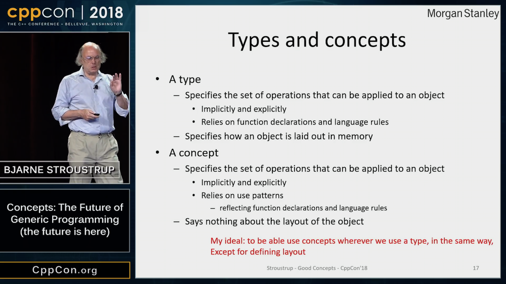
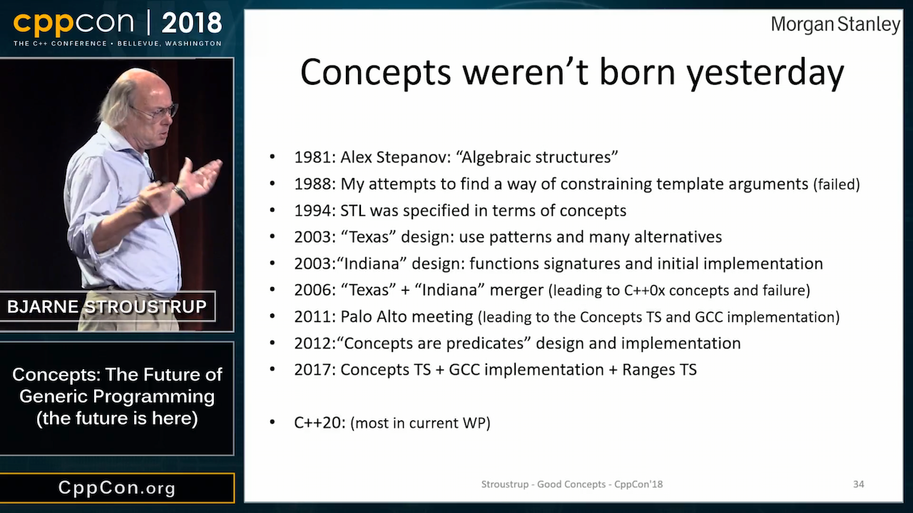
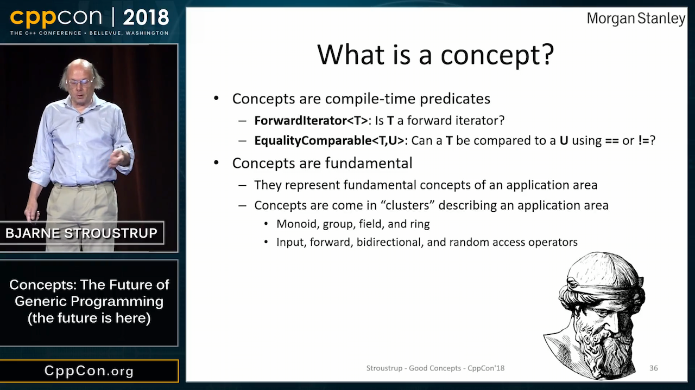
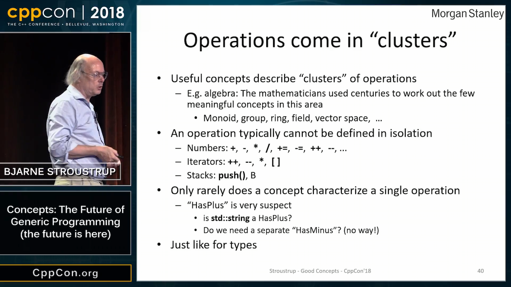
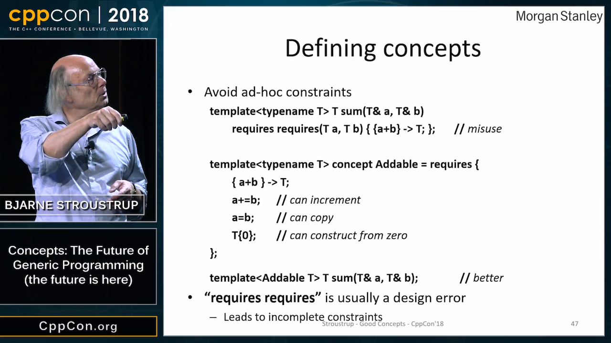
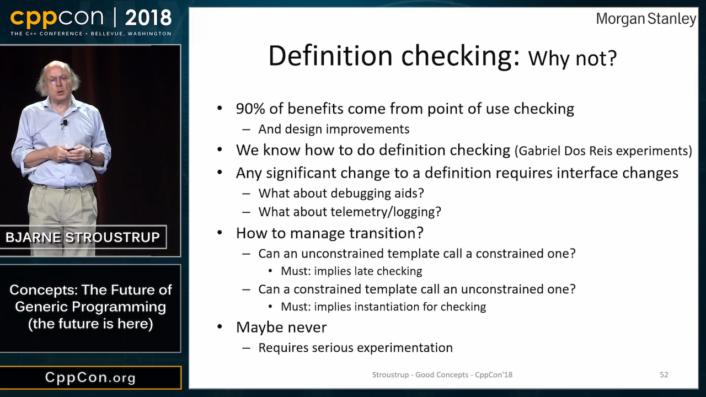
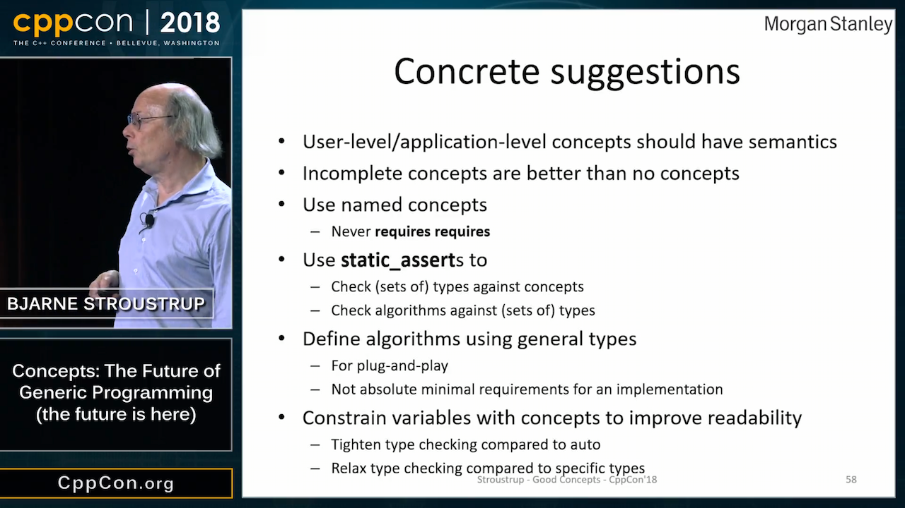

# C++ developers for hire

* Malar Linkeshwaran, London
* Jeremy Levine, New York

# CppCon 2018: Bjarne Stroustrup “Concepts: The Future of Generic Programming (the future is here)” (1/13)

* [Video](https://www.youtube.com/watch?v=HddFGPTAmtU)
    * [Reddit](https://www.reddit.com/r/cpp/comments/9itcz6/cppcon_2018_bjarne_stroustrup_concepts_the_future/)
    * [Arthur O'Dwyer: Concepts as door-opening robots](https://quuxplusone.github.io/blog/2018/09/24/concepts-as-door-opening-robots/)

# CppCon 2018: Bjarne Stroustrup “Concepts: The Future of Generic Programming (the future is here)” (2/13)

# CppCon 2018: Bjarne Stroustrup “Concepts: The Future of Generic Programming (the future is here)” (3/13)

# CppCon 2018: Bjarne Stroustrup “Concepts: The Future of Generic Programming (the future is here)” (4/13)

# CppCon 2018: Bjarne Stroustrup “Concepts: The Future of Generic Programming (the future is here)” (5/13)

# CppCon 2018: Bjarne Stroustrup “Concepts: The Future of Generic Programming (the future is here)” (6/13)

# CppCon 2018: Bjarne Stroustrup “Concepts: The Future of Generic Programming (the future is here)” (7/13)

# CppCon 2018: Bjarne Stroustrup “Concepts: The Future of Generic Programming (the future is here)” (8/13)

# CppCon 2018: Bjarne Stroustrup “Concepts: The Future of Generic Programming (the future is here)” (9/13)

# CppCon 2018: Bjarne Stroustrup “Concepts: The Future of Generic Programming (the future is here)” (10/13)

# CppCon 2018: Bjarne Stroustrup “Concepts: The Future of Generic Programming (the future is here)” (11/13)

# CppCon 2018: Bjarne Stroustrup “Concepts: The Future of Generic Programming (the future is here)” (12/13)

# CppCon 2018: Bjarne Stroustrup “Concepts: The Future of Generic Programming (the future is here)” (13/13)

# C++ Antipathy (1/3)

* [Video: CppCon 2018: Simplicity: Not Just For Beginners, by Kate Gregory](https://www.youtube.com/watch?v=n0Ak6xtVXno)
* [Hacker News](https://news.ycombinator.com/item?id=18095608)
* [Reddit](https://www.reddit.com/r/cpp/comments/9jwdpf/journeys_towards_c_antipathy/)

> I am genuinely curious about the passion of anti C++ commenters - could you comment on your journey towards your current antipathy towards C++? Did you use it and get burnt? What did you use it for? What were the short comings? How long did you use it for? When did you use it (ie which C++ standard version)?

# C++ Antipathy (2/3)

* "Everything is so irredeemably hard"
* "Headers and package management is a total mess"
* "Rust will take over"
* "D avoids most C++ mistakes"
* "Backward compatibility is preventing progress"
* "Too many changes are being pushed by evangelists"
* "I still don't understand why people bother with template metaprogramming"
* "With every new version of the standard it gets more unwieldy, more difficult to use correctly"
* "I was falling back in love with C++ and then I read Scott Meyers' book"

# C++ Antipathy (3/3)

> There has been something of a push towards a simpler style of C++, and the speaker (Kate Gregory) is one of the best at articulating how and why it can work.

* ["Honestly, C++ isn't _that_ bad"](https://www.reddit.com/r/cpp/comments/9jwdpf/journeys_towards_c_antipathy/e6vl8m0/)
* "Concepts should helpfully end (or reduce) the 30 year streak of insane error messages on template substitution failures."

# What would you strip out of C++ or change if backwards compatibility wasn't a concern?

[Reddit](https://www.reddit.com/r/cpp/comments/9k4cxa/what_would_you_strip_out_of_c_or_change_if/)

# Quote

David Wheeler:

> All problems in computer science can be solved by another level of indirection, except for the problem of too many layers of indirection.
