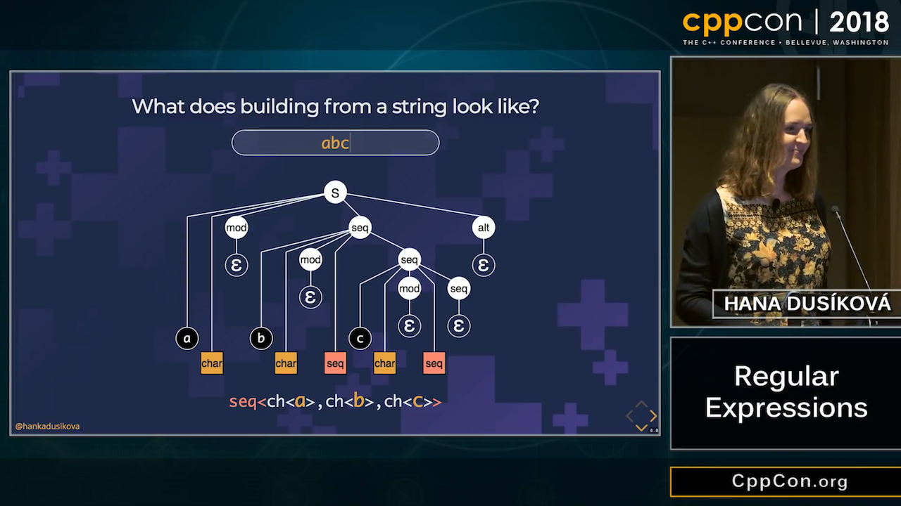
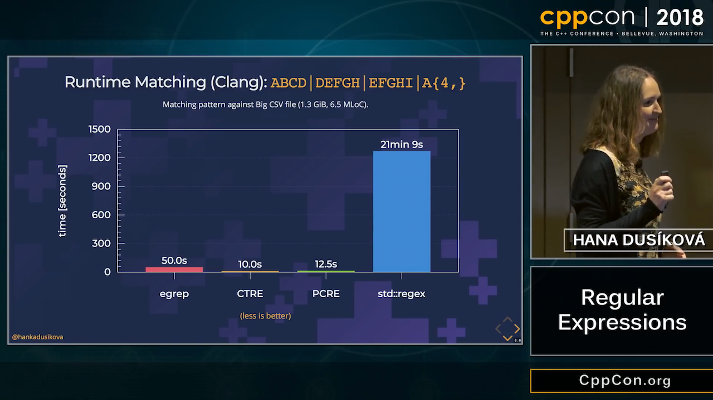
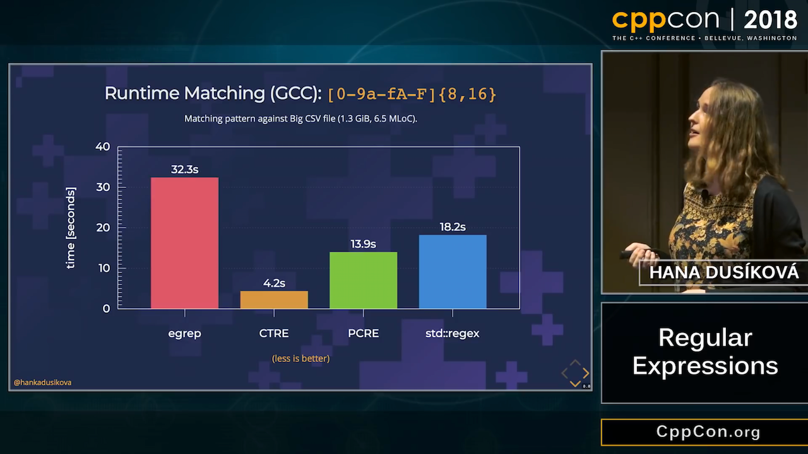
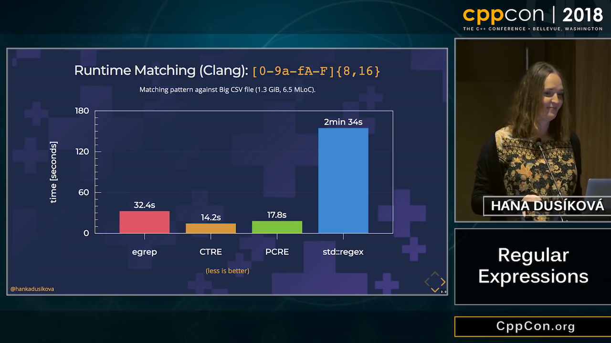
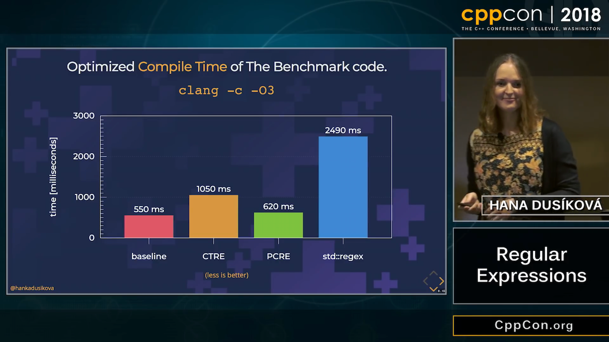

# Bjarne Stroustrup Interview at CppCon 2018

[Video](https://www.youtube.com/watch?v=UZPB9cf9FjM)

# CppCon 2018 Trip Reports

* [Mathieu Ropert](https://mropert.github.io/2018/10/14/cppcon2018/)
* [Anny Gakhokidze](https://annygakh.github.io/longblog/2018/10/14/cppcon2018tripReport.html)
    - with sketches and talk notes!

# CppCon 2018: Hana Dusíková - Compile-Time Regular Expressions (1/6)

* [Video](https://www.youtube.com/watch?v=dxww44YlSZ0)
    * [Reddit](https://www.reddit.com/r/cpp/comments/9nxxe1/cppcon_2018_hana_dus%C3%ADkov%C3%A1_regular_expressions/)
* [Slides](https://www.hanicka.net/ctre/)
* [GitHub](https://github.com/hanickadot/compile-time-regular-expressions) (MIT)
    - [P0732R0 Class Types in Non-Type Template Parameters](http://www.open-std.org/jtc1/sc22/wg21/docs/papers/2018/p0732r0.pdf)

# CppCon 2018: Hana Dusíková - Compile-Time Regular Expressions (2/6)



# CppCon 2018: Hana Dusíková - Compile-Time Regular Expressions (3/6)



# CppCon 2018: Hana Dusíková - Compile-Time Regular Expressions (4/6)



# CppCon 2018: Hana Dusíková - Compile-Time Regular Expressions (5/6)



# CppCon 2018: Hana Dusíková - Compile-Time Regular Expressions (6/6)



# Pre-San Diego Mailing

* [Papers](http://www.open-std.org/jtc1/sc22/wg21/docs/papers/2018/#mailing2018-10)
    - [Reddit](https://www.reddit.com/r/cpp/comments/9nvpfd/c_standards_committee_papers_201810_presan_diego/)

# Pre-San Diego: Modules

* [N4720: Working Draft, Extensions to C++ for Modules](http://www.open-std.org/jtc1/sc22/wg21/docs/papers/2018/n4720.pdf)
    - Gabriel Dos Reis, gdr@microsoft.com
* [P0581R1: Standard Library Modules](http://www.open-std.org/jtc1/sc22/wg21/docs/papers/2018/p0581r1.pdf)
    - Marshall Clow, Beman Dawes, Gabriel Dos Reis, Stephan T. Lavavej, Billy O'Neal, Bjarne Stroustrup, Jonathan Wakely
* [P0909R0: Module TS Supports Legacy Integration](http://www.open-std.org/jtc1/sc22/wg21/docs/papers/2018/p0909r0.html)
    - Steve Downey, sdowney2@bloomberg.net
* [P0877R0: Modular macros](http://www.open-std.org/jtc1/sc22/wg21/docs/papers/2018/p0877r0.html)
    - Bruno Cardoso Lopes, blopes@apple.com

# Pre-San Diego: Concept-constrained auto

* [P0915R0](http://www.open-std.org/jtc1/sc22/wg21/docs/papers/2018/p0915r0.html)
    - Vittorio Romeo <vittorio.romeo@outlook.com>, John Lakos <jlakos@bloomberg.net>

```cpp
template <typename T>
void foo(std::vector<T>& v)
{
    auto<RandomAccessIterator> it{std::begin(v)};
    // ...
}
```

# Pre-San Diego: A sane variant converting constructor

* [P0608R3](http://www.open-std.org/jtc1/sc22/wg21/docs/papers/2018/p0608r3.html)
    - Zhihao Yuan <zy@miator.net>
    - This paper proposes to constrain the variant converting constructor and the converting assignment operator to prevent narrowing conversions and conversions to `bool`.

```cpp
using T = variant<float, long>;
T v;
v = 0;    // what is stored in v: 1) float 2) long 3) ill-formed
```

# Pre-San Diego: Monadic operations for std::optional

* [P0798R2](http://www.open-std.org/jtc1/sc22/wg21/docs/papers/2018/p0798r2.html)
    - Simon Brand, simon.brand@microsoft.com

```cpp
std::optional<image> get_cute_cat (const image& img) {
    return crop_to_cat(img)
           .and_then(add_bow_tie)
           .and_then(make_eyes_sparkle)
           .map(make_smaller)
           .map(add_rainbow);
}
```

# Pre-San Diego: C++ Monadic interface

* [P0650R2](http://www.open-std.org/jtc1/sc22/wg21/docs/papers/2018/p0650r2.pdf)
    - Vicente J. Botet Escribá <vicente.botet@nokia.com>
* [p0323r5 std::expected](http://www.open-std.org/jtc1/sc22/wg21/docs/papers/2018/p0323r5.html)

# Pre-San Diego: Adding a workflow operator to C++

* [P1282R0](http://www.open-std.org/jtc1/sc22/wg21/docs/papers/2018/p1282r0.html)
    - Isabella Muerte <isabella.muerte@target.com>

```cpp
int total = accumulate { 0 } <| view::iota(1)
                             |> view::transform([](int x){return x*x;})
                             |> view::take(10);
```

# Pre-San Diego: Language Variants (1/2)

* [P0095R2](http://www.open-std.org/jtc1/sc22/wg21/docs/papers/2018/p0095r2.html)
    - David Sankel (<dsankel@bloomberg.net>)
    - Dan Sarginson (<dsarginson@bloomberg.net>)
    - Sergei Murzin (<smurzin@bloomberg.net>)

```cpp
lvariant command {
  std::size_t set_score; // Set the score to the specified value
  std::monostate fire_missile; // Fire a missile
  unsigned fire_laser; // Fire a laser with the specified intensity
  double rotate; // Rotate the ship by the specified degrees.
};
```

# Pre-San Diego: Language Variants (2/2)

```cpp
std::ostream& operator<<( std::ostream& stream, const command cmd ) {
  return inspect( cmd ) {
    set_score value =>
      stream << "Set the score to " << value << ".\n"
    fire_missile m =>
      stream << "Fire a missile.\n"
    fire_laser intensity:
      stream << "Fire a laser with " << intensity << " intensity.\n"
    rotate degrees =>
      stream << "Rotate by " << degrees << " degrees.\n"
  };
}
```

# Pre-San Diego: Pattern matching

* [P1308R0](http://www.open-std.org/jtc1/sc22/wg21/docs/papers/2018/p1308r0.html)
    - David Sankel (<dsankel@bloomberg.net>)
    - Dan Sarginson (<dsarginson@bloomberg.net>)
    - Sergei Murzin (<smurzin@bloomberg.net>)

```cpp
enum color { red, yellow, green, blue };
const Vec3 opengl_color =
  inspect(c) {
    red    => Vec3(1.0, 0.0, 0.0)
    yellow => Vec3(1.0, 1.0, 0.0)
    green  => Vec3(0.0, 1.0, 0.0)
    blue   => Vec3(0.0, 0.0, 1.0)
  };
```

* [P1260R0 (?)](http://www.open-std.org/jtc1/sc22/wg21/docs/papers/2018/p1260r0.pdf)

# Pre-San Diego: Reflection

* [N4766 C++ Extensions for reflection](http://www.open-std.org/jtc1/sc22/wg21/docs/papers/2018/n4766.pdf)
* [P0953R1 constexpr reflexpr](http://www.open-std.org/jtc1/sc22/wg21/docs/papers/2018/p0953r1.html)
* [P1240R0 Scalable Reflection in C++](http://www.open-std.org/jtc1/sc22/wg21/docs/papers/2018/p1240r0.pdf)
* [P1306R0 Expansion statements](http://www.open-std.org/jtc1/sc22/wg21/docs/papers/2018/p1306r0.pdf)

# Pre-San Diego: A polymorphic value‒type for C++

* [P0201R4](http://www.open-std.org/jtc1/sc22/wg21/docs/papers/2018/p0201r4.pdf)
    - Jonathan Coe (<jonathanbcoe@gmail.com>)
    - Sean Parent (<sparent@adobe.com>)

Add a class template, `polymorphic_value<T>`, to the standard library to support polymorphicobjects with value‒like semantics.

The class template, `polymorphic_value`, confers value‒like semantics on a free‒store allocated object. A `polymorphic_value<T>` may hold an object of a class publicly derived from `T`, and copying the `polymorphic_value<T>`will copy the object of the derived type.

# Pre-San Diego: A Unified Executors Proposal for C++

* [P0443R9](http://www.open-std.org/jtc1/sc22/wg21/docs/papers/2018/p0443r9.html)
    - Jared Hoberock, jhoberock@nvidia.com
    - Michael Garland, mgarland@nvidia.com
    - Chris Kohlhoff, chris@kohlhoff.com
    - Chris Mysen, mysen@google.com
    - Carter Edwards, hcedwar@sandia.gov
    - Gordon Brown, gordon@codeplay.com
* [P1244R0 Dependent Execution for a Unified Executors Proposal for C++](http://www.open-std.org/jtc1/sc22/wg21/docs/papers/2018/p1244r0.html)
* [P0797R1 Handling Concurrent Exceptions with Executors](http://www.open-std.org/jtc1/sc22/wg21/docs/papers/2018/p0797r1.pdf)
* [P1194 The Compromise Executors Proposal: A lazy simplification of P0443](http://www.open-std.org/jtc1/sc22/wg21/docs/papers/2018/p1194r0.html)
    - This paper seeks to add support for lazy task creation and deferred execution to P0443, while also simplifying the fundamental concepts involved in asynchronous execution.

# Pre-San Diego: Text Formatting

* [P0645R3](http://www.open-std.org/jtc1/sc22/wg21/docs/papers/2018/p0645r3.html)
    - Viktor Zverovich, victor.zverovich@gmail.com

This paper proposes a new text formatting library that can be used as a safe and extensible alternative to the printf family of functions. It is intended to complement the existing C++ I/O streams library and reuse some of its infrastructure such as overloaded insertion operators for user-defined types.

```cpp
string message = format("The answer is {}.", 42);
```

A full implementation of this proposal is available at [https://github.com/fmtlib/fmt/tree/std](https://github.com/fmtlib/fmt/tree/std).

# Pre-San Diego: Freestanding Proposal

* [P0829R3](http://www.open-std.org/jtc1/sc22/wg21/docs/papers/2018/p0829r3.html)
    - Ben Craig, ben.craig@gmail.com
    - "The current set of freestanding libraries provides too little to kernel and embedded programmers. I propose we provide the (nearly) maximal subset of the library that does not require an OS or space overhead."
* [P1105R1: Leaving no room for a lower-level language: A C++ Subset](http://www.open-std.org/jtc1/sc22/wg21/docs/papers/2018/p1105r1.html)
    - Making exceptions, dynamic RTTI, TLS, heap, floating point, program teardown, and blocking operations optional in freestanding mode.
* [P1212R0: Modules and Freestanding](http://www.open-std.org/jtc1/sc22/wg21/docs/papers/2018/p1212r0.html)
    - Standard library modules needs to know a direction for freestanding.

# Pre-San Diego: Down with _typename_!

* [P0634R2](http://www.open-std.org/jtc1/sc22/wg21/docs/papers/2018/p0634r2.html)
    - Nina Ranns, Daveed Vandevoorde

# Pre-San Diego: Parametric Functions (1/2)

* [P0671R1](http://www.open-std.org/jtc1/sc22/wg21/docs/papers/2018/p0671r1.html)
    - Axel Naumann (axel@cern.ch)

```cpp
double Gauss(double x, double mean = 0., double width = 1., double height = 1.);
Gauss(0.1, mean := 0., width := 2.);

// same as:

Gauss(0.1, 0., 2.);

// potential error:

Gauss(0.1, width := 2., age := 65.);
```

# Pre-San Diego: Parametric Functions (2/2)

* [P1229R0 Labelled Parameters](http://www.open-std.org/jtc1/sc22/wg21/docs/papers/2018/p1229r0.html)
    - Jorg Brown <jorg.brown@gmail.com>

```cpp
// declaration
void memcpy(to: char *, from: const char *, n: size_t);
// call site
memcpy(to: buf, from: in, n: bytes);
```

# Pre-San Diego: Signed size() functions

* [P1227R0](http://www.open-std.org/jtc1/sc22/wg21/docs/papers/2018/p1227r0.html)
    - Jorg Brown <jorg.brown@gmail.com>

```cpp
template <class C>
constexpr ptrdiff_t ssize(const C& c);

template <class T, ptrdiff_t N>
constexpr ptrdiff_t ssize(const T (&array)[N]) noexcept;
```

# Standard Library Algorithms: Changes and Additions in C++17

[VCBlog](https://blogs.msdn.microsoft.com/vcblog/2018/10/16/standard-library-algorithms-changes-and-additions-in-c17/)

# Who is STL? I mean the person, not the library

[Reddit](https://www.reddit.com/r/cpp/comments/9mwtcm/who_is_stl_i_mean_the_person_not_the_library/)

> Hey. I’m Stephan T. Lavavej (“Steh-fin Lah-wah-wade”), and I’ve worked on MSVC’s STL since 2007. I’ve also worked on several Standard proposals that were accepted (notably the transparent operator functors). I filmed a bunch of videos for MS’s Channel 9 years ago, introducing various Core Language and Standard Library topics, and I’ve given talks at C++Now (formerly BoostCon) and CppCon which have been recorded.

# Pointer-to-member-functions can be tricky

* [Post](http://www.elbeno.com/blog/?p=1575)
* [Snippet](https://godbolt.org/z/-juwda)
* [Raymond Chen: Pointers to member functions are very strange animals](https://blogs.msdn.microsoft.com/oldnewthing/20040209-00/?p=40713)

# Prepare thy Pitchforks: A De-facto Standard Project Layout

* [Early Reddit post](https://www.reddit.com/r/cpp/comments/996q8o/prepare_thy_pitchforks_a_de_facto_standard/)
* [Later Reddit post](https://www.reddit.com/r/cpp/comments/9eq46c/pitchforks_part_ii_project_layout_and_naming/)
* [Blog post](https://vector-of-bool.github.io/2018/09/16/layout-survey.html)
* [GitHub repo](https://github.com/vector-of-bool/pitchfork/blob/spec/data/spec.bs)

# Reimplementing NumPy in C++

* [NumCpp](https://github.com/dpilger26/NumCpp)
* [xtensor](https://xtensor.readthedocs.io/en/latest/numpy.html)

## Other linear algebra libraries

* [Blaze](https://bitbucket.org/blaze-lib/blaze)
* [Eigen](https://github.com/eigenteam/eigen-git-mirror)
    * [the official repo](https://bitbucket.org/eigen/eigen)
    * [docs](http://eigen.tuxfamily.org/index.php?title=Main_Page)

# Visual C++ Team Blog - std::any: How, when, and why

[Post](https://blogs.msdn.microsoft.com/vcblog/2018/10/04/stdany-how-when-and-why/)

> When you need to store an object of an arbitrary type, pull std::any out of your toolbox. Be aware that there are probably more appropriate tools available when you do know something about the type to be stored.

# C++ Best Practices, by Jason Turner

[GitHub](https://github.com/lefticus/cppbestpractices/blob/master/00-Table_of_Contents.md)

# Library: SQLite ORM

* [Code](https://github.com/fnc12/sqlite_orm)
    - Licence: BSD-2-Clause
    - C++14

# Library: Inja - a template engine for modern C++

* [Code](https://github.com/pantor/inja)
    - Licence: MIT
    - Header-only
    - Uses NLohmann's [JSON library](https://github.com/nlohmann/json/releases)
    - [Conan wrapper](https://github.com/DEGoodmanWilson/conan-inja)

```cpp
json data;
data["name"] = "world";
inja::render("Hello {{ name }}!", data); // Returns "Hello world!"
```

# Library: C++ REST SDK (formerly Casablanca) by Microsoft

* [Code](https://github.com/Microsoft/cpprestsdk)
    - Licence: MIT
    - C++11
    - Supports Windows, Linux, macOS, iOS, Android

> The C++ REST SDK is a Microsoft project for cloud-based client-server communication in native code using a modern asynchronous C++ API design. This project aims to help C++ developers connect to and interact with services.

# Library: Caffe2 - A New Lightweight, Modular, and Scalable Deep Learning Framework

* [Website](https://caffe2.ai/)
* [Code](https://github.com/caffe2/caffe2)
    - Licence: Apache-2.0

# Tool: Superluminal profiler for Windows

[Website](https://www.superluminal.eu/)

* Combines sampling and instrumentation
* Visualizes thread communication flow
* Kernel-level callstacks
* Dynamic filtering of areas of interest
* High frequency sampling (8 KHz)
* Timeline view, call graph, source view
* 7-day free trial, then EUR 99/149/289

# Conan, vcpkg or build2?

[Reddit](https://www.reddit.com/r/cpp/comments/9m4l0p/conan_vcpkg_or_build2/)

* Pragmatic choice: vcpkg or Conan (they work today and are complete enough)
* Pragmatic no-brainer choice: vcpkg (it's the simplest and it have more packages ready)
* Pragmatic but need finer control choice: Conan (it gives more options)
* (Very) Long term choice: Build2 (shows great promises because it uses a coherent model...)
* Ideal choice (from the future): help SG15 (the group reflecting on tools vs C++) define interfaces for build systems and dependency managers so that your choice is not impacted by your dependencies choices.

# Improving C++ Builds with Split DWARF

[Article](http://www.productive-cpp.com/improving-cpp-builds-with-split-dwarf/)

```bash
$ g++ -c -g -gsplit-dwarf main.cpp -o main.o
$ g++ main.o -o app
```

# Having some fun with higher-order functions

* [Article by Barry Revzin](https://medium.com/@barryrevzin/having-some-fun-with-higher-order-functions-e3e30ec69969)
* [Boost.HOF](https://www.boost.org/doc/libs/1_68_0/libs/hof/doc/html/doc/index.html#)

# Twitter


# Twitter


