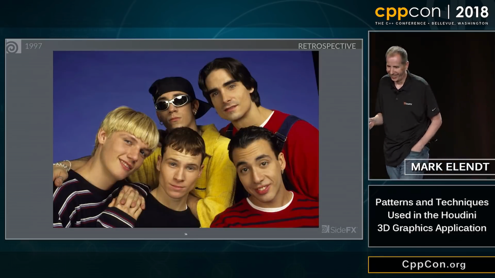

# Herb Sutter: Pre-trip report: Fall ISO C++ standards meeting (San Diego)

* [Post](https://herbsutter.com/2018/11/05/pre-trip-report-fall-iso-c-standards-meeting-san-diego/)
    - 173 unique names
    - 274 papers
    - New Study Groups: EWG Incubator (SG17, JF Bastien) and LEWG Incubator (SG18, Bryce AL)
    - SG12 “UB, Undefined/Unspecifed Behavior” (Gabriel Dos Reis)
    - SG13 “HMI, I/O” (Roger Orr) (Graphics proposal)
    - SG20 "Machine Learning" (chair TBD)
    - [1997 papers](http://open-std.org/JTC1/SC22/WG21/docs/papers/1997/)

# Jeremy Ong: Thoughts on the Cpp Graphics Proposal

* [Post](https://www.jeremyong.com/c++/graphics/2018/11/05/thoughs-on-the-cpp-graphics-proposal.html)
    - [Reddit](https://www.reddit.com/r/cpp/comments/9ulul0/thoughts_on_c_graphics/)

# CppCon 2018: Chandler Carruth “Spectre: Secrets, Side-Channels, Sandboxes, and Security” (1/9)

[Video](https://www.youtube.com/watch?v=_f7O3IfIR2k)


# CppCon 2018: Chandler Carruth “Spectre: Secrets, Side-Channels, Sandboxes, and Security” (2/9)


# CppCon 2018: Chandler Carruth “Spectre: Secrets, Side-Channels, Sandboxes, and Security” (3/9)


# CppCon 2018: Chandler Carruth “Spectre: Secrets, Side-Channels, Sandboxes, and Security” (4/9)


# CppCon 2018: Chandler Carruth “Spectre: Secrets, Side-Channels, Sandboxes, and Security” (5/9)


# CppCon 2018: Chandler Carruth “Spectre: Secrets, Side-Channels, Sandboxes, and Security” (6/9)


# CppCon 2018: Chandler Carruth “Spectre: Secrets, Side-Channels, Sandboxes, and Security” (7/9)


# CppCon 2018: Chandler Carruth “Spectre: Secrets, Side-Channels, Sandboxes, and Security” (8/9)


# CppCon 2018: Chandler Carruth “Spectre: Secrets, Side-Channels, Sandboxes, and Security” (9/9)


# CppCon 2018: Mark Elendt “Patterns and Techniques Used in the Houdini 3D Graphics Application” (1/13)

[Video](https://www.youtube.com/watch?v=2YXwg0n9e7E)


# CppCon 2018: Mark Elendt “Patterns and Techniques Used in the Houdini 3D Graphics Application” (2/13)


# CppCon 2018: Mark Elendt “Patterns and Techniques Used in the Houdini 3D Graphics Application” (3/13)


# CppCon 2018: Mark Elendt “Patterns and Techniques Used in the Houdini 3D Graphics Application” (4/13)


# CppCon 2018: Mark Elendt “Patterns and Techniques Used in the Houdini 3D Graphics Application” (5/13)


# CppCon 2018: Mark Elendt “Patterns and Techniques Used in the Houdini 3D Graphics Application” (6/13)



# CppCon 2018: Mark Elendt “Patterns and Techniques Used in the Houdini 3D Graphics Application” (7/13)


# CppCon 2018: Mark Elendt “Patterns and Techniques Used in the Houdini 3D Graphics Application” (8/13)


# CppCon 2018: Mark Elendt “Patterns and Techniques Used in the Houdini 3D Graphics Application” (9/13)


# CppCon 2018: Mark Elendt “Patterns and Techniques Used in the Houdini 3D Graphics Application” (10/13)


# CppCon 2018: Mark Elendt “Patterns and Techniques Used in the Houdini 3D Graphics Application” (11/13)


# CppCon 2018: Mark Elendt “Patterns and Techniques Used in the Houdini 3D Graphics Application” (12/13)


# CppCon 2018: Mark Elendt “Patterns and Techniques Used in the Houdini 3D Graphics Application” (13/13)


# Standard Library Algorithms: Changes and Additions in C++17

[VCBlog](https://blogs.msdn.microsoft.com/vcblog/2018/10/16/standard-library-algorithms-changes-and-additions-in-c17/)

# Who is STL? I mean the person, not the library

[Reddit](https://www.reddit.com/r/cpp/comments/9mwtcm/who_is_stl_i_mean_the_person_not_the_library/)

> Hey. I’m Stephan T. Lavavej (“Steh-fin Lah-wah-wade”), and I’ve worked on MSVC’s STL since 2007. I’ve also worked on several Standard proposals that were accepted (notably the transparent operator functors). I filmed a bunch of videos for MS’s Channel 9 years ago, introducing various Core Language and Standard Library topics, and I’ve given talks at C++Now (formerly BoostCon) and CppCon which have been recorded.

# Pointer-to-member-functions can be tricky

* [Post](http://www.elbeno.com/blog/?p=1575)
* [Snippet](https://godbolt.org/z/-juwda)
* [Raymond Chen: Pointers to member functions are very strange animals](https://blogs.msdn.microsoft.com/oldnewthing/20040209-00/?p=40713)

# Prepare thy Pitchforks: A De-facto Standard Project Layout

* [Early Reddit post](https://www.reddit.com/r/cpp/comments/996q8o/prepare_thy_pitchforks_a_de_facto_standard/)
* [Later Reddit post](https://www.reddit.com/r/cpp/comments/9eq46c/pitchforks_part_ii_project_layout_and_naming/)
* [Blog post](https://vector-of-bool.github.io/2018/09/16/layout-survey.html)
* [GitHub repo](https://github.com/vector-of-bool/pitchfork/blob/spec/data/spec.bs)

# Reimplementing NumPy in C++

* [NumCpp](https://github.com/dpilger26/NumCpp)
* [xtensor](https://xtensor.readthedocs.io/en/latest/numpy.html)

## Other linear algebra libraries

* [Blaze](https://bitbucket.org/blaze-lib/blaze)
* [Eigen](https://github.com/eigenteam/eigen-git-mirror)
    * [the official repo](https://bitbucket.org/eigen/eigen)
    * [docs](http://eigen.tuxfamily.org/index.php?title=Main_Page)

# Visual C++ Team Blog - std::any: How, when, and why

[Post](https://blogs.msdn.microsoft.com/vcblog/2018/10/04/stdany-how-when-and-why/)

> When you need to store an object of an arbitrary type, pull std::any out of your toolbox. Be aware that there are probably more appropriate tools available when you do know something about the type to be stored.

# C++ Best Practices, by Jason Turner

[GitHub](https://github.com/lefticus/cppbestpractices/blob/master/00-Table_of_Contents.md)

# Library: SQLite ORM

* [Code](https://github.com/fnc12/sqlite_orm)
    - Licence: BSD-2-Clause
    - C++14

# Library: Inja - a template engine for modern C++

* [Code](https://github.com/pantor/inja)
    - Licence: MIT
    - Header-only
    - Uses NLohmann's [JSON library](https://github.com/nlohmann/json/releases)
    - [Conan wrapper](https://github.com/DEGoodmanWilson/conan-inja)

```cpp
json data;
data["name"] = "world";
inja::render("Hello {{ name }}!", data); // Returns "Hello world!"
```

# Library: C++ REST SDK (formerly Casablanca) by Microsoft

* [Code](https://github.com/Microsoft/cpprestsdk)
    - Licence: MIT
    - C++11
    - Supports Windows, Linux, macOS, iOS, Android

> The C++ REST SDK is a Microsoft project for cloud-based client-server communication in native code using a modern asynchronous C++ API design. This project aims to help C++ developers connect to and interact with services.

# Library: Caffe2 - A New Lightweight, Modular, and Scalable Deep Learning Framework

* [Website](https://caffe2.ai/)
* [Code](https://github.com/caffe2/caffe2)
    - Licence: Apache-2.0

# Tool: Superluminal profiler for Windows

[Website](https://www.superluminal.eu/)

* Combines sampling and instrumentation
* Visualizes thread communication flow
* Kernel-level callstacks
* Dynamic filtering of areas of interest
* High frequency sampling (8 KHz)
* Timeline view, call graph, source view
* 7-day free trial, then EUR 99/149/289

# Conan, vcpkg or build2?

[Reddit](https://www.reddit.com/r/cpp/comments/9m4l0p/conan_vcpkg_or_build2/)

* Pragmatic choice: vcpkg or Conan (they work today and are complete enough)
* Pragmatic no-brainer choice: vcpkg (it's the simplest and it have more packages ready)
* Pragmatic but need finer control choice: Conan (it gives more options)
* (Very) Long term choice: Build2 (shows great promises because it uses a coherent model...)
* Ideal choice (from the future): help SG15 (the group reflecting on tools vs C++) define interfaces for build systems and dependency managers so that your choice is not impacted by your dependencies choices.

# Improving C++ Builds with Split DWARF

[Article](http://www.productive-cpp.com/improving-cpp-builds-with-split-dwarf/)

```bash
$ g++ -c -g -gsplit-dwarf main.cpp -o main.o
$ g++ main.o -o app
```

# Having some fun with higher-order functions

* [Article by Barry Revzin](https://medium.com/@barryrevzin/having-some-fun-with-higher-order-functions-e3e30ec69969)
* [Boost.HOF](https://www.boost.org/doc/libs/1_68_0/libs/hof/doc/html/doc/index.html#)

# Compile-time raytracer by Tristan Brindle

* [Code](https://github.com/tcbrindle/raytracer.hpp)
    - [Reddit](https://www.reddit.com/r/cpp/comments/9t2q0t/simple_compiletime_raytracer_using_c17/)

# Iterators: What Must Be Done?

* [Article](https://infektor.net/posts/2018-11-03-iterators-what-must-be-done.html)

# Twitter


# Twitter


