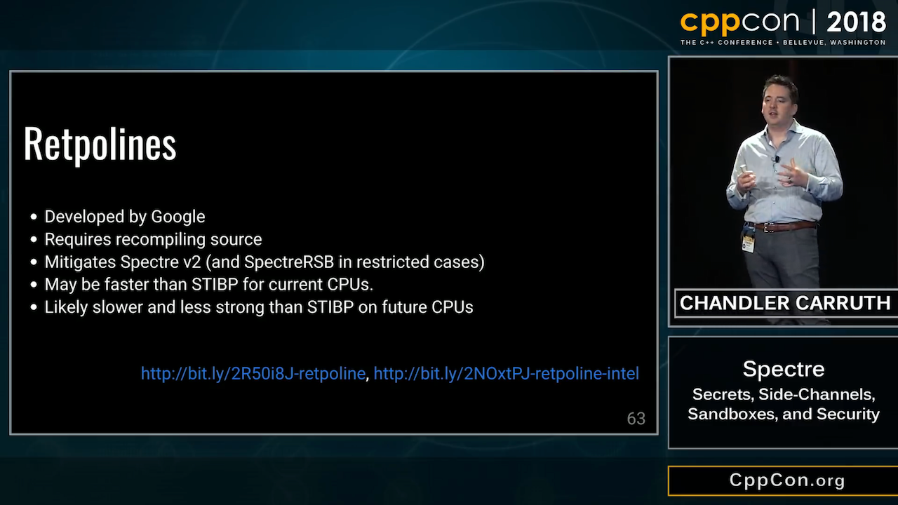
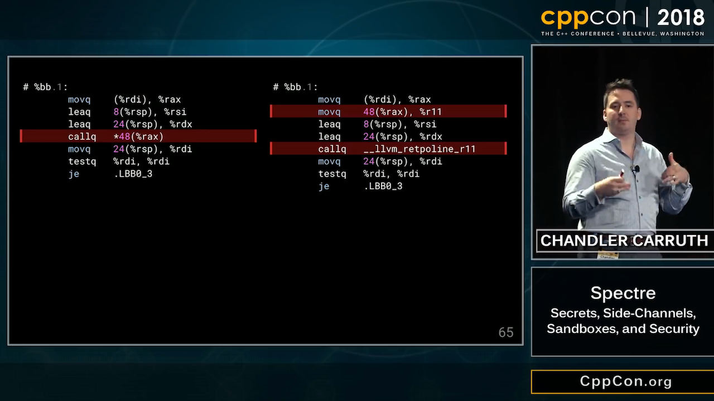
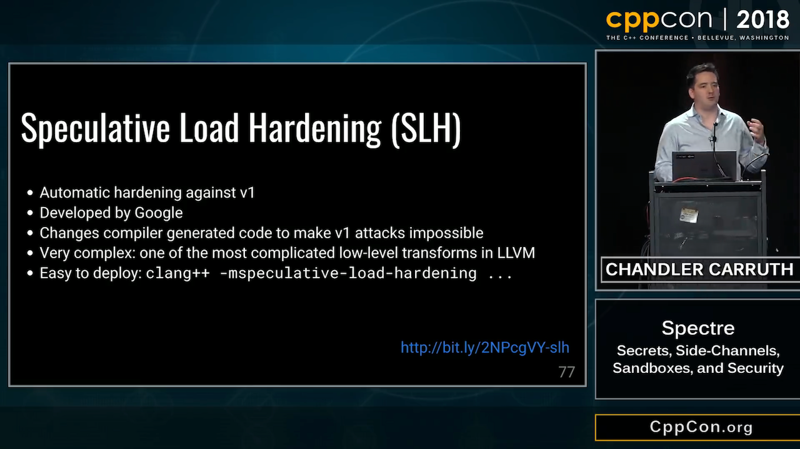
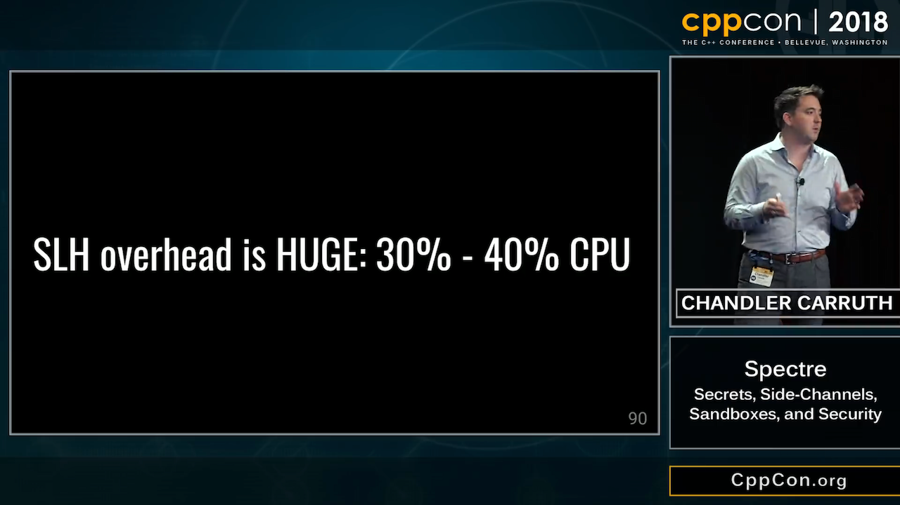
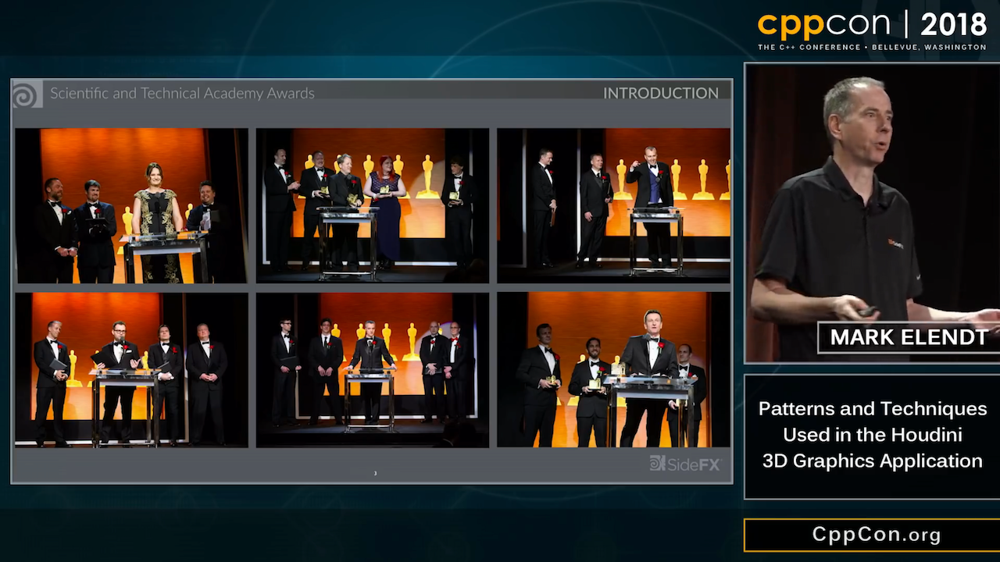
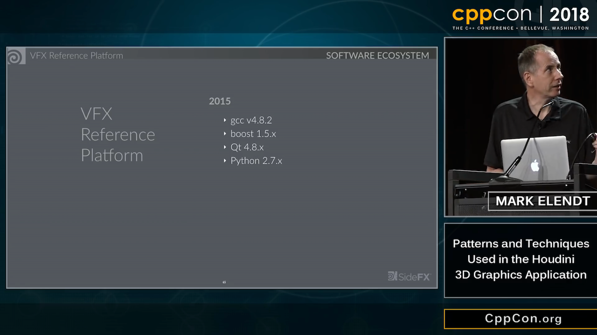
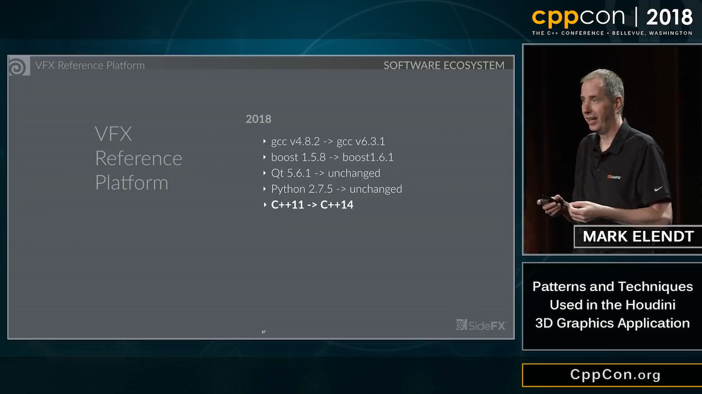
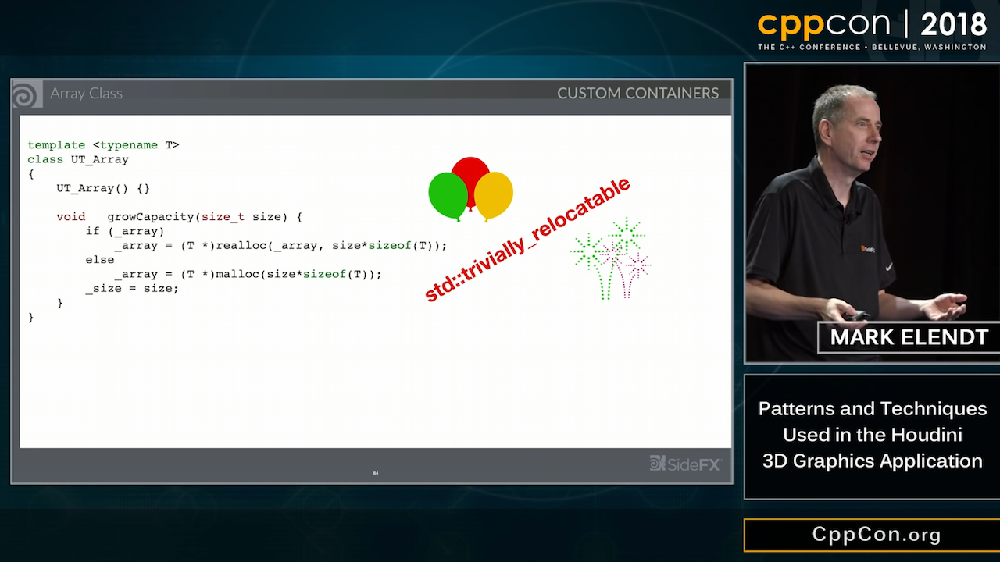
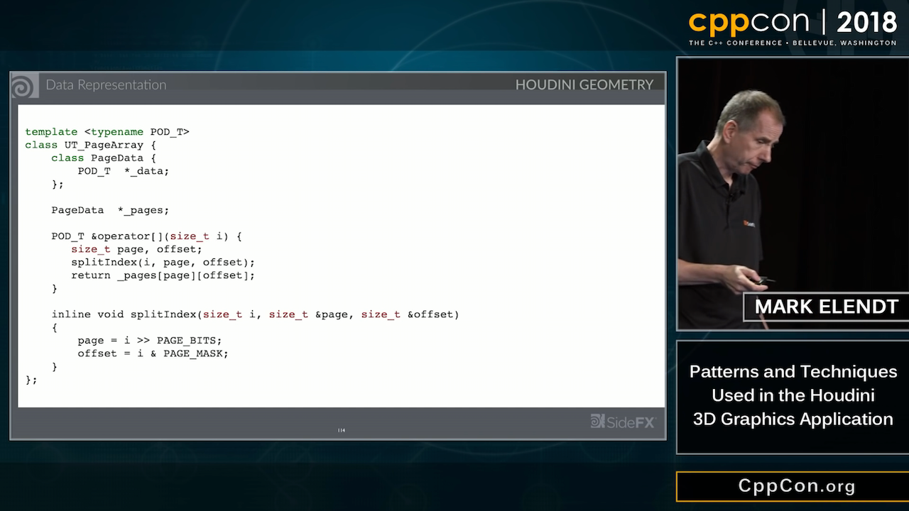

# San Diego trip reports

* [Ben Craig](https://www.reddit.com/r/cpp/comments/9xr4b5/trip_report_freestanding_in_san_diego/)
* [Corentin Jabot](https://cor3ntin.github.io/posts/sandiego/)
    - [Reddit](https://www.reddit.com/r/cpp/comments/9xva89/san_diego_committee_meeting_a_trip_report/)
* [René Rivera](https://robot-dreams.net/2018/11/14/2018-cppsan-wg21-trip-report/)
* [CppCast with Ashley Hedberg](http://cppcast.com/2018/11/ashley-hedberg/)

# CppCon 2018 Trip Reports

[JeanHeyd Meneide](https://thephd.github.io/cppcon-2018-trip-report)

> The Jerk Problem is a very simple one: the larger community seems to value technical excellence over all other values. This means that decency – and being polite during such things as discussion or evaluation – is optional. This is how a lot of people conducted themselves: being successful / making money / having influence somehow justifies their ability to be complete blockheads.

Also:

> Nobody believes I have dark skin ever when they see my videos or meet me. And for some people, that’s a good surprise (but still a problem). Other people think it’s a bad idea I’m here to begin with, which is much more of a problem.

# Better template support and error detection in C++ Modules with MSVC 2017 version 15.9

[VC Blog](https://blogs.msdn.microsoft.com/vcblog/2018/11/27/better-template-support-and-error-detection-in-c-modules-with-msvc-2017-version-15-9/)

# CLion 2018.3

* [What's New](https://www.jetbrains.com/clion/whatsnew/#v2018-3)

# C++17

* [Viva64: C++17 Refresher](https://www.viva64.com/en/b/0533/)
* [VCBlog: Standard Library Algorithms: Changes and Additions in C++17](https://blogs.msdn.microsoft.com/vcblog/2018/10/16/standard-library-algorithms-changes-and-additions-in-c17/)

# CppCon 2018: Chandler Carruth “Spectre: Secrets, Side-Channels, Sandboxes, and Security” (1/9)

[Video](https://www.youtube.com/watch?v=_f7O3IfIR2k)


# CppCon 2018: Chandler Carruth “Spectre: Secrets, Side-Channels, Sandboxes, and Security” (2/9)



# CppCon 2018: Chandler Carruth “Spectre: Secrets, Side-Channels, Sandboxes, and Security” (3/9)


# CppCon 2018: Chandler Carruth “Spectre: Secrets, Side-Channels, Sandboxes, and Security” (4/9)



# CppCon 2018: Chandler Carruth “Spectre: Secrets, Side-Channels, Sandboxes, and Security” (5/9)


# CppCon 2018: Chandler Carruth “Spectre: Secrets, Side-Channels, Sandboxes, and Security” (6/9)



# CppCon 2018: Chandler Carruth “Spectre: Secrets, Side-Channels, Sandboxes, and Security” (7/9)



# CppCon 2018: Chandler Carruth “Spectre: Secrets, Side-Channels, Sandboxes, and Security” (8/9)


# CppCon 2018: Chandler Carruth “Spectre: Secrets, Side-Channels, Sandboxes, and Security” (9/9)


# Meltdown, Spectre etc.

* [Matt Klein](https://medium.com/@mattklein123/meltdown-spectre-explained-6bc8634cc0c2)
* [Graham Sutherland via Frank Denneman](http://frankdenneman.nl/2018/01/05/explainer-spectre-meltdown-graham-sutherland/)

# Hardware Effects

> This repository demonstrates various hardware effects that can degrade application performance in surprising ways and that may be very hard to explain without knowledge of the low-level CPU and OS architecture. For each effect I try to create a proof of concept program that is as small as possible so that it can be understood easily.

* [GitHub](https://github.com/Kobzol/hardware-effects) -- [Reddit](https://www.reddit.com/r/cpp/comments/9y98l5/set_of_c_programs_that_demonstrate_hardware/)
    - Demonstrates: bandwidth saturation, branch misprediction, branch target misprediction, cache aliasing, cache/memory hierarchy bandwidth, data dependencies, denormal floating point numbers, false sharing, hardware prefetching, memory-bound program, non-temporal stores, software prefetching, write combining.

# CppCon 2018: Mark Elendt “Patterns and Techniques Used in the Houdini 3D Graphics Application” (1/13)

[Video](https://www.youtube.com/watch?v=2YXwg0n9e7E)



# CppCon 2018: Mark Elendt “Patterns and Techniques Used in the Houdini 3D Graphics Application” (2/13)


# CppCon 2018: Mark Elendt “Patterns and Techniques Used in the Houdini 3D Graphics Application” (3/13)


# CppCon 2018: Mark Elendt “Patterns and Techniques Used in the Houdini 3D Graphics Application” (4/13)


# CppCon 2018: Mark Elendt “Patterns and Techniques Used in the Houdini 3D Graphics Application” (5/13)


# CppCon 2018: Mark Elendt “Patterns and Techniques Used in the Houdini 3D Graphics Application” (6/13)


# CppCon 2018: Mark Elendt “Patterns and Techniques Used in the Houdini 3D Graphics Application” (7/13)


# CppCon 2018: Mark Elendt “Patterns and Techniques Used in the Houdini 3D Graphics Application” (8/13)



# CppCon 2018: Mark Elendt “Patterns and Techniques Used in the Houdini 3D Graphics Application” (9/13)


# CppCon 2018: Mark Elendt “Patterns and Techniques Used in the Houdini 3D Graphics Application” (10/13)



# CppCon 2018: Mark Elendt “Patterns and Techniques Used in the Houdini 3D Graphics Application” (11/13)



# CppCon 2018: Mark Elendt “Patterns and Techniques Used in the Houdini 3D Graphics Application” (12/13)


# CppCon 2018: Mark Elendt “Patterns and Techniques Used in the Houdini 3D Graphics Application” (13/13)



# Package management is hard, let's mine some Bitcoin (1/2)

|

# Package management is hard, let's mine some Bitcoin (2/2)

* [Issue on GitHub "I don't know what to say"](https://github.com/dominictarr/event-stream/issues/116)
* [Details on the npm blog](https://blog.npmjs.org/post/180565383195/details-about-the-event-stream-incident)
* [event-stream vulnerability explained](https://schneid.io/blog/event-stream-vulnerability-explained/)
* [Bleeping Computer](https://www.bleepingcomputer.com/news/security/backdoor-in-popular-javascript-library-set-to-steal-cryptocurrency/)
* [Exploiting developer infrastructure is insanely easy](https://medium.com/@jsoverson/exploiting-developer-infrastructure-is-insanely-easy-9849937e81d4)
* [The Node.js Ecosystem Is Chaotic and Insecure](https://medium.com/commitlog/the-internet-is-at-the-mercy-of-a-handful-of-people-73fac4bc5068)

# Who is STL? I mean the person, not the library

[Reddit](https://www.reddit.com/r/cpp/comments/9mwtcm/who_is_stl_i_mean_the_person_not_the_library/)

> Hey. I’m Stephan T. Lavavej (“Steh-fin Lah-wah-wade”), and I’ve worked on MSVC’s STL since 2007. I’ve also worked on several Standard proposals that were accepted (notably the transparent operator functors). I filmed a bunch of videos for MS’s Channel 9 years ago, introducing various Core Language and Standard Library topics, and I’ve given talks at C++Now (formerly BoostCon) and CppCon which have been recorded.

# Real world problems with #pragma once?

[Reddit](https://www.reddit.com/r/cpp/comments/a14o5q/real_world_problems_with_pragma_once/)

> No.

Corentin Jabot:

> Pragma once leads to UB if part of the sources are visible from several included paths which are hardlink of each others.
>
> Good. If you do that, you deserve to suffer!

# Pointer-to-member-functions can be tricky

* [Post](http://www.elbeno.com/blog/?p=1575)
* [Snippet](https://godbolt.org/z/-juwda)
* [Raymond Chen: Pointers to member functions are very strange animals](https://blogs.msdn.microsoft.com/oldnewthing/20040209-00/?p=40713)

# Prepare thy Pitchforks: A De-facto Standard Project Layout

* [Early Reddit post](https://www.reddit.com/r/cpp/comments/996q8o/prepare_thy_pitchforks_a_de_facto_standard/)
* [Later Reddit post](https://www.reddit.com/r/cpp/comments/9eq46c/pitchforks_part_ii_project_layout_and_naming/)
* [Blog post](https://vector-of-bool.github.io/2018/09/16/layout-survey.html)
* [GitHub repo](https://github.com/vector-of-bool/pitchfork/blob/spec/data/spec.bs)

# Reimplementing NumPy in C++

* [NumCpp](https://github.com/dpilger26/NumCpp)
* [xtensor](https://xtensor.readthedocs.io/en/latest/numpy.html)

## Other linear algebra libraries

* [Blaze](https://bitbucket.org/blaze-lib/blaze)
* [Eigen](https://github.com/eigenteam/eigen-git-mirror)
    * [the official repo](https://bitbucket.org/eigen/eigen)
    * [docs](http://eigen.tuxfamily.org/index.php?title=Main_Page)

# Visual C++ Team Blog - std::any: How, when, and why

[Post](https://blogs.msdn.microsoft.com/vcblog/2018/10/04/stdany-how-when-and-why/)

> When you need to store an object of an arbitrary type, pull std::any out of your toolbox. Be aware that there are probably more appropriate tools available when you do know something about the type to be stored.

# C++ Best Practices, by Jason Turner

[GitHub](https://github.com/lefticus/cppbestpractices/blob/master/00-Table_of_Contents.md)

# Library: SQLite ORM

SQLite ORM light header only library for modern C++

* [Code](https://github.com/fnc12/sqlite_orm) (BSD-2-Clause)
    - C++14
    - No raw string queries
    - CRUD support; pure select query support
    - Custom types binding support
    - Supports: `BLOB` - maps to `std::vector<char>` or a custom type; `FOREIGN KEY`; composite keys;
`JOIN`; transactions; `ORDER BY` and `LIMIT`, `OFFSET`, `GROUP BY` / `DISTINCT`, `INDEX`, `COLLATE`
    - Migration functionality
    - The only dependency - **libsqlite3**
    - No undefined behaviour - if something goes wrong lib throws an exception
    - In-memory database support - provide `:memory:` or empty filename

# Library: Inja - a template engine for modern C++

* [Code](https://github.com/pantor/inja)
    - Licence: MIT
    - Header-only
    - Uses NLohmann's [JSON library](https://github.com/nlohmann/json/releases)
    - [Conan wrapper](https://github.com/DEGoodmanWilson/conan-inja)

```cpp
json data;
data["name"] = "world";
inja::render("Hello {{ name }}!", data); // Returns "Hello world!"
```

# Library: C++ REST SDK (formerly Casablanca) by Microsoft

* [Code](https://github.com/Microsoft/cpprestsdk)
    - Licence: MIT
    - C++11
    - Supports Windows, Linux, macOS, iOS, Android

> The C++ REST SDK is a Microsoft project for cloud-based client-server communication in native code using a modern asynchronous C++ API design. This project aims to help C++ developers connect to and interact with services.

# Library: Caffe2 - A New Lightweight, Modular, and Scalable Deep Learning Framework

* [Website](https://caffe2.ai/)
* [Code](https://github.com/caffe2/caffe2)
    - Licence: Apache-2.0

# Tool: Superluminal profiler for Windows

[Website](https://www.superluminal.eu/)

* Combines sampling and instrumentation
* Visualizes thread communication flow
* Kernel-level callstacks
* Dynamic filtering of areas of interest
* High frequency sampling (8 KHz)
* Timeline view, call graph, source view
* 7-day free trial, then EUR 99/149/289

# Conan, vcpkg or build2?

[Reddit](https://www.reddit.com/r/cpp/comments/9m4l0p/conan_vcpkg_or_build2/)

* Pragmatic choice: vcpkg or Conan (they work today and are complete enough)
* Pragmatic no-brainer choice: vcpkg (it's the simplest and it have more packages ready)
* Pragmatic but need finer control choice: Conan (it gives more options)
* (Very) Long term choice: Build2 (shows great promises because it uses a coherent model...)
* Ideal choice (from the future): help SG15 (the group reflecting on tools vs C++) define interfaces for build systems and dependency managers so that your choice is not impacted by your dependencies choices.

# Improving C++ Builds with Split DWARF

[Article](http://www.productive-cpp.com/improving-cpp-builds-with-split-dwarf/)

```bash
$ g++ -c -g -gsplit-dwarf main.cpp -o main.o
$ g++ main.o -o app
```

# Having some fun with higher-order functions

* [Article by Barry Revzin](https://medium.com/@barryrevzin/having-some-fun-with-higher-order-functions-e3e30ec69969)
* [Boost.HOF](https://www.boost.org/doc/libs/1_68_0/libs/hof/doc/html/doc/index.html#)

# Compile-time raytracer by Tristan Brindle

* [Code](https://github.com/tcbrindle/raytracer.hpp)
    - [Reddit](https://www.reddit.com/r/cpp/comments/9t2q0t/simple_compiletime_raytracer_using_c17/)

# Iterators: What Must Be Done?

* [Article](https://infektor.net/posts/2018-11-03-iterators-what-must-be-done.html)

# Quote

Andrey Mokhov (@andreymokhov) via Twitter:

> Inside every large program there is a small build system struggling to get out.

# Twitter


# Twitter


