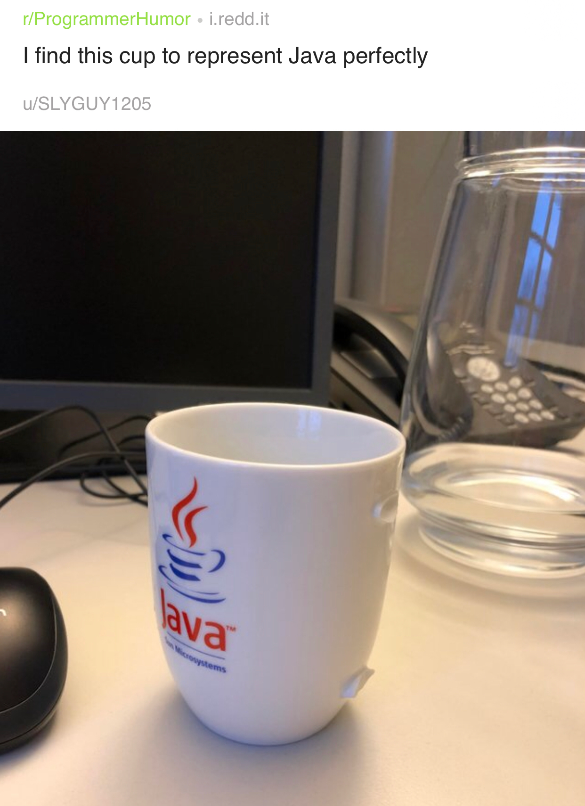

# The arrow operator

Thanks to Martin Waplington:

```cpp
struct A { void foo(); };
struct B { A* operator->(); };
struct C { B operator->(); };
struct D { C operator->(); };
int main() {
    D d;
    d->foo();
}
```

# Library: SQLite ORM

SQLite ORM light header only library for modern C++

* [Code](https://github.com/fnc12/sqlite_orm) (BSD-2-Clause)
    - C++14
    - No raw string queries
    - CRUD support; pure select query support
    - Custom types binding support
    - Supports: `BLOB` - maps to `std::vector<char>` or a custom type; `FOREIGN KEY`; composite keys;
`JOIN`; transactions; `ORDER BY` and `LIMIT`, `OFFSET`, `GROUP BY` / `DISTINCT`, `INDEX`, `COLLATE`
    - Migration functionality
    - The only dependency - **libsqlite3**
    - No undefined behaviour - if something goes wrong lib throws an exception
    - In-memory database support - provide `:memory:` or empty filename

# Library: Inja - a template engine for modern C++

* [Code](https://github.com/pantor/inja)
    - Licence: MIT
    - Header-only
    - Uses NLohmann's [JSON library](https://github.com/nlohmann/json/releases)
    - [Conan wrapper](https://github.com/DEGoodmanWilson/conan-inja)

```cpp
json data;
data["name"] = "world";
inja::render("Hello {{ name }}!", data); // Returns "Hello world!"
```

# Library: C++ REST SDK (formerly Casablanca) by Microsoft

* [Code](https://github.com/Microsoft/cpprestsdk)
    - Licence: MIT
    - C++11
    - Supports Windows, Linux, macOS, iOS, Android

> The C++ REST SDK is a Microsoft project for cloud-based client-server communication in native code using a modern asynchronous C++ API design. This project aims to help C++ developers connect to and interact with services.

# Library: Caffe2 - A New Lightweight, Modular, and Scalable Deep Learning Framework

* [Website](https://caffe2.ai/)
* [Code](https://github.com/caffe2/caffe2)
    - Licence: Apache-2.0

# Tool: Superluminal profiler for Windows

[Website](https://www.superluminal.eu/)

* Combines sampling and instrumentation
* Visualizes thread communication flow
* Kernel-level callstacks
* Dynamic filtering of areas of interest
* High frequency sampling (8 KHz)
* Timeline view, call graph, source view
* 7-day free trial, then EUR 99/149/289

# Conan, vcpkg or build2?

[Reddit](https://www.reddit.com/r/cpp/comments/9m4l0p/conan_vcpkg_or_build2/)

* Pragmatic choice: vcpkg or Conan (they work today and are complete enough)
* Pragmatic no-brainer choice: vcpkg (it's the simplest and it have more packages ready)
* Pragmatic but need finer control choice: Conan (it gives more options)
* (Very) Long term choice: Build2 (shows great promises because it uses a coherent model...)
* Ideal choice (from the future): help SG15 (the group reflecting on tools vs C++) define interfaces for build systems and dependency managers so that your choice is not impacted by your dependencies choices.

# Improving C++ Builds with Split DWARF

[Article](http://www.productive-cpp.com/improving-cpp-builds-with-split-dwarf/)

```bash
$ g++ -c -g -gsplit-dwarf main.cpp -o main.o
$ g++ main.o -o app
```

# Having some fun with higher-order functions

* [Article by Barry Revzin](https://medium.com/@barryrevzin/having-some-fun-with-higher-order-functions-e3e30ec69969)
* [Boost.HOF](https://www.boost.org/doc/libs/1_68_0/libs/hof/doc/html/doc/index.html#)

# Compile-time raytracer by Tristan Brindle

* [Code](https://github.com/tcbrindle/raytracer.hpp)
    - [Reddit](https://www.reddit.com/r/cpp/comments/9t2q0t/simple_compiletime_raytracer_using_c17/)

# Iterators: What Must Be Done?

* [Article](https://infektor.net/posts/2018-11-03-iterators-what-must-be-done.html)

# Reddit


