# Bjarne Stroustrup on CppChat

* [YouTube](https://www.youtube.com/watch?v=OF7xbz8fWPg)
    - education
    - The Standards Committee
    - C++20 and beyond

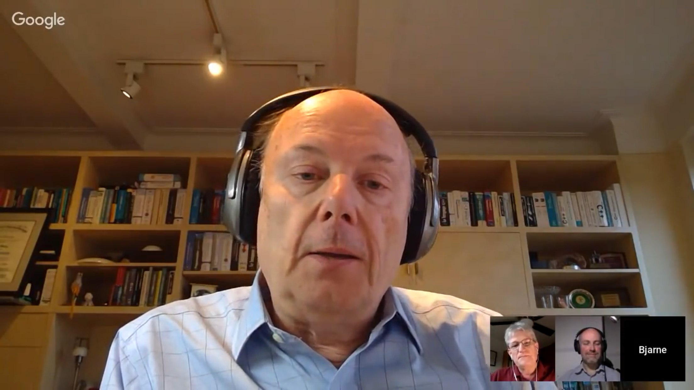

# Matt Godbolt on CppChat

* [YouTube](https://www.youtube.com/watch?v=4KiqKjb0OzY)
    - Compiler Explorer, contributors, infrastructure
    - Tools —> LLVM MCA (machine code analyser), Clang Tidy, PAHole
    - Patched compiler versions to explore new features
    - Code execution is coming
    - Undefined behaviour

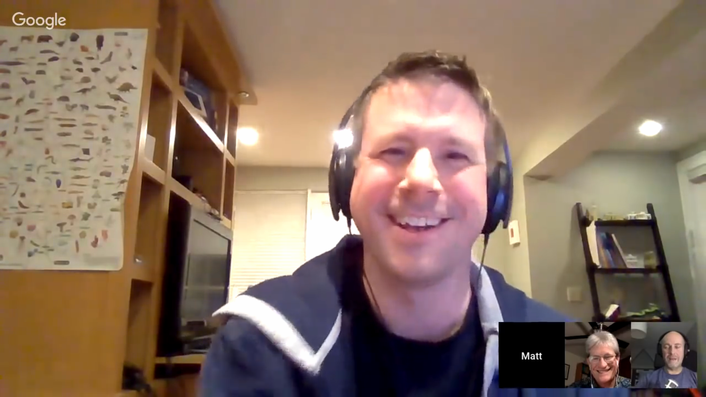

# C++Now 2018: Matt Godbolt - What else has compiler done for me lately? (1/7)

[YouTube](https://youtu.be/nAbCKa0FzjQ)

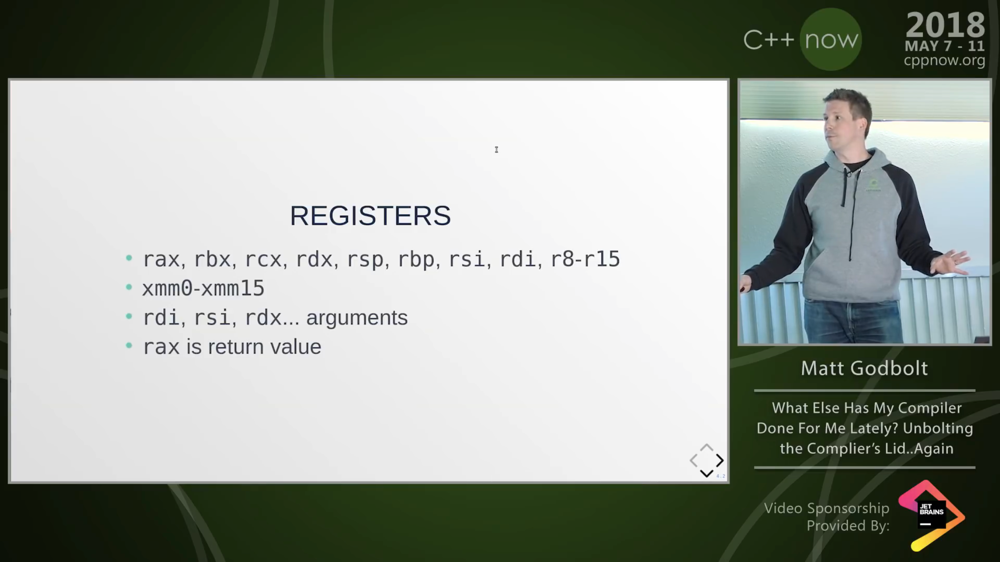

# C++Now 2018: Matt Godbolt - What else has compiler done for me lately? (2/7)

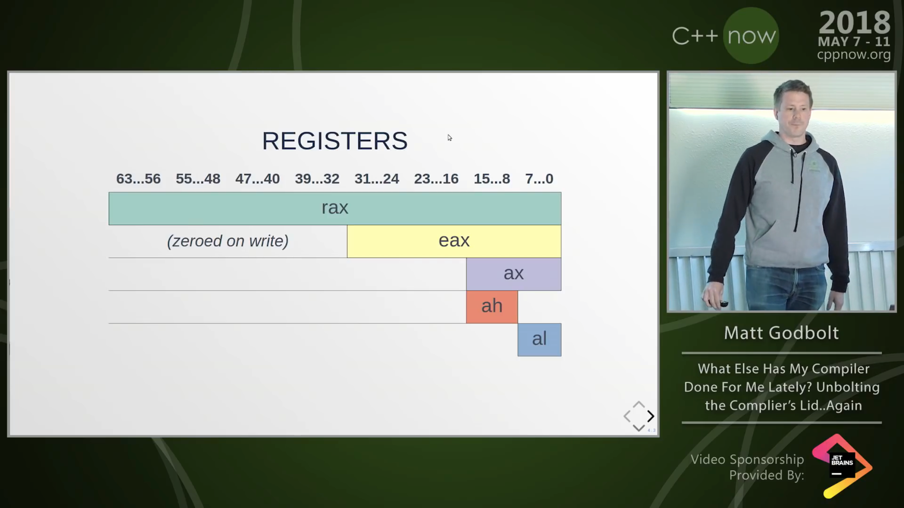

# C++Now 2018: Matt Godbolt - What else has compiler done for me lately? (3/7)

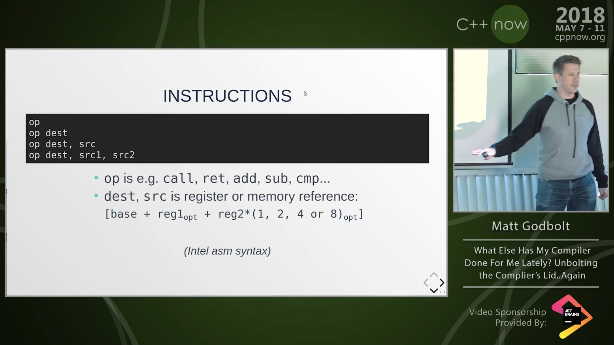

# C++Now 2018: Matt Godbolt - What else has compiler done for me lately? (4/7)

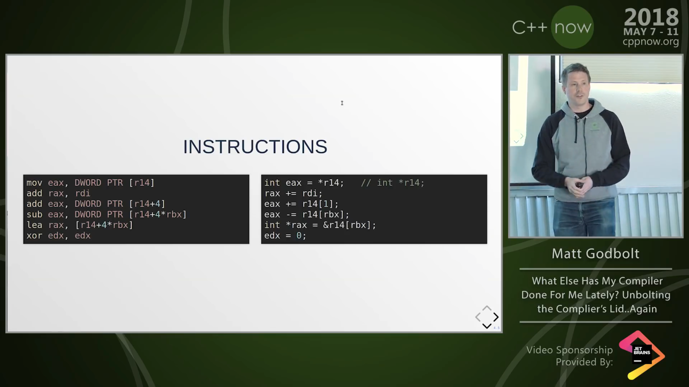

# C++Now 2018: Matt Godbolt - What else has compiler done for me lately? (5/7)

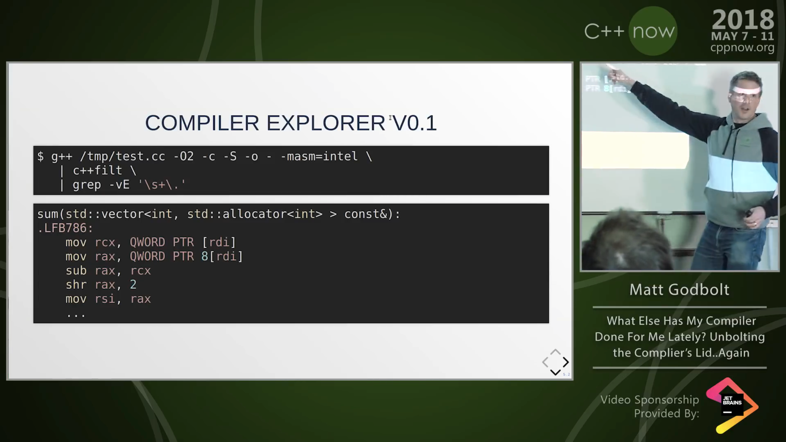

# C++Now 2018: Matt Godbolt - What else has compiler done for me lately? (6/7)

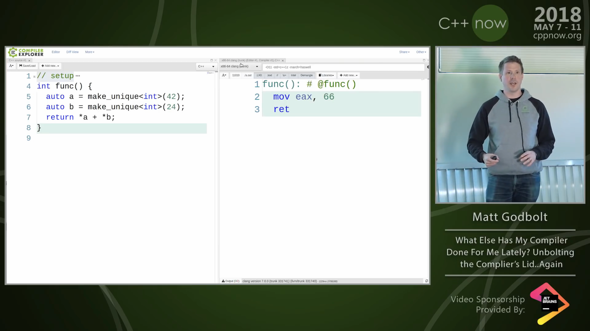

# C++Now 2018: Matt Godbolt - What else has compiler done for me lately? (7/7)

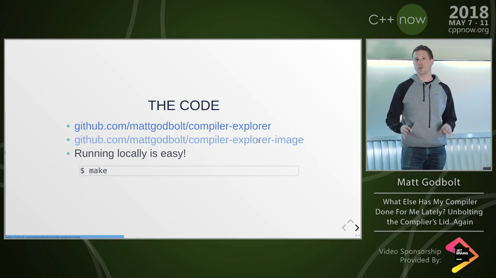

* [GitHub](https://github.com/mattgodbolt/compiler-explorer)
    - [Image](https://github.com/mattgodbolt/compiler-explorer-image)

# IntelliCode in Visual C++

* [VCBlog](https://blogs.msdn.microsoft.com/vcblog/2018/12/05/cppintellicode/)
* [YouTube](https://www.youtube.com/watch?v=Y5Els11sY1A)
    - Uses [SFML: Simple and Fast Multimedia Library](https://www.sfml-dev.org/)

> IntelliCode uses machine learning to train over thousands of real-world projects including open-source projects on GitHub. As such, IntelliCode will be most helpful when using common libraries such as STL. Based on this training, IntelliCode saves your time by putting what you’re most likely to use at the top of your IntelliSense completion list.

# VS2019 Preview

* [Release notes](https://docs.microsoft.com/en-us/visualstudio/releases/2019/release-notes-preview#-c)
    - [Live Share](https://visualstudio.microsoft.com/services/live-share/)
        + [Blog post](https://blogs.msdn.microsoft.com/vcblog/2018/12/04/cppliveshare/)
        + [Reddit](https://www.reddit.com/r/cpp/comments/a3er25/announcing_live_share_for_c_realtime_sharing_and/)

# CLion 2019 Roadmap

* [Blog post](https://blog.jetbrains.com/clion/2018/12/moving-into-2019-clion-roadmap/)

# IKOS static analyzer from NASA

* [GitHub](https://github.com/NASA-SW-VnV/ikos)
    - [Reddit announcement](https://www.reddit.com/r/C_Programming/comments/a5a5nc/ikos_21_an_open_source_static_analyzer_for_c_and_c/)

IKOS is a **sound** static analyzer for C and C++ based on LLVM, developed at NASA.

Here, **sound** means that it is mathematically correct and cannot miss a bug, thanks to the theory of Abstract Interpretation. The counterpart is that it might produce false positives.

IKOS checks for a lot of undefined behaviors, such as buffer overflows, divisions by zero and so on. The full list is available [here](https://github.com/NASA-SW-VnV/ikos/blob/master/analyzer/README.md#checks). The list is somewhat similar to UBSan checks.

# Concepts

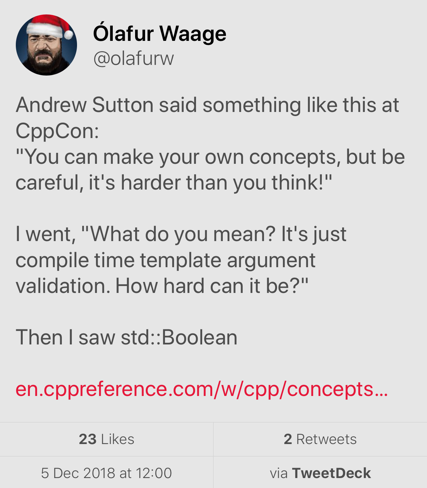

[`std::Boolean` concept](https://en.cppreference.com/w/cpp/concepts/Boolean)

# Standard Ranges, by Eric Niebler

* [Blog post](http://ericniebler.com/2018/12/05/standard-ranges/)

> Ranges got merged and will be part of C++20. This is huge news and represents probably the biggest shift the Standard Library has seen since it was first standardized way back in 1998.

# Library: SQLite ORM

SQLite ORM light header only library for modern C++

* [Code](https://github.com/fnc12/sqlite_orm) (BSD-2-Clause)
    - C++14
    - No raw string queries
    - CRUD support; pure select query support
    - Custom types binding support
    - Supports: `BLOB` - maps to `std::vector<char>` or a custom type; `FOREIGN KEY`; composite keys;
`JOIN`; transactions; `ORDER BY` and `LIMIT`, `OFFSET`, `GROUP BY` / `DISTINCT`, `INDEX`, `COLLATE`
    - Migration functionality
    - The only dependency - **libsqlite3**
    - No undefined behaviour - if something goes wrong lib throws an exception
    - In-memory database support - provide `:memory:` or empty filename

# Library: Inja - a template engine for modern C++

* [Code](https://github.com/pantor/inja)
    - Licence: MIT
    - Header-only
    - Uses NLohmann's [JSON library](https://github.com/nlohmann/json/releases)
    - [Conan wrapper](https://github.com/DEGoodmanWilson/conan-inja)

```cpp
json data;
data["name"] = "world";
inja::render("Hello {{ name }}!", data); // Returns "Hello world!"
```

# Library: C++ REST SDK (formerly Casablanca) by Microsoft

* [Code](https://github.com/Microsoft/cpprestsdk)
    - Licence: MIT
    - C++11
    - Supports Windows, Linux, macOS, iOS, Android

> The C++ REST SDK is a Microsoft project for cloud-based client-server communication in native code using a modern asynchronous C++ API design. This project aims to help C++ developers connect to and interact with services.

# Library: Caffe2 - A New Lightweight, Modular, and Scalable Deep Learning Framework

* [Website](https://caffe2.ai/)
* [Code](https://github.com/caffe2/caffe2)
    - Licence: Apache-2.0

# Tool: Superluminal profiler for Windows

[Website](https://www.superluminal.eu/)

* Combines sampling and instrumentation
* Visualizes thread communication flow
* Kernel-level callstacks
* Dynamic filtering of areas of interest
* High frequency sampling (8 KHz)
* Timeline view, call graph, source view
* 7-day free trial, then EUR 99/149/289

# Twitter

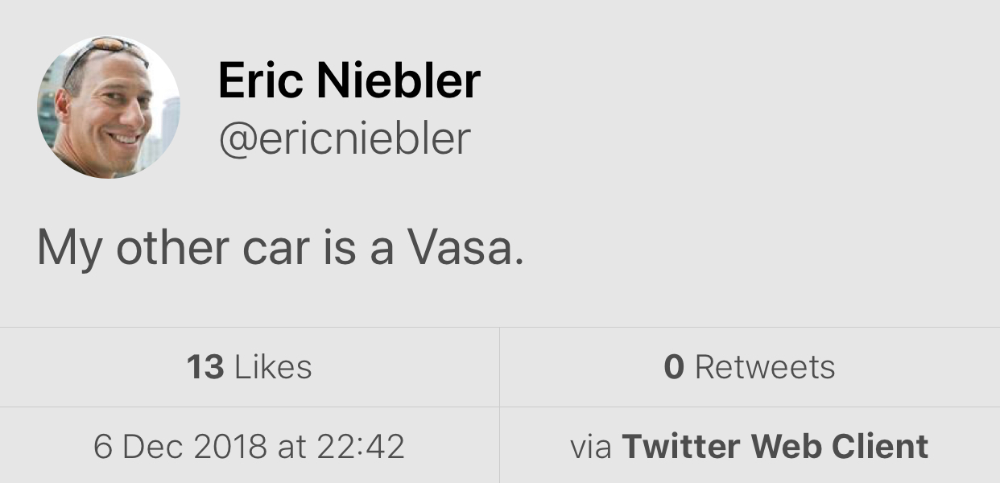

# Reddit


