# Guaranteed Copy Elision Does Not Elide Copies

[VCBlog post by Simon Brand](https://blogs.msdn.microsoft.com/vcblog/2018/12/11/guaranteed-copy-elision-does-not-elide-copies/) :: [Reddit](https://www.reddit.com/r/cpp/comments/a57q05/guaranteed_copy_elision_does_not_elide_copies/)

Continuing the theme of C++ misnomers, value categories are not categories of values; they are characteristics of expressions.

1. A *glvalue* (generalized lvalue) is an expression whose evaluation determines the identity of an object, bit-field, or function.
2. A *prvalue* is an expression whose evaluation initializes an object or a bit-field, or computes the value of an operand of an operator, as specified by the context in which it appears.
3. An *xvalue* is a glvalue that denotes an object or bit-field whose resources can be reused (usually because it is near the end of its lifetime).
4. An *lvalue* is a glvalue that is not an xvalue.
5. An *rvalue* is a prvalue or an xvalue.

> That’s a better name for this feature. Not guaranteed copy elision. **Deferred temporary materialization**.

# CppCon 2018: Victor Ciura: Enough string_view to Hang Ourselves (1/8)

[YouTube](https://www.youtube.com/watch?v=xwP4YCP_0q0)

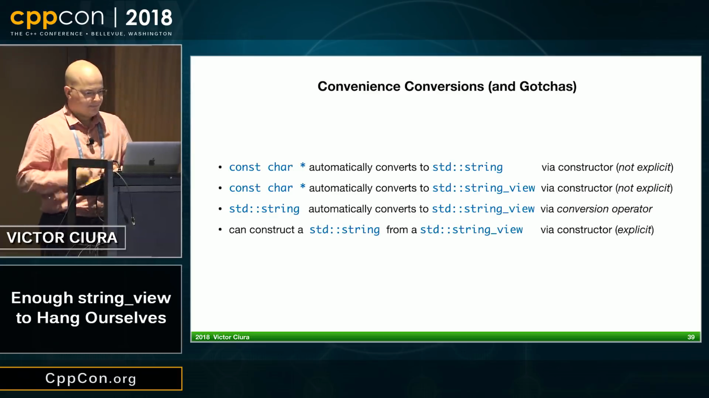

# CppCon 2018: Victor Ciura: Enough string_view to Hang Ourselves (2/8)

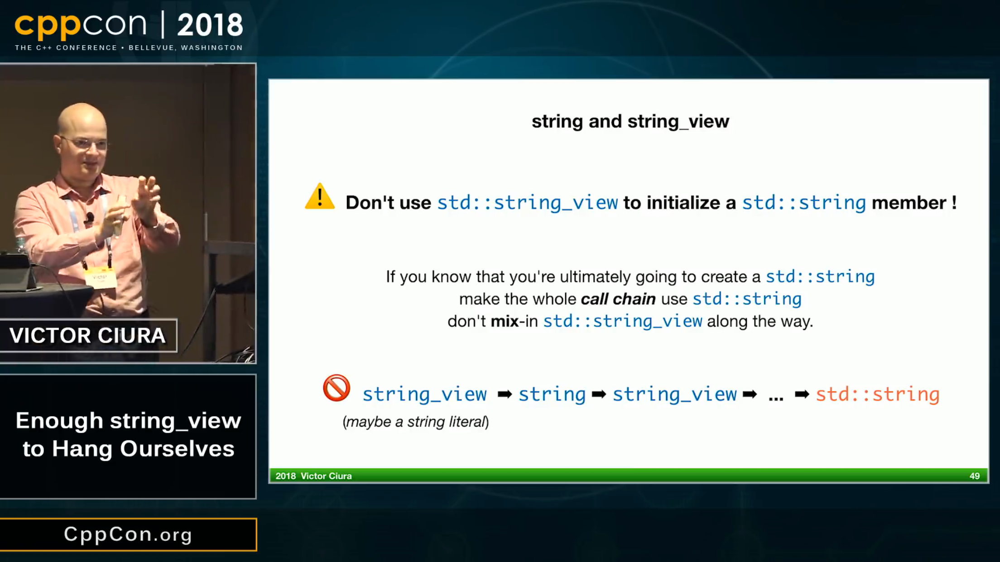

# CppCon 2018: Victor Ciura: Enough string_view to Hang Ourselves (3/8)

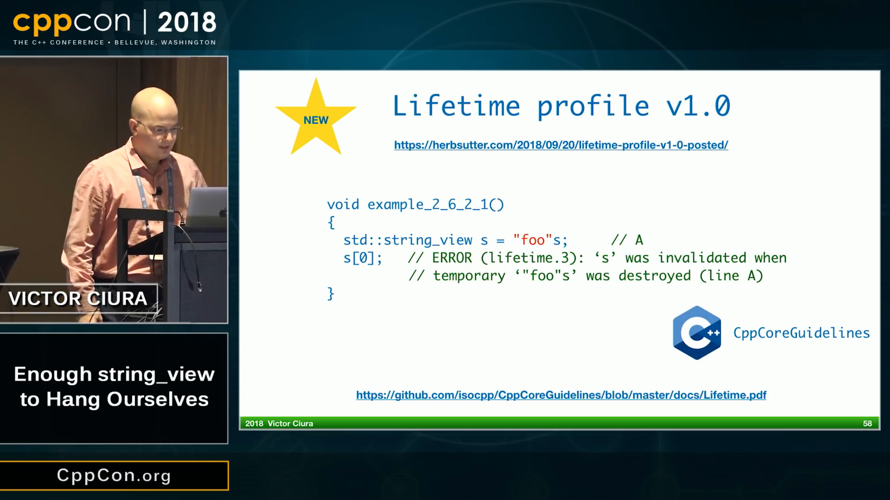

# CppCon 2018: Victor Ciura: Enough string_view to Hang Ourselves (4/8)

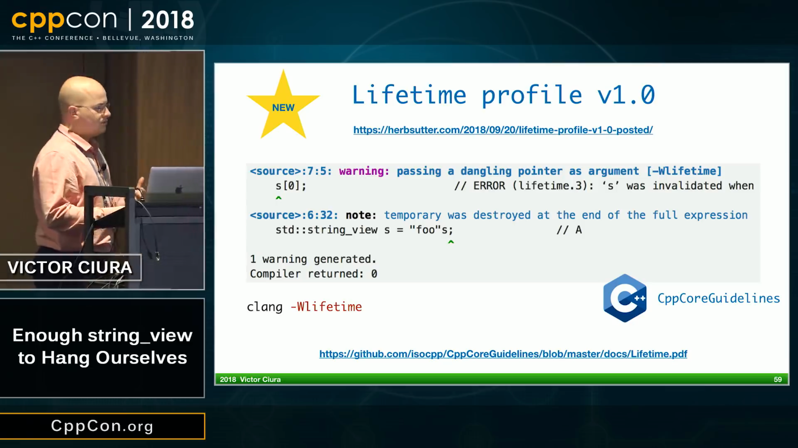

# CppCon 2018: Victor Ciura: Enough string_view to Hang Ourselves (5/8)

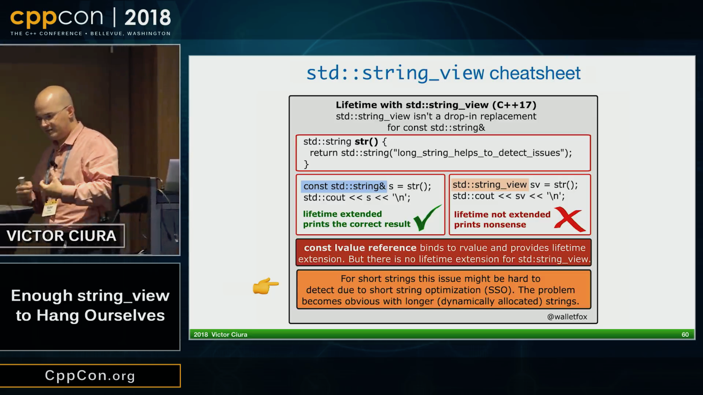

# CppCon 2018: Victor Ciura: Enough string_view to Hang Ourselves (6/8)

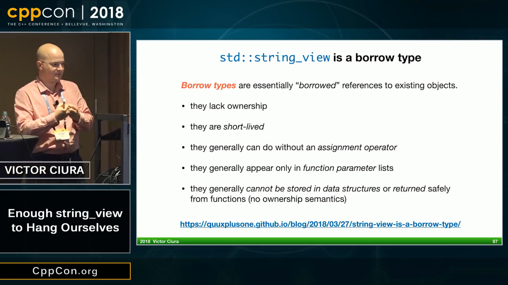

# CppCon 2018: Victor Ciura: Enough string_view to Hang Ourselves (7/8)

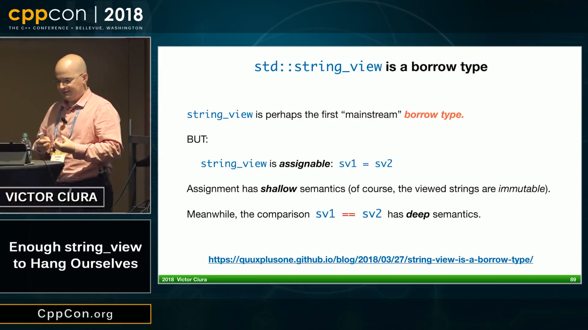

# CppCon 2018: Victor Ciura: Enough string_view to Hang Ourselves (8/8)

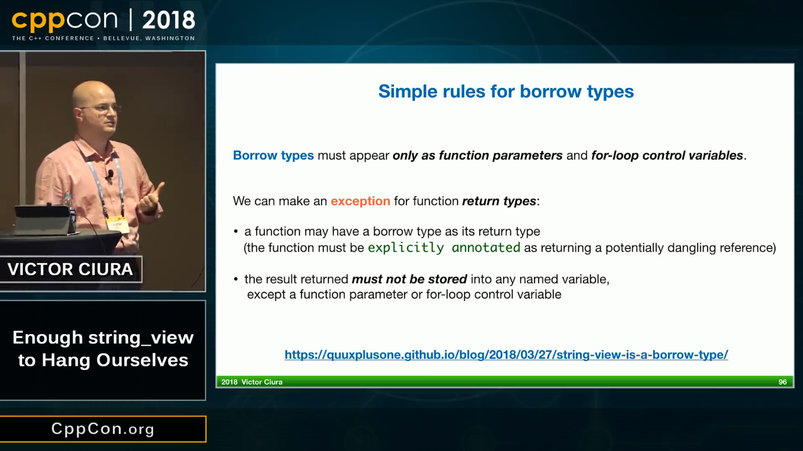

# MSVC class layout (1/3)

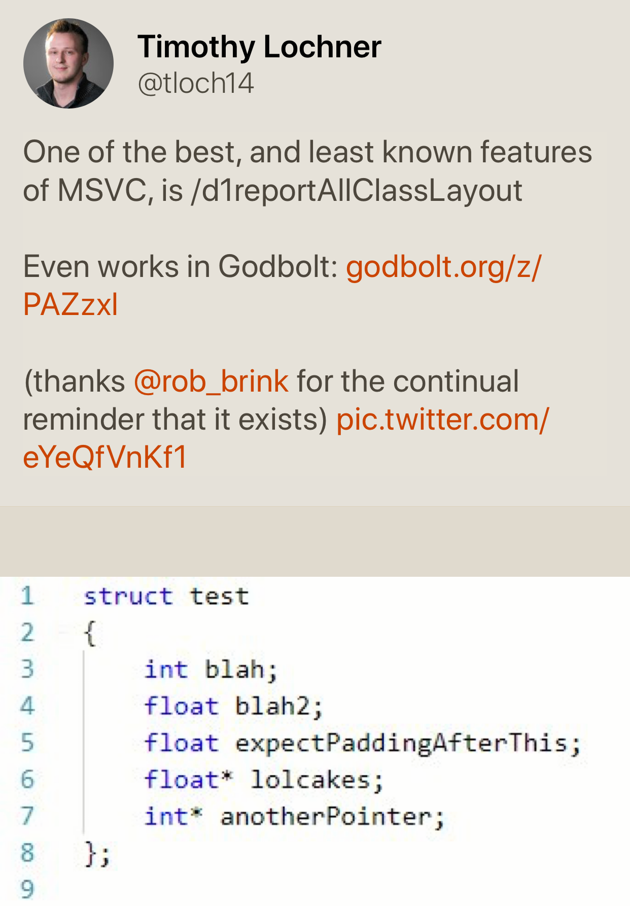

# MSVC class layout (2/3)

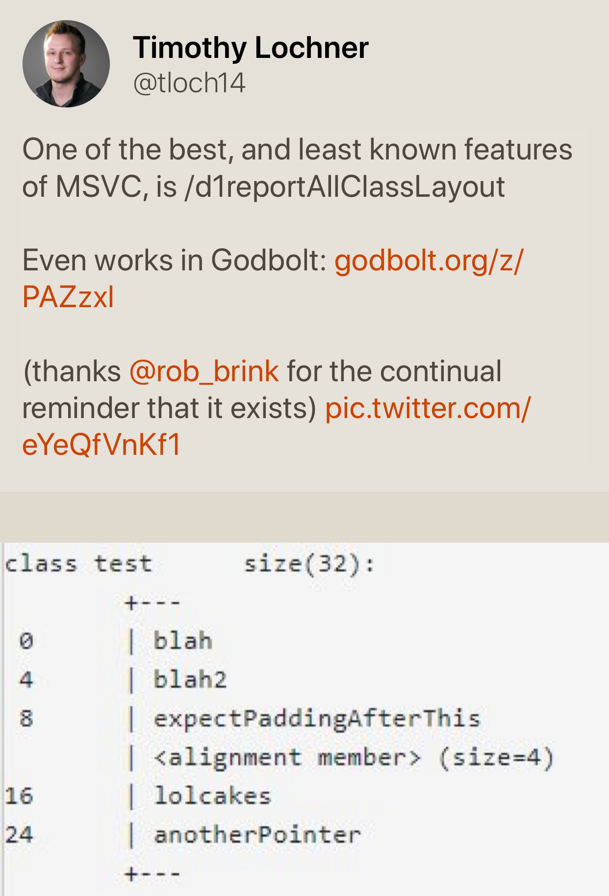

# MSVC class layout (3/3)

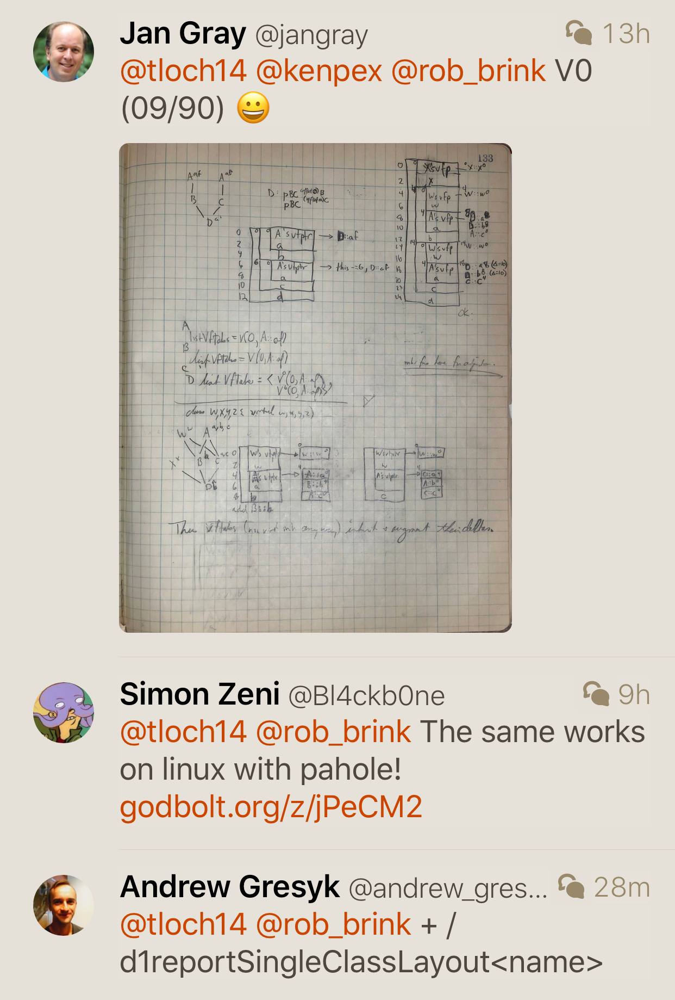

# Conan, vcpkg or build2?

[Reddit](https://www.reddit.com/r/cpp/comments/9m4l0p/conan_vcpkg_or_build2/)

* Pragmatic choice: vcpkg or Conan (they work today and are complete enough)
* Pragmatic no-brainer choice: vcpkg (it's the simplest and it have more packages ready)
* Pragmatic but need finer control choice: Conan (it gives more options)
* (Very) Long term choice: Build2 (shows great promises because it uses a coherent model...)
* Ideal choice (from the future): help SG15 (the group reflecting on tools vs C++) define interfaces for build systems and dependency managers so that your choice is not impacted by your dependencies choices.

# Improving C++ Builds with Split DWARF

[Article](http://www.productive-cpp.com/improving-cpp-builds-with-split-dwarf/)

```bash
$ g++ -c -g -gsplit-dwarf main.cpp -o main.o
$ g++ main.o -o app
```

# Having some fun with higher-order functions

* [Article by Barry Revzin](https://medium.com/@barryrevzin/having-some-fun-with-higher-order-functions-e3e30ec69969)
* [Boost.HOF](https://www.boost.org/doc/libs/1_68_0/libs/hof/doc/html/doc/index.html#)

# Compile-time raytracer by Tristan Brindle

* [Code](https://github.com/tcbrindle/raytracer.hpp)
    - [Reddit](https://www.reddit.com/r/cpp/comments/9t2q0t/simple_compiletime_raytracer_using_c17/)

# Iterators: What Must Be Done?

* [Article](https://infektor.net/posts/2018-11-03-iterators-what-must-be-done.html)

# Oh, DeaR

* [Post by JeanHeyd Meneide](https://thephd.github.io/oh-dear-odr-trap)
    - [Reddit](https://www.reddit.com/r/cpp/comments/a5rkfr/oh_dear/)

# Google C++ Style Guide is No Good

* [Article by Eugene Yakubovich](https://eyakubovich.github.io/2018-11-27-google-cpp-style-guide-is-no-good/)

> Unlike C++ Core Guidelines that try to explain how to use the language effectively, GSG is about forbidding the use of certain features.

* [Reddit](https://www.reddit.com/r/cpp/comments/a1b7km/google_c_style_guide_is_no_good/)

> There are issues with the google c++ style guide, but this article is bad. It is basically just finding contrived cases where you have to use questionable constructs, or willfully misinterpreting the document.

# Twitter

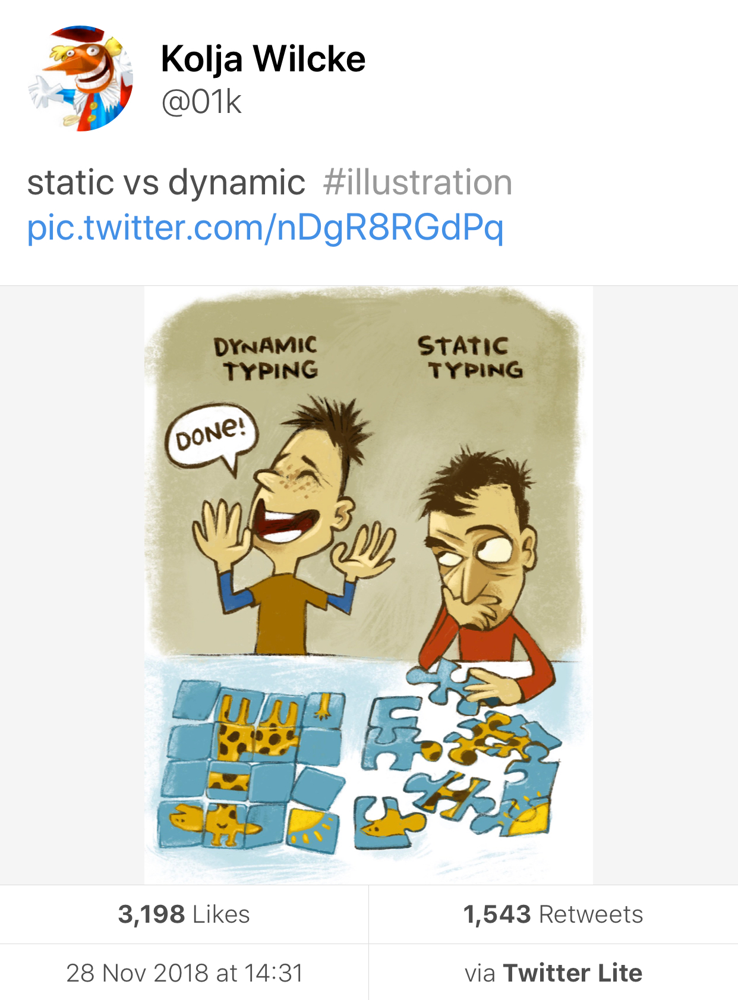

# Twitter

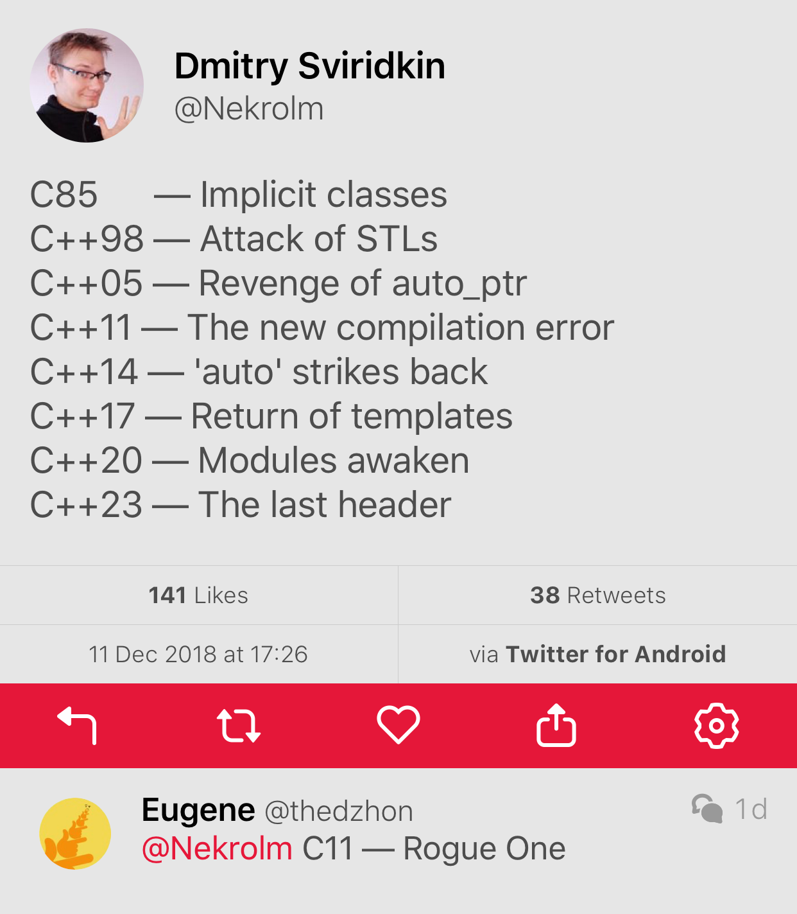
