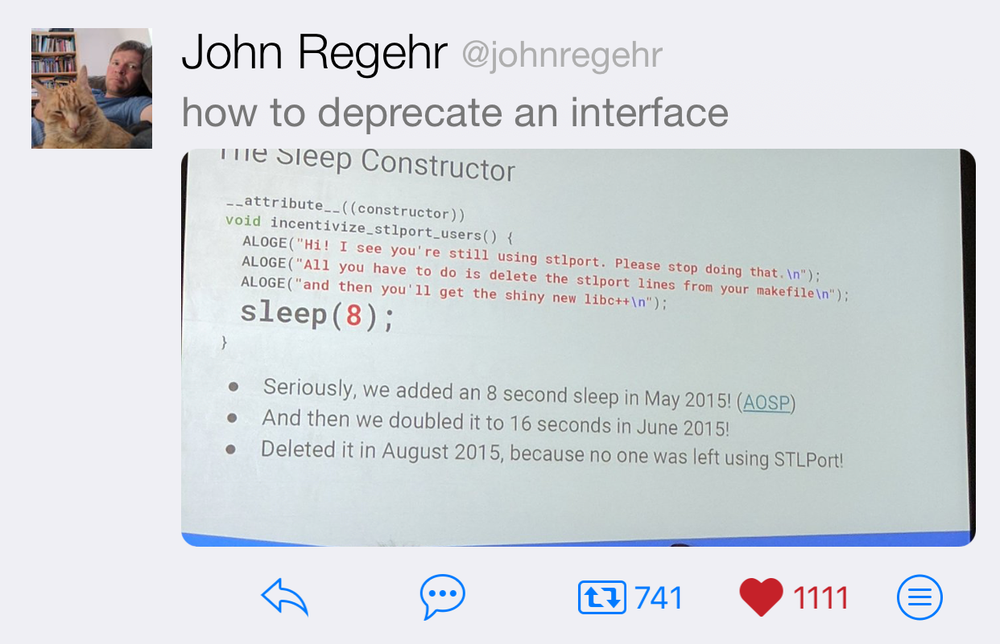

----

Post-San Diego Mailing
----------------------

mailing2018-11_

.. _mailing2018-11: http://www.open-std.org/jtc1/sc22/wg21/docs/papers/2018/#mailing2018-11

Ranges, Code Quality, and the Future of C++
-------------------------------------------

* Article_ by Jason Meisel
* Reddit_

    C++2a is going to be the best version of C++ yet, and a big reason for that is Eric’s Ranges library.

    A range allows you to return the algorithm itself, rather than the data the algorithm generates. This way, you can combine it with other algorithms without modifying it directly.

    Ranges are for utilizing algorithms and coroutines are for implementing algorithms.

.. _Article: https://medium.com/@jasonmeisel/ranges-code-quality-and-the-future-of-c-99adc6199608
.. _Reddit: https://www.reddit.com/r/cpp/comments/a9qb54/ranges_code_quality_and_the_future_of_c/

Oh DeaR
-------

* `Post by JeanHeyd Meneide`_
* Reddit_

.. _Post by JeanHeyd Meneide: https://thephd.github.io/oh-dear-odr-trap
.. _Reddit: https://www.reddit.com/r/cpp/comments/a5rkfr/oh_dear/

Intel Contributes Its Parallel STL Implementation To LLVM
---------------------------------------------------------

* Article_
* Announcement_
* Code_
* Reddit_

.. _Article: https://www.phoronix.com/scan.php?page=news_item&px=Intel-Parallel-STL-Commit
.. _Announcement: https://lists.llvm.org/pipermail/cfe-dev/2018-December/060606.html
.. _Code: https://github.com/llvm-mirror/pstl/commits/master
.. _Reddit: https://www.reddit.com/r/cpp/comments/a9n0gk/intel_contributes_its_parallel_stl_implementation/

Cpp-Taskflow
------------

* Code_
* Docs_

.. _Code: https://github.com/cpp-taskflow/cpp-taskflow
.. _Docs: https://cpp-taskflow.github.io/cpp-taskflow-documentation.github.io/

Proper way to iterate backwards in C++
--------------------------------------

Reddit_

.. code:: c++

    for (size_t i = data.size() - 1; i >= 0; --i) { ... } // Doesn't work
    for (size_t i = data.size(); i--;) { ... } // The C way

    // C++17
    std::vector<int> vec;
    for (auto [value, idx] : reverse_index_adapter(vec)) {
        // idx = n-1, n-2, ... 0
    }

    std::for_each(vec.rbegin(), vec.rend(),  { ... }); // No index

    for (auto it = data.rbegin(); it != data.rend(); ++it) {
        auto i = std::distance(it, data.rend()) - 1;
    }

.. _Reddit: https://www.reddit.com/r/cpp/comments/947a1z/proper_way_to_do_backward_iteration_in_c/

A Perspective on C++ Standardization in 2018
--------------------------------------------

`Post by JeanHeyd Meneide`_

.. _`Post by JeanHeyd Meneide`: https://thephd.github.io/perspective-standardization-in-2018

    You can roll your fantastic thing in your engine / application / middleware / scientific package? Awesome!
    Now write a specification for it.

* The Rigor of Standardization
* Surviving the Process (burnout)
* The Composition of the C++ Standardization Committee

LazyCode
--------

Making C++ cool again, bringing in those expressions from other languages that you wish you had; list comprehension
style maps, filters, ranges, etc.

* GitHub_

.. code:: c++

    int total = lz::read<int>(ifstream("test.txt")) | lz::limit(10) |
                lz::filter( { return i % 2 == 0; }) |
                lz::map( { return i * i; }) | lz::sum();

.. _GitHub: https://github.com/SaadAttieh/lazyCode

Better Enums
------------

Documentation_ | Code_

.. code:: c++

    #include <iostream>
    #include "enum.h"

    BETTER_ENUM(Word, int, Hello, World)

    int main()
    {
        std::cout << (+Word::Hello)._to_string() << ", "
                  << (+Word::World)._to_string() << "!"
                  << std::endl;

        return 0;
    }

.. _Documentation: https://aantron.github.io/better-enums/index.html
.. _Code: https://github.com/aantron/better-enums

The Sleep Constructor
---------------------

