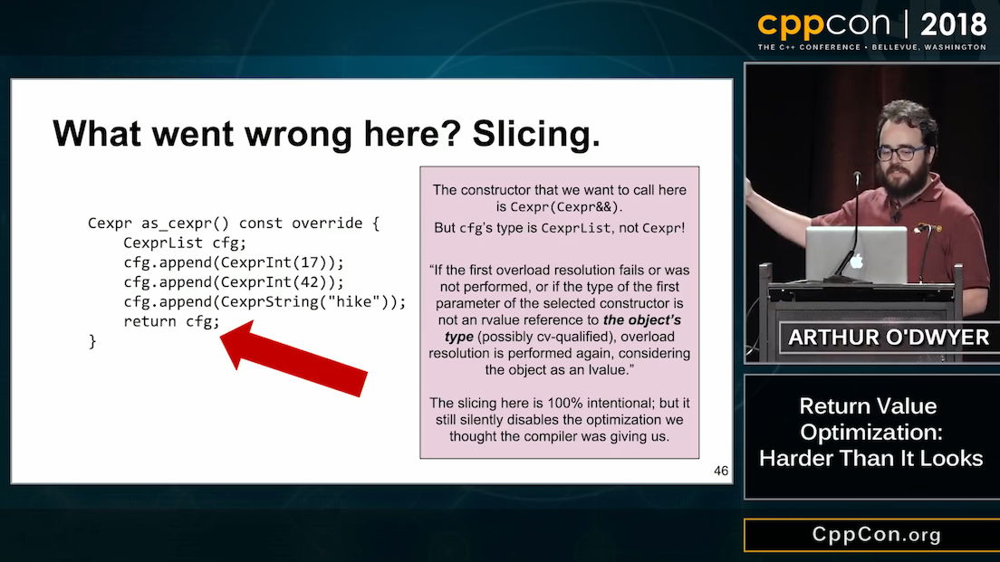
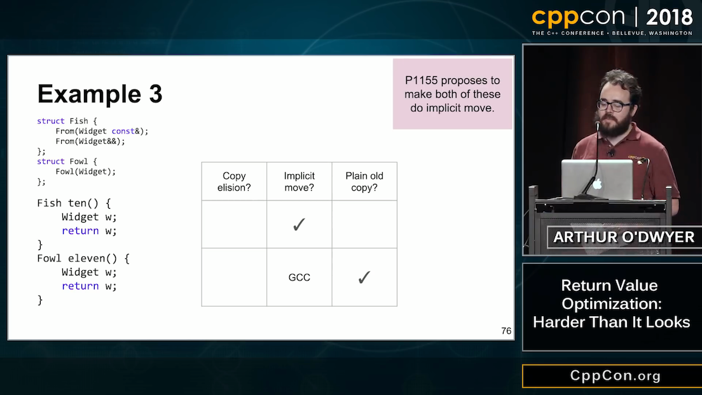
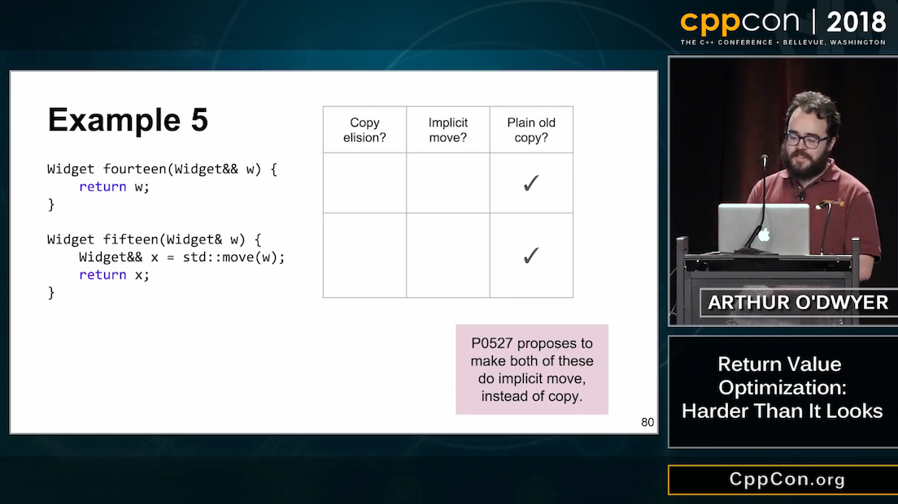
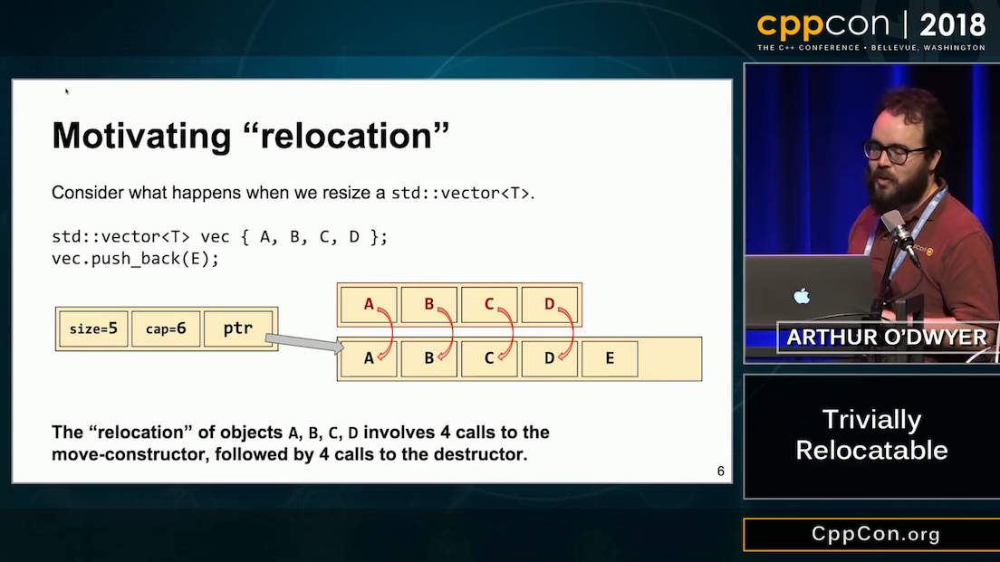
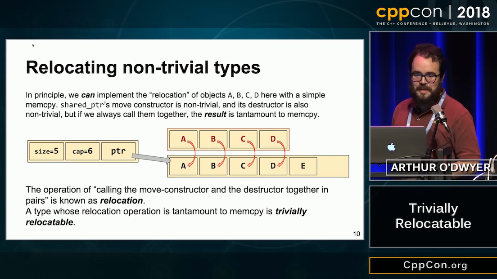
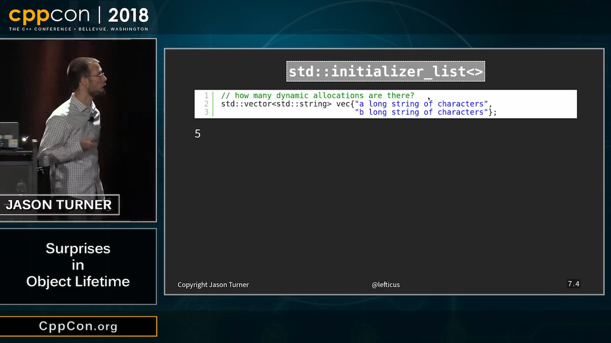
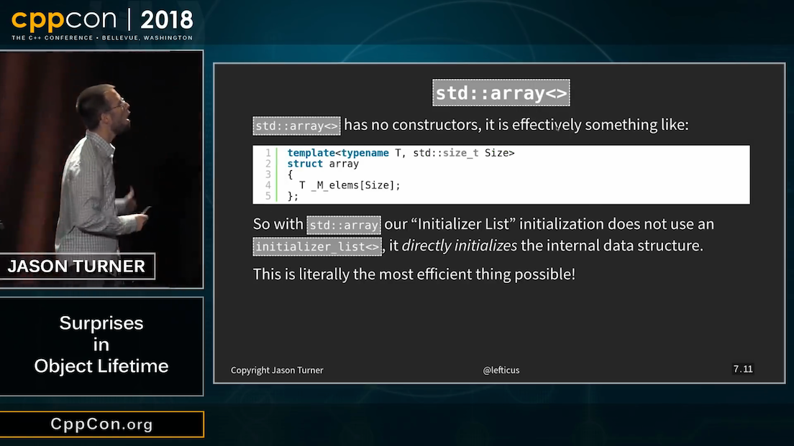
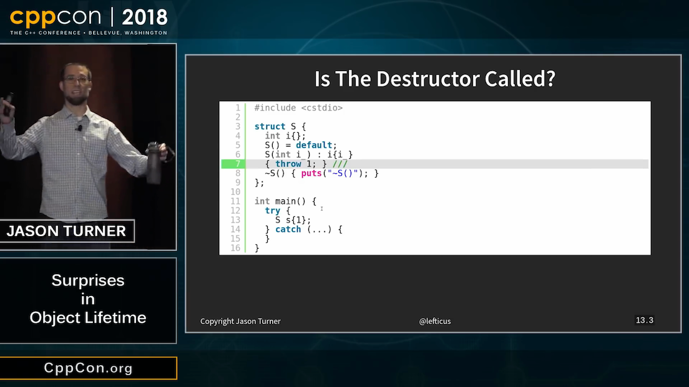

----

Bjarne Stroustrup at UC3M
-------------------------

Celebrating Honoris Causa Doctorate at UC3M by Bjarne Stroustrup

`The continuing evolution of C++`_

.. _`The continuing evolution of C++`: https://youtu.be/ooehrkYkGdA

CppCon 2018: Arthur O'Dwyer "RVO: Harder Than It Looks"
-------------------------------------------------------

* `CppCon 2018 - Arthur O'Dwyer - RVO: Harder Than It Looks`_
* `Trivially Relocatable FAQ`_

.. _`CppCon 2018 - Arthur O'Dwyer - RVO: Harder Than It Looks`: https://youtu.be/hA1WNtNyNbo
.. _`Trivially Relocatable FAQ`: https://quuxplusone.github.io/blog/2018/10/04/trivially-relocatable-faq/

CppCon 2018: Arthur O'Dwyer "RVO: Harder Than It Looks"
-------------------------------------------------------

.. image:: img/odwyer-rvo-1.png

CppCon 2018: Arthur O'Dwyer "RVO: Harder Than It Looks"
-------------------------------------------------------

.. image:: img/odwyer-rvo-2.png

CppCon 2018: Arthur O'Dwyer "RVO: Harder Than It Looks"
-------------------------------------------------------

.. image:: img/odwyer-rvo-3.png

CppCon 2018: Arthur O'Dwyer "RVO: Harder Than It Looks"
-------------------------------------------------------

.. image:: img/odwyer-rvo-4.png

CppCon 2018: Arthur O'Dwyer "RVO: Harder Than It Looks"
-------------------------------------------------------

.. image:: img/odwyer-rvo-5.png

CppCon 2018: Arthur O'Dwyer "RVO: Harder Than It Looks"
-------------------------------------------------------

.. image:: img/odwyer-rvo-6.png

CppCon 2018: Arthur O'Dwyer "RVO: Harder Than It Looks"
-------------------------------------------------------

CppCon 2018: Arthur O'Dwyer "RVO: Harder Than It Looks"
-------------------------------------------------------

.. image:: img/odwyer-rvo-8.png

CppCon 2018: Arthur O'Dwyer "RVO: Harder Than It Looks"
-------------------------------------------------------

.. image:: img/odwyer-rvo-9.png

CppCon 2018: Arthur O'Dwyer "RVO: Harder Than It Looks"
-------------------------------------------------------

.. image:: img/odwyer-rvo-10.png

CppCon 2018: Arthur O'Dwyer "RVO: Harder Than It Looks"
-------------------------------------------------------

CppCon 2018: Arthur O'Dwyer "RVO: Harder Than It Looks"
-------------------------------------------------------

.. image:: img/odwyer-rvo-12.png

CppCon 2018: Arthur O'Dwyer "RVO: Harder Than It Looks"
-------------------------------------------------------

CppCon 2018: Arthur O'Dwyer "RVO: Harder Than It Looks"
-------------------------------------------------------

.. image:: img/odwyer-rvo-14.png

CppCon 2018: Arthur O'Dwyer "RVO: Harder Than It Looks"
-------------------------------------------------------

.. image:: img/odwyer-rvo-15.png

CppCon 2018: Arthur O'Dwyer "RVO: Harder Than It Looks"
-------------------------------------------------------

CppCon 2018: Arthur O'Dwyer "RVO: Harder Than It Looks"
-------------------------------------------------------

CppCon 2018: Jason Turner "Surprises in Object Lifetime"
--------------------------------------------------------

`CppCon 2018 - Jason Turner - Surprises in Object Lifetime`_

.. _`CppCon 2018 - Jason Turner - Surprises in Object Lifetime`: https://youtu.be/uQyT-5iWUow

CppCon 2018: Jason Turner "Surprises in Object Lifetime"
--------------------------------------------------------

.. image:: img/turner-surprises-lifetime-0.png

CppCon 2018: Jason Turner "Surprises in Object Lifetime"
--------------------------------------------------------

CppCon 2018: Jason Turner "Surprises in Object Lifetime"
--------------------------------------------------------

.. image:: img/turner-surprises-lifetime-2.png

CppCon 2018: Jason Turner "Surprises in Object Lifetime"
--------------------------------------------------------

.. image:: img/turner-surprises-lifetime-3.png

CppCon 2018: Jason Turner "Surprises in Object Lifetime"
--------------------------------------------------------

CppCon 2018: Jason Turner "Surprises in Object Lifetime"
--------------------------------------------------------

CppCon 2018: Jason Turner "Surprises in Object Lifetime"
--------------------------------------------------------

.. image:: img/turner-surprises-lifetime-6.png

CppCon 2018: Jason Turner "Surprises in Object Lifetime"
--------------------------------------------------------

.. image:: img/turner-surprises-lifetime-7.png

CppCon 2018: Jason Turner "Surprises in Object Lifetime"
--------------------------------------------------------

.. image:: img/turner-surprises-lifetime-8.png

CppCon 2018: Jason Turner "Surprises in Object Lifetime"
--------------------------------------------------------

.. image:: img/turner-surprises-lifetime-9.png

CppCon 2018: Jason Turner "Surprises in Object Lifetime"
--------------------------------------------------------

CppCon 2018: Jason Turner "Surprises in Object Lifetime"
--------------------------------------------------------

.. image:: img/turner-surprises-lifetime-11.png

CppCon 2018: Jason Turner "Surprises in Object Lifetime"
--------------------------------------------------------

CppCon 2018: Jason Turner "Surprises in Object Lifetime"
--------------------------------------------------------

CppCon 2018: Jason Turner "Surprises in Object Lifetime"
--------------------------------------------------------

CppCon 2018: Jason Turner "Surprises in Object Lifetime"
--------------------------------------------------------

.. image:: img/turner-surprises-lifetime-15.png

CppCon 2018: Jason Turner "Surprises in Object Lifetime"
--------------------------------------------------------

.. image:: img/turner-surprises-lifetime-16.png

CppCon 2018: Jason Turner "Surprises in Object Lifetime"
--------------------------------------------------------

CppCon 2018: Jason Turner "Surprises in Object Lifetime"
--------------------------------------------------------

CppCon 2018: Jason Turner "Surprises in Object Lifetime"
--------------------------------------------------------

.. image:: img/turner-surprises-lifetime-19.png

Proper way to iterate backwards in C++
--------------------------------------

https://www.reddit.com/r/cpp/comments/947a1z/proper_way_to_do_backward_iteration_in_c/

.. code:: c++

    for (size_t i = data.size() - 1; i >= 0; --i) { ... } // Nope
    for (size_t i = data.size(); i--;) { ... } // The C way

    // C++17
    std::vector<int> vec;
    for (auto [value, idx] : reverse_index_adapter(vec)) {
        // idx = n-1, n-2, ... 0
    }

    std::for_each(vec.rbegin(), vec.rend(),  { ... }); // No index

    for (auto it = data.rbegin(); it != data.rend(); ++it) {
        auto i = std::distance(it, data.rend()) - 1;
    }

Move smart pointers in and out functions in modern C++
------------------------------------------------------

* `Move smart pointers in and out functions in modern C++`_
  * Reddit: https://www.reddit.com/r/cpp/comments/aaux96/move_smart_pointers_in_and_out_functions_in/

.. _`Move smart pointers in and out functions in modern C++`: https://www.internalpointers.com/post/move-smart-pointers-and-out-functions-modern-c

Arthur O'Dwyer: Feature that Always Works
-----------------------------------------

* `for (auto&& elt : range) Always Works`_
* `for (auto&& elt : range) Still Always Works`_

.. code:: c++

    for (auto&& elt : range) {
        do_something_with(elt);
    }

.. _`for (auto&& elt : range) Always Works`: https://quuxplusone.github.io/blog/2018/12/15/autorefref-always-works/
.. _`for (auto&& elt : range) Still Always Works`: https://quuxplusone.github.io/blog/2018/12/27/autorefref-still-always-works/

Twitter
-------

Twitter
-------

