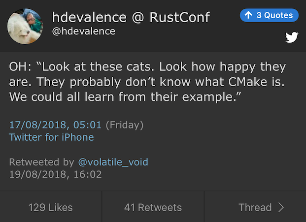

----

Bryce Lelbach's Kona Twitter Poll
---------------------------------

.. image:: img/lelbach-kona-poll.png

https://www.reddit.com/r/cpp/comments/aq8rxf/bryce_lelbach_on_twitter_what_proposed_c20/

Five Awesome C++ Papers For Kona 2019 ISO Meeting
-------------------------------------------------

https://www.bfilipek.com/2019/02/papers-kona.html

C++ Binary Compatibility and Pain-Free Upgrades to Visual Studio 2019
---------------------------------------------------------------------

https://blogs.msdn.microsoft.com/vcblog/2019/01/31/cpp-binary-compatibility-and-pain-free-upgrades-to-visual-studio-2019/

Moving iterators in C++
-----------------------

https://cukic.co/2019/02/09/moving-iterators-in-cxx/

    ``std::move_iterator`` is an iterator adaptor which behaves exactly like the underlying iterator, except that dereferencing converts the value returned by the underlying iterator into an rvalue. (https://en.cppreference.com/w/cpp/iterator/move_iterator)

.. code:: c++

    std::vector<fs::directory_entry> results;
    auto dir_items = files_in_dir(...);
    results.insert(results.end(), dir_items.cbegin(), dir_items.cend());

Low-cost Deterministic C++ Exceptions for Embedded Systems
----------------------------------------------------------

https://www.research.ed.ac.uk/portal/files/78829292/low_cost_deterministic_C_exceptions_for_embedded_systems.pdf

James Renwick, Tom Spink, Björn Franke (University of Edinburgh)

Fast_ber: ASN.1 BER serialization library
-----------------------------------------

* https://github.com/Samuel-Tyler/fast_ber
* https://www.reddit.com/r/cpp/comments/anwlrs/fast_ber_asn1_ber_serialization_library_written/
* https://en.wikipedia.org/wiki/Abstract_Syntax_Notation_One

Twitter
-------

Twitter
-------

.. image:: img/ewg-ransom.png
