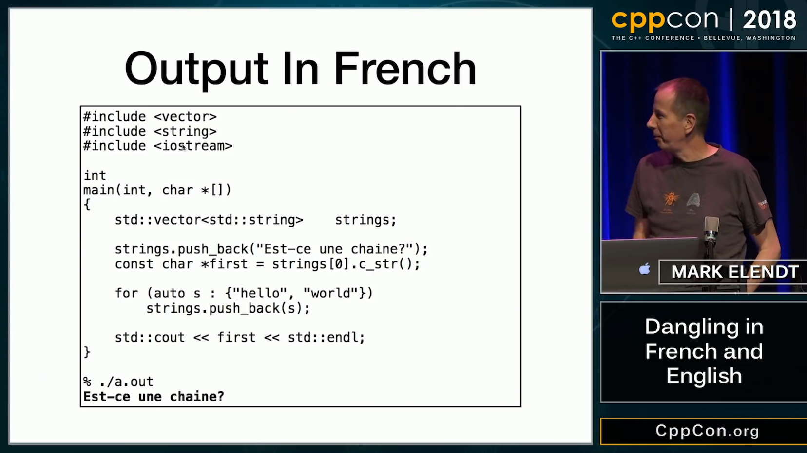

----

Bryce Lelbach's Kona Twitter Poll
---------------------------------

.. image:: img/lelbach-kona-poll.png

https://www.reddit.com/r/cpp/comments/aq8rxf/bryce_lelbach_on_twitter_what_proposed_c20/

Twitter
-------

.. image:: img/ewg-ransom.png

Kona Trip Reports
-----------------

* Modules! Coroutines! Contracts! Ranges! Constexpr! Spaceships! Calendars! Time zones!
* Bryce Lelbach https://www.reddit.com/r/cpp/comments/au0c4x/201902_kona_iso_c_committee_trip_report_c20/
  * The reports of modules being dead on arrival have been greatly exaggerated. https://www.reddit.com/r/cpp/comments/au0c4x/201902_kona_iso_c_committee_trip_report_c20/eh4stfg/
  * More Reddit https://www.reddit.com/r/programming/comments/au1ie3/201902_kona_iso_c_committee_trip_report_c20/
  * Hacker News https://news.ycombinator.com/item?id=19235702
* Herb Sutter https://herbsutter.com/2019/02/23/trip-report-winter-iso-c-standards-meeting-kona/
  * Reddit https://www.reddit.com/r/cpp/comments/au1skl/herbs_kona_trip_report_winter_iso_c_standards/

    At our next meeting in July, we expect to formally adopt a few additional features that were design-approved at this meeting but didn’t complete full wording specification review this week <...> (formatting, ``flat_map`` etc.)

C++20
-----

Bryce Lelbach:

    TL;DR: C++20 may well be as big a release as C++11.

.. image:: img/epic_win.jpg
   :width: 912 px
   :height: 967 px
   :scale: 25 %

Eigen + MTS + Google Ceres Solver = SEGFAULT
--------------------------------------------

* Eigen http://eigen.tuxfamily.org/index.php?title=Main_Page
* Ceres Solver http://ceres-solver.org/
* Memory managers:
  * MTS http://www.desy.de/user/projects/C++/products/mts.html
    - for every 10000 allocations 13 to 17 were unaligned
  * TCMalloc (Google) http://goog-perftools.sourceforge.net/doc/tcmalloc.html
  * Jemalloc (FreeBSD, Facebook) http://jemalloc.net/

.. code:: c++

    bool aligned = ((unsigned long)p % 16) == 0;

CppCon 2018 - Mark Elendt - Dangling in French and English
----------------------------------------------------------

https://youtu.be/jieYLTcmTS0

CppCon 2018 - Mark Elendt - Dangling in French and English
----------------------------------------------------------

https://youtu.be/jieYLTcmTS0

.. image:: img/elendt-dangling-2.png

C++ Binary Compatibility and Pain-Free Upgrades to Visual Studio 2019
---------------------------------------------------------------------

https://blogs.msdn.microsoft.com/vcblog/2019/01/31/cpp-binary-compatibility-and-pain-free-upgrades-to-visual-studio-2019/

Visual Studio 2019 Release Candidate (RC) now available
-------------------------------------------------------

https://devblogs.microsoft.com/visualstudio/visual-studio-2019-release-candidate-rc-now-available/

Moving iterators in C++
-----------------------

https://cukic.co/2019/02/09/moving-iterators-in-cxx/

    ``std::move_iterator`` is an iterator adaptor which behaves exactly like the underlying iterator, except that dereferencing converts the value returned by the underlying iterator into an *rvalue*. (https://en.cppreference.com/w/cpp/iterator/move_iterator)

.. code:: c++

    std::vector<fs::directory_entry> results;
    auto dir_items = files_in_dir(...);
    results.insert(results.end(), dir_items.cbegin(), dir_items.cend());

Low-cost Deterministic C++ Exceptions for Embedded Systems
----------------------------------------------------------

https://www.research.ed.ac.uk/portal/files/78829292/low_cost_deterministic_C_exceptions_for_embedded_systems.pdf

James Renwick, Tom Spink, Björn Franke (University of Edinburgh)

    In our novel C++ exception implementation we make use of a stack-allocated object that records the necessary run-time information for throwing an exception, such as the type and size of the exception object. This state is allocated in a single place and is passed between functions via an implicit function parameter injected into functions which support exceptions. The state is initialised by ``throw`` expressions, and is re-used to enable re-throwing. ``catch`` statements use the state in order to determine whether they can handle the exception. After a call to a function which may throw exceptions, a run-time check is inserted to test whether the state containsan active exception.

Fast_ber: ASN.1 BER serialization library
-----------------------------------------

* https://github.com/Samuel-Tyler/fast_ber
* https://www.reddit.com/r/cpp/comments/anwlrs/fast_ber_asn1_ber_serialization_library_written/
* https://en.wikipedia.org/wiki/Abstract_Syntax_Notation_One

C++, it’s not you. It’s me.
---------------------------

* Blog post: https://c0de517e.blogspot.com/2019/02/c-its-not-you-its-me.html
  * `Reddit <https://www.reddit.com/r/cpp/comments/av8mmz/c_its_not_you_its_me/>`_

| If you follow the twitter-verse (ok, and you happen to be in the same small circle of grumpy gamedevs that forms my bubble) you might have noticed lately a rise of rage and sarcasm against C++ and the direction it's taking.
|
| I don't want to post all the relevant bits, but the crux of the issue, for the lucky among you who don't do social media, is the growing disconnect between people woking on big, complex, performance-sensitive and often monolithic and legacy-ridden codebases that we find in game development, and the ideas of "modernity” of the C++ standard community.

Twitter
-------

Twitter
-------

.. image:: img/load-bearing-bug.png
