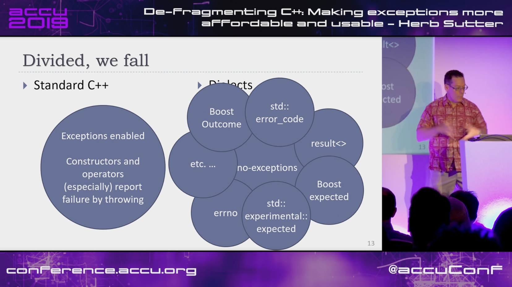
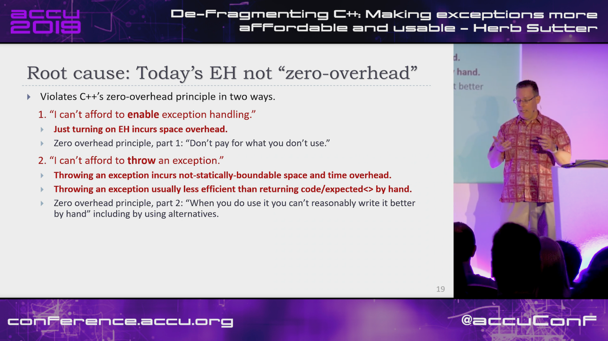
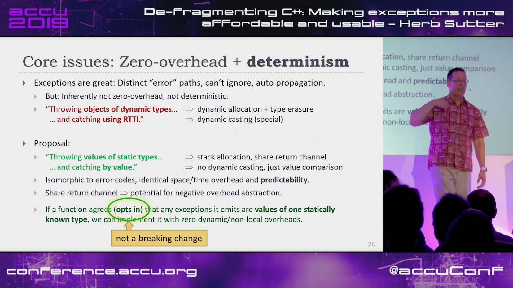
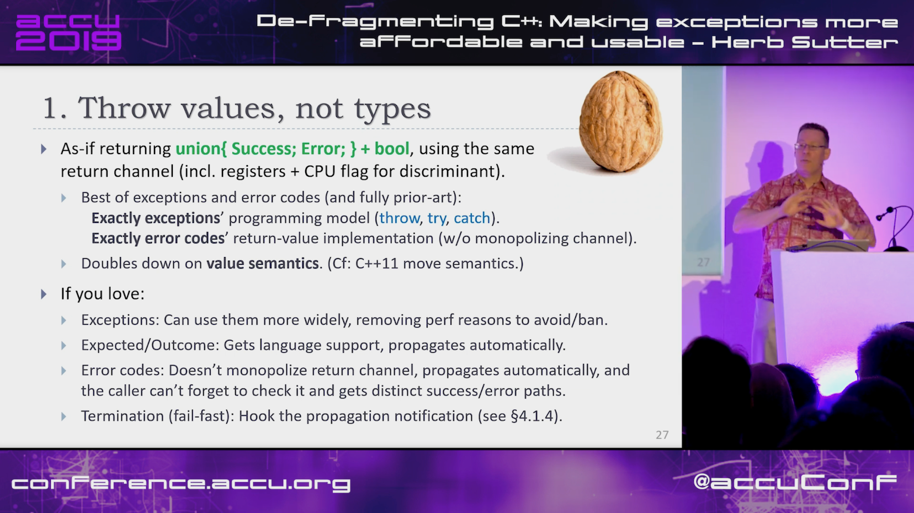

----

Top 25 C++ API design mistakes and how to avoid them
----------------------------------------------------

https://www.acodersjourney.com/top-25-cplusplus-api-design-mistakes-and-how-to-avoid-them/

Book: Martin Reddy - API Design for C++

* `Amazon US <https://www.amazon.com/API-Design-C-Martin-Reddy/dp/0123850037>`_
* `Amazon UK <https://www.amazon.co.uk/API-Design-C-Martin-Reddy/dp/0123850037>`_
* `Safari Books Online <https://learning.oreilly.com/library/view/api-design-for/9780123850034/>`_

https://www.reddit.com/r/cpp/comments/bh5b75/top_25_c_api_design_mistakes_and_how_to_avoid_them/

Herb Sutter [ACCU 2019] De-fragmenting C++: Making exceptions more affordable and usable
----------------------------------------------------------------------------------------

https://www.youtube.com/watch?v=os7cqJ5qlzo

https://www.reddit.com/r/cpp/comments/bifsdx/herb_sutter_accu_2019_defragmenting_c_making/

Herb Sutter [ACCU 2019] De-fragmenting C++: Making exceptions more affordable and usable
----------------------------------------------------------------------------------------

.. image:: img/sutter-accu19-1.png

Herb Sutter [ACCU 2019] De-fragmenting C++: Making exceptions more affordable and usable
----------------------------------------------------------------------------------------

Herb Sutter [ACCU 2019] De-fragmenting C++: Making exceptions more affordable and usable
----------------------------------------------------------------------------------------

Herb Sutter [ACCU 2019] De-fragmenting C++: Making exceptions more affordable and usable
----------------------------------------------------------------------------------------

.. image:: img/sutter-accu19-4.png

Herb Sutter [ACCU 2019] De-fragmenting C++: Making exceptions more affordable and usable
----------------------------------------------------------------------------------------

Herb Sutter [ACCU 2019] De-fragmenting C++: Making exceptions more affordable and usable
----------------------------------------------------------------------------------------

Herb Sutter [ACCU 2019] De-fragmenting C++: Making exceptions more affordable and usable
----------------------------------------------------------------------------------------

.. image:: img/sutter-accu19-7.png

Herb Sutter [ACCU 2019] De-fragmenting C++: Making exceptions more affordable and usable
----------------------------------------------------------------------------------------

.. image:: img/sutter-accu19-8.png

Herb Sutter [ACCU 2019] De-fragmenting C++: Making exceptions more affordable and usable
----------------------------------------------------------------------------------------

.. image:: img/sutter-accu19-9.png

Herb Sutter [ACCU 2019] De-fragmenting C++: Making exceptions more affordable and usable
----------------------------------------------------------------------------------------

.. image:: img/sutter-accu19-10.png

Same function parameters with different return type in C++17/C++20 (1/3)
------------------------------------------------------------------------

https://www.reddit.com/r/cpp/comments/aoidsi/what_is_the_solution_for_same_function_parameters/

Before:

.. code:: c++

    template<typename R>
    R foo(int i)
    { ... }

    foo<string>(1);

Same function parameters with different return type in C++17/C++20 (2/3)
------------------------------------------------------------------------

https://www.reddit.com/r/cpp/comments/aoidsi/what_is_the_solution_for_same_function_parameters/

After:

.. code:: c++

    template<class F> struct Auto : F {
        // conversion operator
        template<class T> operator T() {
            return F::template operator()<T>();
        }
    };

    template<class F> Auto(F) -> Auto<F>; // deduction guide

Same function parameters with different return type in C++17/C++20 (3/3)
------------------------------------------------------------------------

https://www.reddit.com/r/cpp/comments/aoidsi/what_is_the_solution_for_same_function_parameters/

After:

.. code:: c++

    template<class... A>
    auto fooWrapper(A&&... a) {
        return Auto{[&]<class T>() { return foo<T>(std::forward<A>(a)...); }};
    };

    template<class... A>
    auto fooWrapper(int i) {
        return Auto{[=]<class T>() { return foo<T>(i); }};
    };

    double d = fooWrapper(42);

uvw (header-only libuv wrapper in modern C++)
---------------------------------------------

Code: https://github.com/skypjack/uvw (C++14, MIT)

Reddit: https://www.reddit.com/r/cpp/comments/b3wkbf/exhaustive_and_composable_error_handling_in_c/

Boost.Outcome ready for Boost 1.70 release
------------------------------------------

https://www.reddit.com/r/cpp/comments/aqidl6/boostoutcome_ready_for_boost_170_release/

Getting in trouble with mixed comparisons
-----------------------------------------

https://brevzin.github.io/c++/2018/12/09/mixed-comparisons/

C++ Logging Libraries
---------------------

https://www.reddit.com/r/cpp/comments/a3gp0s/best_logging_libraries/

* Spdlog https://github.com/gabime/spdlog
* Loguru https://github.com/emilk/loguru
* EasyLogging https://github.com/zuhd-org/easyloggingpp
* Plog https://github.com/SergiusTheBest/plog
* Google Log https://github.com/google/glog
* P7 http://baical.net/p7.html

Data alignment the C++ way
--------------------------

https://vorbrodt.blog/2019/04/06/data-alignment-the-c-way/

Before modern C++:

.. code:: c++

    struct Old
    {
        int x;
        char padding[16 - sizeof(int)];
    };

Now:

.. code:: c++

    struct alignas(16) New
    {
        int x;
    };

What are some things commonly taught in C++ that are really bad practice?
-------------------------------------------------------------------------

https://www.reddit.com/r/cpp/comments/bgdawr/what_are_some_things_commonly_taught_in_c_that/

* Using inheritance for code reuse. After a couple of years you have an unmaintainable spaghetti that goes 5 levels deep. `# <https://www.reddit.com/r/cpp/comments/bgdawr/what_are_some_things_commonly_taught_in_c_that/elka68o?utm_source=share&utm_medium=web2x>`_
* Raw pointers/new/delete without RAII, improper use of raw (C) strings and arrays `# <https://www.reddit.com/r/cpp/comments/bgdawr/what_are_some_things_commonly_taught_in_c_that/elk6q6a?utm_source=share&utm_medium=web2x>`_
* Trust the programmer. I trusted myself once, and it didn’t end well. Never again making that mistake. `# <https://www.reddit.com/r/cpp/comments/bgdawr/what_are_some_things_commonly_taught_in_c_that/elk23m0?utm_source=share&utm_medium=web2x>`_
* ``using namespace std;`` `# <https://www.reddit.com/r/cpp/comments/bgdawr/what_are_some_things_commonly_taught_in_c_that/elkfyls?utm_source=share&utm_medium=web2x>`_
* Abuse of ``protected``. Where author of base class assumes you will correctly fiddle with protected members. `# <https://www.reddit.com/r/cpp/comments/bgdawr/what_are_some_things_commonly_taught_in_c_that/elk97j4?utm_source=share&utm_medium=web2x>`_
* Single entry, single exit. `# <https://www.reddit.com/r/cpp/comments/bgdawr/what_are_some_things_commonly_taught_in_c_that/ells0vz?utm_source=share&utm_medium=web2x>`_
* Throwing exceptions (!) `# <https://www.reddit.com/r/cpp/comments/bgdawr/what_are_some_things_commonly_taught_in_c_that/elk7qdu?utm_source=share&utm_medium=web2x>`_

**clamp_cast** -- A saturating arithmetic cast
----------------------------------------------

https://github.com/p-groarke/clamp_cast

A narrowing cast that does the right thing. clamp_cast will saturate output values at min or max if the input value would overflow / underflow.

.. code:: c++

    double ld = -42.0;
    unsigned char uc = clamp_cast<unsigned char>(ld);
    // uc == 0

    float f = 500000.f;
    char c = clamp_cast<char>(f);
    // c == 127

A pretty big list of C++ GUI libraries
--------------------------------------

Philippe M. Groarke: https://philippegroarke.com/posts/2018/c++_ui_solutions/

Reddit:

* https://www.reddit.com/r/cpp/comments/babfl5/a_pretty_big_list_of_c_gui_libraries/
* https://www.reddit.com/r/cpp/comments/9njw5n/is_there_an_easytouse_gui_library/
* https://www.reddit.com/r/cpp/comments/9q07bu/any_library_as_small_as_wxwidgets_but_as_powerful/

Modern UI in C++ https://www.reddit.com/r/cpp/comments/b3s2zq/modern_ui_in_c/

Modern Enums
------------

https://www.reddit.com/r/cpp/comments/b9xb3n/its_2019_we_have_the_power_of_constexpr_and/

* Static Enum https://github.com/KonanM/static_enum
* Magic Enum: Enum-to-String and String-to-Enum functions for modern C++ https://github.com/Neargye/magic_enum
* Better Enums http://aantron.github.io/better-enums/
* Wise Enum https://github.com/quicknir/wise_enum
* Meta Enum https://github.com/therocode/meta_enum

Nameof operator for modern C++
------------------------------

https://github.com/Neargye/nameof

See also: CTTI https://github.com/Manu343726/ctti

Exhaustive and Composable Error Handling in C++ (1/3)
-----------------------------------------------------

`Fabian Kosmale <https://fkosmale.bitbucket.io/posts/exhaustive-and-composable-error-handling-in-c%2B%2B/#composable-error-handling>`_

    TL;DR: You can emulate OCaml polymorphic sum type error handling in C++17.

Code: https://bitbucket.org/fkosmale/composableresult/src/master
Reddit: https://www.reddit.com/r/cpp/comments/b3wkbf/exhaustive_and_composable_error_handling_in_c/

    Some people also take exception to the fact that exception handling tables can bloat binaries, or to some <...> slow-down due to exceptions. While one might disagree on the severity of this issue <...>, this issue is important enough for all major compilers to provide a no-exceptions flag, which disables exception support. This makes exceptions a bad idea for library writers who want their libraries to work in as many contexts as possible.

Exhaustive and Composable Error Handling in C++ (2/3)
-----------------------------------------------------

.. code:: c++

    class AST;
    struct SyntaxError {int line; int column;};
    struct GrammarError {int line; int column; std::string explanation;};
    auto parse(std::string input) -> Result<AST, SyntaxError, GrammarError>;

    struct LengthError {int length;};
    struct HeightError {int height;};
    auto validate(AST ast) -> Result<AST, LengthError, HeightError>

    struct DisplayError {std::string explanation;}
    auto display(AST ast) -> void;

Exhaustive and Composable Error Handling in C++ (3/3)
-----------------------------------------------------

.. code:: c++

    auto result = parse(my_input)
      .then(validate)
      .then(display);
    Switch(result)
      .Case<SyntaxError>({
        report_error("Invalid syntax at line", e.line, ":", e.column);})
      .Case<GrammarError>({
        report_error(e.explanation, "at ", e.line, ":", e.column);})
      .Case<LengthError>({
        report_errror("illegal length: ", e.length);})
      .Case<DisplayError>({
        report_error(e.explanation);})
      | ESAC;
    // Triggers static_assert as HeightError is unhandled

Awesome Parallel Computing Resources
------------------------------------

https://github.com/cpp-taskflow/cpp-taskflow/blob/master/awesome-parallel-computing.md

Quirks in Class Template Argument Deduction (1/2)
-------------------------------------------------

Barry Revzin: https://brevzin.github.io/c++/2018/09/01/quirks-ctad/

.. code:: c++

    std::tuple<int> foo();

    std::tuple x = foo(); // tuple<tuple<int>>?
    auto y = foo();       // tuple<int>

What is the intent behind the declaration of variable ``x``?
Are we constructing a new thing (the CTAD goal) or are we using ``std::tuple``
as annotation to ensure that ``x`` is in fact a ``tuple`` (the Concepts goal)?

Quirks in Class Template Argument Deduction (2/2)
-------------------------------------------------

A clearer example:

.. code:: c++

    // The tuple case
    // unquestionably, tuple<int>
    std::tuple a(1);

    // unquestionably, tuple<tuple<int>,tuple<int>>
    std::tuple b(a, a);

    // ??
    std::tuple c(a);

On resolving the type vs member conflict in C++: The Color Color problem
------------------------------------------------------------------------

    In C++, there are ambiguities when a member function has the same name as a type.

* https://devblogs.microsoft.com/oldnewthing/20190419-00/?p=102431
* https://www.reddit.com/r/cpp/comments/bfb1z4/on_resolving_the_type_vs_member_conflict_in_c_the/
* https://en.cppreference.com/w/cpp/language/unqualified_lookup#Member_function_definition

Microsoft BlingFire - A lightning fast Finite State machine and REgular expression manipulation library
-------------------------------------------------------------------------------------------------------

* https://github.com/Microsoft/BlingFire (MIT)
* https://www.reddit.com/r/programming/comments/bf6ks4/microsoft_bing_fire_tokenizer_10x_faster_than_nltk/
* https://news.ycombinator.com/item?id=19687549

C++17 parser-combinator library, CppCmb
---------------------------------------

Cpp>>=Cmb

* https://github.com/LPeter1997/CppCmb
* https://www.reddit.com/r/cpp/comments/bemqaq/my_c17_parsercombinator_library_cppcmb_got_a_huge/
