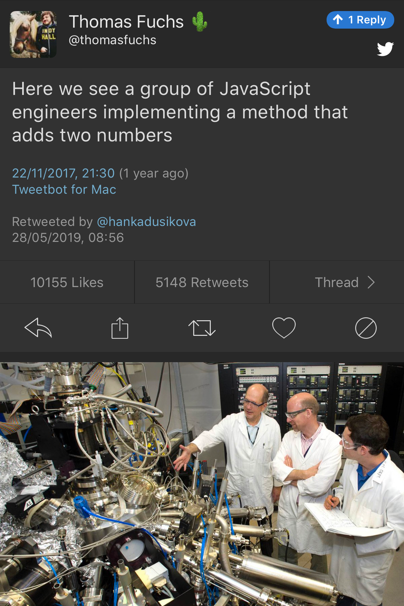

----

What was your latest discovery about C++?
-----------------------------------------

https://www.reddit.com/r/cpp/comments/blu0a4/what_was_your_latest_discovery_about_c/

`URLs in code are legal <https://www.reddit.com/r/cpp/comments/blu0a4/what_was_your_latest_discovery_about_c/emrlwk1?utm_source=share&utm_medium=web2x>`_

.. code::

    void fn() {
        https://www.google.com
        cout << "Everything is fine.\n"
    }

What was your latest discovery about C++? (cont.)
-------------------------------------------------

* Using ``template`` to disambiguate dependent names: `Reddit <https://www.reddit.com/r/cpp/comments/blu0a4/what_was_your_latest_discovery_about_c/emrjntl?utm_source=share&utm_medium=web2x>`_ | `CppReference <https://en.cppreference.com/w/cpp/language/dependent_name>`_ | `SO <https://stackoverflow.com/a/51799617/10154>`_
* Type covariance for virtual functions: `Reddit <https://www.reddit.com/r/cpp/comments/blu0a4/what_was_your_latest_discovery_about_c/emrwtqb?utm_source=share&utm_medium=web2x>`_
* Switch statement discoveries: `Reddit <https://www.reddit.com/r/cpp/comments/blu0a4/what_was_your_latest_discovery_about_c/emrgq5b?utm_source=share&utm_medium=web2x>`_
* Function-level ``try/catch``: `Reddit <https://www.reddit.com/r/cpp/comments/blu0a4/what_was_your_latest_discovery_about_c/emrkku1?utm_source=share&utm_medium=web2x>`_
* ``delete this``: `Reddit <https://www.reddit.com/r/cpp/comments/blu0a4/what_was_your_latest_discovery_about_c/emryqxl?utm_source=share&utm_medium=web2x>`_
* Fun with nested classes: `Reddit <https://www.reddit.com/r/cpp/comments/blu0a4/what_was_your_latest_discovery_about_c/emrn53p?utm_source=share&utm_medium=web2x>`_
* Unique object address: `Reddit <https://www.reddit.com/r/cpp/comments/blu0a4/what_was_your_latest_discovery_about_c/ems14qm?utm_source=share&utm_medium=web2x>`_
* A class can have a static member of incomplete class type: `Reddit <https://www.reddit.com/r/cpp/comments/blu0a4/what_was_your_latest_discovery_about_c/emrsv5y?utm_source=share&utm_medium=web2x>`_
* Namespaces can recursively refer to themselves: `Reddit <https://www.reddit.com/r/cpp/comments/blu0a4/what_was_your_latest_discovery_about_c/emt3p6h?utm_source=share&utm_medium=web2x>`_
* C++ is popular: `Reddit <https://www.reddit.com/r/cpp/comments/blu0a4/what_was_your_latest_discovery_about_c/emrz3bk?utm_source=share&utm_medium=web2x>`_

What was your latest discovery about C++? (cont.)
-------------------------------------------------

* The "arrow operator" (`Reddit <https://www.reddit.com/r/cpp/comments/blu0a4/what_was_your_latest_discovery_about_c/ems982b?utm_source=share&utm_medium=web2x>`_)

.. code:: c++

    int x = 10;
    while (x --> 0) // x goes to 0
    {
        printf("%d ", x);
    }

* Non-void function surprises: `Reddit <https://www.reddit.com/r/cpp/comments/blu0a4/what_was_your_latest_discovery_about_c/emrwkxb?utm_source=share&utm_medium=web2x>`_
* Alternative tokens: `Reddit <https://www.reddit.com/r/cpp/comments/blu0a4/what_was_your_latest_discovery_about_c/emt2cdx?utm_source=share&utm_medium=web2x>`_
* Void functions can return result of other void function: `Reddit <https://www.reddit.com/r/cpp/comments/blu0a4/what_was_your_latest_discovery_about_c/emt6kvw?utm_source=share&utm_medium=web2x>`_

What was your latest discovery about C++? (cont.)
-------------------------------------------------

* CRTP: `Reddit <https://www.reddit.com/r/cpp/comments/blu0a4/what_was_your_latest_discovery_about_c/emt4jcj?utm_source=share&utm_medium=web2x>`_
* Unary plus to force a lambda-to-function-pointer conversion: `Reddit <https://www.reddit.com/r/cpp/comments/blu0a4/what_was_your_latest_discovery_about_c/emto27r?utm_source=share&utm_medium=web2x>`_

.. code:: c++

+[]{}

    For every type ``T`` the unary ``operator+(T*)`` is considered to exist which returns the given pointer as is.
    Here, ``T`` is not restricted to object types but includes function types. A lambda object that didn't capture
    anything has a conversion operator to a function pointer. The unary ``+`` triggers this conversion.

* C++11 implicitly adds ``noexcept`` to destructors (but only if there are no data members or base classes that have a throwing destructor): `Reddit <https://www.reddit.com/r/cpp/comments/blu0a4/what_was_your_latest_discovery_about_c/emt0we3?utm_source=share&utm_medium=web2x>`_
* Reserved identifiers: `Reddit <https://www.reddit.com/r/cpp/comments/blu0a4/what_was_your_latest_discovery_about_c/emt9o8c?utm_source=share&utm_medium=web2x>`_ | `CppReference <https://en.cppreference.com/w/c/language/identifier#Reserved_identifiers>`_

Initialisation in C++17 – the matrix
------------------------------------

http://timur.audio/initialisation-in-c17-the-matrix

C++ Weekly - Ep 144 - Pure Functions in C++
-------------------------------------------

https://youtu.be/8ZxGABHcu40

https://www.reddit.com/r/cpp/comments/a2qzsv/c_weekly_ep_144_pure_functions_in_c/

.. code:: c++

    int square(int value) __attribute__((pure));
    [[gnu::pure]] int square2(int value);
    [[gnu::const]] int square3(int value);

C++ Logging Libraries
---------------------

https://www.reddit.com/r/cpp/comments/a3gp0s/best_logging_libraries/

* Spdlog https://github.com/gabime/spdlog
* Loguru https://github.com/emilk/loguru
* EasyLogging https://github.com/zuhd-org/easyloggingpp
* Plog https://github.com/SergiusTheBest/plog
* Google Log https://github.com/google/glog
* P7 http://baical.net/p7.html

sol3 is Released
----------------

https://thephd.github.io/sol3-released

https://sol2.readthedocs.io/en/latest/

https://www.reddit.com/r/cpp/comments/bs0piq/sol3_a_modern_luac_binding_is_released/

Vexing exceptions
-----------------

https://blogs.msdn.microsoft.com/ericlippert/2008/09/10/vexing-exceptions/

Exhaustive and Composable Error Handling in C++ (1/3)
-----------------------------------------------------

`Fabian Kosmale <https://fkosmale.bitbucket.io/posts/exhaustive-and-composable-error-handling-in-c%2B%2B/#composable-error-handling>`_

    TL;DR: You can emulate OCaml polymorphic sum type error handling in C++17.

`Code <https://bitbucket.org/fkosmale/composableresult/src/master>`_ :: `Reddit <https://www.reddit.com/r/cpp/comments/b3wkbf/exhaustive_and_composable_error_handling_in_c/>`_

Exhaustive and Composable Error Handling in C++ (2/3)
-----------------------------------------------------

.. code:: c++

    class AST;
    struct SyntaxError {int line; int column;};
    struct GrammarError {int line; int column; std::string explanation;};
    auto parse(std::string input) -> Result<AST, SyntaxError, GrammarError>;

    struct LengthError {int length;};
    struct HeightError {int height;};
    auto validate(AST ast) -> Result<AST, LengthError, HeightError>;

    struct DisplayError {std::string explanation;};
    auto display(AST ast) -> void;

Exhaustive and Composable Error Handling in C++ (3/3)
-----------------------------------------------------

.. code:: c++

    auto result = parse(my_input)
      .then(validate)
      .then(display);
    Switch(result)
      .Case<SyntaxError>({
        report_error("Invalid syntax at line", e.line, ":", e.column);})
      .Case<GrammarError>({
        report_error(e.explanation, "at ", e.line, ":", e.column);})
      .Case<LengthError>({
        report_errror("illegal length: ", e.length);})
      .Case<DisplayError>({
        report_error(e.explanation);})
      | ESAC;
    // Triggers static_assert as HeightError is unhandled

Units
-----

https://github.com/nholthaus/units

Having fun in life!
-------------------

http://thiagocafe.com/view/20170910_Having_fun_in_life

Twitter
-------

Quote
-----

Elizabeth Zwicky:

    The only thing more frightening than a programmer with a screwdriver or a hardware engineer with a program is a user with a pair of wire cutters and the root password.
