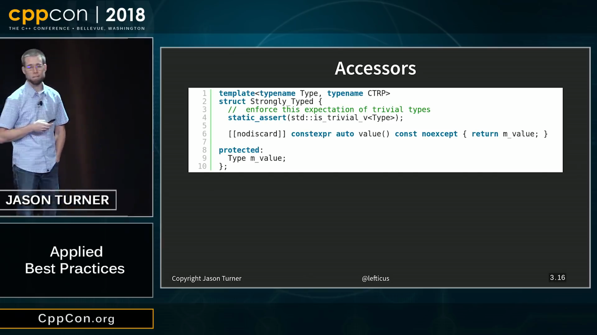
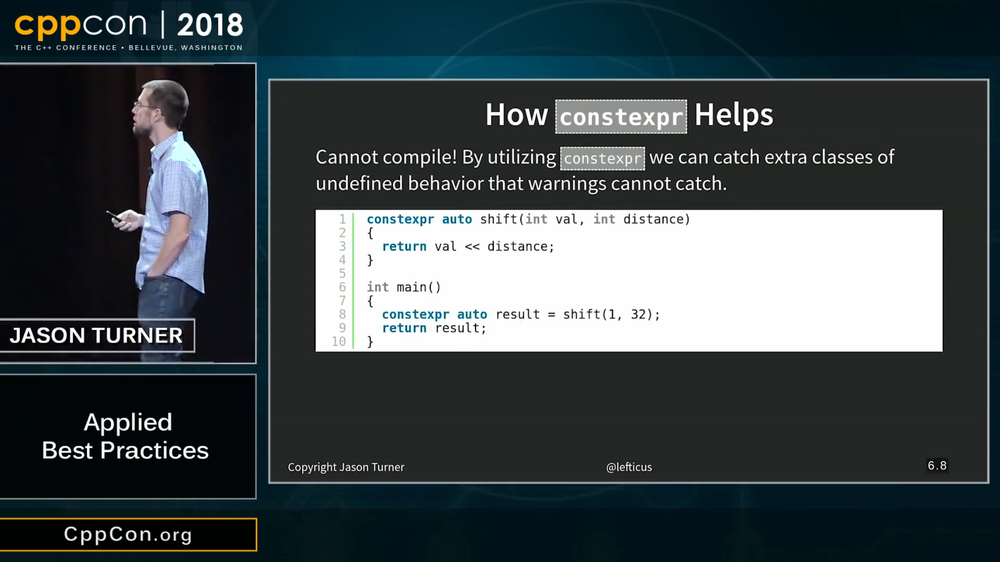
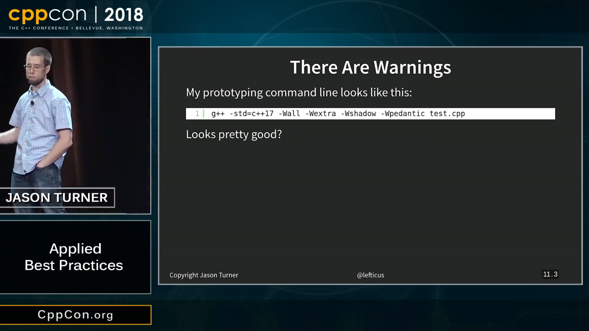
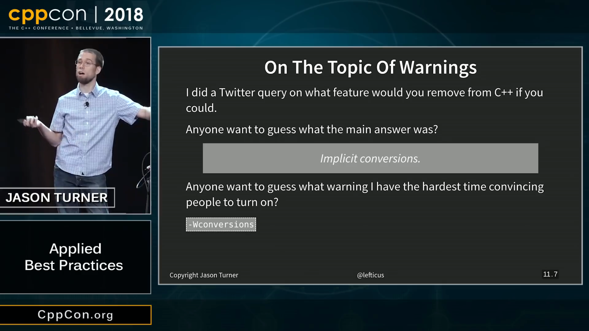
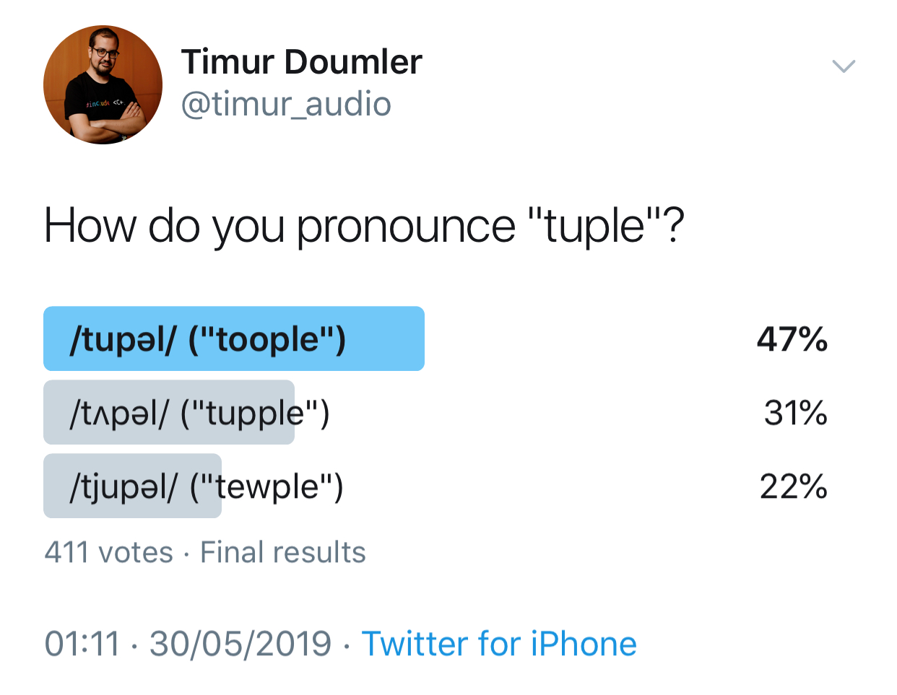

----

Apple SwiftUI and C++
---------------------

.. image:: img/swift-ui-cpp.png

Myths about C++
---------------

https://www.reddit.com/r/cpp/comments/bvf78q/myths/

See also
~~~~~~~~

* `Bjarne Stroustrup - Five Popular Myths about C++ <http://www.stroustrup.com/Myths-final.pdf>`_

CppCon 2018: Jason Turner - Applied Best Practices
--------------------------------------------------

* Video: https://youtu.be/DHOlsEd0eDE
* Slides: https://github.com/CppCon/CppCon2018/blob/master/Presentations/applied_best_practices/applied_best_practices__jason_turner__cppcon_2018.pdf

CppCon 2018: Jason Turner - Applied Best Practices (cont.)
----------------------------------------------------------

CppCon 2018: Jason Turner - Applied Best Practices (cont.)
----------------------------------------------------------

.. image:: img/turner-applied-best-practices-2.png

CppCon 2018: Jason Turner - Applied Best Practices (cont.)
----------------------------------------------------------

.. image:: img/turner-applied-best-practices-3.png

CppCon 2018: Jason Turner - Applied Best Practices (cont.)
----------------------------------------------------------

CppCon 2018: Jason Turner - Applied Best Practices (cont.)
----------------------------------------------------------

.. image:: img/turner-applied-best-practices-5.png

CppCon 2018: Jason Turner - Applied Best Practices (cont.)
----------------------------------------------------------

CppCon 2018: Jason Turner - Applied Best Practices (cont.)
----------------------------------------------------------

.. image:: img/turner-applied-best-practices-7.png

CppCon 2018: Jason Turner - Applied Best Practices (cont.)
----------------------------------------------------------

CppCon 2018: Jason Turner - Applied Best Practices (cont.)
----------------------------------------------------------

.. image:: img/turner-applied-best-practices-9.png

Simplifying C++ with Herb Sutter
--------------------------------

* CppCast http://cppcast.com/2019/05/herb-sutter/
  * Reddit https://www.reddit.com/r/cpp/comments/bv3bc9/cppcast_simplifying_c_with_herb_sutter/
* A theme: Simplifying C++ (& CppCast podcast) https://herbsutter.com/2019/06/01/a-theme-simplifying-c-cppcast-podcast/
  * Reddit https://www.reddit.com/r/cpp/comments/bvukm6/a_theme_simplifying_c_cppcast_podcast/

Awesome Modern C++
------------------

https://awesomecpp.com/

C++ Operator Signatures
-----------------------

https://gist.github.com/beached/38a4ae52fcadfab68cb6de05403fa393

https://github.com/glebd/cppclub/blob/next/3rd/C%2B%2B%2520normal%2520operators.md

Hedley
------

Hedley: A C/C++ header to help move ``#ifdef``s out of your code

* Home page: https://nemequ.github.io/hedley/
* Reddit: https://www.reddit.com/r/cpp/comments/bm2xyk/hedley_a_cc_header_to_help_move_ifdefs_out_of/

STXXL
-----

STXXL: Standard Template Library for Extra Large Data Sets.

The core of STXXL is an implementation of the C++ standard template library for external memory (out-of-core) computations, i. e., STXXL implements containers and algorithms that can process huge volumes of data that only fit on disks. While the closeness to the STL supports ease of use and compatibility with existing applications, another design priority is high performance.

* Home: http://stxxl.org/
* Code: https://github.com/stxxl/stxxl (Boost Software License)
* Video: http://panthema.net/2014/0622-Talk-STXXL-1.4.0-and-Beyond/

Function Poisoning in C++
-------------------------

https://www.fluentcpp.com/2018/09/04/function-poisoning-in-cpp/

.. code:: c++

    #include <stdio.h>
    #pragma GCC poison puts

    int main() {
        puts("a");
    }

    // error: attempt to use poisoned "puts"

Deprecating and Deleting Functions in C++
-----------------------------------------

https://www.fluentcpp.com/2018/11/20/deprecating-and-deleting-functions-in-cpp/

.. code:: c++

    [[deprecated("Replaced by fillmem, which has an improved interface")]]
    void* memset(void*, int, size_t);

Clear, Functional C++ Documentation with Sphinx + Breathe + Doxygen + CMake
---------------------------------------------------------------------------

https://devblogs.microsoft.com/cppblog/clear-functional-c-documentation-with-sphinx-breathe-doxygen-cmake/

See also
~~~~~~~~

* `CppCon 2017: Robert Ramey “How to Write Effective Documentation for C++ Libraries...” <https://youtu.be/YxmdCxX9dMk>`_
* `Eli Bendersky - reStructuredText vs. Markdown for technical documentation <https://eli.thegreenplace.net/2017/restructuredtext-vs-markdown-for-technical-documentation/>`_
* `Viktor Zverovich - reStructuredText vs Markdown for documentation <http://www.zverovich.net/2016/06/16/rst-vs-markdown.html>`_

Twitter
-------

Quote
-----

Cedric Guillemet ``@skaven_``:

    Any sufficiently advanced C++ codebase contains a Utils.cpp/h
