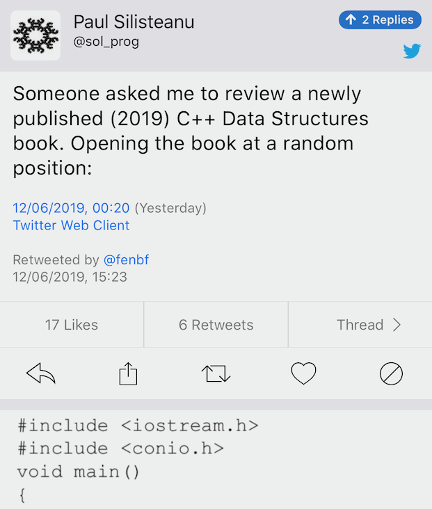

----

P0976r0: Bjarne Stroustrup - The Evils of Paradigms
---------------------------------------------------

http://wg21.link/p0976r0

    In programming, some people deem imperative, object-oriented, and functional programming different paradigms. I
    think the very notion of a paradigm does harm to use and to design because people all too easily fall into the trap
    of considering only one paradigm “good” and then try to fit everything into it, discarding all aspects of
    alternative “paradigms” as wrong or inferior (aka “If your only tool is a hammer, everything looks like a nail”).

CppCast: Pattern Matching with Michael Park
-------------------------------------------

http://cppcast.com/2019/06/michael-park/

P1371: Pattern Matching http://wg21.link/p1371r0

The Story: Bloomberg senior developer Elliot Goodrich
-----------------------------------------------------

https://www.client-server.com/blog/2019/06/the-story-bloomberg-senior-developer-elliot-goodrich

    I don't think C++ is dying by any stretch of the imagination.

https://www.reddit.com/r/cpp/comments/bw8fyu/interesting_interview_on_client_servers_blog_with/

Modern C++ - authors and books
------------------------------

https://www.reddit.com/r/cpp/comments/by60wx/modern_c_authors_and_books/

Enum template parameters
------------------------

.. code:: c++

    enum Foo {FooBar, FooBaz};

    template<Foo foo>
    struct Test {
        Kind kind{foo};
    };

    int main() {
        Test<FooBar> fooBar;
        assert(fooBar.kind==FooBar);
    }

Roman numerals in C++
---------------------

https://github.com/tcbrindle/numeris_romanis

https://www.reddit.com/r/cpp/comments/bxiqmm/numeris_romanis_roman_numeral_support_for_c17/

Unrelated: `What are the rules about using an underscore in a C++ identifier? <https://stackoverflow.com/questions/228783/what-are-the-rules-about-using-an-underscore-in-a-c-identifier>`_

    Each name that begins with an underscore is reserved to the implementation for use as a name in the global namespace.

Understanding when not to **std::move** in C++
----------------------------------------------

https://developers.redhat.com/blog/2019/04/12/understanding-when-not-to-stdmove-in-c/

GCC 9:

.. code:: bash

    -Wall -Wpessimizing-move

Example:

.. code:: c++

    T fn() {
      T t;
      return std::move(t); // Prevents NRVO: returned expression must be a name
    }

Understanding when not to **std::move** in C++ (cont.)
------------------------------------------------------

GCC 9:

.. code:: bash

    -Wextra -Wredundant-move

Example:

.. code:: c++

    struct T {
      T(const T&) = delete;
      T(T&&);
    };

    T fn(T t) {
      return std::move(t); // Redundant: move used implicitly
    }

Understanding when not to **std::move** in C++ (cont.)
------------------------------------------------------

When ``std::move`` makes sense:

.. code:: c++

    struct U {};
    struct T : U {};

    U f() {
      T t;
      return std::move(t); // Necessary
    }

Explanation:

    When a function returns an object whose type is a class derived from the class type the function returns. In that case, overload resolution is performed a second time, this time treating the object as an *lvalue*.

Building better software with better tools: sanitizers versus valgrind
----------------------------------------------------------------------

https://lemire.me/blog/2019/05/16/building-better-software-with-better-tools-sanitizers-versus-valgrind/

Also: `No more leaks with sanitize flags in gcc and clang <https://lemire.me/blog/2016/04/20/no-more-leaks-with-sanitize-flags-in-gcc-and-clang/>`_

**variadic_future**
-------------------

A variadic, completion-based future class for C++17

https://github.com/FrancoisChabot/variadic_future (Apache 2.0)

Re-implementing an old DOS game in C++17
----------------------------------------

https://lethalguitar.wordpress.com/2019/05/28/re-implementing-an-old-dos-game-in-c-17/

Code: https://github.com/lethal-guitar/RigelEngine

Duke Nukem II: https://en.wikipedia.org/wiki/Duke_Nukem_II

Reddit:

* https://www.reddit.com/r/cpp/comments/bubyrn/reimplementing_an_old_dos_game_in_c_17/
* https://www.reddit.com/r/programming/comments/buc3u4/reimplementing_an_old_dos_game_in_c_17/

Also: https://osgameclones.com/

Using **main** is undefined behaviour
-------------------------------------

Shafik Yaghmour:

.. code:: c++

    int main() {
        decltype(main()) x;
        return static_cast<bool>(&main);
    }

.. image:: img/rules-main.png

Attempting to modify a const object is undefined behaviour
----------------------------------------------------------

Shafik Yaghmour:

.. code:: c++

    int b() {
        const int x=1;
        int* p = const_cast<int*>(&x); // OK
        *p = 2;                        // UB
        return *p;
    }

C++17 STL Parallel Algorithms - with GCC 9.1 and Intel TBB on Linux and macOS
-----------------------------------------------------------------------------

https://solarianprogrammer.com/2019/05/09/cpp-17-stl-parallel-algorithms-gcc-intel-tbb-linux-macos/

Threading Building Blocks (TBB) https://www.threadingbuildingblocks.org/

GitHub: https://github.com/intel/tbb (Apache 2.0)

    Since 2018 U5 TBB binary packages include Parallel STL as a high-level component.

Parallel STL: https://github.com/intel/parallelstl (Apache 2.0)

Quote
-----

Melinda Varian:

    The best programs are the ones written when the programmer is supposed to be working on something else.
