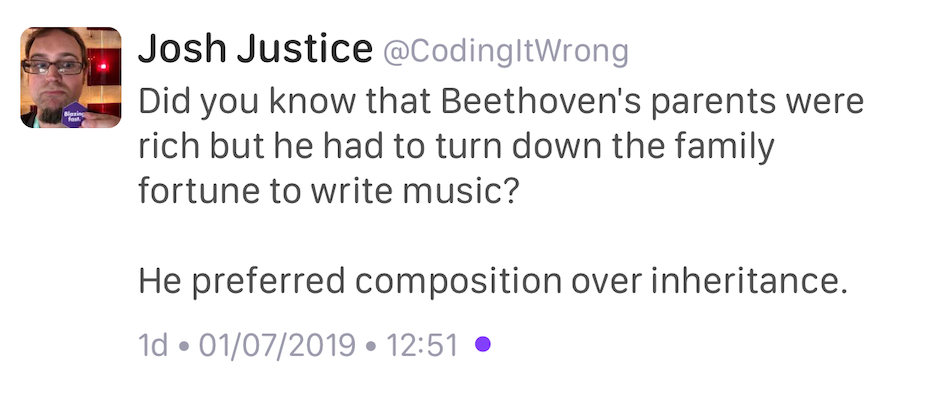

----

A dbg(…) macro for C++
------------------------

https://github.com/sharkdp/dbg-macro

https://www.reddit.com/r/cpp/comments/c2ysa7/a_dbg_macro_for_c/

https://doc.rust-lang.org/std/macro.dbg.html

Algorithms/Data Structure course for C++
----------------------------------------

* Stanford `CS106B - Programming Abstractions <https://see.stanford.edu/Course/CS106B>`_
* MIT `6.006 Introduction to Algorithms, Fall 2011 <https://www.youtube.com/playlist?list=PLUl4u3cNGP61Oq3tWYp6V_F-5jb5L2iHb>`_
* MIT `6.046J Design and Analysis of Algorithms, Spring 2015 <https://www.youtube.com/playlist?list=PLUl4u3cNGP6317WaSNfmCvGym2ucw3oGp>`_
* Alex Stepanov `Efficient Programming with Components <https://www.youtube.com/playlist?list=PLHxtyCq_WDLXryyw91lahwdtpZsmo4BGD>`_
* Udemy `Mastering Data Structures & Algorithms using C and C++ <https://www.udemy.com/datastructurescncpp/>`_

mimalloc
--------

Microsoft mimalloc is a compact general purpose allocator with excellent performance.

https://github.com/microsoft/mimalloc

https://www.reddit.com/r/programming/comments/c3ox2r/mimalloc_is_a_compact_general_purpose_allocator/

`Mimalloc: Free List Sharding in Action
<https://www.microsoft.com/en-us/research/publication/mimalloc-free-list-sharding-in-action/>`_

Serenity OS
-----------

https://github.com/SerenityOS/serenity (BSD-2-Clause)

https://www.reddit.com/r/programming/comments/c13vph/serenityos_a_marriage_between_the_aesthetic_of/

Serenity OS Patterns: The Badge
-------------------------------

(aka The Client-Attorney Idiom)

https://awesomekling.github.io/Serenity-C++-patterns-The-Badge/

* `Reddit <https://www.reddit.com/r/cpp/comments/bzjbu1/serenity_c_patterns_the_badge/>`_
* `SO: Granular friend <https://stackoverflow.com/questions/3217390/clean-c-granular-friend-equivalent-answer-attorney-client-idiom/3218920#3218920>`_
* `Dr. Dobbs - Friendship and the Attorney-Client Idiom <http://www.drdobbs.com/friendship-and-the-attorney-client-idiom/184402053>`_

.. code:: c++

    class Foo;
    class Bar { public: void special(int a, Key<Foo>); };
    Bar().special(1, {}); // at call site in Foo

What are some uses of decltype(auto)?
-------------------------------------

https://stackoverflow.com/questions/24109737/what-are-some-uses-of-decltypeauto

* https://stackoverflow.com/a/24109800/10154
* https://stackoverflow.com/a/24109944/10154

LibTom
------

https://www.libtom.net/

https://github.com/libtom/libtomcrypt

The Power of Hidden Friends in C++
----------------------------------

Article by Anthony Williams

https://www.justsoftwaresolutions.co.uk/cplusplus/hidden-friends.html

.. code:: c++

    namespace A{
      class X{
      public:
        X(int i):data(i){}
      private:
        int data;
        friend bool operator==(X const& lhs,X const& rhs){
          return lhs.data==rhs.data;
        }
      };
    }

**strong_typedef** - Create distinct types for distinct purposes
----------------------------------------------------------------

Article by Anthony Williams

https://www.justsoftwaresolutions.co.uk/cplusplus/strong_typedef.html

https://github.com/anthonywilliams/strong_typedef ()

.. code:: c++

    using transaction_id =
      jss::strong_typedef<struct transaction_tag, std::string>;

    bool is_a_foo(transaction_id id)
    {
      auto &s = id.underlying_value();
      return s.find("foo") != s.end();
    }

Introducing the Rule of DesDeMovA
---------------------------------

Blog post by Peter Sommerlad

https://blog.safecpp.com

https://accu.org/content/conf2014/Howard_Hinnant_Accu_2014.pdf

Rule of Zero:

    Code that you do not write cannot be wrong.

A closer look at **bake**: a tool that makes building C/C++ code effortless
---------------------------------------------------------------------------

https://medium.com/@cortoproject/a-closer-look-at-bake-a-tool-that-makes-building-c-c-code-effortless-b2e0409fad8f

* https://www.reddit.com/r/C_Programming/comments/a85f6w/meet_bake_a_new_build_system_package_manager_for/
* https://www.reddit.com/r/cpp/comments/a8d7ny/meet_bake_a_new_build_system_package_manager_for/
* https://news.ycombinator.com/item?id=18787777

https://github.com/SanderMertens/bake (GPLv3)

    A cargo-like buildsystem and package manager for C/C++

Magic.

Twitter
-------

