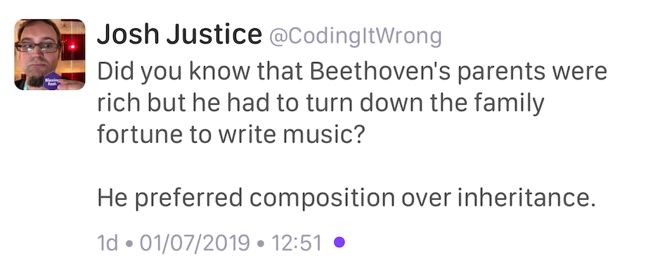

----

Elements of Programming Authors' Edition (free ebook)
-----------------------------------------------------

http://componentsprogramming.com/elements-of-programming-authors-edition/

https://www.reddit.com/r/cpp/comments/c6fjjg/elements_of_programming_authors_edition/

  Alex Stepanov and Paul McJones have just released Elements of Programming Authors’ Edition.

PDF download:

http://elementsofprogramming.com/

C++17 - The Complete Guide by Nicolai Josuttis
----------------------------------------------

https://leanpub.com/cpp17

CLion 2019.2 EAP: MSVC Debugger, Unused Includes Check, and More
----------------------------------------------------------------

https://blog.jetbrains.com/clion/2019/06/clion-2019-2-eap-msvc-debugger-unused-includes-check-and-more/

* Experimental feature: LLDB-based Debugger for the Microsoft Visual C++ toolchain
* The ‘unused includes’ check is back
* Memory view: ASCII view
* Better performance for code completion

https://www.reddit.com/r/cpp/comments/c5vnhw/clion_20192_eap_brings_experimental_lldbbased/

A dbg(…) macro for C++
------------------------

https://github.com/sharkdp/dbg-macro

https://www.reddit.com/r/cpp/comments/c2ysa7/a_dbg_macro_for_c/

https://doc.rust-lang.org/std/macro.dbg.html

Algorithms/Data Structure course for C++
----------------------------------------

* Stanford `CS106B - Programming Abstractions <https://see.stanford.edu/Course/CS106B>`_
* MIT `6.006 Introduction to Algorithms, Fall 2011 <https://www.youtube.com/playlist?list=PLUl4u3cNGP61Oq3tWYp6V_F-5jb5L2iHb>`_
* MIT `6.046J Design and Analysis of Algorithms, Spring 2015 <https://www.youtube.com/playlist?list=PLUl4u3cNGP6317WaSNfmCvGym2ucw3oGp>`_
* Alex Stepanov `Efficient Programming with Components <https://www.youtube.com/playlist?list=PLHxtyCq_WDLXryyw91lahwdtpZsmo4BGD>`_
* Udemy `Mastering Data Structures & Algorithms using C and C++ <https://www.udemy.com/datastructurescncpp/>`_

mimalloc
--------

Microsoft **mimalloc** is a compact general purpose allocator with excellent performance.

https://github.com/microsoft/mimalloc

https://www.reddit.com/r/programming/comments/c3ox2r/mimalloc_is_a_compact_general_purpose_allocator/

`Mimalloc: Free List Sharding in Action
<https://www.microsoft.com/en-us/research/publication/mimalloc-free-list-sharding-in-action/>`_

Serenity OS
-----------

https://github.com/SerenityOS/serenity (BSD-2-Clause)

https://www.reddit.com/r/programming/comments/c13vph/serenityos_a_marriage_between_the_aesthetic_of/

Serenity OS Patterns: The Badge
-------------------------------

(aka The Client-Attorney Idiom)

https://awesomekling.github.io/Serenity-C++-patterns-The-Badge/

* `Reddit <https://www.reddit.com/r/cpp/comments/bzjbu1/serenity_c_patterns_the_badge/>`_
* `SO: Granular friend <https://stackoverflow.com/questions/3217390/clean-c-granular-friend-equivalent-answer-attorney-client-idiom/3218920#3218920>`_
  - Live code: http://ideone.com/7n1Wwz
* `Dr. Dobbs - Friendship and the Attorney-Client Idiom <http://www.drdobbs.com/friendship-and-the-attorney-client-idiom/184402053>`_

.. code:: c++

  template<typename T>
  class Key { friend T; Key(){} Key(Key const&){} };
  class Foo;
  class Bar { public: void special(int a, Key<Foo>); }; // protected API
  class Foo { public: void special() { Bar().special(1, {}); } };

  // At call site
  Foo().special();      // OK
  Bar().special(1, {}); // Error: Key<Foo> ctor is private

Catching use-after-move bugs with Clang's consumed annotations
--------------------------------------------------------------

`Article by Andreas Kling <https://awesomekling.github.io/Catching-use-after-move-bugs-with-Clang-consumed-annotations/>`_ | `Reddit <https://www.reddit.com/r/cpp/comments/cbin7c/catching_useaftermove_bugs_with_clangs_consumed/>`_

- `Clang consumed annotation checking <https://clang.llvm.org/docs/AttributeReference.html#consumed-annotation-checking>`_

.. code:: c++

  class [[clang::consumable(unconsumed)]] CleverObject {
  public:
    CleverObject() {}
    CleverObject(CleverObject&& other) { other.invalidate(); }
    [[clang::callable_when(unconsumed)]]
    void do_something() { assert(m_valid); }
  private:
    [[clang::set_typestate(consumed)]]
    void invalidate() { m_valid = false; }
    bool m_valid { true };
  };

- `Clang-tidy bugprone-use-after-move <https://clang.llvm.org/extra/clang-tidy/checks/bugprone-use-after-move.html>`_

What are some uses of decltype(auto)?
-------------------------------------

https://stackoverflow.com/questions/24109737/what-are-some-uses-of-decltypeauto

* https://stackoverflow.com/a/24109800/10154
* https://stackoverflow.com/a/24109944/10154

LibTom
------

https://www.libtom.net/

https://github.com/libtom/libtomcrypt

The Power of Hidden Friends in C++
----------------------------------

Article by Anthony Williams

https://www.justsoftwaresolutions.co.uk/cplusplus/hidden-friends.html

.. code:: c++

  namespace A{
    class X{
    public:
      X(int i):data(i){}
    private:
      int data;
      friend bool operator==(X const& lhs,X const& rhs){
        return lhs.data==rhs.data;
      }
    };
  }

How to try the new coroutines TS?
---------------------------------

https://www.reddit.com/r/cpp/comments/c6ag3l/how_to_try_the_new_coroutines_ts/

MSVC
~~~~

.. code:: cmd

  /await /std:c++latest

Clang
~~~~~

.. code:: bash

  -std=c++2a -stdlib=libc++ -fcoroutines-ts

* CppCoro - https://github.com/lewissbaker/cppcoro
* coroutine - https://github.com/luncliff/coroutine
* continuable - https://github.com/Naios/continuable

Discussion: member variable naming
----------------------------------

https://www.reddit.com/r/cpp/comments/c6rnel/discussion_member_variable_naming/

* ``m_foo``
* ``foo_``
* ``_foo``

Twitter
-------

