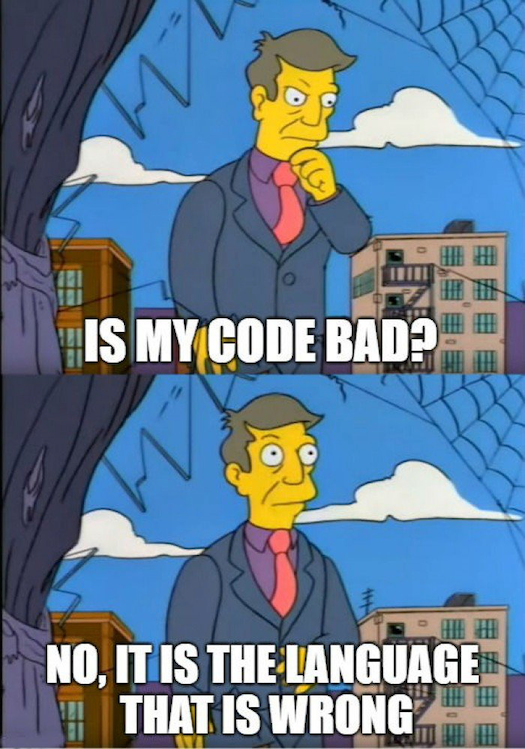
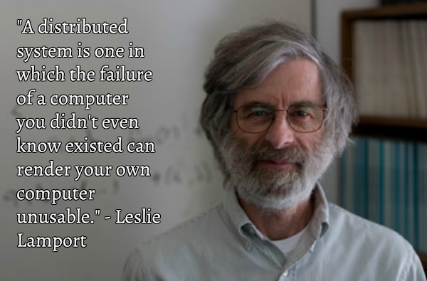

----

C++20 is feature-complete
-------------------------

I wonder what was this tweet about.

``C++20 -= Contracts`` perhaps?

Cologne trip reports
--------------------

* `Herb Sutter <https://herbsutter.com/2019/07/20/trip-report-summer-iso-c-standards-meeting-cologne/>`_
  - `Reddit <https://www.reddit.com/r/cpp/comments/cfpwvv/trip_report_summer_iso_c_standards_meeting_cologne/>`_
* `Bryce Lelbach <https://www.reddit.com/r/cpp/comments/cfk9de/201907_cologne_iso_c_committee_trip_report_the/>`_
  - `On the proposed coroutine keywords <https://www.reddit.com/r/cpp/comments/cfk9de/201907_cologne_iso_c_committee_trip_report_the/euaj7xz?utm_source=share&utm_medium=web2x>`_
  - `On the madness that is std::web_view <https://www.reddit.com/r/cpp/comments/cfk9de/201907_cologne_iso_c_committee_trip_report_the/eub1zjy?utm_source=share&utm_medium=web2x>`_
  - `On the constinit keyword <https://www.reddit.com/r/cpp/comments/cfk9de/201907_cologne_iso_c_committee_trip_report_the/euahb2a?utm_source=share&utm_medium=web2x>`_
  - `On the spaceship operator <https://www.reddit.com/r/cpp/comments/cfk9de/201907_cologne_iso_c_committee_trip_report_the/eucur9p?utm_source=share&utm_medium=web2x>`_

Why std::expected is not in the standard yet? Is it bad practice?
-----------------------------------------------------------------

https://www.reddit.com/r/cpp/comments/c75ipk/why_stdexpected_is_not_in_the_standard_yet_is_it/

* ``std::expected`` https://github.com/TartanLlama/expected
* Boost Outcome https://www.boost.org/doc/libs/1_70_0/libs/outcome/doc/html/index.html
* Outcome without Boost https://ned14.github.io/outcome/
* Leaf https://github.com/zajo/leaf

Scott Meyers' TD trick
----------------------

https://www.reddit.com/r/cpp/comments/c6vnb3/just_started_learning_c_coming_from_python_and/eshq8vb?utm_source=share&utm_medium=web2x

.. code:: c++

  template <typename T> struct TD; // no definition

Now you write something like ``TD<decltype(thing)>`` and the error message tells you the type of thing (as deduced by
``decltype``, of course, but in this case that's probably what you want).

Just started learning C++ coming from Python
--------------------------------------------

https://www.reddit.com/r/cpp/comments/c6vnb3/just_started_learning_c_coming_from_python_and/

  The new GCC compiler with colour highlighting is a little bit better at pointing out errors. It's generally quite
  helpful for pure C/C++ until you make an error with the standard library and you get 200 lines about std::
  whatever<random characters>

  In C++ a trick I always use when the error message is massive is to just focus on the first error.

How do C++ developers manage dependencies?
------------------------------------------

https://www.reddit.com/r/cpp/comments/c6l3eg/how_do_c_developers_manage_dependencies/

  Through much pain and anguish.

How do you get the benefits of Rust in C++?
-------------------------------------------

https://www.reddit.com/r/cpp/comments/c6gtd4/how_do_you_get_the_benefits_of_rust_in_c/

Use constexpr for faster, smaller, and safer code
-------------------------------------------------

https://blog.trailofbits.com/2019/06/27/use-constexpr-for-faster-smaller-and-safer-code/

https://www.reddit.com/r/cpp/comments/c646ng/use_constexpr_for_faster_smaller_and_safer_code/

https://github.com/trailofbits/constexpr-everything (Apache 2.0)

A closer look at **bake**: a tool that makes building C/C++ code effortless
---------------------------------------------------------------------------

https://medium.com/@cortoproject/a-closer-look-at-bake-a-tool-that-makes-building-c-c-code-effortless-b2e0409fad8f

* https://www.reddit.com/r/C_Programming/comments/a85f6w/meet_bake_a_new_build_system_package_manager_for/
* https://www.reddit.com/r/cpp/comments/a8d7ny/meet_bake_a_new_build_system_package_manager_for/
* https://news.ycombinator.com/item?id=18787777

https://github.com/SanderMertens/bake (GPLv3)

    A cargo-like buildsystem and package manager for C/C++

Magic.

Introducing the Rule of DesDeMovA (1/4)
---------------------------------------

Blog post by Peter Sommerlad

https://blog.safecpp.com/2019/07/01/initial.html

https://accu.org/content/conf2014/Howard_Hinnant_Accu_2014.pdf

Rule of Zero:

    Code that you do not write cannot be wrong.

Introducing the Rule of DesDeMovA (2/4)
---------------------------------------

.. image:: img/sommerlad-desdemova1.png

Introducing the Rule of DesDeMovA (3/4)
---------------------------------------

.. image:: img/sommerlad-desdemova2.png

Introducing the Rule of DesDeMovA (3/4)
---------------------------------------

.. image:: img/sommerlad-desdemova3.png

**strong_typedef** - Create distinct types for distinct purposes
----------------------------------------------------------------

Article by Anthony Williams

https://www.justsoftwaresolutions.co.uk/cplusplus/strong_typedef.html

https://github.com/anthonywilliams/strong_typedef ()

.. code:: c++

  using transaction_id =
    jss::strong_typedef<struct transaction_tag, std::string>;

  bool is_a_foo(transaction_id id)
  {
    auto &s = id.underlying_value();
    return s.find("foo") != s.end();
  }

Elements C++ GUI library
------------------------

https://www.cycfi.com/2019/07/photon-micro-gui/

https://www.reddit.com/r/cpp/comments/ccq9pn/elemental_c_gui_library/

CppCast - CMake and VTK with Robert Maynard
-------------------------------------------

http://cppcast.com/2019/07/robert-maynard/

https://www.reddit.com/r/cpp/comments/c9bpxb/cppcast_cmake_and_vtk_with_robert_maynard/

CMake line by line - creating a header-only library
---------------------------------------------------

http://dominikberner.ch/cmake-interface-lib/

https://www.reddit.com/r/cpp/comments/c8ty2h/a_line_by_line_explanation_how_to_create_a/

https://github.com/bernedom/SI

Professional CMake: A Practical Guide, 4th ed., CMake 3.15 https://crascit.com/professional-cmake/ $30

Microsoft to explore using Rust
-------------------------------

https://www.zdnet.com/article/microsoft-to-explore-using-rust/

https://www.reddit.com/r/cpp/comments/cegbhj/microsoft_looking_into_rust_as_an_alternative_to_c/

Quote
-----

Reddit
------

Vittorio Romeo:

