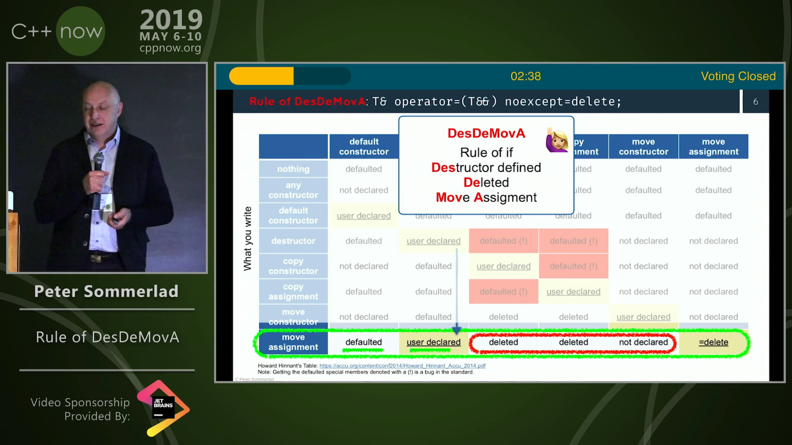

----

What Happened to C++20 Contracts?
---------------------------------

Nathan Myers: https://www.reddit.com/r/cpp/comments/cmk7ek/what_happened_to_c20_contracts/

  This was the first time, in the (exactly) 30 years since ISO was first asked to form a Working Group to standardize C++, that the committee has removed from its Working Draft a major feature, for no expressible technical reason.

  Almost immediately after the feature was voted in, one party to the original agreement -- authors of the rejected 2012 design -- began to post a bewildering variety of proposals for radical changes to the design, promoting them by encouraging confusion about consequences of the agreed-upon design.

What Happened to C++20 Contracts? (cont.)
-----------------------------------------

  One of the proposals, not seen before the day it was presented, seemed to offer that simplicity, and the group seized upon it, voting for it by a margin of 3 to 1. It was opposed by four of the five participants of the original design group, because it was fatally flawed: in use, programmers would need to define preprocessor macros, and put calls to those in their code instead of the core-language syntax defined. It would breed "macro hell".

  On top of its inherent flaws, it amounted to a radical redesign from what was originally accepted by the full committee.

  The immediate, predictable effect was panic. <...>

  Two days later, the same Evolution Working Group voted to remove the feature entirely.

My word, what a thread.

Bryce Lelbach on the C++ Committee
----------------------------------

Twitter: who does what in the C++ Committee
-------------------------------------------

.. image:: img/committee-who-does-what.png

Improved Linker Fundamentals in Visual Studio 2019
--------------------------------------------------

https://devblogs.microsoft.com/cppblog/improved-linker-fundamentals-in-visual-studio-2019/

https://www.reddit.com/r/cpp/comments/chqj93/visual_c_linking_speedup_by_23x_in_latest_visual/

Technical vision for Qt 6
-------------------------

https://blog.qt.io/blog/2019/08/07/technical-vision-qt-6/

https://www.reddit.com/r/cpp/comments/cn52ql/technical_vision_for_qt_6/

* C++17
* Strongly-typed QML
* QML to C++ compilation, JavaScript optional
* CMake as the build system
* Next-generation graphics support

How do C++ developers manage dependencies?
------------------------------------------

https://www.reddit.com/r/cpp/comments/c6l3eg/how_do_c_developers_manage_dependencies/

  Through much pain and anguish.

Scott Meyers' TD trick
----------------------

https://www.reddit.com/r/cpp/comments/c6vnb3/just_started_learning_c_coming_from_python_and/eshq8vb?utm_source=share&utm_medium=web2x

.. code:: c++

  template <typename T> struct TD; // no definition

Now you write something like ``TD<decltype(thing)>`` and the error message tells you the type of thing (as deduced by
``decltype``, of course, but in this case that's probably what you want).

Just started learning C++ coming from Python
--------------------------------------------

https://www.reddit.com/r/cpp/comments/c6vnb3/just_started_learning_c_coming_from_python_and/

  The new GCC compiler with colour highlighting is a little bit better at pointing out errors. It's generally quite
  helpful for pure C/C++ until you make an error with the standard library and you get 200 lines about std::
  whatever<random characters>

  In C++ a trick I always use when the error message is massive is to just focus on the first error.

Use **constexpr** for faster, smaller, and safer code
-----------------------------------------------------

https://blog.trailofbits.com/2019/06/27/use-constexpr-for-faster-smaller-and-safer-code/

https://www.reddit.com/r/cpp/comments/c646ng/use_constexpr_for_faster_smaller_and_safer_code/

https://github.com/trailofbits/constexpr-everything (Apache 2.0)

A closer look at **bake**: a tool that makes building C/C++ code effortless
---------------------------------------------------------------------------

https://medium.com/@cortoproject/a-closer-look-at-bake-a-tool-that-makes-building-c-c-code-effortless-b2e0409fad8f

* https://www.reddit.com/r/C_Programming/comments/a85f6w/meet_bake_a_new_build_system_package_manager_for/
* https://www.reddit.com/r/cpp/comments/a8d7ny/meet_bake_a_new_build_system_package_manager_for/
* https://news.ycombinator.com/item?id=18787777

https://github.com/SanderMertens/bake (GPLv3)

    A cargo-like buildsystem and package manager for C/C++

Magic.

Introducing the Rule of DesDeMovA (1/4)
---------------------------------------

Blog post by Peter Sommerlad

https://blog.safecpp.com/2019/07/01/initial.html

https://accu.org/content/conf2014/Howard_Hinnant_Accu_2014.pdf

Rule of Zero:

    Code that you do not write cannot be wrong.

Introducing the Rule of DesDeMovA (2/4)
---------------------------------------

.. image:: img/sommerlad-desdemova1.png

Introducing the Rule of DesDeMovA (3/4)
---------------------------------------

Introducing the Rule of DesDeMovA (3/4)
---------------------------------------

.. image:: img/sommerlad-desdemova3.png

**strong_typedef** - Create distinct types for distinct purposes
----------------------------------------------------------------

Article by Anthony Williams

https://www.justsoftwaresolutions.co.uk/cplusplus/strong_typedef.html

https://github.com/anthonywilliams/strong_typedef

.. code:: c++

  using transaction_id =
    jss::strong_typedef<struct transaction_tag, std::string>;

  bool is_a_foo(transaction_id id)
  {
    auto &s = id.underlying_value();
    return s.find("foo") != s.end();
  }

Elements C++ GUI library
------------------------

https://www.cycfi.com/2019/07/photon-micro-gui/

https://www.reddit.com/r/cpp/comments/ccq9pn/elemental_c_gui_library/

Are there any good C++ libraries for data visualization?
--------------------------------------------------------

* VTK https://vtk.org/
* ROOT https://root.cern.ch/
* matplotlib-cpp https://github.com/lava/matplotlib-cpp
  * matplotlib (Python) https://matplotlib.org/
* QCustomPlot (QT, GPL/commercial) https://www.qcustomplot.com/

CppCast - CMake and VTK with Robert Maynard
-------------------------------------------

http://cppcast.com/2019/07/robert-maynard/

https://www.reddit.com/r/cpp/comments/c9bpxb/cppcast_cmake_and_vtk_with_robert_maynard/

CMake line by line - creating a header-only library
---------------------------------------------------

http://dominikberner.ch/cmake-interface-lib/

https://www.reddit.com/r/cpp/comments/c8ty2h/a_line_by_line_explanation_how_to_create_a/

https://github.com/bernedom/SI

Professional CMake: A Practical Guide, 4th ed., CMake 3.15 https://crascit.com/professional-cmake/ $30

Are there any OSes built using C++
----------------------------------

https://www.reddit.com/r/cpp/comments/cho1qb/are_there_any_oses_built_using_c/

* `TempleOS <https://github.com/DivineSystems/DivineOS>`_
* `Haiku <https://www.haiku-os.org/>`_
* `Google Fuchsia <https://fuchsia.dev/>`_
* `IncludeOS <https://www.includeos.org/>`_
* `DistortOS <http://distortos.org/>`_ (RTOS)
* `Symbian OS <https://github.com/SymbianSource>`_ (Dead)
* `SerenityOS <https://github.com/SerenityOS/serenity>`_

CosmoScout VR
-------------

A virtual universe which lets you explore, analyze and present huge planetary datasets and large simulation data in real-time.

Uses C++17 and OpenGL.

https://github.com/cosmoscout/cosmoscout-vr (MIT) Copyright (c) 2019 German Aerospace Center (DLR)

https://www.reddit.com/r/cpp/comments/cn657d/the_german_center_for_aerospace_dlr_just_open/

Agner Vector Class Library V2
-----------------------------

This is a C++17 class library for using the Single Instruction Multiple Data (SIMD) instructions in modern microprocessors.

https://www.agner.org/optimize/blog/read.php?i=1013

https://github.com/vectorclass/version2 (Apache 2.0)

Manual https://github.com/vectorclass/manual/blob/master/vcl_manual.pdf

Bugs
----

.. image:: img/grumpy-bugs.png
