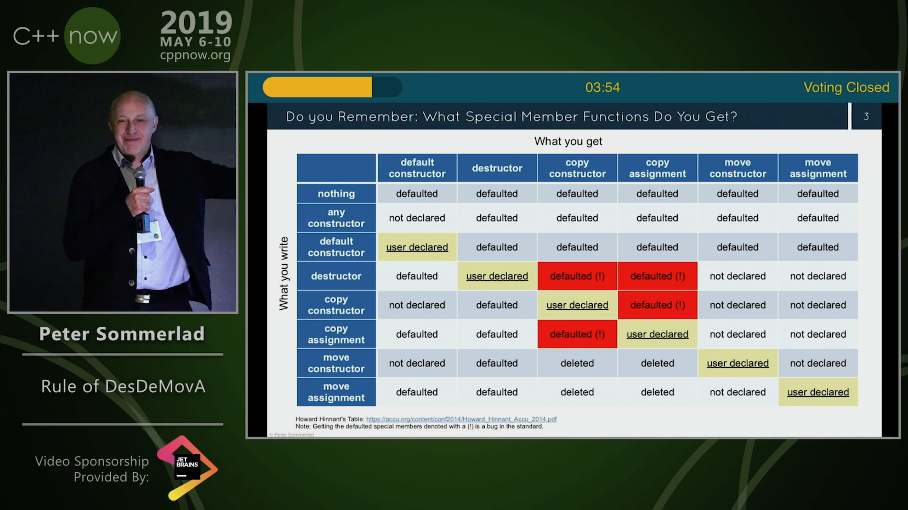
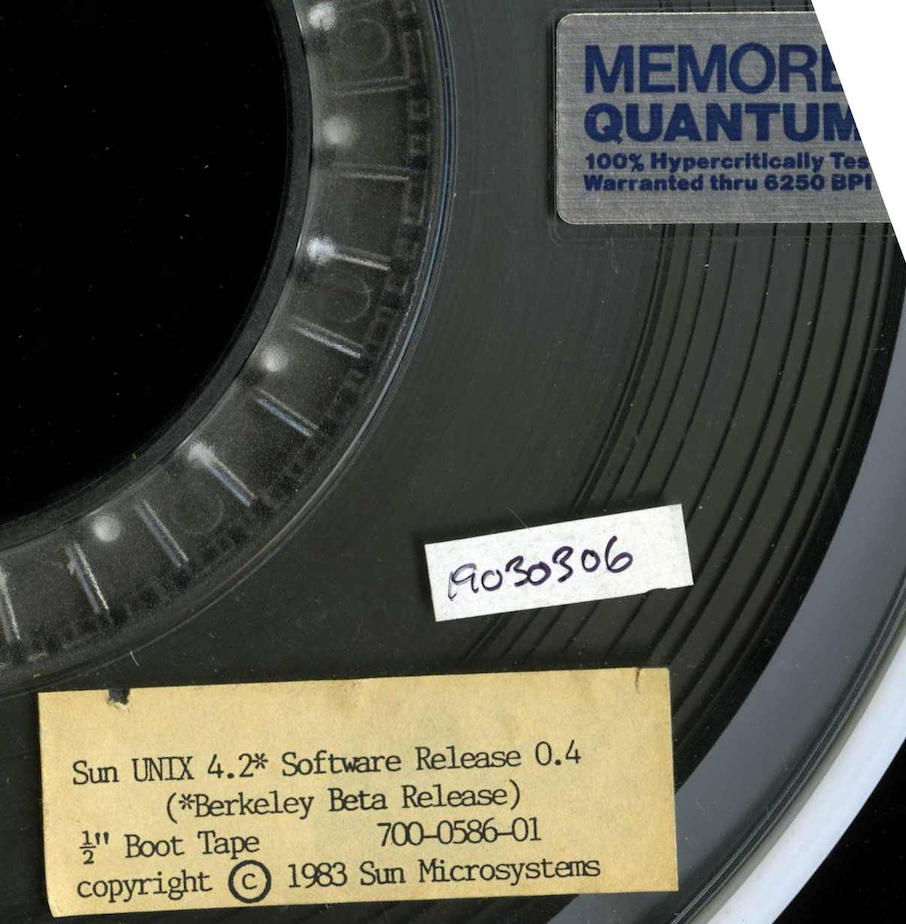

----

Free Book > Pro TBB
-------------------

C++ Parallel Programming with Threading Building Blocks

* `PDF <https://link.springer.com/content/pdf/10.1007%2F978-1-4842-4398-5.pdf>`_
* `Epub <https://link.springer.com/download/epub/10.1007%2F978-1-4842-4398-5.epub>`_

https://www.reddit.com/r/cpp/comments/cov2xw/pro_tbb_c_parallel_programming_with_threading/

Stop using out arguments
------------------------

Sean Parent: https://stlab.cc/tips/stop-using-out-arguments.html

out_ptr
-------

* `P1132R6 <https://thephd.github.io/vendor/future_cxx/papers/d1132.html>`_
* `Example <https://thephd.github.io/vendor/future_cxx/papers/d1132.html#design-casting-void>`_
* Code: https://github.com/ThePhD/out_ptr (Boost)

AnyDuck : A Value Type Erased Type
----------------------------------

Steve Downey: https://www.sdowney.org/2019/07/anyduck-a-value-type-erased-type/

Fixing c++ with epochs
----------------------

Vittorio Romeo: https://vittorioromeo.info/index/blog/fixing_cpp_with_epochs.html

Introducing the Rule of DesDeMovA (1/4)
---------------------------------------

Blog post by Peter Sommerlad

https://blog.safecpp.com/2019/07/01/initial.html

https://accu.org/content/conf2014/Howard_Hinnant_Accu_2014.pdf

Rule of Zero:

    Code that you do not write cannot be wrong.

Introducing the Rule of DesDeMovA (2/4)
---------------------------------------

Introducing the Rule of DesDeMovA (3/4)
---------------------------------------

.. image:: img/sommerlad-desdemova2.png

Introducing the Rule of DesDeMovA (3/4)
---------------------------------------

.. image:: img/sommerlad-desdemova3.png

**strong_typedef** - Create distinct types for distinct purposes
----------------------------------------------------------------

Article by Anthony Williams

https://www.justsoftwaresolutions.co.uk/cplusplus/strong_typedef.html

https://github.com/anthonywilliams/strong_typedef

.. code:: c++

  using transaction_id =
    jss::strong_typedef<struct transaction_tag, std::string>;

  bool is_a_foo(transaction_id id)
  {
    auto &s = id.underlying_value();
    return s.find("foo") != s.end();
  }

Elements C++ GUI library
------------------------

https://www.cycfi.com/2019/07/photon-micro-gui/

https://www.reddit.com/r/cpp/comments/ccq9pn/elemental_c_gui_library/

Are there any good C++ libraries for data visualization?
--------------------------------------------------------

* VTK https://vtk.org/
* ROOT https://root.cern.ch/
* matplotlib-cpp https://github.com/lava/matplotlib-cpp
  * matplotlib (Python) https://matplotlib.org/
* QCustomPlot (QT, GPL/commercial) https://www.qcustomplot.com/

CppCast - CMake and VTK with Robert Maynard
-------------------------------------------

http://cppcast.com/2019/07/robert-maynard/

https://www.reddit.com/r/cpp/comments/c9bpxb/cppcast_cmake_and_vtk_with_robert_maynard/

CMake line by line - creating a header-only library
---------------------------------------------------

http://dominikberner.ch/cmake-interface-lib/

https://www.reddit.com/r/cpp/comments/c8ty2h/a_line_by_line_explanation_how_to_create_a/

https://github.com/bernedom/SI

Professional CMake: A Practical Guide, 4th ed., CMake 3.15 https://crascit.com/professional-cmake/ $30

Are there any OSes built using C++
----------------------------------

https://www.reddit.com/r/cpp/comments/cho1qb/are_there_any_oses_built_using_c/

* `TempleOS <https://github.com/DivineSystems/DivineOS>`_
* `Haiku <https://www.haiku-os.org/>`_
* `Google Fuchsia <https://fuchsia.dev/>`_
* `IncludeOS <https://www.includeos.org/>`_
* `DistortOS <http://distortos.org/>`_ (RTOS)
* `Symbian OS <https://github.com/SymbianSource>`_ (Dead)
* `SerenityOS <https://github.com/SerenityOS/serenity>`_

Agner Vector Class Library V2
-----------------------------

This is a C++17 class library for using the Single Instruction Multiple Data (SIMD) instructions in modern microprocessors.

https://www.agner.org/optimize/blog/read.php?i=1013

https://github.com/vectorclass/version2 (Apache 2.0)

Manual https://github.com/vectorclass/manual/blob/master/vcl_manual.pdf

Retro
-----

