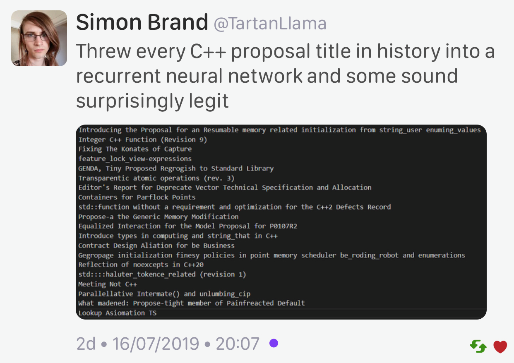
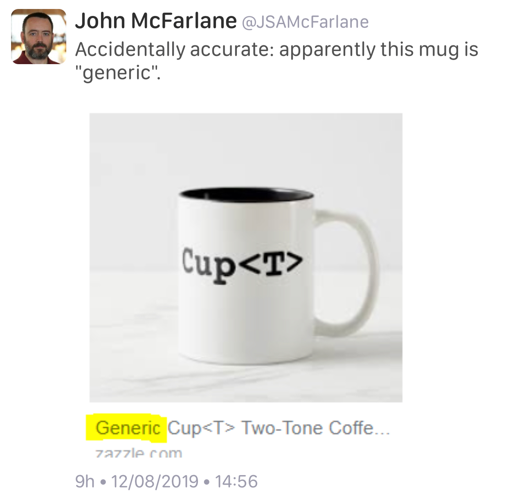

----

Post-Cologne Mailing
====================

http://www.open-std.org/jtc1/sc22/wg21/docs/papers/2019/#mailing2019-08

* `Reddit <https://www.reddit.com/r/cpp/comments/crg1dr/c_standards_committee_papers_201908_postcologne/>`_

Arthur O'Dwyer https://quuxplusone.github.io/blog/2019/08/18/post-cologne-mailing/

* `Reddit <https://www.reddit.com/r/cpp/comments/cs5qmf/the_postcologne_mailing_is_out/>`_

Rust vs. C++
============

Reddit: `Is the C++ committee or any key influencers in the C++ community working on anything to tackle the advantages that Rust
has over C++ (eg. Rust's borrow checking, compiler-checked concurrency safety and cargo package management)
<https://www.reddit.com/r/cpp/comments/crh7lh/is_the_c_committee_or_any_key_influencers_in_the/>`_

Vcpkg: 2019.07 Update
=====================

https://devblogs.microsoft.com/cppblog/vcpkg-2019-07-update/

https://www.reddit.com/r/cpp/comments/cqta79/vcpkg_201907_update/

  Hopefully you will not require specific versions of packages, as the workflow of vcpkg doesn't really support the
  (very common) scenario well.

Boost 1.71 released
===================

https://www.boost.org/users/history/version_1_71_0.html

* NEW: **Variant2**: A never-valueless, strong guarantee implementation of ``std::variant``, from
  Peter Dimov.
* `Reddit <https://www.reddit.com/r/cpp/comments/csj2ql/boost_version_1710/>`_

Lambdas vs. Closures
====================

`Scott Meyers <http://scottmeyers.blogspot.com/2013/05/lambdas-vs-closures.html>`_

* `Reddit <https://www.reddit.com/r/cpp/comments/cqo05i/lambdas_vs_closures_scott_meyers/>`_

Web Framework Benchmarks
========================

https://www.techempower.com/benchmarks/#section=test&runid=26a79c95-5eec-4572-8c94-dd710df659d7&hw=ph&test=update

* `Reddit <https://www.reddit.com/r/cpp/comments/csa0sg/drogonc17_becomes_one_of_the_fastest_web/>`_

https://github.com/an-tao/drogon

**Drogon**: A C++14/17 based HTTP web application framework running on Linux/macOS/Unix

Unified function call
=====================

Barry Revzin
------------

* `What is unified function call syntax anyway? <https://brevzin.github.io/c++/2019/04/13/ufcs-history/>`_
  * `Reddit <https://www.reddit.com/r/cpp/comments/bdflpx/what_is_unified_function_call_syntax_anyway/>`_
* `UFCS Customization and Extension <https://brevzin.github.io/c++/2019/08/22/ufcs-custom-extension/>`_
  * `Reddit <https://www.reddit.com/r/cpp/comments/ctykwd/ufcs_customization_and_extension/>`_
  * `P1282R0 Ceci N’est Pas Une Pipe: Adding a workflow operator to C++ <http://wg21.link/p1282>`_

Unified function call
=====================

Bjarne Stroustrup
-----------------

`A bit of background for the unified call proposal
<https://isocpp.org/blog/2016/02/a-bit-of-background-for-the-unified-call-proposal>`_

  Based on real input from code and users, I reluctantly agreed that for compatibility reasons,
  x.f(y) and f(x,y) could not mean exactly the same. The only feasible way forward was to do a
  traditional lookup based on the syntax used, and then try the other syntax if the first one
  failed. Stability – backwards compatibility – is an important feature, overruling my desire for
  perfection.

`P0131 Unified call syntax concerns
<http://www.open-std.org/jtc1/sc22/wg21/docs/papers/2015/p0131r0.pdf>`_

Introducing the Rule of DesDeMovA (1/4)
=======================================

Blog post by Peter Sommerlad

https://blog.safecpp.com/2019/07/01/initial.html

https://accu.org/content/conf2014/Howard_Hinnant_Accu_2014.pdf

Rule of Zero:

    Code that you do not write cannot be wrong.

Introducing the Rule of DesDeMovA (2/4)
=======================================

.. image:: img/sommerlad-desdemova1.png

Introducing the Rule of DesDeMovA (3/4)
=======================================

.. image:: img/sommerlad-desdemova2.png

Introducing the Rule of DesDeMovA (3/4)
=======================================

.. image:: img/sommerlad-desdemova3.png

**strong_typedef** - Create distinct types for distinct purposes
================================================================

Article by Anthony Williams

https://www.justsoftwaresolutions.co.uk/cplusplus/strong_typedef.html

https://github.com/anthonywilliams/strong_typedef

.. code:: c++

  using transaction_id =
    jss::strong_typedef<struct transaction_tag, std::string>;

  bool is_a_foo(transaction_id id)
  {
    auto &s = id.underlying_value();
    return s.find("foo") != s.end();
  }

Elements C++ GUI library
========================

https://www.cycfi.com/2019/07/photon-micro-gui/

* `Reddit <https://www.reddit.com/r/cpp/comments/ccq9pn/elemental_c_gui_library/>`_

C++ libraries for data visualization
====================================

* VTK https://vtk.org/
* ROOT https://root.cern.ch/
* matplotlib-cpp https://github.com/lava/matplotlib-cpp
  * matplotlib (Python) https://matplotlib.org/
* QCustomPlot (QT, GPL/commercial) https://www.qcustomplot.com/

CppCast - CMake and VTK with Robert Maynard
===========================================

http://cppcast.com/2019/07/robert-maynard/

* `Reddit <https://www.reddit.com/r/cpp/comments/c9bpxb/cppcast_cmake_and_vtk_with_robert_maynard/>`_

CMake line by line - creating a header-only library
===================================================

http://dominikberner.ch/cmake-interface-lib/

* `Reddit <https://www.reddit.com/r/cpp/comments/c8ty2h/a_line_by_line_explanation_how_to_create_a/>`_

https://github.com/bernedom/SI

Professional CMake: A Practical Guide, 4th ed., CMake 3.15 https://crascit.com/professional-cmake/ $30

OSes built using C++
====================

`Reddit <https://www.reddit.com/r/cpp/comments/cho1qb/are_there_any_oses_built_using_c/>`_

* `TempleOS <https://github.com/DivineSystems/DivineOS>`_
* `Haiku <https://www.haiku-os.org/>`_
* `Google Fuchsia <https://fuchsia.dev/>`_
* `IncludeOS <https://www.includeos.org/>`_
* `DistortOS <http://distortos.org/>`_ (RTOS)
* `Symbian OS <https://github.com/SymbianSource>`_ (Dead)
* `SerenityOS <https://github.com/SerenityOS/serenity>`_

Agner Vector Class Library V2
=============================

This is a C++17 class library for using the Single Instruction Multiple Data (SIMD) instructions in modern
microprocessors.

https://www.agner.org/optimize/blog/read.php?i=1013

https://github.com/vectorclass/version2 (Apache 2.0)

Manual https://github.com/vectorclass/manual/blob/master/vcl_manual.pdf

Approval tests (1/2)
====================

Also known as **Golden Master Tests** or **Snapshot Testing** (locking down current behaviour)

* CppOnSea 2019 - Clare Macrae - Quickly testing legacy code https://youtu.be/dtm8V3TIB6k
  * Slides https://slideshare.net/ClareMacrae
  * CppCast with Clare Macrae https://cppcast.com/clare-macrae/
    * r/cpp https://www.reddit.com/r/cpp/comments/ckzc11/cppcast_approval_tests_with_clare_macrae/
* Code https://github.com/approvals/ApprovalTests.cpp (Apache 2.0)
* Approval Tests Library - Capturing Human Intelligence [available for Java, C#, VB.Net, PHP, Ruby, Node.JS and Python]
  https://approvaltests.com/ by Llevelyn Falco
  * Supports Catch, Catch 2, Google Test, `Okra <https://github.com/JayBazuzi/Okra>`_
* Mutation tests: sabotage the code
  * Mutate++ https://github.com/nlohmann/mutate_cpp

Approval tests (2/2)
====================

Books
-----

* Modern C++ Programming with Test-Driven Development, by Jeff Langr
  [`Safari Books Online <https://learning.oreilly.com/library/view/modern-c-programming/9781941222423/>`_]
* Your Code as a Crime Scene, by Adam Tornhill
  [`Safari Books Online <https://learning.oreilly.com/library/view/your-code-as/9781680500813/>`_]
* Software Design X-Rays, by Adam Tornhill
  [`Safari Books Online <https://learning.oreilly.com/library/view/software-design-x-rays/9781680505795/>`_]

Tools
-----

* OpenCoverage https://github.com/OpenCppCoverage
* BullseyeCoverage https://www.bullseye.com

mdspan
======

* Implementation https://github.com/kokkos/mdspan (BSD 3-Clause)
  * Intro https://github.com/kokkos/mdspan/wiki/A-Gentle-Introduction-to-mdspan
  * r/cpp https://www.reddit.com/r/cpp/comments/cl127i/mdspan_productionquality_reference_implementation/
* Kokkos https://github.com/kokkos/kokkos
* Multi-dimensional strided array views in Magnum
  https://blog.magnum.graphics/backstage/multidimensional-strided-array-views/
* P0009R9 **mdspan**: A Non-Owning Multidimensional Array Reference http://wg21.link/p0009r9
* CppCast with Bryce Adelstein Lelbach https://cppcast.com/bryce-lelbach-mdspan/

Clang Build Analyzer
====================

https://github.com/aras-p/ClangBuildAnalyzer

Dropbox abandons C++, uses Swift, Kotlin, JavaScript and Electron instead
=========================================================================

* `Eyal Guthmann (Dropbox): The (not so) hidden cost of sharing code between iOS and Android
  <https://blogs.dropbox.com/tech/2019/08/the-not-so-hidden-cost-of-sharing-code-between-ios-and-android/>`_

    It’s possible we could have done a better job at leveraging open source C++ libraries, but the
    open source culture in the C++ development community was (is still?) not as strong as it is in
    the mobile development community <...>

* `Reddit <https://www.reddit.com/r/cpp/comments/cqft4t/dropbox_replaces_c_with_platformspecific_languages/>`_
* `HackerNews <https://news.ycombinator.com/item?id=20695806>`_

    It seems like the real issue was that Dropbox lost all of their senior C++ engineers.

* `The Register: Dropbox would rather write code twice than try to make C++ work on both iOS and
  Android <https://www.theregister.co.uk/2019/08/16/dropbox_gives_up_on_sharing_c_code_between_ios_and_android/>`_
  * `Reddit <https://www.reddit.com/r/programming/comments/crunfh/dropbox_would_rather_write_code_twice_than_try_to/>`_

Dropbox abandons C++, uses Swift, Kotlin, JavaScript and Electron instead
=========================================================================

Previously
----------

* `Djinni <https://github.com/dropbox/djinni>`_
* `CppCon 2014: Alex Allain & Andrew Twyman "Practical Cross-Platform Mobile C++ Development
  <https://www.youtube.com/watch?v=ZcBtF-JWJhM>`_
* `CppCon 2017: Stephen Spann “Cross-Platform Apps with Dropbox’s Djinni...”
  <https://www.youtube.com/watch?v=ssqhz_1pPI4>`_

Twitter
=======

.. image:: img/tvaneerd-try-catch-opt.png
   :width: 90%

Twitter: Neural Proposals
=========================

Twitter: Generic cup
====================

