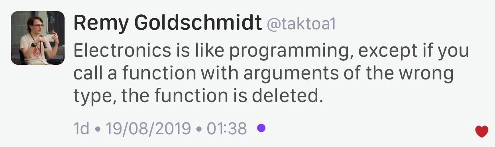

----

Elements C++ GUI library
========================

https://www.cycfi.com/2019/07/photon-micro-gui/

* `Reddit <https://www.reddit.com/r/cpp/comments/ccq9pn/elemental_c_gui_library/>`_

C++ libraries for data visualization
====================================

* VTK https://vtk.org/
* ROOT https://root.cern.ch/
* matplotlib-cpp https://github.com/lava/matplotlib-cpp
  * matplotlib (Python) https://matplotlib.org/
* QCustomPlot (QT, GPL/commercial) https://www.qcustomplot.com/

CppCast - CMake and VTK with Robert Maynard
===========================================

http://cppcast.com/2019/07/robert-maynard/

* `Reddit <https://www.reddit.com/r/cpp/comments/c9bpxb/cppcast_cmake_and_vtk_with_robert_maynard/>`_

CMake line by line - creating a header-only library
===================================================

http://dominikberner.ch/cmake-interface-lib/

* `Reddit <https://www.reddit.com/r/cpp/comments/c8ty2h/a_line_by_line_explanation_how_to_create_a/>`_

https://github.com/bernedom/SI

Professional CMake: A Practical Guide, 4th ed., CMake 3.15 https://crascit.com/professional-cmake/ $30

Agner Vector Class Library V2
=============================

This is a C++17 class library for using the Single Instruction Multiple Data (SIMD) instructions in
modern microprocessors.

https://www.agner.org/optimize/blog/read.php?i=1013

https://github.com/vectorclass/version2 (Apache 2.0)

Manual https://github.com/vectorclass/manual/blob/master/vcl_manual.pdf

mdspan
======

* Implementation https://github.com/kokkos/mdspan (BSD 3-Clause)
  * Intro https://github.com/kokkos/mdspan/wiki/A-Gentle-Introduction-to-mdspan
  * r/cpp https://www.reddit.com/r/cpp/comments/cl127i/mdspan_productionquality_reference_implementation/
* Kokkos https://github.com/kokkos/kokkos
* Multi-dimensional strided array views in Magnum
  https://blog.magnum.graphics/backstage/multidimensional-strided-array-views/
* P0009R9 **mdspan**: A Non-Owning Multidimensional Array Reference http://wg21.link/p0009r9
* CppCast with Bryce Adelstein Lelbach https://cppcast.com/bryce-lelbach-mdspan/

Clang Build Analyzer
====================

https://github.com/aras-p/ClangBuildAnalyzer

Machine Learning with CPP
=========================

`Reddit <https://www.reddit.com/r/cpp/comments/cjrrwm/machine_learning_with_cpp/>`_

* PyTorch https://pytorch.org/features -- has a pure C++ front end https://pytorch.org/cppdocs/
* TensorFlow for C++ https://www.tensorflow.org/api_docs/cc
* Shogun https://www.shogun.ml/

The sad history of Unicode printf-style format specifiers in Visual C++
=======================================================================

https://devblogs.microsoft.com/oldnewthing/20190830-00/?p=102823

* `Reddit <https://www.reddit.com/r/cpp/comments/cxi2xy/the_sad_history_of_unicode_printfstyle_format/>`_

Twitter
=======

.. image:: img/tvaneerd-try-catch-opt.png
   :width: 90%

Twitter: Generic cup
====================

.. image:: img/generic-cup.png
   :width: 70%

Twitter: Electronics
====================

